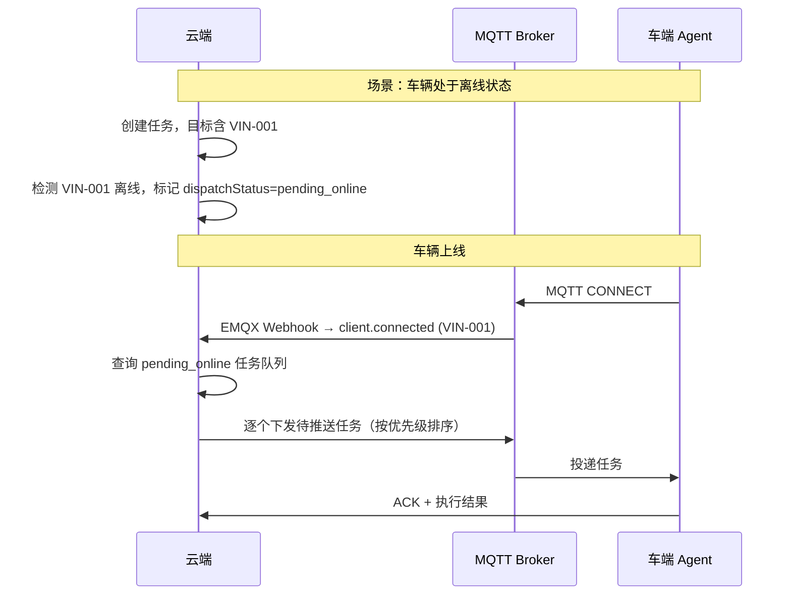

# OpenDOTA 设计文档审阅报告

> **审阅范围**: [opendota_protocol_spec.md](file:///Users/aircold/code/OpenDOTA/doc/opendota_protocol_spec.md) + [opendota_tech_architecture.md](file:///Users/aircold/code/OpenDOTA/doc/opendota_tech_architecture.md)  
> **审阅日期**: 2026-04-17  
> **审阅视角**: 资深车联网/远程诊断平台架构师

---

## 一、目标需求对照矩阵

先将你描述的 7 大核心需求与文档现状逐条对照：

|  #  | 目标需求                                              | 文档覆盖度  | 评估                                                                                       |
| :-: | :---------------------------------------------------- | :---------: | :----------------------------------------------------------------------------------------- |
|  1  | 在线诊断仪：单 ECU 发送 UDS 命令                      |   ✅ 完整   | 第 4-5 章已详细定义通道生命周期 + 单步诊断协议                                             |
|  2  | 封装的多 ECU 脚本（如读全车 DTC）                     | ⚠️ 严重缺失 | 第 6 章批量任务仅支持**单个 ECU**内的多步骤序列，**无法覆盖「跨多个 ECU 的编排脚本」**     |
|  3  | 厂家侧任务系统（多任务 + 优先级 + 有效期 + 目标车辆） | ⚠️ 大量缺失 | 完全没有「云端任务管理系统」的定义——无任务生命周期状态机、无优先级模型、无目标车辆群组概念 |
|  4  | 大批量车辆下发（含离线车辆上线后推送）                | ⚠️ 部分覆盖 | 第 8 章 `schedule_set` 支持单车离线缓存上报，但**无群组/批量下发编排**，无离线任务推送机制 |
|  5  | 车端缓存任务队列 + 云端可操控队列                     | ⚠️ 严重缺失 | 车端 SQLite 缓存仅提及「持久化存储」，**无队列模型**、无队列读取/删除/暂停/继续的控制协议  |
|  6  | 任务类型：单次/周期/定时/条件                         | ⚠️ 部分覆盖 | 第 8 章支持 `once` + `periodic`（Cron），但**缺少「定时任务」和「条件任务」**两种关键模式  |
|  7  | 在线诊断仪与任务的互斥与优先级                        | ❌ 完全缺失 | 通篇无任何互斥机制定义——诊断仪占用时任务如何等待/上报？任务执行中诊断仪如何被拒绝？        |

---

## 二、文档已达成的目标（优点）

在进入问题分析之前，先认可文档已经做得优秀的部分：

1. **协议层设计扎实**：消息信封（Envelope）结构统一、Topic 路由清晰、`msgId` 幂等去重、QoS 策略合理。
2. **车端宏指令体系完善**：`macro_security` / `macro_routine_wait` / `macro_data_transfer` 三大宏的参数化设计精良，准确识别了哪些 UDS 服务必须在车端闭环。
3. **DoIP 双栈传输**：transport 字段抽象良好，CAN 和 DoIP 对云端完全透明，扩展性很强。
4. **ODX 工程化管线**：「离线导入 → 持久化 → 运行时查库」的模式比运行时解析 XML 要高明得多，`macroType` 自动标注的设计尤其精巧。
5. **固件传输安全**：SHA-256 + 预签名 URL + 车端校验链，安全设计很到位。
6. **异步通信架构**：HTTP → MQTT → Redis Pub/Sub → SSE 的异步推送链路设计清晰，PG 回填断线补发方案实用。

---

## 三、关键缺失与设计不足（12 项）

### 缺失 1：缺少多 ECU 编排脚本能力

> [!CAUTION]
> 这是最核心的功能缺口。你的需求明确提到「读取整车所有 ECU 的 DTC」，但当前 `batch_cmd` 只能针对**一个 ECU**（单组 `txId`/`rxId`）。

**现状**：`batch_cmd.payload` 中只有一组 `ecuName` + `txId` + `rxId`，`steps[]` 中所有步骤共享同一个 ECU。

**需要补充**：设计一个**多 ECU 编排层**，有两种架构选择：

| 方案                    | 设计                                                                                | 优点             | 缺点             |
| :---------------------- | :---------------------------------------------------------------------------------- | :--------------- | :--------------- |
| **A. 云端编排**         | 云端按 ECU 拆分为多个 `batch_cmd`，逐个下发或并行下发，云端聚合结果                 | 车端逻辑简单     | 依赖网络，延迟大 |
| **B. 车端编排（推荐）** | 新增 `act=script_cmd`，payload 中包含多个 ECU 的 step 组，车端本地按组顺序/并行执行 | 离线可用，延迟低 | 车端逻辑复杂     |

采用方案B，示例（方案 B——`script_cmd`）：

```json
{
  "act": "script_cmd",
  "payload": {
    "scriptId": "script-read-all-dtc",
    "executionMode": "parallel",
    "ecus": [
      {
        "ecuName": "VCU",
        "txId": "0x7E0",
        "rxId": "0x7E8",
        "steps": [
          { "seqId": 1, "type": "raw_uds", "data": "190209", "timeoutMs": 3000 }
        ]
      },
      {
        "ecuName": "BMS",
        "txId": "0x7E3",
        "rxId": "0x7EB",
        "steps": [
          { "seqId": 1, "type": "raw_uds", "data": "190209", "timeoutMs": 3000 }
        ]
      },
      {
        "ecuName": "EPS",
        "txId": "0x7A0",
        "rxId": "0x7A8",
        "steps": [
          { "seqId": 1, "type": "raw_uds", "data": "190209", "timeoutMs": 3000 }
        ]
      }
    ]
  }
}
```

---

### 缺失 2：缺少云端任务管理系统

> [!CAUTION]
> 文档中完全没有定义「厂家侧任务管理」的概念。当前只有「车端调度」（第 8 章），缺少**云端任务系统**。

**需要补充的核心概念**：

```
┌─────────────────────────────────────────────────────────┐
│                   云端任务管理系统                         │
├─────────────────────────────────────────────────────────┤
│  Task（任务）                                            │
│    ├── taskId          全局唯一标识                       │
│    ├── taskName        任务名称                           │
│    ├── priority        优先级 (0=最高, 9=最低)             │
│    ├── validFrom       任务有效期开始                      │
│    ├── validUntil      任务有效期截止                      │
│    ├── targetScope     目标范围 (VIN列表 / 车型 / 标签)    │
│    ├── scheduleType    调度类型 (once/periodic/timed/     │
│    │                    conditional)                      │
│    ├── scheduleConfig  调度配置 (各类型不同)                │
│    ├── diagPayload     诊断执行内容 (batch_cmd 或          │
│    │                    script_cmd 的 payload)            │
│    ├── status          任务状态 (draft/active/paused/     │
│    │                    completed/expired)                │
│    └── createdBy       创建人                             │
│                                                          │
│  TaskDispatchRecord（任务分发记录）                        │
│    ├── taskId                                            │
│    ├── vin             目标车辆                           │
│    ├── dispatchStatus  分发状态 (pending_online/          │
│    │                    dispatched/ack/executing/         │
│    │                    completed/failed)                 │
│    └── dispatchedAt    实际下发时间                        │
└─────────────────────────────────────────────────────────┘
```

---

### 缺失 3：缺少任务优先级模型

**需要补充**：

- 任务 `priority` 字段（如 0-9，0 最高）
- 车端任务队列按优先级排序执行
- 多任务抢占规则：高优先级任务到达时，是否中断正在执行的低优先级任务？
- 在线诊断仪视为 `priority=0`（最高），但受特殊互斥规则约束（见缺失 7）

---

### 缺失 4：缺少大批量车辆分发机制

**现状**：所有 MQTT Topic 都按 VIN 单发（`dota/v1/cmd/.../{vin}`），没有群组/批量下发的设计。

**需要补充**：

- **目标车辆群组**：支持按 VIN 列表、车型、标签、全量等维度定义目标范围
- **分发调度器（Task Dispatcher）**：云端将任务拆分为每辆车的独立下发，追踪每辆车的分发状态
- **流量控制**：大批量下发时的限流/分批策略，避免 MQTT Broker 过载
- **状态聚合面板**：任务维度的执行进度看板（已下发 / 已完成 / 失败 / 待上线）

---

### 缺失 5：缺少离线车辆任务推送机制

> [!IMPORTANT]
> 你的需求明确提到「离线车辆上线后推送任务」，但文档中没有定义这个机制。

**需要补充**：



**关键设计点**：

- 利用 EMQX 的 `client.connected` Webhook 感知车辆上线
- 云端维护 `pending_online` 队列，上线后按优先级逐个推送
- 需要考虑任务有效期：上线时如果任务已过期则不再下发

---

### 缺失 6：车端任务队列与队列操控协议

> [!CAUTION]
> 你的需求明确提到「车端缓存任务队列」+ 「云端可下发指令读取、删除、暂停、继续队列中的任务」，但文档中完全没有这个能力。

**需要新增 Topic 和 act 类型**：

| Topic                      | act            | 方向 | 说明                     |
| :------------------------- | :------------- | :--: | :----------------------- |
| `dota/v1/cmd/queue/{vin}`  | `queue_query`  | C2V  | 查询车端当前任务队列状态 |
| `dota/v1/cmd/queue/{vin}`  | `queue_delete` | C2V  | 删除队列中指定任务       |
| `dota/v1/cmd/queue/{vin}`  | `queue_pause`  | C2V  | 暂停队列中指定任务       |
| `dota/v1/cmd/queue/{vin}`  | `queue_resume` | C2V  | 恢复队列中指定任务       |
| `dota/v1/resp/queue/{vin}` | `queue_status` | V2C  | 车端上报队列状态         |

**`queue_query` 响应示例**：

```json
{
  "act": "queue_status",
  "payload": {
    "queueSize": 3,
    "currentExecuting": "task-001",
    "tasks": [
      {
        "taskId": "task-001",
        "priority": 1,
        "status": "executing",
        "progress": "step 3/5"
      },
      { "taskId": "task-002", "priority": 3, "status": "queued" },
      { "taskId": "task-003", "priority": 5, "status": "paused" }
    ]
  }
}
```

---

### 缺失 7：完全缺少在线诊断仪与任务的互斥机制 ⭐

> [!CAUTION]
> 这是你需求中最复杂的部分，文档中完全没有涉及。需要定义一个完整的**资源仲裁协议**。

**需要补充的核心机制**：

#### 7.1 车端资源状态机

```
                    ┌───────────┐
        ┌──────────>│   IDLE    │<──────────┐
        │           └─────┬─────┘           │
        │                 │                 │
   channel_close    channel_open     task_complete
        │                 │                 │
        │                 ▼                 │
        │           ┌───────────┐           │
        ├───────────│  DIAG_    │           │
        │           │  SESSION  │           │
        │           └───────────┘           │
        │                                   │
        │           ┌───────────┐           │
        └───────────│   TASK_   ├───────────┘
                    │  RUNNING  │
                    └───────────┘
```

#### 7.2 冲突裁决规则

| 当前状态         | 到达请求         | 裁决结果          | 车端行为                                                                                          |
| :--------------- | :--------------- | :---------------- | :------------------------------------------------------------------------------------------------ |
| IDLE             | `channel_open`   | ✅ 接受           | 进入 DIAG_SESSION                                                                                 |
| IDLE             | 任务触发执行     | ✅ 接受           | 进入 TASK_RUNNING                                                                                 |
| **TASK_RUNNING** | `channel_open`   | ❌ **拒绝**       | 回复 `channel_event { event: "rejected", reason: "TASK_IN_PROGRESS", taskId: "xxx" }`             |
| **DIAG_SESSION** | 任务到达执行时间 | ⏸️ **挂起不执行** | 任务标记为 `deferred`，上报 `schedule_resp { status: "DEFERRED", reason: "DIAG_SESSION_ACTIVE" }` |
| DIAG_SESSION     | `channel_close`  | → IDLE            | 检查是否有被挂起的任务，按优先级恢复执行                                                          |

#### 7.3 协议字段补充

`channel_open` 的响应需要增加拒绝情况：

```json
{
  "act": "channel_event",
  "payload": {
    "channelId": "ch-uuid-001",
    "event": "rejected",
    "status": 1,
    "reason": "TASK_IN_PROGRESS",
    "currentTaskId": "task-cron-001",
    "msg": "车端正在执行定时任务，诊断通道请求被拒绝"
  }
}
```

---

### 缺失 8：缺少「定时任务」和「条件任务」类型

**现状**：第 8 章 `scheduleCondition.mode` 只有 `once` 和 `periodic` 两种。

**你的需求要求四种任务类型**：

| 任务类型 | `mode` 值     |   现状    | 需补充的配置                                                                      |
| :------- | :------------ | :-------: | :-------------------------------------------------------------------------------- |
| 单次任务 | `once`        |  ✅ 已有  | —                                                                                 |
| 周期任务 | `periodic`    | ⚠️ 需补充 | `intervalMs`（执行间隔）、`maxExecutions`（最大执行次数，`-1`=无限）              |
| 定时任务 | `timed`       |  ❌ 缺失  | `executeAtList: [timestamp1, timestamp2, ...]`（指定时间点列表）、`maxExecutions` |
| 条件任务 | `conditional` |  ❌ 缺失  | `triggerCondition`（触发条件定义）、`maxTriggers`（最大触发次数，`-1`=无限）      |

**条件任务需要定义的触发条件类型**：

```json
{
  "mode": "conditional",
  "triggerCondition": {
    "type": "signal",
    "signalName": "KL15_STATUS",
    "operator": "==",
    "value": "ON",
    "description": "上电自检：检测到 KL15 上电时触发"
  },
  "maxTriggers": -1,
  "validWindow": {
    "startTime": 1713300000000,
    "endTime": 1713800000000
  }
}
```

**触发条件类型枚举建议**：

| `type`      | 说明         | 示例                  |
| :---------- | :----------- | :-------------------- |
| `power_on`  | 上电自检     | 检测到 KL15 = ON      |
| `signal`    | 信号值触发   | 某信号值达到阈值      |
| `dtc`       | DTC 触发     | 检测到特定故障码出现  |
| `timer`     | 运行时长触发 | 累计运行 N 小时后     |
| `geo_fence` | 地理围栏触发 | 车辆进入/离开指定区域 |

---

### 缺失 9：缺少最大执行次数控制

**你的需求明确提到**：「最大执行多少次（包括无限）」。

**现状**：第 8 章的 `scheduleCondition` 中没有 `maxExecutions` 字段。

**需要补充**：

```json
{
  "scheduleCondition": {
    "mode": "periodic",
    "cronExpression": "0 */5 * * * ?",
    "maxExecutions": 100,
    "currentExecutionCount": 0
  }
}
```

- `maxExecutions = -1` 表示无限执行
- `maxExecutions = 1` 等价于 `once`
- 车端本地维护 `currentExecutionCount`，达到上限后自动停止

---

### 缺失 10：数据库表设计缺少任务管理相关表

**技术架构文档**中只有 `diag_record` 和 `batch_task` 两张表，缺少：

| 需要新增的表           | 用途                                                           |
| :--------------------- | :------------------------------------------------------------- |
| `task_definition`      | 任务定义（含优先级、有效期、调度类型、调度配置、诊断 payload） |
| `task_target`          | 任务目标车辆关联（支持 VIN 列表、车型、标签等）                |
| `task_dispatch_record` | 每辆车的分发记录（分发状态、下发时间、完成时间）               |
| `task_execution_log`   | 每次执行的详细日志（周期任务会有多次执行记录）                 |

---

### 缺失 11：缺少心跳/在线状态管理

**批量下发和离线推送**严重依赖「知道哪些车在线」，但文档中没有：

- 车辆在线状态表（`vehicle_online_status`）
- 利用 MQTT Last Will + EMQX Webhook 维护在线状态的方案
- 车端心跳上报机制（与 UDS 心跳不同，这是**平台级心跳**）

---

### 缺失 12：任务控制 Topic 能力不足

**现状**：Topic 注册表中有 `dota/v1/cmd/control/{vin}`（任务控制），但文档正文**没有定义这个 Topic 的报文格式**。第 8.5 节只有 `schedule_cancel`。

**需要补充**：

| act           | 说明                         |
| :------------ | :--------------------------- |
| `task_pause`  | 暂停指定任务                 |
| `task_resume` | 恢复指定任务                 |
| `task_cancel` | 取消指定任务                 |
| `task_query`  | 查询指定任务或全部任务的状态 |

---

## 四、总结评分

| 维度             | 评分 (1-5) | 说明                                        |
| :--------------- | :--------: | :------------------------------------------ |
| 单 ECU 在线诊断  | ⭐⭐⭐⭐⭐ | 完善，可直接指导编码                        |
| 宏指令与传输层   | ⭐⭐⭐⭐⭐ | 设计精良，双栈支持优秀                      |
| ODX 引擎         |  ⭐⭐⭐⭐  | 架构清晰，细节可指导编码                    |
| 多 ECU 脚本      |     ⭐     | 仅单 ECU，核心能力缺失                      |
| 云端任务系统     |     ⭐     | 无任务管理概念，全面缺失                    |
| 大批量分发       |     ⭐     | 无群组/批量下发机制                         |
| 任务类型丰富度   |    ⭐⭐    | 仅 once + periodic，缺 timed 和 conditional |
| 诊断仪与任务互斥 |     ⭐     | 完全缺失                                    |
| 车端任务队列操控 |     ⭐     | 完全缺失                                    |

**总体评价**：文档在**「在线诊断仪」这条线上设计扎实**（单 ECU 诊断 + 宏指令 + DoIP + ODX），但在**「任务系统」这条线上严重缺失**。当前文档大约覆盖了你目标的 **40%**——诊断执行层已经 ready，但任务编排、调度、分发、互斥这整个上层管理系统还是一片空白。

## 五、建议的补充优先级

```
                   紧迫度 →
┌──────────────────────────────────────────────┐
│  P0 (必须立即补充，否则核心需求无法满足)        │
│    ├── 缺失 7: 诊断仪与任务互斥机制            │
│    ├── 缺失 1: 多 ECU 编排脚本                 │
│    ├── 缺失 2: 云端任务管理系统                 │
│    └── 缺失 6: 车端任务队列与操控协议           │
│                                               │
│  P1 (核心链路依赖)                             │
│    ├── 缺失 5: 离线车辆任务推送                 │
│    ├── 缺失 4: 大批量车辆分发机制               │
│    ├── 缺失 8: 定时任务和条件任务类型            │
│    └── 缺失 9: 最大执行次数控制                 │
│                                               │
│  P2 (工程完善)                                 │
│    ├── 缺失 10: 数据库表补充                    │
│    ├── 缺失 11: 心跳与在线状态管理              │
│    ├── 缺失 12: 任务控制 Topic 完善             │
│    └── 缺失 3: 优先级模型细化                   │
└──────────────────────────────────────────────┘
```

---

> [!IMPORTANT]
> **核心结论**：当前两份文档定义了一个优秀的「远程诊断仪」，但离你目标的「远程诊断 + 批量任务调度平台」还差一个完整的**任务管理系统层**。建议新增一份独立文档 `opendota_task_system_spec.md`，专门定义任务管理系统的协议与架构，然后在现有两份文档中增加互斥机制和多 ECU 编排的补充章节。
