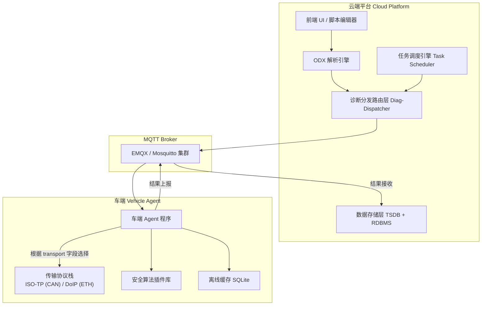
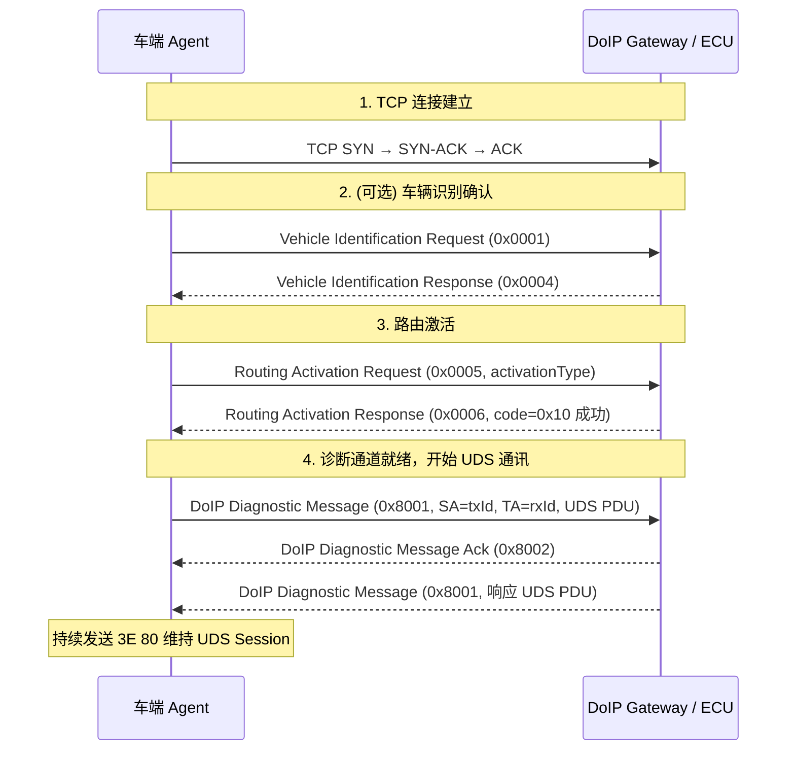
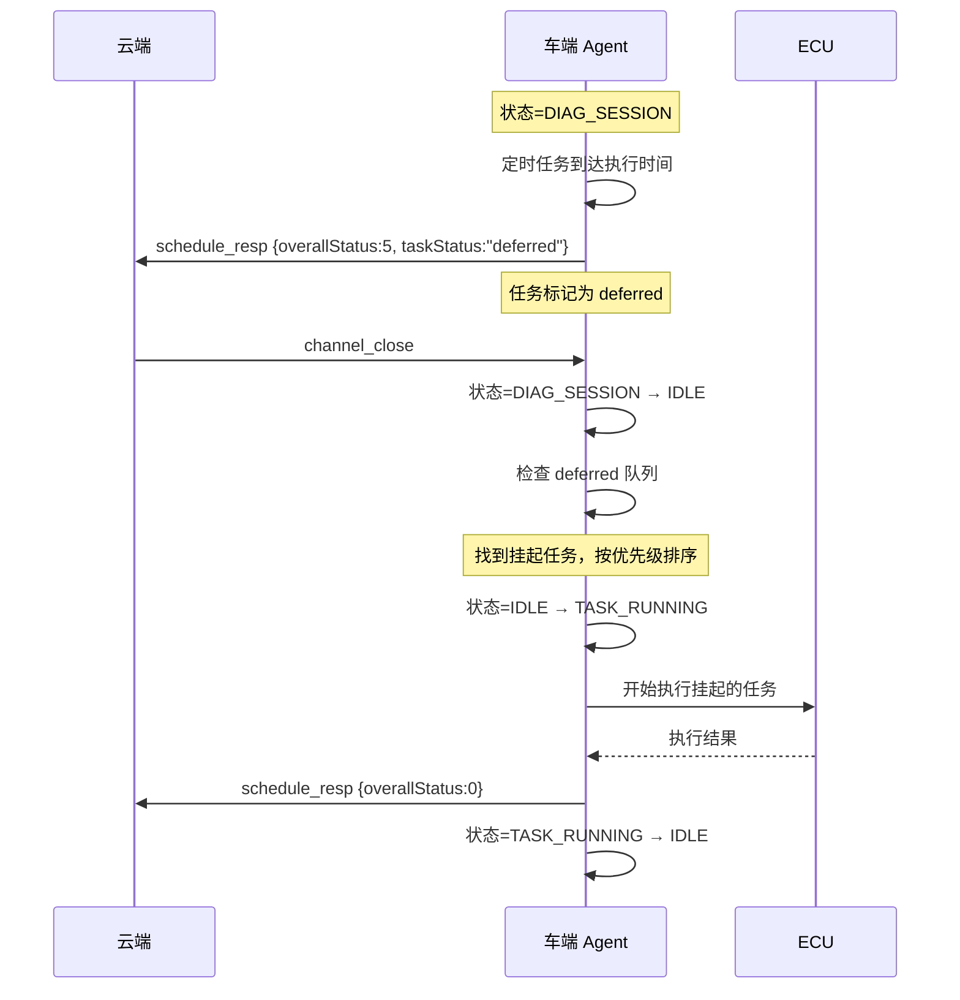
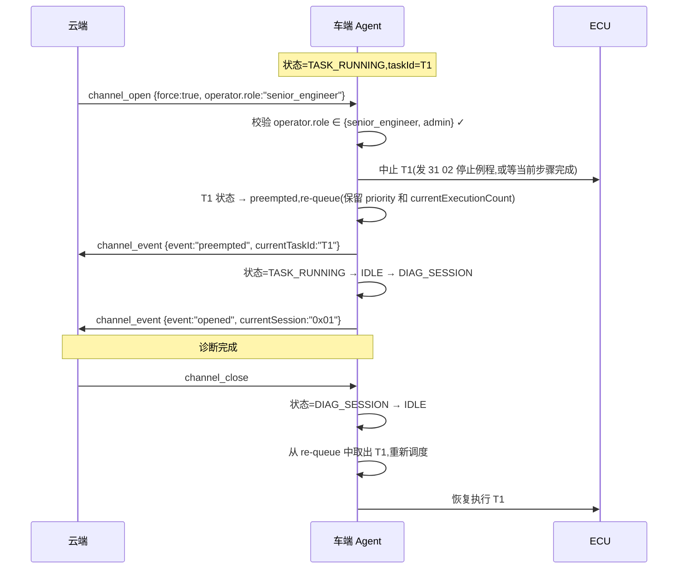
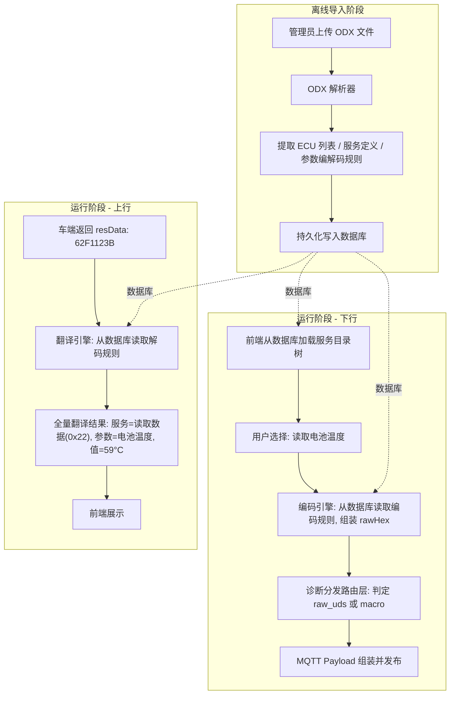
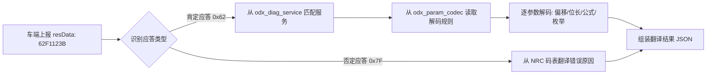
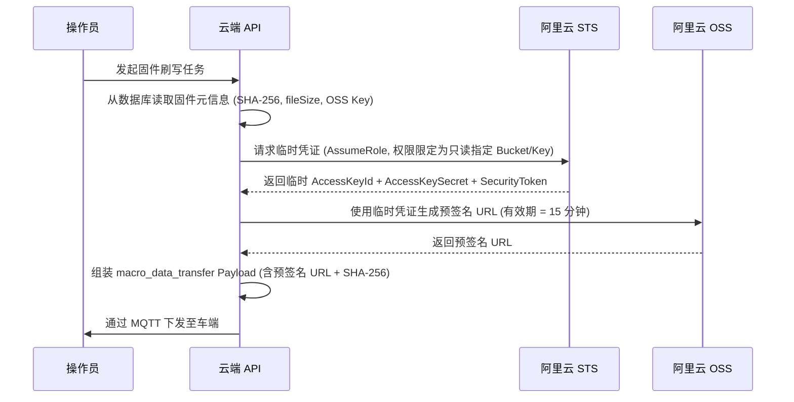
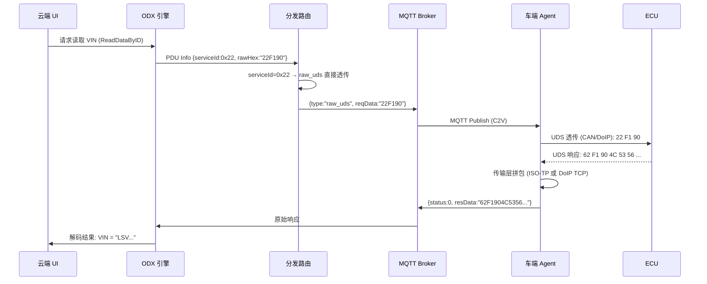
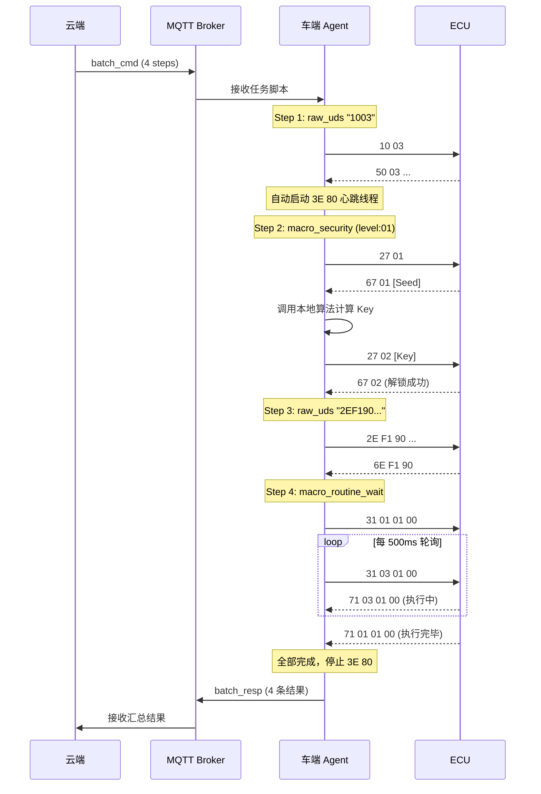

# OpenDOTA 车云诊断通讯协议工程规范

> **版本**: v1.2  
> **日期**: 2026-04-17  
> **状态**: 设计评审中(生产级加固版: ECU 级互斥 / 周期计数一致性 / 聚合分片 / 时钟信任)  
> **适用范围**: 云端平台 ↔ 车端 Agent 之间基于 MQTT 的远程诊断通讯

---

## 目录

1. [系统架构总览](#1-系统架构总览)
2. [MQTT Topic 路由设计](#2-mqtt-topic-路由设计)
3. [消息封包协议 (Message Envelope)](#3-消息封包协议-message-envelope)
4. [诊断通道生命周期管理](#4-诊断通道生命周期管理)
5. [单步诊断交互协议 (Single Diagnostic)](#5-单步诊断交互协议-single-diagnostic)
6. [批量诊断任务协议 (Batch Diagnostic)](#6-批量诊断任务协议-batch-diagnostic)
7. [车端宏指令体系 (Macro Command System)](#7-车端宏指令体系-macro-command-system)
8. [定时、周期、条件任务调度 (Scheduled & Conditional Task)](#8-定时与周期任务调度-scheduled-task)
9. [多 ECU 编排脚本协议 (Multi-ECU Script)](#9-多-ecu-编排脚本协议-multi-ecu-script)
10. [车端资源仲裁与互斥机制 (Resource Arbitration)](#10-车端资源仲裁与互斥机制-resource-arbitration)
11. [车端任务队列与反压操控 (Queue Control & Back-pressure)](#11-车端任务队列与操控协议-queue-control)
12. [任务控制与幂等协议 (Task Control & Idempotency)](#12-任务控制协议-task-control)
13. [云端 ODX 引擎与分发路由架构](#13-云端-odx-引擎与分发路由架构)
14. [错误码与状态码定义](#14-错误码与状态码定义)
15. [安全、审计与权限](#15-安全与审计要求)
16. [可观测性与 SLO](#16-可观测性与-slo)
17. [车端时钟信任模型](#17-车端时钟信任模型v12)

---

## 1. 系统架构总览

### 1.1 架构分层

系统严格分为三个纵向层次，各层职责边界清晰，严禁越界：

| 层级 | 名称 | 职责 | 关键特征 |
|:---:|:---|:---|:---|
| **L1** | 业务配置层（云端） | ODX 解析、DBC/CDD 翻译、报文编解码、人机交互 | 理解业务语义，管理车型配置 |
| **L2** | 车云协议层（MQTT 通道） | 标准化 JSON 封包的传输与路由 | 纯运输通道，不关心业务语义 |
| **L3** | 车端执行层（车端 Agent） | 原生 UDS 透传、宏命令执行、ISO-TP / DoIP 底层处理、心跳维持 | 不懂 ODX，不处理业务翻译；支持 CAN/CAN-FD 与 DoIP 双传输栈 |

### 1.2 架构示意图



### 1.3 核心设计原则

> [!IMPORTANT]
> **"公网 MQTT 里只跑'指令意图（Intent）'和'结果汇总（Summary）'，绝不跑'毫秒级的交互闭环'。"**

1. **车端是无状态的搬运工**：车端 Agent 不解析 ODX，不翻译报文含义，只执行传输和宏逻辑。
2. **时效敏感操作必须下沉**：所有需要在毫秒级完成多次握手的操作（安全访问、大包传输、例程轮询），必须封装为车端宏，在车内总线本地闭环。
3. **协议层与业务层解耦**：引入新车型只需更新云端 ODX 配置，车端代码零修改（除新增算法插件外）。

---

## 2. MQTT Topic 路由设计

### 2.1 Topic 命名规范

采用基于**动作方向 + 业务场景 + VIN 码**的 RESTful 风格层级结构。

**格式**: `dota/v{版本}/{方向}/{业务场景}/{vin}`

### 2.2 Topic 注册表

| 数据流向 | 业务场景 | Topic | QoS | 说明 |
|:---:|:---|:---|:---:|:---|
| **C2V** ↓ | 诊断通道管理 | `dota/v1/cmd/channel/{vin}` | 1 | 开启/关闭诊断通道 |
| **C2V** ↓ | 单步诊断指令 | `dota/v1/cmd/single/{vin}` | 1 | 单条 UDS 指令下发 |
| **C2V** ↓ | 批量任务下发 | `dota/v1/cmd/batch/{vin}` | 1 | 批量诊断任务脚本下发 |
| **C2V** ↓ | 定时任务策略 | `dota/v1/cmd/schedule/{vin}` | 1 | 周期/定时/条件任务策略下发 |
| **C2V** ↓ | 任务控制 | `dota/v1/cmd/control/{vin}` | 1 | 取消/暂停/恢复任务 |
| **C2V** ↓ | 多 ECU 脚本下发 | `dota/v1/cmd/script/{vin}` | 1 | 多 ECU 编排脚本下发 |
| **C2V** ↓ | 车端队列操控 | `dota/v1/cmd/queue/{vin}` | 1 | 车端任务队列查询/操控 |
| **V2C** ↑ | 指令到达回执 | `dota/v1/ack/{vin}` | 1 | 车端确认收到报文(`task_ack` 幂等返回) |
| **V2C** ↑ | 单步诊断结果 | `dota/v1/resp/single/{vin}` | 1 | 单条 UDS 执行结果上报 |
| **V2C** ↑ | 批量任务结果 | `dota/v1/resp/batch/{vin}` | 1 | 批量/定时任务执行结果上报(含 `schedule_resp`) |
| **V2C** ↑ | 通道状态通知 | `dota/v1/event/channel/{vin}` | 1 | 诊断通道状态变更事件(`channel_event` / `channel_ready`) |
| **V2C** ↑ | 多 ECU 脚本结果 | `dota/v1/resp/script/{vin}` | 1 | 编排脚本执行结果上报 |
| **V2C** ↑ | 队列状态上报 | `dota/v1/resp/queue/{vin}` | 1 | 车端任务队列状态/反压拒绝(`queue_status` / `queue_reject`) |
| **V2C** ↑ | 条件触发事件 | `dota/v1/event/condition/{vin}` | 1 | 条件任务触发命中事件(`condition_fired`) |
| **V2C** ↑ | 周期执行边界 | `dota/v1/event/execution/{vin}` | 1 | **v1.2** 周期/条件任务单次执行 `execution_begin` / `execution_end` 边界上报 |
| **C2V** ↓ | 时钟校准下发 | `dota/v1/cmd/time/{vin}` | 1 | **v1.2** `time_sync_request` |
| **V2C** ↑ | 时钟校准响应 | `dota/v1/resp/time/{vin}` | 1 | **v1.2** `time_sync_response`,含车端 RTC 及漂移上报 |

### 2.3 QoS 策略

- 所有诊断指令统一使用 **QoS 1**（至少投递一次）。
- 报文中通过 `msgId` 实现业务层去重，保证**幂等性**。
- 不使用 QoS 2（性能开销过大且 MQTT Broker 集群下一致性难以保障）。

---

## 3. 消息封包协议 (Message Envelope)

### 3.1 公共封包结构

所有车云交互报文（无论上行下行）都必须遵循统一的最外层 JSON 骨架：

```json
{
  "msgId": "550e8400-e29b-41d4-a716-446655440000",
  "timestamp": 1713258654000,
  "vin": "LSVWA234567890123",
  "act": "single_cmd",
  "operator": {
    "id": "eng-12345",
    "role": "senior_engineer",
    "tenantId": "chery-hq",
    "ticketId": "DIAG-2026-0417-001"
  },
  "payload": { }
}
```

### 3.2 字段说明

| 字段 | 类型 | 必填 | 说明 |
|:---|:---:|:---:|:---|
| `msgId` | string (UUID) | ✅ | 全局唯一消息 ID,用于日志追踪、防重放去重 |
| `timestamp` | int64 | ✅ | 报文生成时的 Unix 毫秒级时间戳 |
| `vin` | string (17 位) | ✅ | 目标车架号 |
| `act` | string (enum) | ✅ | 业务动作类型,见下方枚举 |
| `operator` | object | 条件 | 操作者上下文。**C2V 方向的所有 `*_cmd` / `*_cancel` / `*_pause` / `*_resume` / `queue_*` / `task_*` / `channel_*` 报文必须携带**;V2C 方向的 `*_resp` 建议原样回填以便审计链串联(若遗漏,云端应根据 `msgId` 从 `diag_record` 反查补全)。详见 [3.4 节](#34-operator-操作者上下文) |
| `payload` | object | ✅ | 具体的业务数据对象 |

### 3.3 `operator` 操作者上下文

> [!IMPORTANT]
> 远程诊断直接操作车辆 ECU,所有下发必须可追溯到具体人员和工单。`operator` 字段是整个审计链的主锚点——禁止任何 C2V 指令在缺少 `operator` 的情况下进入 MQTT 通道,Spring Boot API 层应在 `@RestControllerAdvice` 拦截器中强制校验。

| 字段 | 类型 | 必填 | 说明 |
|:---|:---:|:---:|:---|
| `operator.id` | string | ✅ | 操作员唯一标识(对应 `operator.id` 主键),与 JWT sub claim 一致 |
| `operator.role` | string (enum) | ✅ | 角色枚举:`viewer` / `engineer` / `senior_engineer` / `admin`,见 [15.4 权限矩阵](#154-操作权限矩阵) |
| `operator.tenantId` | string | ✅ | 租户 ID,用于多主机厂隔离。车端收到后必须校验与自身证书 O 字段一致,不一致直接丢弃 |
| `operator.ticketId` | string | ❌ | 工单号(如召回编号、生产线工单号),用于审计关联。建议必填以便事后追溯 |

**字段使用约束**:

1. **云端 → 车端**:API 网关层从 JWT 解析出 `operator`,直接注入到 Envelope,业务代码不可自行构造或覆盖。
2. **车端 → 云端**:车端对 `*_resp` 报文**应当**原样携带请求的 `operator` 字段(车端本地队列中已持久化);若丢失,云端 ODX Decoder 可通过 `msgId` 反查 `diag_record.operator_id` 重建。
3. **车端 → 云端的主动事件**(如 `channel_event: ecu_lost` / `queue_status` 自发上报):`operator` 可省略,由云端标记为 `system` 操作者写入审计日志。
4. **任务触发的下发**(周期任务、离线推送):`operator` 字段取**任务创建者**,并携带原 `ticketId` 链条;这样审计可以追溯到"是谁在什么工单下创建了这个周期任务"。

### 3.4 `act` 枚举定义

| act 值 | 方向 | 说明 |
|:---|:---:|:---|
| `channel_open` | C2V | 请求开启诊断通道 |
| `channel_close` | C2V | 请求关闭诊断通道 |
| `channel_event` | V2C | 通道状态变更事件通知(`opened`/`closed`/`rejected`/`idle_timeout`/`ecu_lost`/`vehicle_sleep`/`doip_tcp_disconnect`/`doip_routing_failed`/`session_changed`/`preempted`) |
| `channel_ready` | V2C | 车端资源从 TASK_RUNNING 回落到 IDLE 的主动通知,供被拒绝的诊断仪重试(见 [10.7 节](#107-优先级抢占与挂起补偿策略)) |
| `single_cmd` | C2V | 单步诊断指令下发 |
| `single_resp` | V2C | 单步诊断结果上报 |
| `batch_cmd` | C2V | 批量诊断任务下发 |
| `batch_resp` | V2C | 批量诊断结果上报 |
| `schedule_set` | C2V | 定时/周期任务策略下发 |
| `schedule_cancel` | C2V | 取消定时/周期任务(保留别名,推荐使用 `task_cancel`) |
| `schedule_resp` | V2C | 定时任务执行结果上报 |
| `script_cmd` | C2V | 多 ECU 编排脚本下发 |
| `script_resp` | V2C | 多 ECU 编排脚本结果上报 |
| `queue_query` | C2V | 查询车端任务队列状态 |
| `queue_delete` | C2V | 删除队列中指定任务 |
| `queue_pause` | C2V | 暂停队列中指定任务 |
| `queue_resume` | C2V | 恢复队列中指定任务 |
| `queue_status` | V2C | 车端上报队列状态(周期性+变更触发) |
| `queue_reject` | V2C | 车端队列已满或策略拒绝,下发被拒(见 [11.8 节](#118-队列满反压协议-queue_full)) |
| `task_pause` | C2V | 暂停指定任务 |
| `task_resume` | C2V | 恢复指定任务 |
| `task_cancel` | C2V | 取消指定任务(覆盖 `schedule_cancel`,适用于所有任务类型) |
| `task_query` | C2V | 查询指定任务或全部任务的状态 |
| `task_ack` | V2C | 车端对下发任务的接收确认(含幂等去重结果,见 [12.6 节](#126-任务幂等与重复下发)) |
| `condition_fired` | V2C | 条件任务触发器命中,车端告知云端已把对应任务放入执行队列(实际结果仍通过 `schedule_resp` 上报,见 [8.3 节](#83-条件任务运行时与监听基座)) |
| `execution_begin` | V2C | **v1.2** 周期/条件任务单次执行开始的权威确认,携带 `executionSeq`。云端以此幂等写入 `task_execution_log`,防止车端 SQLite 丢失导致超执行(见 [8.5.1 节](#851-周期任务执行双-ack-execution_begin--execution_end)) |
| `execution_end` | V2C | **v1.2** 周期/条件任务单次执行完成上报,回填结果;与 `execution_begin` 同 `executionSeq`,`ON CONFLICT DO NOTHING` 幂等合并 |
| `time_sync_request` | C2V | **v1.2** 云端主动时钟校准下发(见 [§17](#17-车端时钟信任模型)) |
| `time_sync_response` | V2C | **v1.2** 车端响应云端时钟校准,或车端启动/每 24h 主动上报本地 RTC;云端计算漂移更新 `vehicle_clock_trust` |

---

## 4. 诊断通道生命周期管理

### 4.1 设计背景

> [!WARNING]
> UDS 协议中，ECU 的 **S3 Server Timer** 通常为 4~5 秒。如果在此时间内 ECU 未收到任何诊断请求，会自动退回默认会话 `0x01`。云端通过公网无法以毫秒级精度发送心跳，因此**心跳维持（Tester Present `3E 80`）必须由车端 Agent 在本地托管**。

### 4.2 通道开启 (`channel_open`)

**云端 → 车端（CAN 示例）**

```json
{
  "act": "channel_open",
  "payload": {
    "channelId": "ch-uuid-001",
    "ecuName": "VCU",
    "transport": "UDS_ON_CAN",
    "txId": "0x7E0",
    "rxId": "0x7E8",
    "globalTimeoutMs": 300000,
    "force": false,
    "preemptPolicy": "wait"
  }
}
```

**云端 → 车端（DoIP 示例）**

```json
{
  "act": "channel_open",
  "payload": {
    "channelId": "ch-uuid-002",
    "ecuName": "GW",
    "transport": "UDS_ON_DOIP",
    "txId": "0x0E80",
    "rxId": "0x1001",
    "doipConfig": {
      "ecuIp": "169.254.100.10",
      "ecuPort": 13400,
      "activationType": "0x00"
    },
    "globalTimeoutMs": 300000,
    "force": false,
    "preemptPolicy": "wait",
    "ecuScope": ["GW"]
  }
}
```

| 字段 | 类型 | 必填 | 说明 |
|:---|:---:|:---:|:---|
| `channelId` | string | ✅ | 通道唯一标识,用于后续操作关联 |
| `ecuName` | string | ✅ | 目标 ECU 逻辑名称 |
| `transport` | string (enum) | ❌ | 传输层协议类型,默认 `UDS_ON_CAN`。可选值:`UDS_ON_CAN` / `UDS_ON_DOIP` |
| `txId` | string (hex) | ✅ | UDS 源寻址标识。CAN 模式下为请求 Arbitration ID(如 `0x7E0`);DoIP 模式下为 Tester Logical Address(如 `0x0E80`) |
| `rxId` | string (hex) | ✅ | UDS 目标寻址标识。CAN 模式下为期望响应 Arbitration ID(如 `0x7E8`);DoIP 模式下为 ECU Logical Address(如 `0x1001`) |
| `doipConfig` | object | 条件 | `transport=UDS_ON_DOIP` 时必填。DoIP 连接配置 |
| `doipConfig.ecuIp` | string | ✅ | DoIP 实体(ECU / 网关)的 IP 地址 |
| `doipConfig.ecuPort` | int | ❌ | TCP 端口,默认 `13400`(ISO 13400 标准端口) |
| `doipConfig.activationType` | string (hex) | ❌ | Routing Activation Type,默认 `0x00`(Default)。`0x01` = WWH-OBD |
| `globalTimeoutMs` | int | ✅ | 全局空闲超时(毫秒),超过此时间无任何指令下发,车端自动释放通道 |
| `force` | boolean | ❌ | **抢占模式**,默认 `false`。`true` 时允许打断车端当前执行的任务,车端将当前任务 re-queue 后进入 DIAG_SESSION。**仅 `operator.role ∈ {senior_engineer, admin}` 可设置为 `true`**,车端据 `operator.role` 做兜底校验(见 [10.7 节](#107-优先级抢占与挂起补偿策略)) |
| `preemptPolicy` | string (enum) | ❌ | 被拒绝时的后续策略,默认 `wait`。可选:`wait`(等待 `channel_ready` 通知) / `fail_fast`(立即返回 `rejected`)。详见 [10.7](#107-优先级抢占与挂起补偿策略) |
| `ecuScope` | string[] | ✅ | **v1.2 必填**。本通道要锁定的 ECU 名集合。单 ECU 场景传 `["VCU"]`,跨 ECU 批量传 `["VCU","BMS"]`(车端按字典序一次性原子获取,避免死锁,见 [§10.2.3](#1023-多-ecu-锁的原子获取与死锁防护))。必须为 `ecuName` 及其下游依赖 ECU 的集合;车端对 scope 外的 ECU 请求会拒绝并上报 `ECU_NOT_IN_SCOPE` |

**车端收到后的动作**：

- **CAN 模式** (`transport=UDS_ON_CAN`)：
  1. 锁定该 ECU 的 CAN 通道资源。
  2. 启动后台线程，以 2~3 秒间隔向目标 ECU 发送 `3E 80`（抑制正响应的 Tester Present）。
  3. 启动空闲定时器，倒计时 `globalTimeoutMs`；每收到一条新的指令则重置定时器。
  4. 向云端回传通道开启确认。

- **DoIP 模式** (`transport=UDS_ON_DOIP`)：
  1. 建立 TCP 连接至 `doipConfig.ecuIp:ecuPort`。
  2. 发送 DoIP Routing Activation Request（`activationType`），等待 Routing Activation Response。
     - 若响应码 = `0x10`（成功），继续下一步。
     - 若响应码非 `0x10` 或超时，上报 `DOIP_ROUTING_FAILED` 错误并终止。
  3. 启动后台线程，以 2~3 秒间隔向目标 ECU 发送 `3E 80`（通过 DoIP Diagnostic Message 封装）。
  4. 启动空闲定时器，倒计时 `globalTimeoutMs`；每收到一条新的指令则重置定时器。
  5. 向云端回传通道开启确认。

**车端 → 云端（通道确认）**

```json
{
  "act": "channel_event",
  "payload": {
    "channelId": "ch-uuid-001",
    "event": "opened",
    "status": 0,
    "currentSession": "0x01",
    "currentSecurityLevel": null,
    "msg": "通道已建立,3E 80 心跳已启动"
  }
}
```

| 字段 | 类型 | 说明 |
|:---|:---:|:---|
| `event` | string (enum) | `opened` / `closed` / `rejected` / `idle_timeout` / `ecu_lost` / `vehicle_sleep` / `doip_tcp_disconnect` / `doip_routing_failed` / `session_changed` / `preempted` |
| `status` | int | 执行状态码(见 [14.1](#141-通用执行状态码-status)) |
| `currentSession` | string (hex) | **当前 UDS 会话等级**,如 `0x01`(Default) / `0x02` / `0x03`(Extended) / `0x04`(Safety) / `0x60`+ (ODX 自定义)。每次会话切换都要主动上报,UI 侧据此实时展示当前会话 |
| `currentSecurityLevel` | string (hex) \| null | 当前已解锁的安全等级,未解锁为 `null`。通道关闭、`10 01`、S3 timer 超时均会置空 |
| `currentTaskId` | string | `event=rejected` 时必填,说明是哪个任务在占用;`event=preempted` 时表示被抢占的任务 ID |
| `reason` | string | `event ∈ {rejected, preempted}` 时必填,详见 [10.4 节](#104-通道拒绝响应格式) |
| `msg` | string | 人类可读说明 |

> [!IMPORTANT]
> **会话变更必报**:车端每完成一次会话切换(`0x10 XX` 成功响应),都要通过 `event=session_changed` 上报最新 `currentSession`。云端据此在 UI 上展示"当前会话=Extended",避免工程师换班后看到陈旧状态。

### 4.3 通道关闭 (`channel_close`)

**云端 → 车端**

```json
{
  "act": "channel_close",
  "payload": {
    "channelId": "ch-uuid-001",
    "resetSession": true
  }
}
```

| 字段 | 说明 |
|:---|:---|
| `resetSession` | 布尔值。若为 `true`，车端在停止 `3E 80` 前主动发送 `10 01` 将 ECU 踢回默认会话 |

### 4.4 通道异常关闭（车端主动上报）

当车端因以下原因自动关闭通道时,必须上报云端:

| 场景 | `event` 值 | 适用传输层 | 说明 |
|:---|:---|:---:|:---|
| 空闲超时 | `idle_timeout` | 全部 | 云端长时间未下发新指令,超过 `globalTimeoutMs` |
| ECU 通讯中断 | `ecu_lost` | 全部 | `3E 80` 连续 N 次未收到 ECU 响应 |
| 车辆休眠 | `vehicle_sleep` | 全部 | 检测到 KL15 OFF,整车进入休眠 |
| DoIP TCP 断连 | `doip_tcp_disconnect` | DoIP | TCP 连接意外断开(对端 RST / FIN) |
| DoIP 路由激活失败 | `doip_routing_failed` | DoIP | Routing Activation 被 ECU 拒绝或超时 |
| 被 force 抢占 | `preempted` | 全部 | 更高优先级(`force=true` 且 `operator.role` 满足)的 `channel_open` 抢占本通道 |


### 4.5 传输层适配策略

> [!IMPORTANT]
> 协议层（MQTT Envelope）通过 `transport` 字段声明传输类型，车端 Agent 据此选择对应的传输协议栈。**云端不感知底层是 CAN 还是 DoIP**——对云端而言，`txId`/`rxId` 始终是「逻辑寻址标识」，`reqData`/`resData` 始终是完整的 UDS PDU 十六进制字符串。

#### 4.5.1 CAN / CAN-FD 传输路径

```
云端 MQTT Envelope
  └─ transport = UDS_ON_CAN
  └─ txId = CAN Arbitration ID (如 0x7E0)
  └─ rxId = CAN Arbitration ID (如 0x7E8)
       │
       ▼
车端 Agent (ISO-TP 协议栈)
  └─ ISO 15765-2 分帧/拼包（FF → FC → CF）
  └─ 单帧上限：CAN = 7 字节，CAN-FD = 63 字节
  └─ 多帧上限：理论 4095 字节
```

#### 4.5.2 DoIP (以太网) 传输路径

```
云端 MQTT Envelope
  └─ transport = UDS_ON_DOIP
  └─ txId = Tester Logical Address (如 0x0E80)
  └─ rxId = ECU Logical Address (如 0x1001)
  └─ doipConfig = { ecuIp, ecuPort, activationType }
       │
       ▼
车端 Agent (DoIP 协议栈)
  └─ TCP 连接至 ecuIp:ecuPort
  └─ Routing Activation (activationType)
  └─ DoIP Generic Header (Payload Type = 0x8001) 封装 UDS PDU
  └─ 无 ISO-TP 分帧，TCP 流式传输，单次可传输 2^32 字节
```

#### 4.5.3 DoIP 通道建立详细流程



#### 4.5.4 DoIP 通道关闭流程

1. 若 `resetSession=true`：先通过 DoIP Diagnostic Message 发送 `10 01` 将 ECU 踢回默认会话。
2. 停止 `3E 80` 心跳。
3. 发送 TCP FIN 关闭连接。
4. 上报 `channel_event` (`event=closed`)。

#### 4.5.5 DoIP vs CAN 行为差异汇总

| 维度 | CAN / CAN-FD | DoIP |
|:---|:---|:---|
| 连接建立 | 无需显式连接（广播总线） | TCP 三次握手 + Routing Activation |
| 分帧处理 | ISO-TP（FF/FC/CF），车端自动拼包 | 无分帧，DoIP Header 携带长度字段 |
| 最大 UDS PDU | ISO-TP 理论上限 4095 字节 | TCP 流式，无硬上限 |
| 心跳维持 | UDS `3E 80` | UDS `3E 80` + DoIP Alive Check（TCP 层面） |
| 断连检测 | `3E 80` 无响应 | TCP FIN/RST + `3E 80` 无响应 |
| 通道关闭 | 停止 `3E 80` 即可 | `10 01` → 停止 `3E 80` → TCP FIN |


---

## 5. 单步诊断交互协议 (Single Diagnostic)

### 5.1 适用场景

模拟诊断仪的一问一答模式：工程师在云端 UI 上手动点击按钮，发送一条 UDS 指令，车端执行后返回结果。

> [!NOTE]
> 使用单步诊断前，**必须先通过 `channel_open` 建立诊断通道**。

### 5.2 指令下发 (`single_cmd`)

**云端 → 车端**

```json
{
  "act": "single_cmd",
  "payload": {
    "cmdId": "cmd-88bb-5541",
    "channelId": "ch-uuid-001",
    "type": "raw_uds",
    "reqData": "22F190",
    "timeoutMs": 5000
  }
}
```

| 字段 | 类型 | 必填 | 说明 |
|:---|:---:|:---:|:---|
| `cmdId` | string | ✅ | 指令业务唯一 ID，用于请求-响应匹配 |
| `channelId` | string | ✅ | 关联的诊断通道 ID |
| `type` | string (enum) | ✅ | 指令类型：`raw_uds` 或 `macro_*`（见第 7 章） |
| `reqData` | string (hex) | 条件 | `type=raw_uds` 时必填，原始 UDS 十六进制数据 |
| `timeoutMs` | int | ✅ | 单条指令的车端最大等待超时时间 |

### 5.3 结果上报 (`single_resp`)

**车端 → 云端**

```json
{
  "act": "single_resp",
  "payload": {
    "cmdId": "cmd-88bb-5541",
    "channelId": "ch-uuid-001",
    "status": 0,
    "errorCode": "",
    "resData": "62F19001020304",
    "execDuration": 120
  }
}
```

| 字段 | 类型 | 说明 |
|:---|:---:|:---|
| `cmdId` | string | 必须原样带回，云端依此匹配等待中的请求 |
| `status` | int | 执行状态码（见第 14 章） |
| `errorCode` | string | UDS NRC 码或车端自定义错误码 |
| `resData` | string (hex) | 原始 UDS 十六进制响应数据 |
| `execDuration` | int | 车端实际执行耗时（毫秒） |

---

## 6. 批量诊断任务协议 (Batch Diagnostic)

### 6.1 适用场景

批量诊断针对需要执行一连串 UDS 指令的场景（如整车自检、标定写入序列）。云端将全部指令以**脚本清单**的形式一次性下发，车端本地按序执行，全部完成后打包上报结果。

> [!NOTE]
> 批量任务**不需要**预先建立诊断通道。车端收到批量任务后，自行管理 ECU 连接、Session 维持和释放的全生命周期。

### 6.2 任务下发 (`batch_cmd`)

**云端 → 车端**

```json
{
  "act": "batch_cmd",
  "payload": {
    "taskId": "task-v4-batch2026",
    "priority": 3,
    "ecuName": "VCU",
    "transport": "UDS_ON_CAN",
    "txId": "0x7E0",
    "rxId": "0x7E8",
    "strategy": 1,
    "steps": [
      {
        "seqId": 1,
        "type": "raw_uds",
        "data": "1003",
        "timeoutMs": 2000
      },
      {
        "seqId": 2,
        "type": "macro_security",
        "level": "01",
        "algoId": "algo_vcu_1"
      },
      {
        "seqId": 3,
        "type": "raw_uds",
        "data": "2EF19001020304",
        "timeoutMs": 3000
      },
      {
        "seqId": 4,
        "type": "macro_routine_wait",
        "data": "31010100",
        "maxWaitMs": 15000
      }
    ]
  }
}
```

| 字段 | 类型 | 必填 | 说明 |
|:---|:---:|:---:|:---|
| `taskId` | string | ✅ | 批次任务全局唯一标识 |
| `priority` | int | ❌ | 任务优先级（0-9，0=最高，9=最低）。默认 5。在线诊断仪隐含 `priority=0` |
| `ecuName` | string | ✅ | 目标 ECU 逻辑名称 |
| `transport` | string (enum) | ❌ | 传输层协议类型，默认 `UDS_ON_CAN`。可选值：`UDS_ON_CAN` / `UDS_ON_DOIP`。详见 [4.5 节](#45-传输层适配策略) |
| `txId` / `rxId` | string (hex) | ✅ | UDS 源/目标寻址标识。CAN 模式下为 Arbitration ID；DoIP 模式下为 Logical Address |
| `doipConfig` | object | 条件 | `transport=UDS_ON_DOIP` 时必填，结构同 `channel_open`。详见 [4.2 节](#42-通道开启-channel_open) |
| `strategy` | int | ✅ | 错误处理策略：`0` = 遇错立即终止 (Abort)；`1` = 遇错跳过继续 (Continue) |
| `steps` | array | ✅ | 有序的指令步骤列表（支持 `raw_uds` 与 `macro_*` 混写） |

#### `steps[n]` 通用字段

| 字段 | 类型 | 必填 | 说明 |
|:---|:---:|:---:|:---|
| `seqId` | int | ✅ | 步骤序号（全局唯一，用于结果一一对应） |
| `type` | string (enum) | ✅ | 指令类型：`raw_uds` / `macro_security` / `macro_routine_wait` / `macro_data_transfer` |
| `data` | string (hex) | 条件 | `type=raw_uds` 时为原始 UDS 数据；宏类型时为启动指令（如有） |
| `timeoutMs` | int | 条件 | 单步超时（`raw_uds` 时必填） |

### 6.3 任务结果上报 (`batch_resp`)

**车端 → 云端**

```json
{
  "act": "batch_resp",
  "payload": {
    "taskId": "task-v4-batch2026",
    "overallStatus": 1,
    "taskDuration": 24500,
    "results": [
      {
        "seqId": 1,
        "status": 0,
        "resData": "500300C80014"
      },
      {
        "seqId": 2,
        "status": 0,
        "resData": "",
        "msg": "Security Level 01 解锁成功"
      },
      {
        "seqId": 3,
        "status": 0,
        "resData": "6EF190"
      },
      {
        "seqId": 4,
        "status": 3,
        "errorCode": "NRC_22",
        "resData": "7F3122"
      }
    ]
  }
}
```

| 字段 | 类型 | 说明 |
|:---|:---:|:---|
| `overallStatus` | int | 整体状态：`0` 全部成功 / `1` 部分成功 / `2` 全部失败 / `3` 任务被终止 |
| `taskDuration` | int | 车端整体执行耗时（毫秒） |
| `results` | array | 与 `steps` 中 `seqId` 一一对应的执行结果 |

---

## 7. 车端宏指令体系 (Macro Command System)

### 7.1 设计背景

> [!CAUTION]
> 以下 UDS 服务因涉及**毫秒级多步握手**、**动态参数计算**、**大包分帧传输**或**长时间轮询等待**，如果通过云端逐条下发将严重受限于公网延迟，**必须封装为车端本地宏命令，在车内总线侧闭环执行**。

### 7.2 宏指令类型汇总

| 宏类型标识 | 对应 UDS 服务 | 核心原因 | 车端动作 |
|:---|:---|:---|:---|
| `macro_security` | `0x27` Security Access | Seed-to-Key 有严格的时间窗口限制（通常 < 2秒），公网延迟必超时 | 车端本地完成 27 XX → 拿 Seed → 调算法算 Key → 27 XX+1 全流程 |
| `macro_routine_wait` | `0x31` Routine Control | 例程执行耗时长（可达数十秒），期间需要反复发 `31 03` 轮询 + `3E 80` 维持心跳 | 车端发 `31 01` → 循环发 `31 03` 查状态 → 等结果出炉后上报 |
| `macro_data_transfer` | `0x34/0x36/0x37` Data Transfer | 大文件需要拆成上百帧 `36` 逐帧发送，每帧都有 ACK，公网无法承受 | 车端从指定 URL 下载文件至本地 → 本地高速传输 → 上报结果 |

### 7.3 `macro_security` — 安全访问宏

**用途**：在单步或批量场景中，完成 `27` 服务的全自动安全解锁。

**参数化设计**（适配所有 Level，无需为每个 Level 单独开发）：

```json
{
  "type": "macro_security",
  "level": "03",
  "algoId": "Algo_Chery_V2",
  "maxRetry": 3
}
```

| 字段 | 类型 | 必填 | 说明 |
|:---|:---:|:---:|:---|
| `level` | string (hex) | ✅ | 安全访问级别（如 `"01"`, `"03"`, `"11"` 等）。车端自动推算其 SubFunction：请求 Seed 为 `level`，发送 Key 为 `level + 1` |
| `algoId` | string | ✅ | 车端本地算法插件标识。车端据此从本地算法库（`.so` / `.dll`）中动态加载对应的 Seed-to-Key 计算函数 |
| `maxRetry` | int | ❌ | 最大重试次数（默认 1）。如果首次失败，车端可等待 `attemptDelay` 后重新走一遍 |

**车端执行流程**：
1. 发送 `27 {level}` 请求 Seed。
2. 拿到 Seed 后立即调用本地 `algoId` 对应的算法函数计算 Key。
3. 发送 `27 {level+1} [Key]` 完成认证。
4. 判定肯定响应 `67 {level+1}` 即为成功。

**上报结果格式**：

```json
{
  "seqId": 2,
  "status": 0,
  "msg": "Security Level 03 解锁成功"
}
```

### 7.4 `macro_routine_wait` — 例程等待宏

**用途**：启动车端 ECU 的自检、标定、排气等耗时例程，并自动等待执行完成。

```json
{
  "type": "macro_routine_wait",
  "data": "31010203",
  "pollIntervalMs": 500,
  "maxWaitMs": 15000
}
```

| 字段 | 类型 | 必填 | 说明 |
|:---|:---:|:---:|:---|
| `data` | string (hex) | ✅ | 例程启动指令（`31 01 XX XX`） |
| `pollIntervalMs` | int | ❌ | 轮询间隔（默认 500ms），车端每隔此时间发 `31 03` 查询结果 |
| `maxWaitMs` | int | ✅ | 最大等待时间，超时后视为执行失败 |

**车端执行流程**：
1. 发送 `31 01 XX XX` 启动例程。
2. 每隔 `pollIntervalMs` 发送 `31 03 XX XX` 查询执行状态。
3. 期间持续发送 `3E 80` 维持会话。
4. 收到明确的完成响应或超过 `maxWaitMs` 时结束。

### 7.5 `macro_data_transfer` — 数据传输宏

**用途**:远程刷写(Flash)或大数据块读取。

> [!CAUTION]
> 固件刷写是**高危操作**——写入错误的数据到 ECU 内存可能导致车辆变砖。因此本协议对固件传输链路施加了严格的安全约束:**SHA-256 完整性校验 + OSS 预签名 URL 时效控制 + 传输会话 + 失败回滚**。详见 [15.3 固件传输安全](#153-固件传输安全)。

```json
{
  "type": "macro_data_transfer",
  "direction": "download",
  "transferSessionId": "xfer-2026-0417-a3f",
  "fileUrl": "https://oss.example.com/firmware/vcu_v2.3.bin?Expires=1713262254&OSSAccessKeyId=STS.xxx&Signature=yyy",
  "fileSha256": "a3f2b8c9d0e1f2a3b4c5d6e7f8091a2b3c4d5e6f708192a3b4c5d6e7f8091a2b",
  "fileSize": 131072,
  "memoryAddress": "0x00080000",
  "memorySize": "0x00020000",
  "chunkSize": 4096,
  "resumeFromOffset": 0,
  "rollbackOnFailure": true,
  "targetPartition": "B",
  "preFlashSnapshotRequired": true
}
```

| 字段 | 类型 | 必填 | 说明 |
|:---|:---:|:---:|:---|
| `direction` | string | ✅ | `"download"` (云→ECU 写入) / `"upload"` (ECU→云 读取) |
| `transferSessionId` | string | ✅ | **传输会话 ID**(UUID/ULID)。车端 SQLite 用它作为断点续传的锚点;同 ID 再次下发即视为续传 |
| `fileUrl` | string | 条件 | 下载时必填。**必须为带时效的 OSS 预签名 URL**(有效期 ≤ 15 分钟),不得使用永久直链。详见 [15.3 节](#153-固件传输安全) |
| `fileSha256` | string | ✅ | 文件的 **SHA-256** 校验值(64 位十六进制字符串)。车端下载后**必须**校验,不一致则拒绝刷写 |
| `fileSize` | int | ✅ | 文件大小(字节)。车端下载前可用于预检磁盘空间,下载后校验文件完整性 |
| `memoryAddress` | string (hex) | 条件 | ECU 内存起始地址(下载时必填) |
| `memorySize` | string (hex) | 条件 | 内存块大小 |
| `chunkSize` | int | ❌ | `36 Transfer Data` 单帧数据长度,默认 `4096`。ECU 支持能力可通过前置 `34` 协商覆盖 |
| `resumeFromOffset` | int | ❌ | 断点续传起始偏移(字节),默认 `0`。**车端若在 SQLite 中发现同 `transferSessionId` 的断点记录,以车端记录为准,忽略此字段的 0 值** |
| `rollbackOnFailure` | boolean | ❌ | 失败回滚策略。默认 `true`。车端在写入失败时尝试将 ECU 恢复到前一个稳定分区(要求 ECU 硬件支持 A/B 双分区) |
| `targetPartition` | string | ❌ | `"A"` / `"B"`,仅在 A/B 分区的 ECU 上有意义。默认写到 inactive 分区,成功后通过 `31 01 FF01`(Routine: Switch Partition) 切换 |
| `preFlashSnapshotRequired` | boolean | ❌ | 下载前是否要求车端先 `34/35/37` upload 备份原 ECU 内存。默认 `false`。设置 `true` 时 `rollbackOnFailure` 才有最全面保障 |

**车端执行流程**(以 download 为例):

1. 校验 `fileUrl` 是否为预签名 URL(含 `Expires` / `Signature` 参数),非预签名 URL 直接拒绝。
2. 检查本地 SQLite 的 `flash_session` 表:同 `transferSessionId` 是否已存在?
   - **不存在** → 创建新记录,`resumeFromOffset=0`
   - **存在且 hash 一致** → 从 `lastConfirmedOffset` 续传
   - **存在但 hash 不一致** → 废弃旧记录,重新开始(这是云端更新了固件版本的场景)
3. 检查本地磁盘剩余空间是否 ≥ `fileSize`。
4. 从 `fileUrl` 的 `Range: bytes=resumeFromOffset-` 开始下载固件文件至车端本地磁盘。
5. 计算下载文件的 SHA-256,与 `fileSha256` 比对,**不一致则终止任务并上报错误**。
6. 若 `preFlashSnapshotRequired=true`:先 `34/35/37` 将 ECU 当前分区备份到本地(用于回滚)。
7. 发送 `34`(Request Download)协商传输参数,协商成功后更新 SQLite `chunkSize`。
8. 循环发送 `36`(Transfer Data)逐块写入,**每完成一个块都更新 `flash_session.lastConfirmedOffset`**(WAL 保证原子性)。
9. 发送 `37`(Request Transfer Exit)结束传输。
10. 通过 `31 01 FF00`(Routine: Check Programming Dependency)校验 CRC/依赖。
11. 校验通过 → 若 A/B 分区,发 `31 01 FF01` 切换到新分区;否则 `11 01` 复位 ECU。
12. 整体完成 → 删除 SQLite 记录,上报最终结果与校验状态。
13. **任一步骤失败**: 
    - 若 `rollbackOnFailure=true`: 将 ECU `active_partition` 切回原 partition(A/B 场景),或从备份恢复(使用预上传的备份)。
    - 若 `rollbackOnFailure=false`: 保留 ECU 当前状态,上报 `OTA_PARTIAL_FAILED`,**此时车辆可能处于不一致状态,人工介入**。
    - SQLite 中 `flash_session` 保留,等待云端下次 replay(续传)。

> [!IMPORTANT]
> `transferSessionId` + 断点续传 + A/B 分区 + 失败回滚这四项共同构成企业级 OTA 的安全基座。**MVP 阶段可先只实现 `transferSessionId` 和 SHA-256 校验**,A/B 分区和回滚作为协议字段预留,待 ECU 硬件支持后打开。


### 7.6 底层传输协议处理（对云端完全透明）

> [!IMPORTANT]
> 无论底层传输是 CAN 还是 DoIP，车端向云端上报的 `resData` **始终必须是完整拼装好的单一十六进制字符串**，云端绝不参与底层分帧/拼包逻辑。

**CAN / CAN-FD 场景（ISO-TP 分帧）**：

当 UDS 响应数据超过单帧长度（CAN 为 7 字节，CAN-FD 为 63 字节）时，CAN 物理总线上会触发 ISO 15765-2（ISO-TP）的多帧切包流程：首帧（FF）→ 流控帧（FC）→ 连续帧（CF）。此底层握手必须由车端 ISO-TP 协议栈自动处理拼包。

**DoIP 场景（TCP 流式传输）**：

DoIP 基于 TCP 流式传输，UDS PDU 由 DoIP Generic Header（含 `payload length` 字段）封装，**不存在** ISO-TP 的 FF/FC/CF 分帧过程。单次可传输的 UDS PDU 大小远超 ISO-TP 的 4095 字节上限（DoIP Header 支持 2^32 字节）。车端 DoIP 协议栈仅需从 TCP 流中按 DoIP Header 长度字段截取完整 PDU 即可。

---

## 8. 定时与周期任务调度 (Scheduled Task)

### 8.1 设计原则

> [!IMPORTANT]
> 定时/周期任务的调度引擎**必须驻留在车端**。云端只负责下发"策略配置"（圣旨），车端根据本地 RTC 时钟自行判断执行时机，执行结果离线缓存，待网络恢复后批量上报。

**原因**：
- 车辆可能停在无信号区域（地下车库）。
- 云端定时触发完全依赖实时网络，不可靠。
- 高频周期任务（如每分钟采集）会导致公网流量爆炸。

### 8.2 策略下发 (`schedule_set`)

**云端 → 车端**

```json
{
  "act": "schedule_set",
  "payload": {
    "taskId": "task-cron-001",
    "priority": 3,
    "scheduleCondition": {
      "mode": "periodic",
      "cronExpression": "0 */5 * * * ?",
      "maxExecutions": 100,
      "currentExecutionCount": 0,
      "validWindow": {
        "startTime": 1713300000000,
        "endTime": 1713800000000
      },
      "vehicleState": {
        "ignition": "ON",
        "speedMax": 120,
        "gear": "ANY"
      }
    },
    "ecuName": "BMS",
    "transport": "UDS_ON_CAN",
    "txId": "0x7E3",
    "rxId": "0x7EB",
    "strategy": 1,
    "steps": [
      {
        "seqId": 1,
        "type": "raw_uds",
        "data": "220101",
        "timeoutMs": 2000
      },
      {
        "seqId": 2,
        "type": "raw_uds",
        "data": "220102",
        "timeoutMs": 2000
      }
    ]
  }
}
```

> [!NOTE]
> `schedule_set` 同样支持 `transport` 和 `doipConfig` 字段，语义与 `channel_open` / `batch_cmd` 完全一致。详见 [4.5 节](#45-传输层适配策略)。

#### `scheduleCondition` 字段说明

| 字段 | 类型 | 必填 | 说明 |
|:---|:---:|:---:|:---|
| `mode` | string (enum) | ✅ | 任务模式:`"once"`=单次执行;`"periodic"`=周期执行;`"timed"`=定时执行;`"conditional"`=条件触发 |
| `cronExpression` | string | 条件 | `mode=periodic` 时必填(与 `intervalMs` 二选一)。标准 Cron 表达式 |
| `intervalMs` | int64 | 条件 | `mode=periodic` 时可选(与 `cronExpression` 二选一)。执行间隔毫秒数 |
| `executeAt` | int64 | 条件 | `mode=once` 时必填。指定的执行时间戳 |
| `executeAtList` | int64[] | 条件 | `mode=timed` 时必填。指定时间点列表(毫秒级时间戳数组),车端依次在各时间点执行 |
| `triggerCondition` | object | 条件 | `mode=conditional` 时必填。触发条件定义,详见 [8.3](#83-条件任务运行时与监听基座) |
| `maxExecutions` | int | ❌ | 最大执行次数。`-1`=无限执行,`1` 等价于 `once`。默认 `-1`。车端本地维护计数器,达到上限后自动停止。**与 `validWindow` 同时配置时,以先命中者为准**(见 [8.2.4](#824-maxexecutions-与-validwindow-的优先级)) |
| `currentExecutionCount` | int | — | 当前已执行次数。**v1.2 权威来源变更**:车端每次触发前发 `execution_begin {executionSeq}`,完成后发 `execution_end`;云端以 `MAX(execution_seq)` 为准,车端 SQLite 崩溃导致本地丢失时不影响计数正确性(见 [§8.5.1](#851-周期任务执行双-ack-execution_begin--execution_end))。`schedule_resp` 仍可携带快照作为冗余。每次 `execution_end` 必带,连续 `ceil(maxExecutions/10)` 次执行或累计距上次 ≥ 10 分钟后,车端必须主动触发一次 `schedule_resp` 快照 |
| `missPolicy` | string (enum) | ❌ | **错过补偿策略**。**v1.2 默认值按 `triggerCondition.type` 自动推导**(见 [§8.3.4](#834-misspolicy-默认值推导规则)):`dtc` → `fire_all`;`signal` / `power_on` / `timer` / `geo_fence` / 无 trigger 的周期任务 → `fire_once`。显式传入的值覆盖默认。可选枚举:`"skip_all"` 全部跳过、`"fire_once"` 只补一次最新的、`"fire_all"` 全部补齐(慎用,可能瞬间打爆车端队列) |
| `validWindow.startTime` | int64 | ✅ | 任务执行有效期起始时间(车端本地) |
| `validWindow.endTime` | int64 | ✅ | 任务执行有效期截止时间,过期后车端自动删除该任务。**与云端 `task_definition.valid_until` 的层次关系见 [8.2.5](#825-validuntil-与-validwindow-的层次关系)** |
| `vehicleState.ignition` | string | ❌ | 车辆点火状态要求:`"ON"` / `"OFF"` / `"ANY"` |
| `vehicleState.speedMax` | int | ❌ | 最大允许车速(km/h),超速时跳过执行 |
| `vehicleState.gear` | string | ❌ | 挡位要求:`"P"` / `"N"` / `"D"` / `"ANY"` |

#### 8.2.1 定时任务示例 (`mode=timed`)

```json
{
  "scheduleCondition": {
    "mode": "timed",
    "executeAtList": [1713300000000, 1713386400000, 1713472800000],
    "maxExecutions": 3,
    "validWindow": {
      "startTime": 1713300000000,
      "endTime": 1713800000000
    }
  }
}
```

> [!NOTE]
> 定时任务与单次任务 (`once`) 的区别：`once` 只有一个执行时间点，`timed` 支持多个预定时间点依次执行。

#### 8.2.2 条件任务示例 (`mode=conditional`)

```json
{
  "scheduleCondition": {
    "mode": "conditional",
    "triggerCondition": {
      "type": "signal",
      "signalName": "KL15_STATUS",
      "operator": "==",
      "value": "ON",
      "description": "上电自检：检测到 KL15 上电时触发"
    },
    "maxExecutions": -1,
    "validWindow": {
      "startTime": 1713300000000,
      "endTime": 1713800000000
    }
  }
}
```

#### 8.2.3 `triggerCondition` 触发条件类型枚举

| `type` 值 | 说明 | 示例 |
|:---|:---|:---|
| `power_on` | 上电自检 | 检测到 KL15 = ON |
| `signal` | 信号值触发 | 某信号值达到阈值 |
| `dtc` | DTC 触发 | 检测到特定故障码出现 |
| `timer` | 运行时长触发 | 累计运行 N 小时后 |
| `geo_fence` | 地理围栏触发 | 车辆进入/离开指定区域 |

**`triggerCondition` 字段说明**:

| 字段 | 类型 | 必填 | 说明 |
|:---|:---:|:---:|:---|
| `type` | string (enum) | ✅ | 触发条件类型,见上方枚举 |
| `signalName` | string | 条件 | `type=signal` 时必填。信号名称(必须在车端 DBC 订阅白名单中,见 [8.3.2](#832-车端监听白名单与-dbc-订阅)) |
| `operator` | string | 条件 | `type=signal` 时必填。比较运算符:`"=="` / `"!="` / `">"` / `"<"` / `">="` / `"<="` |
| `value` | string | 条件 | `type=signal` / `type=dtc` 时必填。触发值 |
| `debounceMs` | int | ❌ | 触发抖动过滤,默认 `500`。信号持续满足此时长才算命中(防抖) |
| `cooldownMs` | int | ❌ | 同一触发器两次命中之间的最小间隔,默认 `0`(不限制)。用于 DTC 风暴场景避免任务被反复触发 |
| `description` | string | ❌ | 触发条件的人类可读描述 |

#### 8.2.4 `maxExecutions` 与 `validWindow` 的优先级

> [!IMPORTANT]
> 两者是**"先命中即终止"**关系,无隐式优先级。车端每次执行前必须做两次独立判断:
>
> 1. 若 `currentExecutionCount >= maxExecutions`(且 `maxExecutions != -1`) → 不执行,任务标记为 `completed`,从队列移除。
> 2. 若 `now() >= validWindow.endTime` → 不执行,任务标记为 `expired`,从队列移除。
>
> 两者同时命中时,记录最早命中的原因(通常是 validWindow)作为任务终态。

#### 8.2.5 `validUntil` 与 `validWindow` 的层次关系

OpenDOTA 存在两个时间窗口,分别属于**云端分发**和**车端执行**两个不同层次:

| 窗口 | 所属层 | 作用 | 过期后的动作 |
|:---|:---|:---|:---|
| `task_definition.valid_until` | 云端 | 云端**可下发窗口**。超过此时间,云端 dispatcher 停止向新上线车辆下发 | `task_dispatch_record.dispatch_status → expired`,不再尝试下发 |
| `scheduleCondition.validWindow` | 车端 | 车端**可执行窗口**。已下发到车端的任务,超过此时间车端自动删除 | 车端本地删除任务,上报 `overallStatus=4`(CANCELED)或 `expired` |

**关系约束**:

1. **车端 `validWindow.endTime` 必须 ≥ 云端 `valid_until`**。否则任务可能已下发到车端,但车端执行前就过期了,浪费下发。
2. **典型配置**:`validWindow.endTime = valid_until + 7 天缓冲`。覆盖"任务停止下发但已下发的车辆仍可执行一段时间"的场景。
3. **云端下发时**:API 层对新建任务默认填充 `validWindow.endTime = valid_until + 7*24h`,运营可在 UI 上单独调整。
4. 云端 `valid_until` 已过但 `validWindow.endTime` 未到 → 已下发的车可继续执行;未下发的车不再下发。
5. `valid_until` 和 `validWindow.endTime` 都有关联的 `_start` 字段,遵循相同的"云端窗口 ⊆ 车端窗口"原则。

### 8.3 条件任务运行时与监听基座

> [!IMPORTANT]
> 条件任务的"触发器"并不占用诊断资源状态机(`IDLE/DIAG_SESSION/TASK_RUNNING`)。触发器挂在车端独立的**监听基座(Condition Listener Substrate)**上,长期被动监听;一旦触发命中才生成一个"待执行的诊断任务",进入队列和资源状态机博弈。

#### 8.3.1 监听基座的三类数据源

| 数据源 | 实现形态 | 触发器类型 |
|:---|:---|:---|
| **CAN 总线广播帧订阅** | 车端 Agent 利用 socketcan / vcan 监听 OEM 提供的 DBC 中的广播帧,提取信号值 | `power_on`(KL15 信号)、`signal`(任意 DBC 信号)、`geo_fence`(GPS 信号) |
| **UDS DTC 周期轮询** | 车端 Agent 以低频(默认 60 秒)轮询每个关键 ECU 的 `19 02 09`,解析 DTC 变化 | `dtc`(新出现的或特定码的 DTC) |
| **车端内部 timer** | 本地 RTC + 累计运行时长计数器 | `timer`(启动后累计运行 N 小时) |

#### 8.3.2 车端监听白名单与 DBC 订阅

> [!CAUTION]
> 订阅过多 CAN 信号会引发性能和隐私问题——整车 CAN 总线每秒数千帧,不可能全量处理。**必须提前配置白名单**,只订阅运营确实需要作为触发源的信号。

- OEM 通过**管理后台**预先上传 `signal_catalog.json`(从 DBC 自动提取),声明哪些信号可被条件任务引用。
- 云端下发 `schedule_set { mode: conditional, triggerCondition.type: signal }` 时,**车端校验 `signalName` 是否在 `signal_catalog` 内**,不在则拒绝并上报 `errorCode="SIGNAL_NOT_WHITELISTED"`。
- 支持热更新:更新白名单后通过 OTA 推送到车端,避免为每个新信号单独出一个 Agent 版本。

**v1.2 白名单版本协商**:

为防止"白名单 OTA 推送时车辆离线/正在刷写" 导致条件任务到达后车端版本落后而被拒绝,`schedule_set` 下发时**必须**携带 `signalCatalogVersion` 字段:

```json
{
  "act": "schedule_set",
  "payload": {
    "taskId": "task-cond-vspeed",
    "signalCatalogVersion": 7,
    "scheduleCondition": {
      "mode": "conditional",
      "triggerCondition": {
        "type": "signal",
        "signalName": "VEHICLE_SPEED",
        "operator": ">",
        "value": "120"
      }
    }
  }
}
```

车端行为:

| 车端版本 vs `signalCatalogVersion` | 响应 |
|:---|:---|
| 相等 | 正常入队 |
| **车端更低** | 返回 `queue_reject { reason: "SIGNAL_CATALOG_STALE", currentVersion: X, expectedVersion: Y }`。云端收到后触发白名单 OTA,然后按 `suggestedRetryAfterMs`(默认 300s)重试 |
| 车端更高 | 正常入队(向前兼容,车端新版本的白名单一定是老版本的超集) |

云端 `task_definition.schedule_config.signalCatalogVersion` 应在运营保存任务时固化为当时的最新版本号,后续白名单迭代不会让历史任务失效。

#### 8.3.3 监听基座与诊断仪互斥关系

| 场景 | 行为 |
|:---|:---|
| 诊断仪占用期间,条件触发器命中(如 DTC 出现) | **触发器正常记录命中事件**,但生成的诊断任务受 [10.3 节](#103-冲突裁决规则)裁决,通常进入 `deferred` 状态,等待通道关闭后再执行 |
| 诊断仪占用期间,DTC 轮询本身是否暂停? | **暂停**。DTC 轮询用的是 `0x19` 服务,会占用 ECU 会话资源,与诊断仪会话冲突。通道关闭后恢复轮询 |
| 诊断仪占用期间,CAN 信号被动监听是否暂停? | **不暂停**。被动监听不发 UDS 请求,只读总线广播帧,无资源冲突 |
| 整车休眠(KL15 OFF),条件任务如何处理 | 监听基座依靠 RTC 唤醒机制运行(若硬件支持);休眠期间的命中按 `missPolicy` 决定:`skip_all`/`fire_once`/`fire_all` |

#### 8.3.4 `missPolicy` 默认值推导规则

> [!IMPORTANT]
> v1.2 把 `missPolicy` 默认值从"一律 `fire_once`"改为**按触发语义自动推导**。理由:DTC 类触发对"每个历史时刻都必须有记录"有合规要求,一律合并会丢失关键瞬态;采集类触发关心的是"当前状态",合并为一次最新值反而更干净。显式传入的 `missPolicy` 优先级始终高于默认推导。

| `scheduleCondition.mode` | `triggerCondition.type` | 默认 `missPolicy` | 理由 |
|:---|:---|:---:|:---|
| `conditional` | `dtc` | `fire_all` | 每个 DTC 出现时刻都必须有独立记录(合规/事故追溯) |
| `conditional` | `signal` / `power_on` / `geo_fence` | `fire_once` | 关心当前状态而非历史抖动 |
| `conditional` | `timer` | `fire_once` | 计时器累计命中,合并即可 |
| `periodic` / `timed` | — | `fire_once` | 周期采集关心最新值 |
| 任意 | 任意 | **显式传入** | 始终覆盖默认(例如运营强制 `fire_all` 做全量审计) |

**云端 API 层实现要求**:`POST /api/task` 接口在持久化 `task_definition.miss_policy` 前,若运营未显式设置,必须按上表计算默认值写入,**不要依赖下游车端自己推导**,以保证多端行为一致。

#### 8.3.5 DTC 首次出现时间戳保真机制

> [!CAUTION]
> §8.3.3 规定"诊断仪占用期间 DTC 主动轮询暂停"。但合规/事故追溯场景下,**DTC 首次出现的精确时间戳不可丢失**——通道关闭后再轮询只能看到累积结果,首次触发时刻已被覆盖。v1.2 要求车端在诊断仪占用期间持续 **passive 监听**,保留首次触发时间戳。

**车端双通路 DTC 捕获**:

| 通路 | 何时工作 | 数据源 | 精度 |
|:---|:---|:---|:---|
| **主动轮询** | 资源 IDLE / TASK_RUNNING 时,60s 间隔 | `0x19 02 09` | 60s 粒度 |
| **被动监听** | 所有时刻持续(包括 DIAG_SESSION) | (1) ECU 主动广播的 `0x19 04` 周期帧;(2) CAN NM / DoIP Alive frame 携带的故障状态位;(3) OEM 自定义的故障广播 DID | 毫秒级(广播帧直接携带 timestamp) |

**车端本地表 `dtc_pending_capture`**:

```
dtc_pending_capture (车端 SQLite)
├── task_id            TEXT      -- 若对应某条件任务
├── dtc_code           TEXT      -- P0100 等
├── status_flag        TEXT      -- 0x8F 等
├── first_seen_at      INT64     -- 本地单调时钟 + RTC 绑定的首次出现时刻
├── last_seen_at       INT64     -- 最后命中时刻
├── occurrence_count   INT       -- 窗口内累计命中次数
├── captured_during    TEXT      -- "diag_session" / "task_running" / "idle"
└── UNIQUE(dtc_code)
```

**处理规则**:

1. 被动监听检测到 DTC 出现 → 立即 upsert `dtc_pending_capture`,`first_seen_at` 仅首次插入时写入,`occurrence_count += 1`。
2. 若对应条件任务(`triggerCondition.type=dtc`),立即生成 `condition_fired` 事件并携带 `first_seen_at`。诊断仪占用期间,任务本身被 `deferred`,但**命中事件正常上报**。
3. 通道关闭后,根据任务 `missPolicy` 处理:
   - `fire_all`(DTC 默认):对 `dtc_pending_capture` 中的每个条目生成一次执行,`triggerSnapshot.detectedAt = first_seen_at`。
   - `fire_once`:合并为一次执行,`triggerSnapshot.detectedAt` 用最早的 `first_seen_at`,但记录 `aggregatedCount` 告知云端实际合并了几次。
4. 每次处理完一个条目后从表中删除;诊断仪再次占用前表保持干净。

> [!IMPORTANT]
> 被动监听**不发**任何 UDS 请求,不占用 ECU 会话资源,与诊断仪无冲突。它只读 CAN 总线广播帧和网络管理帧——这些在整车电源 ON 期间始终存在。**车端 Agent 必须在启动时注册这些帧的订阅**,即使当前没有条件任务,也要为未来的任务预热。

#### 8.3.6 `condition_fired` 上报事件

**车端 → 云端**

Topic: `dota/v1/event/condition/{vin}`

```json
{
  "act": "condition_fired",
  "payload": {
    "taskId": "task-cond-001",
    "triggerType": "dtc",
    "triggerSnapshot": {
      "dtcCode": "P0100",
      "status": "0x8F",
      "detectedAt": 1713300123456
    },
    "firedAt": 1713300123500,
    "actionTaken": "queued",
    "executionSeq": 7
  }
}
```

| 字段 | 说明 |
|:---|:---|
| `triggerType` | 命中的触发器类型 |
| `triggerSnapshot` | 命中时的上下文快照(信号值 / DTC 码及状态位 / 地理位置),用于审计 |
| `firedAt` | 命中时刻 |
| `actionTaken` | `"queued"` 放入队列 \| `"deferred"` 因诊断会话挂起 \| `"skipped"` 冷却期/白名单/maxExecutions 命中 |
| `executionSeq` | 这是第几次触发(1-based),与 `currentExecutionCount` 对齐 |

> [!NOTE]
> `condition_fired` 只是"命中通知",实际诊断结果仍然通过 `schedule_resp` 上报。云端 UI 可用两者组合显示"触发了 → 正在执行 → 执行完成"的三段式进度。

### 8.4 车端调度流程

1. **持久化存储**:车端收到策略后,解析并写入本地 SQLite 数据库。
2. **定时扫描**:车端 Agent 后台线程每 60 秒扫描一次活跃任务表。
3. **条件校验**:时间到达 → 检查 `vehicleState` 所有前置条件 → 全部满足则执行 → 任何条件不满足则跳过本轮。
4. **结果缓存**:执行结果写入本地 Offline Cache(附带真实执行时间戳)。
5. **汇聚上报**:网络恢复时(MQTT 重连),将缓存中待上报的结果合并后批量发送。

### 8.5 周期任务结果上报 (`schedule_resp`)

**车端 → 云端**

```json
{
  "act": "schedule_resp",
  "payload": {
    "taskId": "task-cron-001",
    "batchUploadMode": "aggregated",
    "resultsHistory": [
      {
        "triggerTime": 1713300100000,
        "overallStatus": 0,
        "results": [
          { "seqId": 1, "status": 0, "resData": "620101AABB" },
          { "seqId": 2, "status": 0, "resData": "620102CCDD" }
        ]
      },
      {
        "triggerTime": 1713300400000,
        "overallStatus": 1,
        "results": [
          { "seqId": 1, "status": 0, "resData": "620101EEFF" },
          { "seqId": 2, "status": 2, "errorCode": "TIMEOUT", "resData": "" }
        ]
      }
    ]
  }
}
```

#### 8.5.1 周期任务执行双 ack (`execution_begin` / `execution_end`)

> [!IMPORTANT]
> **v1.2 引入**:为解决"车端 SQLite 崩溃导致 `currentExecutionCount` 丢失 → 超执行 `maxExecutions`"的合规风险,所有周期 / 条件任务每次触发都必须发送 `execution_begin` 与 `execution_end` 双 ack,云端以此作为**权威计数**,车端本地计数仅作 hint。

**车端 → 云端**:`dota/v1/event/execution/{vin}`,QoS 1

```json
{
  "msgId": "b1c2d3e4-...",
  "act": "execution_begin",
  "payload": {
    "taskId": "task-cron-001",
    "executionSeq": 7,
    "triggerAt": 1713300300000,
    "triggerSource": "cron",
    "ecuScope": ["BMS"]
  }
}
```

执行完成后:

```json
{
  "msgId": "c2d3e4f5-...",
  "act": "execution_end",
  "payload": {
    "taskId": "task-cron-001",
    "executionSeq": 7,
    "beginMsgId": "b1c2d3e4-...",
    "endAt": 1713300305200,
    "overallStatus": 0,
    "executionDuration": 5200,
    "results": [ /* 同 batch_resp.results */ ]
  }
}
```

**字段**:

| 字段 | 说明 |
|:---|:---|
| `executionSeq` | 车端本地单调递增的执行序号(1-based)。与 `task_id` + `vin` 三元组构成云端幂等键 |
| `triggerSource` | `cron` / `timed` / `conditional:dtc` / `conditional:signal` / `miss_compensation` |
| `beginMsgId` | `execution_end` 必带,用于关联同一次执行的 begin 报文 |

**云端处理**(伪代码):

```sql
-- execution_begin 到达
INSERT INTO task_execution_log (task_id, vin, execution_seq, trigger_time, begin_msg_id, begin_reported_at)
VALUES (?, ?, ?, ?, ?, now())
ON CONFLICT (task_id, vin, execution_seq) DO NOTHING;

UPDATE task_dispatch_record
SET current_execution_count = GREATEST(current_execution_count, ?),
    last_reported_at = now()
WHERE task_id = ? AND vin = ?;

-- execution_end 到达
UPDATE task_execution_log
SET end_msg_id = ?, end_reported_at = now(),
    overall_status = ?, result_payload = ?, execution_duration = ?
WHERE task_id = ? AND vin = ? AND execution_seq = ?;
```

**关键行为**:

- `ON CONFLICT DO NOTHING`:车端重传 `execution_begin` 不会破坏已存在的记录。
- `GREATEST(..., ?)`:车端本地回退到旧值时云端不降计数,防止本地 SQLite 损坏导致计数倒退。
- 云端定时对账作业:`begin_reported_at` 后超过 `maxExecutionMs * 3` 仍无 `end_reported_at` 的,标记 `overall_status=2 failed`,触发告警。

#### 8.5.2 聚合报文分片协议

> [!IMPORTANT]
> 车辆离线 3 天、每 5 分钟采集 → 重连后单次 `schedule_resp` 可能包含 800+ 条 `resultsHistory`,轻易突破 MQTT 256KB payload 软上限。v1.2 定义分片协议,在车端拆包,云端重组。

**触发条件**:车端序列化后 payload 超过 **200KB**(保留 56KB 给 Envelope + header + 未来扩展)。

**分片报文格式**(单个 `schedule_resp` 被拆为多个,共享 `aggregationId`):

```json
{
  "act": "schedule_resp",
  "payload": {
    "taskId": "task-cron-001",
    "batchUploadMode": "aggregated_chunked",
    "aggregationId": "agg-2026-0417-7fa",
    "chunkSeq": 1,
    "chunkTotal": 5,
    "truncated": false,
    "droppedCount": 0,
    "resultsHistory": [ /* 本片条目 */ ]
  }
}
```

| 字段 | 说明 |
|:---|:---|
| `aggregationId` | UUID,同一次聚合的所有分片共享;云端据此在 `task_result_chunk` 表中重组 |
| `chunkSeq` | 1-based,递增 |
| `chunkTotal` | 车端在发首片时已知总片数(已全部累积在本地队列) |
| `truncated` | 最后一片置 `true` 时表示本次聚合被 `maxChunks=50` 截断 |
| `droppedCount` | 被丢弃的最老 `resultsHistory` 条数 |

**车端规则**:

1. 单次聚合最多 `maxChunks = 50` 片,覆盖约 10MB 有效数据。
2. 若 `resultsHistory` 条数超出 50 片可容纳,**优先丢弃最老**,保留最新;`truncated=true` + `droppedCount=N` 让云端知情。
3. 同一 `aggregationId` 的所有片必须在 60 秒内发完;超时车端整体放弃重试,留在 SQLite 等下次重连。
4. 每片自带完整 Envelope + `operator`,允许云端单独验证每片的合法性。

**云端规则**:

1. 每收到一片 → `INSERT INTO task_result_chunk ... ON CONFLICT (aggregation_id, chunk_seq) DO NOTHING`。
2. 当 `count(*) WHERE aggregation_id = ?` 达到 `chunk_total` → 重组为完整 `resultsHistory`,写入 `task_execution_log`,删除 `task_result_chunk` 对应行。
3. 任一 `aggregation_id` 超过 5 分钟仍未收齐 → `WARN` 日志 + Prometheus 告警 `dota_chunk_reassembly_timeout_total`;不清理,等车端重传或人工处理。
4. 收到 `chunk_seq > chunk_total` 或 `chunk_total` 不一致 → 拒绝并上报审计 `CHUNK_PROTOCOL_VIOLATION`。

### 8.6 任务取消 (`schedule_cancel`)

> [!NOTE]
> `schedule_cancel` 作为 v1 历史遗留保留,新代码应使用 [§12.4 `task_cancel`](#124-任务取消-task_cancel),后者覆盖所有任务类型。

**云端 → 车端**

```json
{
  "act": "schedule_cancel",
  "payload": {
    "taskId": "task-cron-001"
  }
}
```

车端收到后,从本地 SQLite 中删除该任务,并停止后续所有调度。

---

## 9. 多 ECU 编排脚本协议 (Multi-ECU Script)

### 9.1 适用场景

多 ECU 编排脚本针对需要跨多个 ECU 执行诊断操作的场景（如读取整车所有 ECU 的 DTC、全车 EOL 自检脚本）。云端将多个 ECU 的诊断步骤以编排脚本方式一次性下发，车端本地按 ECU 分组执行，全部完成后打包上报结果。

> [!NOTE]
> 与 `batch_cmd` 的区别：`batch_cmd` 仅针对**单个 ECU** 的多步骤序列；`script_cmd` 支持**多个 ECU** 的并行/串行编排。

### 9.2 脚本下发 (`script_cmd`)

**云端 → 车端**

Topic: `dota/v1/cmd/script/{vin}`

```json
{
  "act": "script_cmd",
  "payload": {
    "scriptId": "script-read-all-dtc",
    "priority": 3,
    "executionMode": "parallel",
    "globalTimeoutMs": 60000,
    "ecus": [
      {
        "ecuName": "VCU",
        "transport": "UDS_ON_CAN",
        "txId": "0x7E0",
        "rxId": "0x7E8",
        "strategy": 1,
        "steps": [
          { "seqId": 1, "type": "raw_uds", "data": "190209", "timeoutMs": 3000 }
        ]
      },
      {
        "ecuName": "BMS",
        "transport": "UDS_ON_CAN",
        "txId": "0x7E3",
        "rxId": "0x7EB",
        "strategy": 1,
        "steps": [
          { "seqId": 1, "type": "raw_uds", "data": "190209", "timeoutMs": 3000 }
        ]
      },
      {
        "ecuName": "EPS",
        "transport": "UDS_ON_CAN",
        "txId": "0x7A0",
        "rxId": "0x7A8",
        "strategy": 1,
        "steps": [
          { "seqId": 1, "type": "raw_uds", "data": "190209", "timeoutMs": 3000 }
        ]
      }
    ]
  }
}
```

| 字段 | 类型 | 必填 | 说明 |
|:---|:---:|:---:|:---|
| `scriptId` | string | ✅ | 脚本全局唯一标识 |
| `priority` | int | ❌ | 任务优先级（0-9，0=最高），默认 5 |
| `executionMode` | string (enum) | ✅ | 执行模式：`"parallel"`=各 ECU 并行执行；`"sequential"`=各 ECU 按数组顺序串行执行 |
| `globalTimeoutMs` | int | ✅ | 全局超时时间（毫秒），超过此时间未完成的 ECU 步骤视为超时 |
| `ecus` | array | ✅ | ECU 编排列表，每个元素为一个 ECU 的诊断步骤组 |

#### `ecus[n]` 元素字段

| 字段 | 类型 | 必填 | 说明 |
|:---|:---:|:---:|:---|
| `ecuName` | string | ✅ | ECU 逻辑名称 |
| `transport` | string (enum) | ❌ | 传输层协议类型，默认 `UDS_ON_CAN` |
| `txId` / `rxId` | string (hex) | ✅ | UDS 源/目标寻址标识 |
| `doipConfig` | object | 条件 | `transport=UDS_ON_DOIP` 时必填，结构同 `channel_open` |
| `strategy` | int | ❌ | 错误处理策略：`0`=遇错终止该 ECU 步骤；`1`=遇错跳过继续。默认 `1` |
| `steps` | array | ✅ | 该 ECU 的有序指令步骤列表（格式同 `batch_cmd.steps`） |

### 9.3 脚本结果上报 (`script_resp`)

**车端 → 云端**

Topic: `dota/v1/resp/script/{vin}`

```json
{
  "act": "script_resp",
  "payload": {
    "scriptId": "script-read-all-dtc",
    "overallStatus": 1,
    "scriptDuration": 8500,
    "ecuResults": [
      {
        "ecuName": "VCU",
        "overallStatus": 0,
        "ecuDuration": 2100,
        "results": [
          { "seqId": 1, "status": 0, "resData": "5902090100018F" }
        ]
      },
      {
        "ecuName": "BMS",
        "overallStatus": 0,
        "ecuDuration": 1800,
        "results": [
          { "seqId": 1, "status": 0, "resData": "590209" }
        ]
      },
      {
        "ecuName": "EPS",
        "overallStatus": 2,
        "ecuDuration": 3000,
        "results": [
          { "seqId": 1, "status": 2, "errorCode": "TIMEOUT", "resData": "" }
        ]
      }
    ]
  }
}
```

| 字段 | 类型 | 说明 |
|:---|:---:|:---|
| `scriptId` | string | 原样带回脚本 ID |
| `overallStatus` | int | 整体状态：`0` 全部成功 / `1` 部分成功 / `2` 全部失败 / `3` 被终止 |
| `scriptDuration` | int | 整体执行耗时（毫秒） |
| `ecuResults` | array | 每个 ECU 的执行结果 |
| `ecuResults[n].ecuName` | string | ECU 名称 |
| `ecuResults[n].overallStatus` | int | 该 ECU 的整体执行状态 |
| `ecuResults[n].ecuDuration` | int | 该 ECU 的执行耗时（毫秒） |
| `ecuResults[n].results` | array | 该 ECU 每个步骤的结果（格式同 `batch_resp.results`） |

### 9.4 与定时任务的组合

`schedule_set` 的 payload 中可以使用 `script_cmd` 格式来定义多 ECU 的定时/周期任务。通过增加 `payloadType` 字段区分：

| `payloadType` 值 | 说明 |
|:---|:---|
| `"batch"`（默认） | 使用现有的单 ECU `ecuName`/`txId`/`rxId`/`steps` 字段 |
| `"script"` | 使用 `ecus[]` 数组格式，支持多 ECU 编排 |

---

## 10. 车端资源仲裁与互斥机制 (Resource Arbitration)

### 10.1 设计背景

> [!CAUTION]
> 在线诊断仪（实时人工操作）和后台批量/定时任务可能同时请求占用同一车辆的诊断资源。如果不定义明确的互斥机制，会导致资源竞争、UDS 会话冲突和不可预测的行为。本章定义了车端的资源仲裁协议，确保任意时刻只有一种诊断活动占用车端总线资源。

### 10.2 车端资源状态机

> [!IMPORTANT]
> **v1.2 重大变更**:资源状态机从"整车一把锁"细化为**每 ECU 一把锁**。诊断仪在 VCU 上工作时,BMS 采集任务可以并行执行,避免把一辆车串行化成单通道。车端为 `ecuScope` 覆盖的每个 ECU 各维护一份 `{IDLE, DIAG_SESSION, TASK_RUNNING}` 状态,整车层仅作聚合视图暴露给监控。

#### 10.2.1 per-ECU 状态机

```
(每个 ECU 独立维护一份;VCU / BMS / EPS / GW 等互不干扰)

                    ┌───────────┐
        ┌──────────>│   IDLE    │<──────────┐
        │           └─────┬─────┘           │
        │                 │                 │
   channel_close    channel_open     task_complete
        │                 │                 │
        │                 ▼                 │
        │           ┌───────────┐           │
        ├───────────│  DIAG_    │           │
        │           │  SESSION  │           │
        │           └───────────┘           │
        │                                   │
        │           ┌───────────┐           │
        └───────────│   TASK_   ├───────────┘
                    │  RUNNING  │
                    └───────────┘
```

| 状态 | 说明 |
|:---|:---|
| `IDLE` | 该 ECU 空闲,可接受新的 `channel_open` 或任务执行 |
| `DIAG_SESSION` | 在线诊断仪在该 ECU 上建立了通道 |
| `TASK_RUNNING` | 后台任务(batch / schedule / script)正在操作该 ECU |

#### 10.2.2 并行示例

```mermaid
gantt
    title ECU 级互斥允许的并行执行
    dateFormat HH:mm:ss
    axisFormat %H:%M:%S

    section VCU (由诊断仪占用)
    channel_open VCU       :active, vcu1, 10:00:00, 10:05:00
    工程师操作 0x22/0x2E    :crit,   vcu2, 10:00:10, 10:04:50

    section BMS (由周期任务占用)
    schedule_set 每5分钟    :active, bms1, 10:00:00, 10:05:00
    执行 190209            :crit,   bms2, 10:00:03, 10:00:05
    执行 190209            :crit,   bms3, 10:05:03, 10:05:05

    section EPS (空闲)
    IDLE                   :done, eps1, 10:00:00, 10:05:00
```



三个 ECU 同时独立工作,互不阻塞,吞吐从"整车串行"提升到"硬件允许的最大并行度"。

#### 10.2.3 多 ECU 锁的原子获取与死锁防护

跨 ECU 任务(`script_cmd` / 多 ECU 批量)需要同时持有多把锁,如果两辆车分别按不同顺序获取,会导致经典的环形等待死锁。车端**必须**按以下规则获取:

1. 锁获取前,对 `ecuScope` 中的所有 ECU 名称按**字典序升序**排序。
2. 对排序后的集合**一次性原子获取**(内部可用全局 `ReentrantLock` 包裹、或 SQLite 的 `BEGIN IMMEDIATE`):任一 ECU 当前非 `IDLE` 即整体失败,已获取的锁立即释放。
3. 整体失败时,按 `preemptPolicy` / 任务 `priority` 决定返回 `rejected` 还是入 `backlog`。
4. 任务结束或通道关闭时,按**相反顺序**释放锁(先获取的后释放),便于日志对齐。

```
错误做法(会死锁):
  VIN-A script [VCU, BMS]: 先锁 VCU, 再锁 BMS
  VIN-B script [BMS, VCU]: 先锁 BMS, 再锁 VCU

正确做法:
  两者都按 [BMS, VCU] 字典序,一次性 try-lock 全部,要么全成功要么全失败
```

> [!CAUTION]
> `ecuScope` 必须覆盖**所有会被该任务间接触发的 ECU**。例如通过网关发 `0x22` 读 BMS 参数,`ecuScope` 要同时包含 GW 和 BMS——否则并发请求会在网关层面冲突。云端 ODX 引擎在组装 `script_cmd` 时应自动推导完整 scope。

### 10.3 冲突裁决规则

以 ECU 为粒度,对 `ecuScope` 中每个 ECU 独立判决。**任一 ECU 判为拒绝,则整个请求被拒绝**(`ecuScope` 是 all-or-nothing,没有部分接受)。

| 目标 ECU 当前状态 | 到达请求 | 裁决结果 | 车端行为 |
|:---|:---|:---|:---|
| IDLE | `channel_open` | ✅ 接受 | 该 ECU 进入 DIAG_SESSION |
| IDLE | 任务触发执行 | ✅ 接受 | 该 ECU 进入 TASK_RUNNING |
| **TASK_RUNNING** | `channel_open` | ❌ **拒绝** | 回复 `channel_event { event: "rejected", reason: "TASK_IN_PROGRESS", conflictEcu: "BMS" }` |
| **DIAG_SESSION** | 任务到达执行时间 | ⏸️ **挂起不执行** | 任务标记为 `deferred`,上报 `schedule_resp { overallStatus: 5, taskStatus: "deferred", conflictEcu: "VCU" }` |
| **同一 ECU 二次 `channel_open`** | `channel_open` | ❌ 拒绝 | 回复 `channel_event { event: "rejected", reason: "ECU_ALREADY_OCCUPIED" }`。诊断仪一次只能锁该 ECU 一个通道 |
| DIAG_SESSION | `channel_close` | → IDLE | 检查是否有被挂起的任务,按优先级恢复执行 |
| TASK_RUNNING | 任务完成/失败 | → IDLE | 检查该 ECU 上排队中的任务,按优先级执行下一个 |
| `ecuScope` 中任一 ECU 非 IDLE | 多 ECU 任务 | ❌ 整体拒绝 | 已获取的锁全部释放,返回 `queue_reject { reason: "MULTI_ECU_LOCK_FAILED", conflictEcus: ["BMS"] }` |

> [!IMPORTANT]
> **在线诊断仪优先级规则**(v1.2 延续):诊断仪 `channel_open` 隐含 `priority=0`(最高),但**默认不抢占正在执行的任务**(例外见 [§10.7.1 force 抢占](#1071-force-抢占流程)和 [§10.7.5 自动抢占](#1075-自动抢占规则))。已开始执行的任务不可随意中断,避免 ECU 状态不一致。

### 10.4 通道拒绝响应格式

当车端因任务正在执行而拒绝 `channel_open` 时，通过 `channel_event` 上报拒绝原因：

```json
{
  "act": "channel_event",
  "payload": {
    "channelId": "ch-uuid-001",
    "event": "rejected",
    "status": 1,
    "reason": "TASK_IN_PROGRESS",
    "currentTaskId": "task-cron-001",
    "msg": "车端正在执行定时任务，诊断通道请求被拒绝"
  }
}
```

| 字段 | 类型 | 说明 |
|:---|:---:|:---|
| `event` | string | 固定值 `"rejected"` |
| `reason` | string | 拒绝原因枚举：`"TASK_IN_PROGRESS"` |
| `currentTaskId` | string | 当前正在执行的任务 ID |
| `msg` | string | 人类可读的拒绝说明 |

### 10.5 任务挂起响应格式

当诊断通道活跃期间任务到达执行时间时，车端将任务标记为挂起并上报：

```json
{
  "act": "schedule_resp",
  "payload": {
    "taskId": "task-cron-001",
    "overallStatus": 5,
    "taskStatus": "deferred",
    "reason": "DIAG_SESSION_ACTIVE",
    "deferredAt": 1713300100000,
    "msg": "在线诊断会话活跃中，任务执行被挂起"
  }
}
```

| 字段 | 类型 | 说明 |
|:---|:---:|:---|
| `overallStatus` | int | 固定值 `5`（DEFERRED），与 [14.2 节](#142-批量任务整体状态码-overallstatus) 统一 |
| `taskStatus` | string | 车端队列状态字符串，固定值 `"deferred"`，与 [14.4 节](#144-任务状态域总表与跨域映射) 统一 |
| `reason` | string | 挂起原因枚举：`"DIAG_SESSION_ACTIVE"` |
| `deferredAt` | int64 | 挂起时刻的 Unix 毫秒时间戳 |

### 10.6 挂起任务恢复流程



### 10.7 优先级抢占与挂起补偿策略

> [!CAUTION]
> §10.3 的"不抢占"是默认规则,覆盖 95% 的日常诊断。但**存在两类场景必须破例**:
> 1. 紧急召回检测(priority 1-2)遇到运行中的采集类低优先级任务,不允许无限等待;
> 2. 高级工程师/管理员排故时,被一个"正在跑 10 分钟 routine"的后台任务挡住,同样无法接受。
>
> 本节定义**显式 force 抢占协议**(只有满足角色的操作者可用)和**错过补偿策略**(miss policy),对默认规则做受控破例。

#### 10.7.1 force 抢占流程



**force 抢占约束**:

| 约束项 | 规则 |
|:---|:---|
| 角色要求 | `operator.role ∈ {senior_engineer, admin}` 否则车端拒绝并上报 `SECURITY_VIOLATION` |
| 不可抢占的任务 | `macro_data_transfer` 执行中的任务(固件刷写中断会导致 ECU 变砖),车端返回 `channel_event { event:"rejected", reason:"NON_PREEMPTIBLE_TASK" }` |
| 中断点 | 原子步骤不可分割。车端在**当前步骤完成后**(或 `macro_routine_wait` 发送 `31 02` 停止例程后)才切换状态,而非强制 kill |
| 被抢占任务的状态 | 原地 `re-queue`,`priority` 和 `currentExecutionCount` 保留,**不计入失败次数**,`retry_count += 1` |
| 审计 | 抢占事件必须写入审计日志,关联两个 `operator.id`(抢占者 + 被抢占任务创建者)和两个 `ticketId` |

#### 10.7.2 preemptPolicy 被拒后的行为

当 `force=false` 且车端返回 `channel_event { event: "rejected" }` 时,云端按 `preemptPolicy` 处理:

| `preemptPolicy` | 行为 |
|:---|:---|
| `wait` (默认) | 云端保留请求,订阅 `dota/v1/event/channel/{vin}` 等待 `channel_ready` 事件,收到后自动 replay 原始 `channel_open`。超时 3 分钟未收到 → 通知前端"车端任务耗时较长,请手动重试" |
| `fail_fast` | 立即向前端返回 `423 Locked`,显示"车端正在执行 `{taskId}`,预计完成时间 `{ETA}`",不自动重试 |

#### 10.7.3 `channel_ready` 主动通知事件

车端在 TASK_RUNNING → IDLE 时,若**过去 5 分钟内曾拒绝过 `channel_open`**,必须主动上报:

**车端 → 云端**

Topic: `dota/v1/event/channel/{vin}`

```json
{
  "act": "channel_ready",
  "payload": {
    "resourceState": "IDLE",
    "completedTaskId": "task-cron-001",
    "readyAt": 1713301200000,
    "pendingChannelOpenMsgId": "550e8400-e29b-41d4-a716-446655440000"
  }
}
```

| 字段 | 说明 |
|:---|:---|
| `completedTaskId` | 刚完成的任务 ID |
| `pendingChannelOpenMsgId` | 最近被拒绝的 `channel_open` 的 `msgId`,云端据此精确关联 replay |

> [!NOTE]
> 这个事件避免了云端 1 秒一次的 `queue_query` 轮询,显著降低 MQTT 流量。

#### 10.7.4 `missPolicy` 挂起补偿策略详解

诊断会话持续 10 分钟,期间一个 `"0 */5 * * * ?"` 的 Cron 任务理论上该触发 2 次。通道关闭后车端按任务的 `missPolicy` 补偿:

| `missPolicy` | 行为 | 适用场景 |
|:---|:---|:---|
| `skip_all` | 错过的全部丢弃,只从下一个自然触发点开始 | 高频采集(错过一个 5 秒采样无所谓) |
| `fire_once` (默认) | 合并所有错过的触发点,只执行**一次最新的**(用最后一个触发时刻的上下文) | 整车巡检、DTC 扫描(关心"当前状态",不关心历史) |
| `fire_all` | 按序全部补齐,但两次执行之间强制 `max(10s, cron_interval/2)` 间隔 | 审计/合规(每个时间点的结果都必须存在) |

**补偿上报格式**(节选):

```json
{
  "act": "schedule_resp",
  "payload": {
    "taskId": "task-cron-001",
    "missCompensation": {
      "policy": "fire_once",
      "missedTriggerTimes": [1713300300000, 1713300600000],
      "consolidatedTriggerTime": 1713300600000
    },
    "resultsHistory": [ /* 单次执行结果 */ ]
  }
}
```

> [!IMPORTANT]
> `missCompensation` 字段**必须携带**,用于云端数据分析时辨别"这一条数据实际覆盖了多少原始触发点"——`fire_once` 场景下一行数据可能代表错过的 N 个时间点的合并视角。

#### 10.7.5 自动抢占规则

> [!CAUTION]
> §10.7.1 的 `force` 抢占要求 `senior_engineer+` 角色,这对一般工程师的"紧急召回级任务"(例如 OEM 内部 P1 安全工单)是过高的门槛。v1.2 引入**基于优先级差的自动抢占**:满足下表条件时,车端**不需要角色提升**就自动打断低优先级任务,避免优先级反转。

| 新任务 `priority` | 当前任务 `priority` | 当前任务类型 | 自动抢占? |
|:---:|:---:|:---|:---:|
| ≤ 2 | ≥ 6 | `raw_uds` / `macro_routine_wait`(轮询中,可安全 `31 02` 停止) | ✅ 自动抢占 |
| ≤ 2 | ≥ 6 | `macro_security` **已发 27 XX 未完成 27 XX+1** | ❌ 禁止(会触发 NRC_37 Anti-Scan 锁定 10s 或更久) |
| ≤ 2 | ≥ 6 | `macro_data_transfer` 执行中 | ❌ 禁止(刷写中断会 brick ECU) |
| 2 < priority ≤ 5 | 任意 | 任意 | ❌ 不自动抢占(正常排队) |
| 任意 | 任意 | 任意 | 若需跨越上表边界,必须显式 `force=true` 并校验角色 |

**车端动作**:满足自动抢占条件时,车端**同步**执行 §10.7.1 的 re-queue 流程,但**不要求** `operator.role ∈ {senior_engineer, admin}`。新任务的 `operator` 必须完整(P0/P1 工单必须有 `ticketId`),进审计。

> [!NOTE]
> 该规则**不是**万能的"高优先级碾压低优先级"。它只在差距 ≥ 4 级(0-2 vs 6-9)时生效,避免"优先级膨胀"——运营不可能把每个任务都标成 P1。

### 10.8 DoIP 工位场景互斥(v1.2)

> [!IMPORTANT]
> 在产线 EOL(End of Line)或 4S 店维修工位,多台 DoIP 诊断仪可能通过不同网口同时接入同一辆车的不同域控。严格的"整车 / ECU 级锁"在这种场景会造成大量无谓拒绝:实际上只要两台诊断仪操作的是不同 ECU,就不应冲突。

**设计**:`channel_open.doipConfig` 新增可选字段 `workstationId`,车端对每个 `workstationId` 维持独立的 `resourceStates` 字典:

```json
{
  "act": "channel_open",
  "payload": {
    "channelId": "ch-ws-01",
    "ecuName": "VCU",
    "transport": "UDS_ON_DOIP",
    "txId": "0x0E80",
    "rxId": "0x1001",
    "doipConfig": {
      "ecuIp": "169.254.100.10",
      "ecuPort": 13400,
      "activationType": "0x00",
      "workstationId": "EOL-STN-B-03"
    },
    "globalTimeoutMs": 300000,
    "force": false,
    "preemptPolicy": "wait",
    "ecuScope": ["VCU"]
  }
}
```

| 场景 | 行为 |
|:---|:---|
| 无 `workstationId`(CAN / 默认 DoIP) | 全车共享一套 `resourceStates`,与 v1.1 一致 |
| 两台诊断仪 `workstationId` 不同,`ecuScope` 不重叠 | ✅ 完全并行,互不感知 |
| 两台诊断仪 `workstationId` 不同,`ecuScope` 重叠 | ❌ 后者被拒,`reason=ECU_LOCKED_BY_OTHER_WORKSTATION`,含占用方 `workstationId` |
| 后台任务(周期/单次)—— 无 `workstationId` | 与所有工位竞争,参与全局锁 |

> [!CAUTION]
> `workstationId` 不是免责盾牌。**必须**由 EMQX ACL 校验:`workstationId` 必须与证书 OU 或 username 的 suffix 一致,防止诊断仪 A 伪装成 B 绕过冲突检测。配合 §15.4 RBAC 使用。


---

## 11. 车端任务队列与操控协议 (Queue Control)

### 11.1 设计背景

> [!IMPORTANT]
> 车端需要维护一个本地任务队列来管理待执行和已调度的任务。云端需要具备远程查询、删除、暂停和恢复车端队列中任务的能力，以实现对车端任务的全生命周期管控。

### 11.2 Topic 与 act 类型

| Topic | act | 方向 | 说明 |
|:---|:---|:---:|:---|
| `dota/v1/cmd/queue/{vin}` | `queue_query` | C2V | 查询车端当前任务队列状态 |
| `dota/v1/cmd/queue/{vin}` | `queue_delete` | C2V | 删除队列中指定任务 |
| `dota/v1/cmd/queue/{vin}` | `queue_pause` | C2V | 暂停队列中指定任务 |
| `dota/v1/cmd/queue/{vin}` | `queue_resume` | C2V | 恢复队列中指定任务 |
| `dota/v1/resp/queue/{vin}` | `queue_status` | V2C | 车端上报队列状态 |

### 11.3 队列查询 (`queue_query`)

**云端 → 车端**

```json
{
  "act": "queue_query",
  "payload": {}
}
```

**车端 → 云端** (`queue_status`)

```json
{
  "act": "queue_status",
  "payload": {
    "queueSize": 3,
    "currentExecuting": "task-001",
    "resourceState": "TASK_RUNNING",
    "resourceStates": {
      "VCU": "DIAG_SESSION",
      "BMS": "TASK_RUNNING",
      "EPS": "IDLE"
    },
    "tasks": [
      {
        "taskId": "task-001",
        "priority": 1,
        "status": "executing",
        "progress": "step 3/5",
        "taskType": "batch_cmd",
        "ecuScope": ["BMS"]
      },
      {
        "taskId": "task-002",
        "priority": 3,
        "status": "queued",
        "taskType": "schedule_set",
        "ecuScope": ["VCU"]
      },
      {
        "taskId": "task-003",
        "priority": 5,
        "status": "paused",
        "taskType": "script_cmd",
        "ecuScope": ["VCU","BMS","EPS"]
      }
    ]
  }
}
```

| 字段 | 类型 | 说明 |
|:---|:---:|:---|
| `queueSize` | int | 队列中的任务总数 |
| `currentExecuting` | string | 当前正在执行的任务 ID（无则为空） |
| `resourceState` | string | **聚合视图**（v1.1 兼容字段）。规则：任一 ECU 为 `DIAG_SESSION` 则整车视为 `DIAG_SESSION`；否则任一为 `TASK_RUNNING` 则为 `TASK_RUNNING`；全 `IDLE` 才为 `IDLE` |
| `resourceStates` | object | **v1.2 新增**。per-ECU 状态映射 `{ecuName: resourceState}`。云端据此精确判断某个 ECU 是否可接新任务，实现 ECU 级并行（见 [§10.2](#102-车端资源状态机)） |
| `tasks[n].taskId` | string | 任务 ID |
| `tasks[n].priority` | int | 任务优先级 |
| `tasks[n].status` | string | 任务状态：`"executing"` / `"queued"` / `"paused"` / `"deferred"` / `"scheduling"` / `"superseding"`。详见 [14.4 节](#144-任务状态域总表与跨域映射) |
| `tasks[n].progress` | string | 执行进度描述（可选） |
| `tasks[n].taskType` | string | 任务类型：`"batch_cmd"` / `"schedule_set"` / `"script_cmd"` |
| `tasks[n].ecuScope` | string[] | **v1.2 新增**。该任务锁定的 ECU 集合，用于云端计算可并行度 |

> [!IMPORTANT]
> **车端→云端状态映射规则**：云端收到 `queue_status` 上报后，**必须**根据 `tasks[n].status` 同步更新对应的 `task_dispatch_record.dispatch_status`。映射关系如下：
>
> | 车端 `tasks[n].status` | 云端 `dispatch_status` 映射 |
> |:---|:---|
> | `queued` | `queued` |
> | `executing` | `executing` |
> | `paused` | `paused` |
> | `deferred` | `deferred` |
>
> 当任务从队列中消失（即上一次上报存在但本次上报不存在），且未收到对应的结果上报（`batch_resp`/`schedule_resp`/`script_resp`），云端应将该记录标记为 `failed` 并触发告警。

### 11.4 队列删除 (`queue_delete`)

**云端 → 车端**

```json
{
  "act": "queue_delete",
  "payload": {
    "taskId": "task-003"
  }
}
```

车端行为：从本地队列和 SQLite 中移除指定任务。如果任务正在执行（`status=executing`），则先终止执行再移除。删除完成后通过 `queue_status` 上报更新后的队列状态。

### 11.5 队列暂停 (`queue_pause`)

**云端 → 车端**

```json
{
  "act": "queue_pause",
  "payload": {
    "taskId": "task-002"
  }
}
```

车端行为：将指定任务标记为 `paused` 状态。暂停的任务不会被调度执行，但仍保留在队列中。如果暂停的是正在执行的任务，则在当前步骤完成后停止后续步骤。

### 11.6 队列恢复 (`queue_resume`)

**云端 → 车端**

```json
{
  "act": "queue_resume",
  "payload": {
    "taskId": "task-002"
  }
}
```

车端行为：将暂停的任务恢复为 `queued` 状态，重新参与调度。

### 11.7 车端队列模型

车端任务队列基于 SQLite 持久化存储(WAL 模式),具备以下特性:

1. **优先级排序**:任务按 `priority` 值升序排列(数值越小优先级越高),相同优先级按入队时间排序。
2. **持久化保障**:所有任务状态写入 SQLite,使用 WAL + `PRAGMA synchronous=NORMAL` 保证断电后最多丢失一次未刷盘的写入,重启后队列自动恢复。
3. **容量限制**:队列容量可配置(通过 OTA 配置中心下发),默认 `maxQueueSize=100`。车端按**硬件能力**(内存/存储/CPU)决定合理阈值。
4. **软硬两级水位**:
   - **软水位(默认 80%)**:车端达到软水位后,对新到达的低优先级任务(`priority ≥ 6`)返回 `queue_reject`,对高优先级仍接受。
   - **硬水位(100%)**:车端拒绝所有新任务,返回 `queue_reject` with `reason="QUEUE_FULL"`。
5. **自动清理**:`validWindow.endTime` 到期的任务自动从队列中移除;`scheduling` 态任务若 `maxExecutions` 已达标,立即升级为 `completed` 并移除。
6. **LRU 兜底回收**(仅当开启):当硬水位触发且新任务的优先级高于队列中某个任务时,车端可选择**淘汰**队列中优先级最低的 `scheduling` 态任务(`paused`/`executing` 不可淘汰);被淘汰任务上报 `overallStatus=3`(ABORTED) 带 `reason="EVICTED_BY_PRIORITY"`。

### 11.8 队列满反压协议 (`QUEUE_FULL`)

> [!IMPORTANT]
> 车端返回 `queue_reject` 并非终态——云端必须**维护候补表(pending backlog)**,等车端 `queue_status` 上报队列有空位后自动 replay。这样可避免在 100 辆车都满的情况下,运营侧无从下手补发任务。

**车端 → 云端**

Topic: `dota/v1/resp/queue/{vin}`

```json
{
  "act": "queue_reject",
  "payload": {
    "rejectedTaskId": "task-001",
    "reason": "QUEUE_FULL",
    "currentQueueSize": 100,
    "maxQueueSize": 100,
    "suggestedRetryAfterMs": 60000
  }
}
```

| 字段 | 类型 | 说明 |
|:---|:---:|:---|
| `rejectedTaskId` | string | 被拒的任务 ID |
| `reason` | string (enum) | `"QUEUE_FULL"` / `"SOFT_WATERMARK_LOW_PRIO"` / `"DUPLICATE_TASK_ID"`(见 [12.6](#126-任务幂等与重复下发)) / `"CAPACITY_POLICY"` / `"SECURITY_VIOLATION"` |
| `currentQueueSize` | int | 当前队列长度 |
| `maxQueueSize` | int | 硬水位阈值 |
| `suggestedRetryAfterMs` | int | 建议的退避时长,云端可据此设置下次 replay 时间 |

#### 11.8.1 云端候补表(Pending Backlog)机制

```
┌──────────────────────────────────────────────────┐
│  云端 task_dispatch_pending_backlog 表            │
│                                                  │
│  ┌─────────┬───────┬──────────┬──────────────┐   │
│  │ task_id │ vin   │ priority │ enqueued_at  │   │
│  ├─────────┼───────┼──────────┼──────────────┤   │
│  │ T-001   │ VIN-A │ 3        │ 2026-04-17.. │   │
│  │ T-002   │ VIN-A │ 5        │ 2026-04-17.. │   │
│  └─────────┴───────┴──────────┴──────────────┘   │
└──────────────────────────────────────────────────┘
           ▲                                ▲
           │                                │
   收到 queue_reject 后入堆         收到 queue_status 空闲后出堆
```

**云端处理规则**:

1. 收到 `queue_reject` → 将 `rejectedTaskId`+`vin` 写入 `task_dispatch_pending_backlog`,`dispatch_status` 维持 `dispatched`,附加 `retry_count++`。
2. 订阅车端 `queue_status`——一旦发现 `queueSize < maxQueueSize * 0.7`(回落到软水位以下),按优先级从 backlog 取出排队中的任务,重新 publish。
3. 超过 `retry_count=5` 或距 `task.valid_until` 不足 1 分钟时停止重试,标记 `failed`。
4. 同一个 VIN 每分钟最多 replay **10 条**,避免反复重试打爆 MQTT。

#### 11.8.2 车端主动通知队列空闲

车端在以下时机主动上报 `queue_status`(即使云端没 query):

- 队列长度从 `≥ 0.8 * maxQueueSize` 回落到 `< 0.7 * maxQueueSize`(消除抖动的滞回)
- 任何任务从队列中移除(完成/失败/取消)
- 任务状态从 `scheduling` → `queued` → `executing` 的关键跃迁

主动通知 Topic: `dota/v1/resp/queue/{vin}`,`act=queue_status`,`payload` 增加 `triggerReason: "capacity_available" | "task_completed" | "transition"`。

---

## 12. 任务控制协议 (Task Control)

### 12.1 设计背景

`dota/v1/cmd/control/{vin}` Topic 用于云端对车端任务进行生命周期控制。本章完善该 Topic 的所有报文格式定义，覆盖任务的暂停、恢复、取消和查询操作。

> [!NOTE]
> 任务控制协议与队列操控协议（第 11 章）的区别：**任务控制**直接操作指定任务的生命周期状态（暂停/恢复/取消），**队列操控**管理整个队列的组织结构（查询全景/批量操作）。

### 12.2 任务暂停 (`task_pause`)

**云端 → 车端**

Topic: `dota/v1/cmd/control/{vin}`

```json
{
  "act": "task_pause",
  "payload": {
    "taskId": "task-cron-001"
  }
}
```

车端行为：
- 如果任务正在执行，在当前步骤完成后暂停后续步骤执行。
- 如果任务在队列中等待，将其标记为 `paused`。
- 周期性任务暂停后，后续周期不再触发。

### 12.3 任务恢复 (`task_resume`)

**云端 → 车端**

```json
{
  "act": "task_resume",
  "payload": {
    "taskId": "task-cron-001"
  }
}
```

车端行为：将暂停的任务恢复为活跃状态。周期性任务恢复后，从下一个 Cron 周期开始继续调度。

### 12.4 任务取消 (`task_cancel`)

**云端 → 车端**

```json
{
  "act": "task_cancel",
  "payload": {
    "taskId": "task-cron-001",
    "reason": "MANUAL_CANCEL"
  }
}
```

| 字段 | 类型 | 必填 | 说明 |
|:---|:---:|:---:|:---|
| `taskId` | string | ✅ | 要取消的任务 ID |
| `reason` | string | ❌ | 取消原因：`"MANUAL_CANCEL"` / `"EXPIRED"` / `"SUPERSEDED"` |

车端行为：
- 如果任务正在执行，立即终止并清理资源（释放 ECU 通道、停止 `3E 80` 心跳）。
- 从本地 SQLite 中删除该任务。
- 通过对应类型的结果 Topic 上报取消确认（`overallStatus=4`，即 CANCELED）。具体上报的 `act` 和 Topic 取决于被取消任务的原始类型：
  - `batch_cmd` 任务 → `batch_resp`（Topic: `dota/v1/resp/batch/{vin}`）
  - `schedule_set` 任务 → `schedule_resp`（Topic: `dota/v1/resp/batch/{vin}`）
  - `script_cmd` 任务 → `script_resp`（Topic: `dota/v1/resp/script/{vin}`）

> [!NOTE]
> `task_cancel` 是 `schedule_cancel` 的超集。`schedule_cancel` 仅能取消定时/周期任务，`task_cancel` 可以取消所有类型的任务（batch、schedule、script）。建议统一使用 `task_cancel`。

### 12.5 任务查询 (`task_query`)

**云端 → 车端**

```json
{
  "act": "task_query",
  "payload": {
    "taskId": "task-cron-001"
  }
}
```

- 若 `taskId` 有值：返回指定任务的详细状态。
- 若 `taskId` 为空或不传：返回所有任务的状态概要。

**车端 → 云端**：通过 `dota/v1/resp/queue/{vin}` 的 `queue_status` 上报，格式同 [第 11.3 节](#113-队列查询-queue_query)。

### 12.6 任务幂等与重复下发

> [!IMPORTANT]
> 车端重启、网络抖动、云端重试都可能导致同一个 `taskId` 被重复下发。车端必须幂等处理,否则 SQLite `UNIQUE(taskId)` 约束会误报错误、云端 `retry_count` 会虚高。

#### 12.6.1 车端收到新任务的处理流程

```
收到 batch_cmd / script_cmd / schedule_set
     │
     ▼
车端 SQLite 查 taskId 是否存在?
     │
   ┌─┴─┐
   No  Yes
   │   │
   │   ├── 任务内容 hash 一致?
   │   │    ├── Yes → 发 task_ack { status: "duplicate_ignored" }, 保留原记录
   │   │    └── No  → 发 task_ack { status: "version_conflict" }, 拒绝新任务
   │   │           (除非下发报文带 supersedes=<原 taskId>, 才覆盖)
   │   │
   ▼
入队,发 task_ack { status: "accepted", enqueuedAt: ... }
```

#### 12.6.2 `task_ack` 报文格式

**车端 → 云端**

Topic: `dota/v1/ack/{vin}`

```json
{
  "act": "task_ack",
  "payload": {
    "taskId": "task-cron-001",
    "originalMsgId": "550e8400-...",
    "status": "accepted",
    "enqueuedAt": 1713300000000,
    "currentExecutionCount": 0,
    "hashMatched": true
  }
}
```

| 字段 | 类型 | 说明 |
|:---|:---:|:---|
| `originalMsgId` | string | 原下发报文的 `msgId`,用于精确关联 |
| `status` | string (enum) | `"accepted"` 首次入队 / `"duplicate_ignored"` 幂等忽略 / `"version_conflict"` 内容不同已拒绝 / `"rejected"` 其他原因(如 `queue_reject`) |
| `enqueuedAt` | int64 | 任务入队的车端 RTC 时间戳 |
| `currentExecutionCount` | int | 周期任务场景下,车端本地已累计的执行次数(首次 accepted 为 0) |
| `hashMatched` | boolean | 幂等场景下,新旧任务内容 hash 是否一致。false 表示收到了同 taskId 但内容不同的"变种"任务 |

#### 12.6.3 任务版本替换 (`supersedes`)

当需要**修改一个已下发的任务**(例如运营调整了 Cron 表达式),必须通过 `supersedes` 显式声明覆盖:

```json
{
  "act": "schedule_set",
  "payload": {
    "taskId": "task-cron-002",
    "supersedes": "task-cron-001",
    "version": 2,
    ...
  }
}
```

车端收到后,按**旧任务当前所处状态**分支处理:

| 旧任务状态 | 车端动作 | 云端 `dispatch_status` 终态 | 说明 |
|:---|:---|:---|:---|
| `queued` / `scheduling` / `paused` / `deferred` | 立即从队列删除,入队新任务 | 旧 → `canceled` `reason=SUPERSEDED`;新 → `queued` | 无执行中步骤,零代价切换 |
| `executing`(普通 `raw_uds` / `macro_routine_wait`) | 标记旧任务为 `superseding`,当前步骤完成(或 `routine_wait` 发 `31 02` 停止例程)后,对旧任务上报 `overallStatus=4 reason=SUPERSEDED`,再入队新任务 | 旧 → `canceled` `reason=SUPERSEDED`;新 → `queued` | 保留当前步骤的结果上报链,避免审计链断开 |
| `executing`(`macro_data_transfer` / `macro_security` 半程) | **拒绝 supersede**,返回 `task_ack { status: "supersede_rejected", reason: "NON_INTERRUPTIBLE" }` | 新任务入 `pending_backlog`,等旧任务自然结束后 replay | 刷写中断会 brick ECU;安全解锁半程中断会触发 `NRC_37` 锁定延迟 |

**车端上报 `task_ack` 的 status 扩展枚举**(v1.2 新增):

- `supersede_accepted`:旧任务已按表中规则处理完成,新任务已入队
- `supersede_rejected`:旧任务不可中断,新任务未入队

> [!IMPORTANT]
> `supersedes` 只能在**同一个逻辑任务**的迭代间使用,不能跨任务。云端 API 层在 `POST /api/task/{id}/revise` 接口自动填充,应用层不自己手写。

---

## 13. 云端 ODX 引擎与分发路由架构

### 13.1 架构定位

ODX 引擎属于**云端业务配置层 (L1)**，与车云协议层 (L2) 严格解耦。ODX 引擎并非运行时实时解析 XML，而是采用**"离线导入 → 结构化提取 → 持久化存储 → 运行时查库"**的工程化模式。

核心职责：
1. **离线阶段**：导入 ODX 文件，解析并提取所有 ECU 支持的诊断服务定义，持久化到关系型数据库。
2. **运行阶段**：前端从数据库读取该车型/ECU 的可用服务目录，展示给用户选择；用户选择后，系统从数据库读取对应的编码规则组装指令下发。
3. **翻译阶段**：对所有 UDS 服务的请求和响应进行全量人类可读翻译，而非仅翻译响应数据。

### 13.2 整体处理流水线



### 13.3 ODX 离线导入与持久化

#### 13.3.1 导入流程

管理员通过平台管理后台上传 ODX 文件包（通常为 `.pdx` 压缩包，内含 `.odx-d`、`.odx-c`、`.odx-cs` 等文件）。系统执行以下处理：

1. **解压与校验**：解压 `.pdx` 包，校验文件完整性。
2. **解析 XML 结构**：按 ISO 22901 标准递归解析 ODX XML 节点树。
3. **提取核心数据**：从 XML 中提取以下四类核心结构化数据。
4. **持久化入库**：将提取的结构化数据写入关系型数据库。

#### 13.3.2 数据库持久化模型

从 ODX 中需要提取并持久化的核心数据表：

**表 1：`odx_vehicle_model` — 车型基础信息**

| 字段 | 类型 | 说明 |
|:---|:---|:---|
| `id` | bigint (PK) | 主键 |
| `modelCode` | varchar | 车型编码（如 `"CHERY_EQ7"`） |
| `modelName` | varchar | 车型名称（如 `"奇瑞 星途瑶光"`） |
| `odxVersion` | varchar | ODX 文件版本号 |
| `importTime` | datetime | 导入时间 |
| `sourceFile` | varchar | 源 ODX 文件名 |

**表 2：`odx_ecu` — ECU 定义**

| 字段 | 类型 | 说明 |
|:---|:---|:---|
| `id` | bigint (PK) | 主键 |
| `modelId` | bigint (FK) | 关联车型 ID |
| `ecuCode` | varchar | ECU 内部标识（ODX 中的 `BASE-VARIANT` / `ECU-VARIANT`） |
| `ecuName` | varchar | ECU 显示名称（如 `"VCU 整车控制器"`） |
| `txId` | varchar | UDS 源寻址标识。CAN 模式下为请求 Arbitration ID（如 `"0x7E0"`）；DoIP 模式下为 Tester Logical Address（如 `"0x0E80"`） |
| `rxId` | varchar | UDS 目标寻址标识。CAN 模式下为期望响应 Arbitration ID（如 `"0x7E8"`）；DoIP 模式下为 ECU Logical Address（如 `"0x1001"`） |
| `protocol` | varchar | 通讯协议（`"UDS_ON_CAN"` / `"UDS_ON_DOIP"`） |
| `secAlgoRef` | varchar | 安全访问算法引用标识 |

**表 3：`odx_diag_service` — 诊断服务定义（核心表）**

| 字段 | 类型 | 说明 |
|:---|:---|:---|
| `id` | bigint (PK) | 主键 |
| `ecuId` | bigint (FK) | 关联 ECU ID |
| `serviceCode` | varchar | UDS 服务 ID（如 `"0x22"`） |
| `subFunction` | varchar | 子功能码（如有，如 `"F190"`，即 DID） |
| `serviceName` | varchar | 服务内部标识名（ODX 中的 `SHORT-NAME`，如 `"Read_VIN"` ） |
| `displayName` | varchar | 人类可读的中文名称（如 `"读取车辆识别码 (VIN)"`） |
| `description` | text | 服务详细说明 |
| `category` | varchar | 服务分类（如 `"识别信息"` / `"故障诊断"` / `"标定写入"` / `"安全访问"` / `"例程控制"`） |
| `requestRawHex` | varchar | 编码后的完整请求 Hex（如 `"22F190"`） |
| `responseIdHex` | varchar | 期望肯定响应头 Hex（如 `"62F190"`） |
| `requiresSecurity` | boolean | 是否需要安全解锁才可执行 |
| `requiredSecLevel` | varchar | 前置安全等级（如 `"01"`，无则为空） |
| `requiredSession` | varchar | 前置会话等级（如 `"03"` 扩展会话） |
| `macroType` | varchar | 分发路由类型（`"raw_uds"` / `"macro_security"` / `"macro_routine_wait"` / `"macro_data_transfer"` / `"blocked"`），由导入时根据 serviceCode 自动判定 |
| `isEnabled` | boolean | 是否启用（管理员可手动禁用某些危险服务） |

**表 4：`odx_param_codec` — 参数编解码规则**

| 字段 | 类型 | 说明 |
|:---|:---|:---|
| `id` | bigint (PK) | 主键 |
| `serviceId` | bigint (FK) | 关联服务 ID |
| `paramName` | varchar | 参数内部名称（如 `"BatteryVoltage"`） |
| `displayName` | varchar | 参数中文显示名（如 `"动力电池电压"`） |
| `byteOffset` | int | 在响应数据中的字节偏移位置 |
| `bitOffset` | int | 位偏移（如有位域字段） |
| `bitLength` | int | 参数占用的位长度 |
| `dataType` | varchar | 数据类型：`"unsigned"` / `"signed"` / `"ascii"` / `"bcd"` / `"enum"` |
| `formula` | varchar | 物理值转换公式（如 `"raw * 0.1 + 0"`） |
| `unit` | varchar | 单位（如 `"V"` / `"°C"` / `"km/h"`） |
| `enumMapping` | json | 当 dataType=enum 时的枚举映射表（如 `{"0":"OFF", "1":"ON"}`） |
| `minValue` | decimal | 物理值有效范围下限 |
| `maxValue` | decimal | 物理值有效范围上限 |

#### 13.3.3 导入时自动标注 `macroType`

> [!IMPORTANT]
> 在 ODX 导入阶段，系统必须根据 `serviceCode` **自动判定**每个服务的分发路由类型（`macroType`），写入 `odx_diag_service` 表。前端和分发路由层在运行时无需再做判断，直接读取该字段即可。

**自动标注规则**：

| serviceCode | 自动标注的 macroType | 规则说明 |
|:---|:---|:---|
| `0x27` | `macro_security` | 安全访问服务，必须车端本地闭环 |
| `0x31`（SubFunc=`01`） | `macro_routine_wait` | 例程启动，需要车端自动轮询等待 |
| `0x31`（SubFunc=`02`/`03`） | `raw_uds` | 例程停止/查询结果，可透传 |
| `0x34` / `0x36` / `0x37` | `macro_data_transfer` | 数据传输服务 |
| `0x3E` | `blocked` | 心跳服务，云端禁止下发 |
| 其余所有 | `raw_uds` | 默认透传 |

### 13.4 前端服务目录展示

#### 13.4.1 前端交互流程

1. 用户在前端选择**车型**（从 `odx_vehicle_model` 表加载）。
2. 系统展示该车型下所有的 **ECU 列表**（从 `odx_ecu` 表加载）。
3. 用户选择某个 ECU 后，系统展示该 ECU 支持的**服务目录树**（从 `odx_diag_service` 表加载，按 `category` 分组展示）。
4. 用户点击某个服务（如"读取电池温度"），系统读取该服务的 `requestRawHex`、`macroType`、`requiredSession`、`requiresSecurity` 等字段，**自动组装**完整的下发指令。

#### 13.4.2 服务目录 API 返回示例

**接口**: `GET /api/odx/services?ecuId=123`

```json
{
  "ecuName": "BMS 电池管理系统",
  "txId": "0x7E3",
  "rxId": "0x7EB",
  "categories": [
    {
      "category": "识别信息",
      "services": [
        {
          "id": 1001,
          "displayName": "读取 ECU 硬件版本号",
          "serviceCode": "0x22",
          "requestRawHex": "22F193",
          "macroType": "raw_uds",
          "requiredSession": "01",
          "requiresSecurity": false
        },
        {
          "id": 1002,
          "displayName": "读取 ECU 软件版本号",
          "serviceCode": "0x22",
          "requestRawHex": "22F195",
          "macroType": "raw_uds",
          "requiredSession": "01",
          "requiresSecurity": false
        }
      ]
    },
    {
      "category": "故障诊断",
      "services": [
        {
          "id": 2001,
          "displayName": "读取所有已存储故障码 (DTC)",
          "serviceCode": "0x19",
          "requestRawHex": "190209",
          "macroType": "raw_uds",
          "requiredSession": "01",
          "requiresSecurity": false
        },
        {
          "id": 2002,
          "displayName": "清除所有故障码",
          "serviceCode": "0x14",
          "requestRawHex": "14FFFFFF",
          "macroType": "raw_uds",
          "requiredSession": "03",
          "requiresSecurity": false
        }
      ]
    },
    {
      "category": "安全访问",
      "services": [
        {
          "id": 3001,
          "displayName": "安全解锁 Level 01 (读取级)",
          "serviceCode": "0x27",
          "macroType": "macro_security",
          "requiredSession": "03",
          "requiresSecurity": false
        }
      ]
    },
    {
      "category": "标定写入",
      "services": [
        {
          "id": 4001,
          "displayName": "写入充电电流上限",
          "serviceCode": "0x2E",
          "requestRawHex": "2E0100",
          "macroType": "raw_uds",
          "requiredSession": "03",
          "requiresSecurity": true,
          "requiredSecLevel": "01"
        }
      ]
    },
    {
      "category": "例程控制",
      "services": [
        {
          "id": 5001,
          "displayName": "执行高压绝缘检测",
          "serviceCode": "0x31",
          "requestRawHex": "31010300",
          "macroType": "macro_routine_wait",
          "requiredSession": "03",
          "requiresSecurity": true,
          "requiredSecLevel": "01"
        }
      ]
    }
  ]
}
```

#### 13.4.3 前端自动编排前置依赖

> [!TIP]
> 当用户点击的服务带有 `requiredSession` 或 `requiresSecurity` 前置条件时，前端（或后端编排层）应**自动在该指令前插入所需的前置步骤**，用户无需手动处理。

例如用户点击"写入充电电流上限"（需要 `session=03` + `security=01`），系统自动编排为：

```
Step 1: channel_open (建立诊断通道)
Step 2: raw_uds "1003" (切换到扩展会话)
Step 3: macro_security level="01" (安全解锁)
Step 4: raw_uds "2E0100XX" (执行写入)
```

### 13.5 编码引擎（下行：请求编码）

**功能**：根据用户选择的服务，从数据库读取编码规则，组装完整的 UDS 请求字节。

**输入**：`(serviceId: 4001, 用户填写的参数值: chargeCurrentLimit=120)`  
**处理过程**：
1. 从 `odx_diag_service` 读取 `requestRawHex = "2E0100"`。
2. 从 `odx_param_codec` 读取该服务的写入参数编码规则（公式反向运算）。
3. 将物理值 `120A` 按公式反算为原始值，编码为 Hex 追加到请求尾部。

**输出**：`PDU Info 对象`

```json
{
  "serviceId": "0x2E",
  "subFunction": "0100",
  "rawHex": "2E010078",
  "macroType": "raw_uds",
  "displayName": "写入充电电流上限",
  "requiredSession": "03",
  "requiresSecurity": true,
  "requiredSecLevel": "01"
}
```

### 13.6 诊断分发路由层（核心中间件）

**功能**：接收 PDU Info 对象，根据其 `macroType` 字段（在 ODX 导入时已预标注）直接路由，无需再做 serviceId 判断。

**路由逻辑**：

```
if pduInfo.macroType == "blocked":
    拒绝下发，返回错误提示
elif pduInfo.macroType == "raw_uds":
    包装为 {"type": "raw_uds", "reqData": pduInfo.rawHex}
elif pduInfo.macroType == "macro_security":
    包装为 {"type": "macro_security", "level": ..., "algoId": ...}
elif pduInfo.macroType == "macro_routine_wait":
    包装为 {"type": "macro_routine_wait", "data": pduInfo.rawHex, ...}
elif pduInfo.macroType == "macro_data_transfer":
    包装为 {"type": "macro_data_transfer", ...}
```

**完整的 serviceId 拦截参考表**（用于 ODX 导入时自动标注 `macroType`，以及运行时的兜底校验）：

| serviceId | UDS 服务名称 | macroType | 路由说明 |
|:---|:---|:---|:---|
| `0x10` | DiagnosticSessionControl | `raw_uds` | 透传，但需联动触发通道管理 |
| `0x11` | ECUReset | `raw_uds` | 直接透传 |
| `0x14` | ClearDTC | `raw_uds` | 直接透传 |
| `0x19` | ReadDTCInformation | `raw_uds` | 直接透传 |
| `0x22` | ReadDataByIdentifier | `raw_uds` | 直接透传 |
| `0x23` | ReadMemoryByAddress | `raw_uds` | 直接透传 |
| `0x27` | SecurityAccess | `macro_security` | **宏** → 车端本地闭环解锁 |
| `0x2E` | WriteDataByIdentifier | `raw_uds` | 直接透传 |
| `0x2F` | IOControlByIdentifier | `raw_uds` | 直接透传 |
| `0x31` | RoutineControl (启动) | `macro_routine_wait` | **宏** → 车端自动轮询等待 |
| `0x31` | RoutineControl (查询/停止) | `raw_uds` | 直接透传 |
| `0x34/0x36/0x37` | Upload/Download | `macro_data_transfer` | **宏** → 车端本地分帧传输 |
| `0x3E` | TesterPresent | `blocked` | **阻断** → 由通道管理自动托管 |
| 其他 | — | `raw_uds` | 默认透传 |

### 13.7 翻译引擎（上行：全量解码与翻译）

> [!IMPORTANT]
> 翻译引擎需要对**所有 UDS 服务**的请求和响应都进行人类可读翻译，而不仅仅是 `0x22` 读数据类服务的参数值解码。包括故障码翻译、会话状态翻译、安全访问状态翻译、例程结果翻译等。

#### 13.7.1 翻译覆盖范围

| UDS 服务 | 请求翻译 | 响应翻译 | 翻译内容示例 |
|:---|:---:|:---:|:---|
| `0x10` 会话控制 | ✅ | ✅ | 请求: `"切换到扩展诊断会话 (0x03)"`；响应: `"会话切换成功, P2=50ms"` |
| `0x11` ECU 复位 | ✅ | ✅ | 请求: `"硬复位 (0x01)"`；响应: `"复位已接受"` |
| `0x14` 清除 DTC | ✅ | ✅ | 请求: `"清除所有 DTC (0xFFFFFF)"`；响应: `"清除成功"` |
| `0x19` 读 DTC | ✅ | ✅ | 请求: `"读取所有已确认 DTC"`；响应: `"共 3 个故障码: P0100 - 进气流量传感器电路故障, ..."` |
| `0x22` 读数据 | ✅ | ✅ | 请求: `"读取电池温度 (DID: F112)"`；响应: `"电池温度 = 59°C"` |
| `0x27` 安全访问 | ✅ | ✅ | 请求: `"请求安全解锁 Level 01"`；响应: `"解锁成功"` 或 `"密钥无效 (NRC 35)"` |
| `0x2E` 写数据 | ✅ | ✅ | 请求: `"写入充电电流上限 = 120A"`；响应: `"写入成功"` |
| `0x31` 例程控制 | ✅ | ✅ | 请求: `"启动高压绝缘检测"`；响应: `"检测完成, 绝缘电阻 = 500kΩ, 结果: 合格"` |
| `0x7F` 否定应答 | — | ✅ | 响应: `"服务 0x22 被拒绝, 原因: 当前条件不满足 (NRC 0x22)"` |

#### 13.7.2 翻译引擎处理流程



#### 13.7.3 翻译结果输出格式

**肯定响应翻译示例**（读取数据 `0x22`）：

```json
{
  "translationType": "positive",
  "serviceCode": "0x22",
  "serviceDisplayName": "读取数据 (ReadDataByIdentifier)",
  "subFunction": "F112",
  "subFunctionDisplayName": "读取电池温度",
  "rawRequest": "22F112",
  "rawResponse": "62F1123B",
  "parameters": [
    {
      "paramName": "BatteryTemperature",
      "displayName": "电池温度",
      "rawHex": "3B",
      "rawDecimal": 59,
      "physicalValue": 59.0,
      "unit": "°C",
      "formula": "raw * 1.0 + 0",
      "status": "normal",
      "validRange": "[-40, 120]"
    }
  ]
}
```

**否定响应翻译示例**（`0x7F`）：

```json
{
  "translationType": "negative",
  "serviceCode": "0x22",
  "serviceDisplayName": "读取数据 (ReadDataByIdentifier)",
  "rawResponse": "7F2222",
  "nrcCode": "0x22",
  "nrcName": "ConditionsNotCorrect",
  "nrcDisplayName": "当前条件不满足",
  "nrcDescription": "ECU 当前的运行状态不满足执行该服务请求所需的条件。可能需要先切换到扩展诊断会话 (0x03) 或进行安全解锁。"
}
```

**故障码翻译示例**（`0x19` 读 DTC）：

```json
{
  "translationType": "positive",
  "serviceCode": "0x19",
  "serviceDisplayName": "读取故障信息 (ReadDTCInformation)",
  "rawResponse": "5902090100018F...",
  "dtcCount": 3,
  "dtcList": [
    {
      "dtcCode": "P0100",
      "dtcHex": "010001",
      "dtcDisplayName": "进气流量传感器电路故障",
      "dtcStatus": "0x8F",
      "statusFlags": {
        "testFailed": true,
        "confirmedDTC": true,
        "testNotCompletedSinceLastClear": false,
        "testFailedSinceLastClear": true
      }
    }
  ]
}
```

### 13.9 大规模车辆惊群防护(v1.2)

> [!CAUTION]
> 清晨大停车场同时上电 → 上万车辆在 30 秒内完成 MQTT CONNECT,EMQX `client.connected` 事件瞬间涌入云端 → Spring Boot 消费端并发触发 `pending_online` 任务 replay → 下行流量瞬间打爆 EMQX。惊群问题在 v1.1 架构(`§4.5 离线任务推送`)只解决了**上行**削峰(Kafka),**下行**仍是同步 publish。v1.2 补齐下行流控。

#### 13.9.1 四级流控组合

| 层级 | 机制 | 默认阈值 | 溢出行为 |
|:---|:---|:---|:---|
| **租户级并发** | Redis `INCR` + TTL 的原子计数 | 200 并发 replay / 租户 | 超限任务挂 `pending_backlog`,滑动窗口内重试 |
| **车型级 QPS** | Token Bucket | 50 任务/秒 / 车型 | 排队,不拒绝 |
| **VIN 级 jitter** | `Thread.sleep(random(0, jitterMaxMs))` | `jitterMaxMs = 30000` | 错峰触发,杜绝"同秒 10000 车同时收任务" |
| **单车并发** | SQLite 事务锁 | 1 个 inflight `channel_open` | `queue_reject { reason: "VIN_DISPATCH_IN_FLIGHT" }` |

#### 13.9.2 分桶触发算法

Spring Boot 消费 EMQX `client.connected` 事件后,不立即 replay,而是:

```java
// 伪代码
public void onVehicleOnline(VinOnlineEvent ev) {
    int bucket = Math.abs(ev.vin().hashCode()) % DISPATCH_BUCKET_COUNT;  // 默认 60 桶
    long delayMs = bucket * 500L + ThreadLocalRandom.current().nextLong(0, 500);
    scheduler.schedule(() -> replayPendingTasks(ev.vin()), delayMs, MILLISECONDS);
}
```

60 桶 × 500ms = 30 秒窗口内均匀打散 10000 辆车,瞬时 QPS 从 10000 降到 333。

#### 13.9.3 配置化阈值

上述所有阈值都**必须**通过配置中心(Nacos / Apollo)下发,运营可按双 11 / 高峰日动态调整。严禁硬编码。对应 Prometheus 指标 `dota_dispatch_bucket_queue_depth` 超过 200 时告警。

---


## 14. 错误码与状态码定义

### 14.1 通用执行状态码 (`status`)

| 码值 | 名称 | 说明 |
|:---:|:---|:---|
| `0` | SUCCESS | 执行成功，`resData` 包含有效的肯定响应 |
| `1` | REJECTED | 车端主动拒绝执行（如车辆行驶中、条件不满足） |
| `2` | TIMEOUT | UDS 请求超时，ECU 未在规定时间内响应 |
| `3` | NRC | ECU 返回了否定响应（Negative Response），具体错误码见 `errorCode` |
| `4` | CHANNEL_NOT_FOUND | 指定的 `channelId` 不存在或已关闭 |
| `5` | ALGO_ERROR | 宏执行时，安全算法插件加载失败或计算异常 |
| `6` | NETWORK_ERROR | 车端内部 CAN/DoIP 总线通讯异常 |
| `7` | CANCELED | 任务被云端主动取消 |
| `8` | DOIP_ROUTING_FAILED | DoIP Routing Activation 失败（ECU 拒绝激活或超时） |
| `9` | DOIP_TCP_DISCONNECT | DoIP TCP 连接意外断开（对端 RST / 网络异常） |

### 14.2 批量任务整体状态码 (`overallStatus`)

| 码值 | 名称 | 说明 |
|:---:|:---|:---|
| `0` | ALL_SUCCESS | 所有步骤全部执行成功 |
| `1` | PARTIAL_SUCCESS | 部分步骤成功，部分步骤失败 |
| `2` | ALL_FAILED | 所有步骤全部失败 |
| `3` | ABORTED | 因 `strategy=0` 遇错后任务被终止 |
| `4` | CANCELED | 任务被云端主动取消（`task_cancel`），车端已终止执行并清理资源 |
| `5` | DEFERRED | 任务被诊断会话挂起（仅 `schedule_resp` 使用），待诊断通道关闭后恢复执行 |

### 14.3 常见 UDS NRC 错误码 (`errorCode`)

| NRC | 名称 | 说明 |
|:---|:---|:---|
| `NRC_12` | SubFunctionNotSupported | 子功能不支持 |
| `NRC_13` | IncorrectMessageLengthOrInvalidFormat | 报文长度或格式不正确 |
| `NRC_22` | ConditionsNotCorrect | 当前条件不满足 |
| `NRC_24` | RequestSequenceError | 请求顺序错误 |
| `NRC_25` | NoResponseFromSubnetComponent | 子网组件无响应 |
| `NRC_31` | RequestOutOfRange | 请求超出范围 |
| `NRC_33` | SecurityAccessDenied | 安全访问被拒绝 |
| `NRC_35` | InvalidKey | 密钥无效 |
| `NRC_36` | ExceededNumberOfAttempts | 超出最大尝试次数 |
| `NRC_37` | RequiredTimeDelayNotExpired | 安全锁定延迟未到期 |
| `NRC_72` | GeneralProgrammingFailure | 编程失败 |
| `NRC_78` | RequestCorrectlyReceived_ResponsePending | 请求已接收，响应待处理 |

### 14.4 任务状态域总表与跨域映射

> [!IMPORTANT]
> OpenDOTA 系统中存在**四个独立的状态域**，各域职责不同、状态值不同。所有代码和文档必须严格区分，**禁止跨域混用**。

#### 14.4.1 四个状态域定义

| # | 状态域 | 归属 | 作用范围 | 数据类型 |
|:---:|:---|:---|:---|:---|
| 1 | `task_definition.status` | 云端数据库 | 任务定义的生命周期管理 | string (小写下划线) |
| 2 | `task_dispatch_record.dispatch_status` | 云端数据库 | 每辆车的分发记录追踪 | string (小写下划线) |
| 3 | `tasks[n].status`（车端队列状态） | 车端 SQLite / MQTT 上报 | 车端本地任务队列状态 | string (小写下划线) |
| 4 | `resourceState`（车端资源状态） | 车端内存 / MQTT 上报 | 车端诊断硬件资源占用 | string (全大写下划线) |

#### 14.4.2 域 1：任务定义状态 (`task_definition.status`)

| 状态值 | 含义 | 转换条件 |
|:---|:---|:---|
| `draft` | 草稿 | 初始状态 |
| `active` | 已激活 | 操作员发布任务 |
| `paused` | 已暂停 | 操作员暂停任务分发 |
| `completed` | 已完成 | 所有目标车辆的分发记录均达到终态 |
| `expired` | 已过期 | `valid_until < now()` 自动标记 |

#### 14.4.3 域 2：分发记录状态 (`task_dispatch_record.dispatch_status`)

```
                                    ┌───────────┐
                            ┌──────►│  expired  │ (过期未下发)
                            │       └───────────┘
                     valid_until到期
                            │
┌────────────┐    下发成功   ┌────┴───┐   车端上报   ┌─────────┐   单次任务完成   ┌──────────┐
│pending_    ├──────────────►│dispatched├───────────►│  queued  ├─开始执行─┐     │completed │
│online      │              └────┬───┘              └────┬────┘         ▼     └──────────┘
└─────┬──────┘                   │                      │        ┌──────────┐        ▲
      │                    下发失败                  周期/条件     │executing │────────┘
      │                          │                   完成回落     └──┬───┬───┘
      │                   ┌──────▼──┐                ┌──────────┐   │   │
      │                   │ failed  │     ◄──────────┤scheduling├───┘   │
      │                   └─────────┘                └──────────┘       │
      │                                                ▲                │
      │                                          周期触发新一轮           │
      │                                                                 │
      │           ┌────────────────┬────────────────────────────────────┘
      │      诊断仪挂起        云端暂停                                   执行失败
      │           ▼                ▼                                      ▼
      │    ┌──────────┐    ┌──────────┐                           ┌──────────┐
      │    │ deferred │    │  paused  │                           │  failed  │
      │    └──────────┘    └──────────┘                           └──────────┘
      │         ┌──────────┐
      └────────►│ canceled │◄──── 任何非终态均可取消
                └──────────┘
```

| 状态值 | 含义 | 终态 |
|:---|:---|:---:|
| `pending_online` | 等待车辆上线后下发 | |
| `dispatched` | 已通过 MQTT 下发,等待车端确认 | |
| `queued` | 车端已确认收到,在队列中排队等待执行 | |
| `executing` | 车端正在执行**某一次**调度 | |
| `scheduling` | **周期/条件任务两次触发之间的等待态**(已被下发,车端持有,等待下次触发)。区别于 `queued`:`queued` 表示立即可执行,`scheduling` 表示等计划时间 | |
| `paused` | 被云端暂停(`task_pause` / `queue_pause`) | |
| `deferred` | 被诊断会话挂起,待通道关闭后自动恢复 | |
| `completed` | 执行完成(单次任务终态;周期任务达到 `maxExecutions` 后也进入) | ✅ |
| `failed` | 执行失败或下发失败 | ✅ |
| `canceled` | 被云端主动取消(`task_cancel`) | ✅ |
| `expired` | `validWindow.endTime` 到期(已下发但未完成)或 `valid_until` 到期未下发,自动过期 | ✅ |

#### 14.4.4 域 3：车端队列状态 (`tasks[n].status`)

| 状态值 | 含义 | 说明 |
|:---|:---|:---|
| `queued` | 在队列中排队 | 等待资源空闲,立即可执行 |
| `executing` | 正在执行 | 占用诊断资源 |
| `scheduling` | 等待下次触发 | 周期/条件任务的 dormant 态,不占资源 |
| `paused` | 已暂停 | 不参与调度,但保留在队列中 |
| `deferred` | 被诊断会话挂起 | 诊断通道关闭后自动恢复为 `queued` |

> [!NOTE]
> 车端队列中**不存在终态**。任务完成/失败/取消后立即从队列中移除,通过对应的结果 Topic(`batch_resp` / `schedule_resp` / `script_resp`)上报最终结果。

#### 14.4.5 域 4：车端资源状态 (`resourceState`)

| 状态值 | 含义 |
|:---|:---|
| `IDLE` | 空闲，可接受任何诊断请求 |
| `DIAG_SESSION` | 在线诊断仪占用中（`channel_open` 已建立） |
| `TASK_RUNNING` | 后台任务正在执行 |

> [!NOTE]
> `resourceState` 使用**全大写下划线**命名风格，与其他三个状态域区分。这是因为 `resourceState` 描述的是车端硬件资源层面的互斥状态，属于不同的抽象维度。

#### 14.4.6 车端上报 → 云端分发记录状态映射表

| 触发事件 | 车端队列状态 | 云端 `dispatch_status` 映射 |
|:---|:---|:---|
| `queue_status` 上报中 `status=queued` | `queued` | → `queued` |
| `queue_status` 上报中 `status=executing` | `executing` | → `executing` |
| `queue_status` 上报中 `status=scheduling` | `scheduling` | → `scheduling` |
| `queue_status` 上报中 `status=paused` | `paused` | → `paused` |
| `schedule_resp` 上报 `overallStatus=5`(DEFERRED) | `deferred` | → `deferred` |
| `batch_resp` / `script_resp` 上报 `overallStatus=0/1` | 已从队列移除 | → `completed` |
| `schedule_resp` 上报 `overallStatus=0/1`(**周期任务单次完成,且未达 maxExecutions**) | 仍在队列中,回落 `scheduling` | → `scheduling`(等待下次触发) |
| `schedule_resp` 上报 `overallStatus=0/1`(**周期任务达到 maxExecutions**) | 已从队列移除 | → `completed` |
| `*_resp` 上报 `overallStatus=2/3` | 已从队列移除 | → `failed` |
| `*_resp` 上报 `overallStatus=4`(CANCELED) | 已从队列移除 | → `canceled` |

---

## 15. 安全与审计要求

### 15.1 通讯安全

| 安全措施 | 实施方案 | 优先级 |
|:---|:---|:---:|
| **传输加密** | 车端与 MQTT Broker 之间使用 TLS 1.2+ 加密通道 | P0 |
| **双向认证** | 基于 X.509 证书的 mTLS 双向认证,杜绝设备伪造 | P0 |
| **证书/VIN 强绑定** | MQTT client cert `CN=<VIN>`, `O=<TenantId>`, EMQX ACL 强制三元校验(见 [15.1.1](#1511-mtls-证书与-vin-租户强绑定)) | P0 |
| **Payload 签名** | 下发指令的 Payload 使用 HMAC-SHA256 签名,`msgId`+`timestamp`+`operator.id` 参与签名防重放 | P1 |
| **时间窗口校验** | 车端校验 `timestamp`,超过 5 分钟的报文视为过期直接丢弃 | P1 |
| **Operator 强制校验** | 所有 C2V `cmd_*` 类报文缺失 `operator` 或 `operator.tenantId` 与证书 O 字段不符时,车端直接丢弃并上报 `SECURITY_VIOLATION` 审计事件 | P0 |

#### 15.1.1 mTLS 证书与 VIN/租户强绑定

> [!CAUTION]
> 仅启用 mTLS 不足以防止跨车辆伪造。A 车的合法证书若不做绑定校验,可以接 MQTT 伪造发 B 车的 `single_resp`,整条审计链就塌了。EMQX 必须做**证书 CN / MQTT username / Topic 中的 VIN**三元一致校验,缺一不可。

**证书签发约定**:

| 证书字段 | 填充值 | 说明 |
|:---|:---|:---|
| `Subject CN` | `<VIN>` | 17 位车架号 |
| `Subject O` | `<TenantId>` | 租户/主机厂标识(如 `chery-hq`) |
| `Subject OU` | `vehicle-agent` / `cloud-broker` | 端侧类型 |
| `Extended Key Usage` | `clientAuth` / `serverAuth` | 车端为 clientAuth,Broker 为 serverAuth |
| `NotAfter` | 签发 +5 年 | 配合 OTA 轮换 |

**EMQX ACL 必须配置以下三条规则**(失败一条即断连):

```yaml
# EMQX Dashboard → Access Control → ACL 或 emqx_auth_mnesia 插件
# 规则 1: MQTT username 必须与客户端证书 CN 一致(禁止用证书 A 冒充 username B)
auth.cert_cn_as_username = true

# 规则 2: Topic 中的 VIN 段必须与 username 严格相等
#        通配符 ${username} 是 EMQX 提供的变量替换
topic "dota/v1/+/+/${username}" allow

# 规则 3: 租户隔离——同租户的车不能互相订阅/发布
#        通过 Rule Engine 在 connect 时校验 cert.subject.O == expected_tenant
```

**Spring Boot 侧 Webhook 校验**(防止 EMQX 配置漂移时仍有兜底):

```java
// 在 MQTT Subscriber 处理每条 V2C 消息时校验
public void onMessageArrived(String topic, MqttMessage mqttMessage) {
    DiagMessage<?> env = parseEnvelope(mqttMessage);
    String vinInTopic = extractVinFromTopic(topic);
    if (!vinInTopic.equals(env.vin())) {
        securityAuditService.record("VIN_TOPIC_MISMATCH", topic, env);
        return; // 丢弃消息
    }
    // operator.tenantId 与车辆注册表中的租户必须一致
    String registeredTenant = vehicleRegistryService.getTenant(env.vin());
    if (env.operator() != null
            && !registeredTenant.equals(env.operator().tenantId())) {
        securityAuditService.record("TENANT_MISMATCH", topic, env);
        return;
    }
    // ...继续业务处理
}
```

### 15.2 操作审计

所有诊断操作必须记录审计日志,存入不可篡改的日志存储(如 Elasticsearch / ClickHouse),**保留期 ≥ 3 年**(满足《汽车数据安全管理若干规定》及主机厂合规要求):

| 审计字段 | 说明 |
|:---|:---|
| `auditId` | 审计条目唯一 ID(UUID) |
| `msgId` | 关联的业务消息 ID,可与 `diag_record` / `task_execution_log` join |
| `operatorId` | 操作人员 ID(来自 Envelope.operator.id) |
| `operatorRole` | 操作人员角色 |
| `tenantId` | 租户 ID |
| `ticketId` | 关联的工单号 |
| `vin` | 目标车辆 VIN 码 |
| `action` | 执行的动作(`act` 字段) |
| `resourceType` | 资源类型(channel/single/batch/script/schedule/task/queue/firmware) |
| `reqPayload` | 下发的完整 Payload(脱敏后;密钥/预签名 URL 必须 mask) |
| `resPayload` | 车端返回的完整结果 |
| `timestamp` | 操作时间(毫秒时间戳) |
| `result` | 操作结果(成功/失败/超时/被拒) |
| `clientIp` | 操作人员的公网 IP 地址 |
| `userAgent` | 操作人员的浏览器/客户端标识 |
| `chainId` | 审计链 ID;关联任务触发的下发时保留**任务创建者**的 `auditId`,形成操作者→任务→每次执行的溯源链 |

> [!IMPORTANT]
> **审计存储必须独立账号**。诊断业务读写账号**无权**删除审计条目,只允许追加;审计管理员账号仅用于合规审阅,与业务研发物理隔离。

#### 15.2.1 WORM(Write-Once-Read-Many)与灾备(v1.2)

| 措施 | 方案 | 实施细节 |
|:---|:---|:---|
| **热存储只追加** | PostgreSQL `security_audit_log` 表 + append-only trigger | `BEFORE UPDATE OR DELETE OR TRUNCATE` 触发器抛 EXCEPTION(见 `sql/init_opendota.sql` 第 8 节注释模板)。业务账号 `REVOKE UPDATE, DELETE, TRUNCATE` |
| **物理隔离** | 独立 tablespace(专用加密磁盘) | `CREATE TABLESPACE ts_audit LOCATION '/pgdata/audit'; ALTER TABLE security_audit_log SET TABLESPACE ts_audit;` |
| **Elasticsearch 镜像(若启用)** | 索引级 `_settings { "blocks.write": true }` 切换到只追加,ILM 策略 Hot→Warm→Cold→Delete | Hot(7d)允许写入 → rollover 后 `blocks.write=true`;Warm/Cold 不可写,只能 search |
| **冷归档** | S3 / OSS Object Lock(Compliance 模式,Retention=3 年) | 每日 00:30 ETL 把 > 90 天的 PostgreSQL 行搬到 `s3://{bucket}/audit/{yyyy}/{mm}/`。**Compliance 模式下即使 root 账号也无法删除/改写** |
| **跨区灾备** | S3 跨区复制(CRR / SRR)到异地灾备桶 | **RPO ≤ 5 分钟 / RTO ≤ 1 小时**;异地桶同样启用 Object Lock |
| **完整性校验** | 每日对冷归档分区做 SHA-256,写入独立 `audit_manifest` 表 | 合规审计时先校验 manifest,再验证数据;manifest 本身也 WORM |
| **密钥管理** | KMS CMK(Customer Managed Key)加密 S3 Object | 密钥轮换 90 天一次;Compliance 模式即使 CMK 删除,归档仍可读 |

**恢复演练**:每季度做一次 DR 演练:

1. 从异地桶恢复一个随机月份的归档
2. 用 manifest 校验 SHA-256
3. `gpg --verify` 校验 ETL 签名
4. 随机抽查 100 条 `audit_id` 与热 PostgreSQL 的 diff

演练结果必须生成报告,作为下一年度合规审计的输入。

### 15.3 固件传输安全

> [!CAUTION]
> 固件刷写直接操作 ECU 内存，是整个诊断系统中**风险最高的操作**。如果固件文件在传输途中被篡改，或 URL 泄露后被恶意方利用，可能导致车辆功能丧失甚至安全事故。

#### 15.3.1 设计原则

| 安全维度 | 旧方案（已废弃） | 新方案 | 安全边界提升 |
|:---|:---|:---|:---|
| **完整性校验** | MD5 | **SHA-256** | MD5 已被证明可碰撞伪造（2017 年 Google SHAttered 攻击），SHA-256 目前无已知碰撞攻击 |
| **URL 时效性** | OSS 永久直链 | **预签名 URL（≤ 15 分钟有效期）** | 永久直链泄露后可无限访问；预签名 URL 过期即失效 |
| **文件大小校验** | 无 | **`fileSize` 字段** | 防止下载截断或拼接攻击 |

#### 15.3.2 云端预签名 URL 生成流程



**云端实现要点**（以阿里云 OSS Java SDK 为例）：

```java
/**
 * 生成固件下载预签名 URL
 * 使用 STS 临时凭证，限定权限范围和有效期
 */
public String generatePresignedUrl(String bucketName, String objectKey) {
    // 有效期 15 分钟
    Date expiration = new Date(System.currentTimeMillis() + 15 * 60 * 1000);

    GeneratePresignedUrlRequest request = new GeneratePresignedUrlRequest(
        bucketName, objectKey, HttpMethod.GET);
    request.setExpiration(expiration);

    // 使用 STS 临时凭证初始化的 OSS Client
    URL signedUrl = ossClient.generatePresignedUrl(request);
    return signedUrl.toString();
}
```

#### 15.3.3 车端校验链

车端在执行 `macro_data_transfer` 宏时,**必须**按以下顺序执行校验,任一步骤失败则终止刷写:

```
1. [URL 格式校验]  fileUrl 必须包含 Expires/Signature 参数 → 否则拒绝（status=1, errorCode="INVALID_URL"）
2. [磁盘空间预检]  剩余空间 ≥ fileSize → 否则拒绝（status=1, errorCode="DISK_FULL"）
3. [文件下载]      HTTP GET fileUrl → 下载失败（如 URL 过期 403）则终止（status=6, errorCode="DOWNLOAD_FAILED"）
4. [大小校验]      下载文件大小 == fileSize → 否则终止（status=1, errorCode="SIZE_MISMATCH"）
5. [SHA-256 校验]  计算下载文件的 SHA-256 == fileSha256 → 否则终止（status=1, errorCode="HASH_MISMATCH"）
6. [UDS 刷写]     34 → 36 (循环) → 37
```

### 15.4 操作权限矩阵

> [!IMPORTANT]
> 云端 API 网关必须在下发前按下表做 RBAC 检查;车端作为兜底,在收到请求时**再校验一次** `operator.role` 与本次动作是否匹配——防止云端服务被攻破后绕过权限。

#### 15.4.1 角色定义

| 角色 | 典型使用者 | 可访问业务范围 |
|:---|:---|:---|
| `viewer` | 客服、售后坐席 | 只读:DTC 查询、车辆状态查看、任务看板 |
| `engineer` | 一线诊断工程师 | 常规诊断、清除 DTC、简单标定写入 |
| `senior_engineer` | 资深工程师、排故专家 | 高权限写入、诊断仪抢占、取消/暂停他人任务 |
| `admin` | 平台管理员、DevOps | 固件刷写、ODX 导入、全局配置、审计导出 |

#### 15.4.2 操作权限表(行=动作,列=角色;`✓` 允许,`✕` 拒绝,`?` 需二次审批)

| 动作 | 关联 act / UDS 服务 | viewer | engineer | senior_eng | admin |
|:---|:---|:---:|:---:|:---:|:---:|
| 查询任务看板 / 诊断记录 | `GET /api/task/list`, `GET /api/diag/record` | ✓ | ✓ | ✓ | ✓ |
| 开启诊断通道(常规) | `channel_open` | ✕ | ✓ | ✓ | ✓ |
| 开启诊断通道(force 抢占任务) | `channel_open { force: true }` | ✕ | ✕ | ✓ | ✓ |
| 读取数据 / 读取 DTC | `0x22` / `0x19` | ✕ | ✓ | ✓ | ✓ |
| 清除 DTC | `0x14` | ✕ | ✓ | ✓ | ✓ |
| 安全解锁 Level ≤ 0x03 | `macro_security` | ✕ | ✓ | ✓ | ✓ |
| 安全解锁 Level ≥ 0x05(编程级) | `macro_security` | ✕ | ✕ | ✓ | ✓ |
| 写标定数据(非安全相关) | `0x2E` | ✕ | ✓ | ✓ | ✓ |
| 写标定数据(安全相关:制动/转向/电池) | `0x2E`(标记 `safetyCritical=true`) | ✕ | ✕ | ? | ✓ |
| ECU 复位 / 会话切换 | `0x11` / `0x10` | ✕ | ✓ | ✓ | ✓ |
| 例程控制(诊断/自检) | `macro_routine_wait` | ✕ | ✓ | ✓ | ✓ |
| 固件刷写 | `macro_data_transfer` | ✕ | ✕ | ? | ✓ |
| 创建任务(单次/周期/定时/条件) | `POST /api/task` | ✕ | ✓ | ✓ | ✓ |
| 批量下发 > 100 辆车 | `POST /api/task` | ✕ | ✕ | ✓ | ✓ |
| 取消/暂停**他人**任务 | `task_cancel` / `task_pause` | ✕ | ✕ | ✓ | ✓ |
| 取消/暂停**自己**任务 | `task_cancel` / `task_pause` | ✕ | ✓ | ✓ | ✓ |
| 删除车端队列任务 | `queue_delete` | ✕ | ✕ | ✓ | ✓ |
| 导入 ODX 文件 | `POST /api/odx/import` | ✕ | ✕ | ✕ | ✓ |
| 导出审计日志 | `GET /api/audit/export` | ✕ | ✕ | ✕ | ✓ |
| 租户/权限/证书管理 | `/api/admin/*` | ✕ | ✕ | ✕ | ✓ |

> [!NOTE]
> 标注 `?` 的动作需走**二次审批工作流**(Maker-Checker):申请者提交 → 审批人(另一个 admin/senior_engineer)批准 → 系统注入 `approvalId` 到 Envelope.payload,车端收到后校验 `approvalId` 在云端审批记录中有效才执行。

#### 15.4.3 云端实现约定

```java
@PreAuthorize("@rbac.canExecute(#act, authentication)")
@PostMapping("/api/cmd/single")
public Result<MsgId> dispatchSingle(
        @RequestHeader("X-Ticket-Id") String ticketId,
        @RequestBody SingleCmdRequest req,
        Authentication auth) {
    // RBAC 通过后, 注入 operator 到 Envelope
    DiagMessage<SingleCmdPayload> env = envelopeBuilder.build(
        vin, DiagAction.SINGLE_CMD, req.toPayload(),
        Operator.from(auth, ticketId)
    );
    return Result.ok(diagDispatcher.publish(env));
}
```

---

## 16. 可观测性与 SLO

> [!IMPORTANT]
> 远程诊断平台的每一个关键路径都必须可度量、可告警、可追溯。本章定义**必须埋点的 SLI(Service Level Indicator)**、**SLO 目标值**、以及与 Prometheus/Grafana/Jaeger 的对接约定。未达到本章要求的服务不得上线。

### 16.1 核心 SLI 清单

#### 16.1.1 诊断链路

| 指标 | Prom metric 名 | 类型 | 维度(labels) | SLO 目标 |
|:---|:---|:---|:---|:---|
| 单步诊断端到端延迟 | `dota_single_cmd_latency_seconds` | Histogram | `act`, `tenant_id`, `transport` | P95 < 3s, P99 < 5s |
| MQTT 发布失败率 | `dota_mqtt_publish_failed_total` | Counter | `direction`, `qos`, `error_code` | < 0.1% / 分钟 |
| ODX 翻译失败率 | `dota_odx_decode_failed_total` | Counter | `service_code`, `ecu_name` | < 0.5% / 分钟 |
| SSE 推送延迟(Redis → 浏览器) | `dota_sse_push_latency_seconds` | Histogram | `vin` | P95 < 500ms |
| SSE 断线补发触发率 | `dota_sse_replay_triggered_total` | Counter | `backlog_size_bucket` | 报警阈值:单日 > 5% 连接触发过补发 |

#### 16.1.2 任务系统

| 指标 | Prom metric 名 | 类型 | SLO 目标 |
|:---|:---|:---|:---|
| 任务下发成功率 | `dota_task_dispatch_success_ratio` | Gauge | > 99.5% |
| 离线车辆上线后首个任务下发延迟 | `dota_offline_task_push_latency_seconds` | Histogram | P95 < 10s |
| 车端 QUEUE_FULL 反压触发率 | `dota_queue_reject_total` | Counter | 单车 < 1 次/天 |
| 任务过期率(valid_until 前未完成分发) | `dota_task_expired_total` | Counter | < 1% / 日 |
| Webhook 消费延迟(EMQX → Spring Boot) | `dota_webhook_consume_lag_seconds` | Histogram | P95 < 2s |
| Webhook 处理失败率 | `dota_webhook_process_failed_total` | Counter | < 0.01% / 分钟 |
| 车辆在线总数 | `dota_vehicle_online_count` | Gauge (by tenant) | — |
| 车辆在线率(online / registered) | `dota_vehicle_online_ratio` | Gauge (by tenant, model) | 业务定义 |

#### 16.1.3 资源仲裁

| 指标 | Prom metric 名 | 类型 | SLO 目标 |
|:---|:---|:---|:---|
| `channel_open` 拒绝率 | `dota_channel_open_rejected_ratio` | Gauge | < 2% |
| 诊断仪平均等待时长(`preemptPolicy=wait` 到 `channel_ready`) | `dota_channel_wait_seconds` | Histogram | P95 < 30s |
| 任务挂起率(deferred) | `dota_task_deferred_total` | Counter | 监控驱动优化 |
| force 抢占发生次数 | `dota_force_preemption_total` | Counter (by `operator.role`) | 突增报警(5 分钟内 > 10 次) |
| 条件任务 miss compensation 触发率 | `dota_miss_compensation_total` | Counter (by `missPolicy`) | 监控驱动 |

#### 16.1.4 安全与合规

| 指标 | Prom metric 名 | 告警阈值 |
|:---|:---|:---|
| mTLS 证书到期(< 30 天) | `dota_cert_expiry_days` | ≤ 30 天即告警 |
| `VIN_TOPIC_MISMATCH` 事件 | `dota_security_vin_mismatch_total` | 任意 > 0 立即告警 |
| `TENANT_MISMATCH` 事件 | `dota_security_tenant_mismatch_total` | 任意 > 0 立即告警 |
| 权限校验拒绝率 | `dota_rbac_denied_total` | 单 operator 5 分钟 > 20 次告警(可能是凭据泄漏) |
| 审计日志落盘失败 | `dota_audit_write_failed_total` | 任意 > 0 立即告警(合规风险) |

### 16.2 分布式追踪 (OpenTelemetry)

**必须贯穿的 trace span 链条**:

```
HTTP Request → API Controller → DiagDispatcher.publish
                 │                      │
                 │                      └─► MQTT Publish (span carries msgId)
                 │                                       │
                 │                                       ▼
                 │                                       (跨越 MQTT Broker 和车端)
                 │                                       │
                 │                                       ▼
                 │                           MQTT Subscribe (span 重新开启,父 traceId 从 Envelope 恢复)
                 │                                       │
                 │                           ODX Decoder → Redis Publish → SSE Emitter
                 │                                       │
                 └──────────── SSE Push ◄────────────────┘
```

**TraceId 传递约定**:
- Envelope 中增加 `traceparent` 字段(W3C Trace Context 格式)作为**可选**上下文传播字段。车端 Agent 若支持 OTEL 则提取解析;若不支持,云端收到 V2C 时通过 `msgId` 到 `diag_record` 反查原 traceId 继续。
- MDC 中 `traceId` / `msgId` / `vin` / `operator.id` 四字段必须贯穿每条日志。

### 16.3 日志等级使用规范

> [!CAUTION]
> 生产环境默认日志等级 `INFO`,不允许 `DEBUG` 长期开启(会引发 PII 泄露和磁盘爆炸)。任何要在生产开 `DEBUG` 的场景必须走**动态日志等级接口**,精细到 VIN 级,并设置 30 分钟自动降级。

| 等级 | 使用场景 |
|:---|:---|
| `ERROR` | 已触发 SLO 告警的异常;需人工介入的失败(OTA 回滚成功但 ECU 依然异常等) |
| `WARN` | 预期外但系统已降级处理的场景(QUEUE_FULL, channel_rejected, duplicate_ignored) |
| `INFO` | 业务关键节点:MQTT 发布、V2C 接收、任务状态跃迁、资源状态机切换、权限校验结果 |
| `DEBUG` | ODX 解码细节、Redis 发布内容、单个 SSE 推送 — 仅临时排障开启 |

### 16.4 告警路由与升级路径

| 告警严重度 | 通知通道 | 响应 SLO |
|:---|:---|:---|
| `P0`(系统不可用、安全违规) | 电话 + 即时通讯 + 短信 | 15 分钟内响应 |
| `P1`(SLO 持续违反 > 5 分钟) | 即时通讯 + 邮件 | 30 分钟内响应 |
| `P2`(单 VIN 异常、单操作员异常) | 邮件日报 | 24 小时内处理 |
| `P3`(容量预警) | 周报 | 1 周内评估 |

### 16.5 数据留存与合规

| 数据类型 | 热存储 | 冷归档 | 合规要求 |
|:---|:---|:---|:---|
| `diag_record` | PG(90 天) | 对象存储(3 年) | 《数据安全法》— 可检索 |
| `task_execution_log` | PG(180 天) | 对象存储(3 年) | 审计相关 |
| 审计日志 `security_audit_log` | Elasticsearch(1 年) | 冷归档(5 年) | 不可篡改 |
| Prometheus 指标 | 本地(15 天) | VictoriaMetrics / Thanos(1 年) | 容量规划 |
| OTEL Traces | Tempo / Jaeger(7 天) | — | 排障 |

---

## 17. 车端时钟信任模型(v1.2)

### 17.1 设计背景

车端的 `executeAtList` / `validWindow` / `cooldownMs` 均依赖车端 RTC。但 RTC 有多种失信场景:

- 车辆长期下电(>3 个月)导致 RTC 电池失效,重启后时钟归零
- 维修工人员物理调整车端时间
- 时钟芯片硬件故障,出现跳跃式漂移
- 恶意攻击者修改本地时钟绕过 `cooldownMs` 限制

v1.1 对此没有任何防护——所有基于时间的判断都无条件信任本地 RTC。v1.2 引入**时钟信任模型**:车端必须周期上报本地时间,云端比对后决定其可信度,**失信时依赖时间的功能降级**。

### 17.2 时间同步协议

#### 17.2.1 车端主动上报(每 24 小时 / 每次启动)

**车端 → 云端**,Topic: `dota/v1/resp/time/{vin}`

```json
{
  "msgId": "ts-req-0001",
  "act": "time_sync_response",
  "payload": {
    "direction": "self_report",
    "vehicleRtcAt": 1713300000000,
    "vehicleMonotonicMs": 8640123,
    "bootEpochMs": 1713291359877,
    "rtcSource": "hardware_rtc",
    "agentVersion": "agent-1.2.0"
  }
}
```

| 字段 | 说明 |
|:---|:---|
| `vehicleRtcAt` | 车端**本地 RTC**当前时刻(毫秒) |
| `vehicleMonotonicMs` | 车端启动后的单调时钟毫秒数,不受 RTC 调整影响 |
| `bootEpochMs` | 本次启动的 RTC 时刻(= `vehicleRtcAt - vehicleMonotonicMs`),用于云端识别重启事件 |
| `rtcSource` | `hardware_rtc` / `gps_synced` / `ntp_synced` / `unknown` |

#### 17.2.2 云端响应 + 按需下发权威时间

**云端 → 车端**,Topic: `dota/v1/cmd/time/{vin}`

云端收到 `time_sync_response (self_report)` 后,计算 `drift_ms = vehicleRtcAt - cloudRtcAt`(**扣除 MQTT 单程延迟估计**,保守取 RTT/2)。若 `abs(drift_ms) > max_drift_ms`(默认 ±60000ms),立即回推 `time_sync_request` 要求车端校准:

```json
{
  "act": "time_sync_request",
  "payload": {
    "authoritativeEpochMs": 1713300000120,
    "maxDriftMs": 60000,
    "applyMode": "step",
    "reason": "DRIFT_EXCEEDED"
  }
}
```

| 字段 | 说明 |
|:---|:---|
| `authoritativeEpochMs` | 云端权威时间(毫秒);车端应将其扣除已知网络延迟后应用 |
| `applyMode` | `"step"` 直接跳变;`"slew"` 按 ±500ppm 平滑追赶(避免业务逻辑误判时间回退) |
| `reason` | `"SCHEDULED"` / `"DRIFT_EXCEEDED"` / `"BOOT_DETECTED"` / `"MANUAL"` |

车端收到后执行校准,然后主动再发一次 `time_sync_response { direction: "ack" }` 带新 RTC。

### 17.3 漂移检测与信任状态

云端维护 `vehicle_clock_trust` 表(见 `sql/init_opendota.sql` §4),每次 sync 后更新:

| `trust_status` | 判定规则 | 含义 |
|:---|:---|:---|
| `trusted` | `abs(drift_ms) ≤ max_drift_ms` 且最近一次 sync < 26h | 所有时间相关功能正常 |
| `drifting` | 连续两次 sync 漂移方向一致且 `abs(drift_ms) ∈ (max_drift_ms, 3*max_drift_ms]` | 仍信任,但打告警;定时任务仍执行 |
| `untrusted` | `abs(drift_ms) > 3*max_drift_ms`,或超过 48 小时未收到 sync | 降级,见 §17.4 |
| `unknown` | 车辆从未完成 sync(新注册或刚上电) | 按 `untrusted` 降级处理 |

### 17.4 按功能降级矩阵

| 功能 | 时钟依赖 | `trusted` | `drifting` | `untrusted` / `unknown` |
|:---|:---|:---:|:---:|:---:|
| 单步诊断 (`single_cmd`) | 无(立即执行) | ✅ | ✅ | ✅ |
| 批量任务 (`batch_cmd`) | 无(立即执行) | ✅ | ✅ | ✅ |
| **定时任务** (`mode=timed`) | **`executeAtList`** | ✅ | ⚠️ 告警继续 | ❌ **挂起**,上报 `schedule_resp { overallStatus: 1, reason: "CLOCK_UNTRUSTED" }` |
| 周期任务 (`mode=periodic`) | `intervalMs` 基于**单调时钟** | ✅ | ✅ | ✅(单调时钟不受影响) |
| `validWindow` 判定 | 本地 RTC | ✅ | ✅ | ❌ 忽略 `validWindow.endTime`,仅靠云端 `task_cancel` 结束 |
| 条件任务 `cooldownMs` | 本地 RTC 差值 | ✅ | ✅ | ⚠️ 使用单调时钟替代,但记录 `cooldown_fallback=true` |
| `macro_security` 重试延迟 | 单调时钟 | ✅ | ✅ | ✅ |
| 审计 `timestamp` | 本地 RTC | ✅(直接用) | ⚠️ 附加 `clock_drift_ms` | ❌ 使用云端 `server_received_at` 为准,车端 `timestamp` 标记为 `unreliable=true` |

**车端降级通知**:`trust_status` 切换为 `untrusted` 时,车端主动上报事件:

```json
{
  "act": "channel_event",
  "payload": {
    "event": "clock_untrusted",
    "lastKnownRtc": 1713300000000,
    "monotonicMs": 8640123,
    "reason": "RTC_BATTERY_DEAD"
  }
}
```

---

## 附录 A：车端 Agent 算法插件规范

### 插件部署

车端算法插件以**动态链接库**形式部署在车端 Agent 的指定目录下：

```
/opt/dota-agent/plugins/security/
├── algo_vcu_1.so
├── algo_bms_v2.so
├── Algo_Chery_V2.so
└── ...
```

### 插件接口约定

所有算法插件必须实现以下统一函数签名（C ABI）：

```c
/**
 * @brief 根据 ECU 返回的 Seed 计算 Key
 * @param seed      输入：ECU 返回的种子字节数组
 * @param seedLen   输入：种子长度
 * @param key       输出：计算后的密钥字节数组（调用方分配内存）
 * @param keyLen    输出：密钥实际长度
 * @param level     输入：安全访问级别
 * @return          0=成功, 非0=失败错误码
 */
int CalculateKey(
    const unsigned char* seed, int seedLen,
    unsigned char* key, int* keyLen,
    int level
);
```

---

## 附录 B：数据存储建议

| 数据类型 | 推荐存储 | 说明 |
|:---|:---|:---|
| 任务元数据（Task） | MySQL / PostgreSQL | 任务 ID、状态机、创建人、定时策略等 |
| 设备与车型关系 | MySQL / PostgreSQL | VIN 码、ECU 列表、寻址 ID 映射 |
| 诊断报文流水 | ClickHouse / TDengine | 海量时序数据，支持高速写入与聚合查询 |
| ODX 配置 | MongoDB / MySQL | 车型诊断服务定义、编解码规则 |
| 审计日志 | Elasticsearch / ClickHouse | 不可篡改，支持全文检索 |
| 刷写固件文件 | MinIO / 阿里云 OSS | 对象存储，通过 URL 下发给车端 |

---

## 附录 C：完整交互时序示例

### C.1 单步诊断：读取 VIN 码完整流程



### C.2 批量任务：安全解锁 + 标定写入完整流程



---

## 附录 D：符合性测试向量(Conformance Test Vectors, v1.2)

> [!IMPORTANT]
> 多供应商 Agent 对接时,必须以本附录为准跑通全部用例。任一用例不通过即视为不符合 OpenDOTA v1.2 规范,不允许接入生产 MQTT Broker。建议云端在测试环境部署一套"一致性验证器"自动跑这些用例。

### D.1 测试分类与覆盖点

| 类别 | 覆盖 P0/P1 项 | 用例数 |
|:---|:---|:---:|
| A. Envelope 解析与幂等 | 信封结构、msgId 防重放、operator 必填 | 4 |
| B. ECU 锁获取 | ecuScope 必填、字典序原子锁、二次占用拒绝 | 5 |
| C. 多 ECU 死锁防护 | 跨车环形等待不发生 | 2 |
| D. 任务 supersedes | queued / executing / non-interruptible 三分支 | 3 |
| E. missPolicy 默认推导 | DTC→fire_all, signal→fire_once, 显式覆盖 | 3 |
| F. 聚合报文分片 | 阈值触发、重组、截断、乱序 | 4 |
| G. 时钟信任降级 | trusted/drifting/untrusted 切换、定时任务挂起 | 4 |
| H. 自动抢占 | priority ≤ 2 vs ≥ 6、非可中断任务拒绝 | 3 |
| I. DTC 保真 | passive 监听、first_seen_at 保留 | 2 |
| **合计** | | **30** |

### D.2 详细测试用例

下表给每个用例列出**输入报文(或前置状态)**、**期望车端响应**、**通过判据**。

| #     | 类别 | 场景 | 输入报文 / 前置状态 | 期望车端响应 | 通过判据 |
|:-----:|:---:|:---|:---|:---|:---|
| A-1   | A   | 缺失 `operator` 的 C2V 指令 | `{act:"single_cmd", payload:{...}}` 不含 operator | 车端丢弃并上报审计 `SECURITY_VIOLATION` | `single_resp` 不出现;`security_audit_log` 新增一行 `action=SECURITY_VIOLATION` |
| A-2   | A   | `timestamp` 偏移 > 5 分钟 | `timestamp = now() - 400000ms` | 车端丢弃 | 无响应,审计记录 `STALE_TIMESTAMP` |
| A-3   | A   | 同 `msgId` 重发 | 连续两次相同 `single_cmd` | 第二次应为幂等忽略 | 只出现一次 `single_resp` |
| A-4   | A   | `tenantId` 与证书 O 字段不一致 | operator.tenantId=`chery-hq`,证书 O=`byd-hq` | 车端丢弃 | 审计记录 `TENANT_MISMATCH` |
| B-1   | B   | `ecuScope` 缺失 | `channel_open { ecuName:"VCU" }` 不带 `ecuScope` | 车端拒绝 | `channel_event { event:"rejected", reason:"ECU_SCOPE_REQUIRED" }` |
| B-2   | B   | 单 ECU 锁成功 | VCU=IDLE,`channel_open { ecuScope:["VCU"] }` | 接受 | `channel_event { event:"opened", currentSession:"0x01" }`,`queue_status.resourceStates.VCU=="DIAG_SESSION"` |
| B-3   | B   | 同 ECU 二次占用 | VCU=DIAG_SESSION,再发 `channel_open { ecuScope:["VCU"] }` | 拒绝 | `channel_event { event:"rejected", reason:"ECU_ALREADY_OCCUPIED" }` |
| B-4   | B   | ecuScope 外 ECU 操作 | `channel_open { ecuScope:["VCU"] }` 后发 `single_cmd` 针对 BMS | 车端拒绝 | `single_resp { status:1, errorCode:"ECU_NOT_IN_SCOPE" }` |
| B-5   | B   | 多 ECU 成功锁 | VCU=BMS=IDLE,`script_cmd { ecuScope:["VCU","BMS"] }` | 接受,按字典序锁 BMS→VCU | `script_resp` 最终返回,`queue_status.resourceStates` 期间两 ECU 均为 TASK_RUNNING |
| C-1   | C   | 跨车环形请求 | VIN-A: `script [VCU,BMS]`;VIN-B: `script [BMS,VCU]` 同时下发 | 两车均按字典序 `[BMS,VCU]` 获取 | 不出现死锁;两次任务均成功完成 |
| C-2   | C   | 部分 ECU 已占用 | BMS=TASK_RUNNING,`script_cmd { ecuScope:["VCU","BMS"] }` | 整体拒绝,不占用 VCU | `queue_reject { reason:"MULTI_ECU_LOCK_FAILED", conflictEcus:["BMS"] }`;`resourceStates.VCU` 保持 IDLE |
| D-1   | D   | supersede queued 任务 | T1 queued,下发 T2 `supersedes:T1` | T1 直接删,T2 入队 | `task_ack { status:"supersede_accepted" }`;T1 分发记录 `canceled reason=SUPERSEDED` |
| D-2   | D   | supersede executing 的 routine_wait | T1 在 `31 03` 轮询中,下发 T2 `supersedes:T1` | 发 `31 02` 停例程,上报 T1 `overallStatus=4`,再入队 T2 | `batch_resp T1 { overallStatus:4, reason:"SUPERSEDED" }`;`task_ack T2 { status:"supersede_accepted" }` |
| D-3   | D   | supersede 刷写中任务 | T1 是 `macro_data_transfer` 执行中,下发 T2 `supersedes:T1` | 拒绝 supersede | `task_ack T2 { status:"supersede_rejected", reason:"NON_INTERRUPTIBLE" }`;T1 继续 |
| E-1   | E   | DTC 触发任务未显式 missPolicy | `schedule_set { mode:conditional, triggerCondition.type:"dtc" }` 不带 `missPolicy` | 车端本地按 `fire_all` 推导 | 连续两次错过后,通道关闭重放时产生两次独立 `schedule_resp` |
| E-2   | E   | 信号触发任务未显式 missPolicy | `schedule_set { mode:conditional, triggerCondition.type:"signal" }` 不带 `missPolicy` | 车端按 `fire_once` 推导 | 错过 N 次仅产生一次 `schedule_resp`,携 `missCompensation.policy:"fire_once"` |
| E-3   | E   | 显式 `missPolicy=skip_all` 覆盖默认 | DTC 任务 + 显式 `missPolicy:"skip_all"` | 按 `skip_all` 执行 | 错过的 DTC 事件不补偿,`schedule_resp` 仅在通道关闭后的首次自然触发时产生 |
| F-1   | F   | 250KB `resultsHistory` 不分片 | 累计 resultsHistory 序列化后 199KB | 单片上报 | 单个 `schedule_resp`,无 `aggregationId` |
| F-2   | F   | 600KB 拆 3 片 | 累计 599KB | 拆 3 片上报,chunkSeq=1/2/3 | `task_result_chunk` 表有 3 行,重组后写入 `task_execution_log` 一行 |
| F-3   | F   | 乱序到达 | 云端按 3→1→2 顺序收到分片 | 云端成功重组 | 重组后 `results` 顺序与车端发送顺序一致 |
| F-4   | F   | 超过 maxChunks 截断 | 累计 15MB 超过 50 片容量 | 保留最新 50 片,`truncated=true`,`droppedCount=N` | 最末片 payload 带 `truncated:true`;告警 `dota_chunk_truncated_total += 1` |
| G-1   | G   | 时钟漂移 +30s | `time_sync_response` 报 `drift_ms=30000` | trust_status=trusted,无降级 | `vehicle_clock_trust.trust_status == 'trusted'` |
| G-2   | G   | 时钟漂移 +90s | `drift_ms=90000` | trust_status=drifting,不降级但告警 | Prometheus 告警 `dota_clock_drift_exceeded` |
| G-3   | G   | 时钟漂移 +5 分钟 | `drift_ms=300000` | trust_status=untrusted,定时任务挂起 | `mode=timed` 任务返回 `schedule_resp { overallStatus:1, reason:"CLOCK_UNTRUSTED" }` |
| G-4   | G   | 48 小时无 sync | 最近 sync > 48h | trust_status=untrusted | 同 G-3 |
| H-1   | H   | priority=2 抢占 priority=7 的 raw_uds | T-hi `priority:2` 下发,T-lo `priority:7` 在 `executing` raw_uds | 自动抢占,不需 senior_engineer | T-lo 上报 `overallStatus=3 reason=PREEMPTED`;T-hi 开始执行 |
| H-2   | H   | priority=2 尝试抢占 priority=7 的 macro_data_transfer | T-lo 正在 `36` 传输 | 拒绝自动抢占 | T-hi 入 backlog `reason="NON_PREEMPTIBLE_TASK"` |
| H-3   | H   | priority=3 vs priority=7(差距不够) | T-hi `priority:3` vs T-lo `priority:7` | 不自动抢占,正常排队 | T-hi 入 `queued` 等待 |
| I-1   | I   | DIAG_SESSION 期间 DTC 出现 | DTC P0100 通过 `0x19 04` 广播帧被动命中 | 入 `dtc_pending_capture` | `condition_fired { triggerSnapshot.detectedAt=<广播帧时刻> }` 即时上报 |
| I-2   | I   | 通道关闭后 fire_all 补偿 | I-1 后 `channel_close` | 对 `dtc_pending_capture` 每条生成一次执行 | `schedule_resp.resultsHistory` 长度等于 `dtc_pending_capture` 的条目数;`first_seen_at` 保留 |

### D.3 验证器执行约定

- 所有用例在 **EMQX + Spring Boot + Vehicle Simulator** 的 docker-compose 环境下跑通
- 每个用例必须有**机器可读**的 JSON 断言(`jq` 表达式或 Junit XML),不依赖人工观察
- 验证器输出 `TAP 14` 格式或 `JUnit XML`,可直接接入 GitLab CI / GitHub Actions
- 版本迭代时:新增用例标 `[v1.3-new]`,废弃用例标 `[deprecated]`,保留至少一个版本以便回归

---

> **文档维护说明**：本文档应随协议版本迭代持续更新。MQTT Topic 中 `v1` 版本号为协议主版本标识，当发生不兼容的 Breaking Change（如 Envelope 结构变更）时，应递增至 `v2`。
