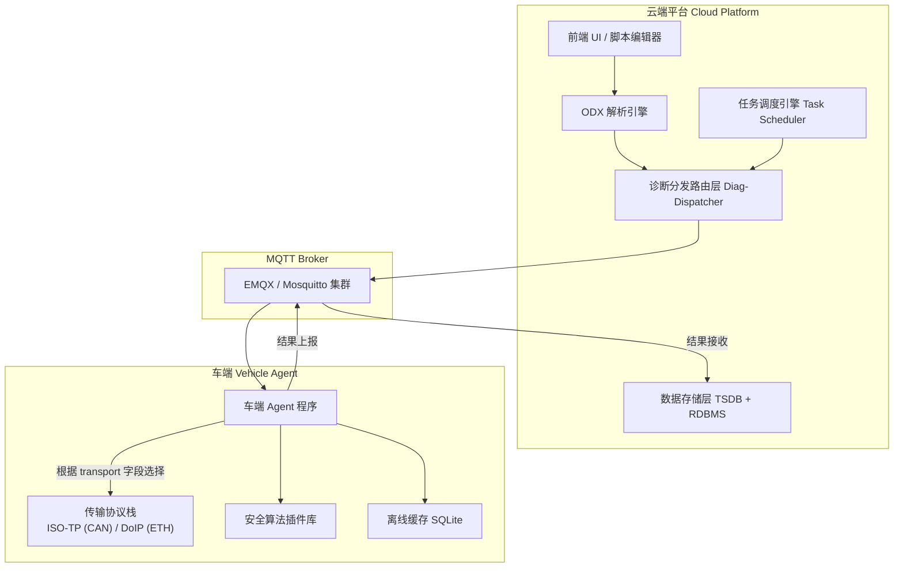
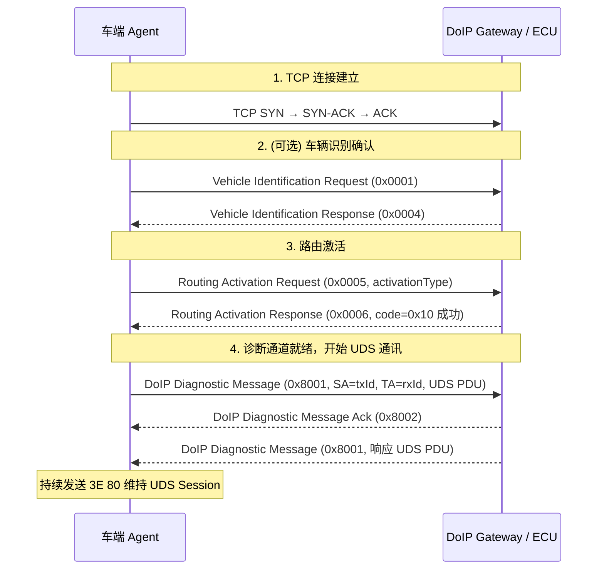
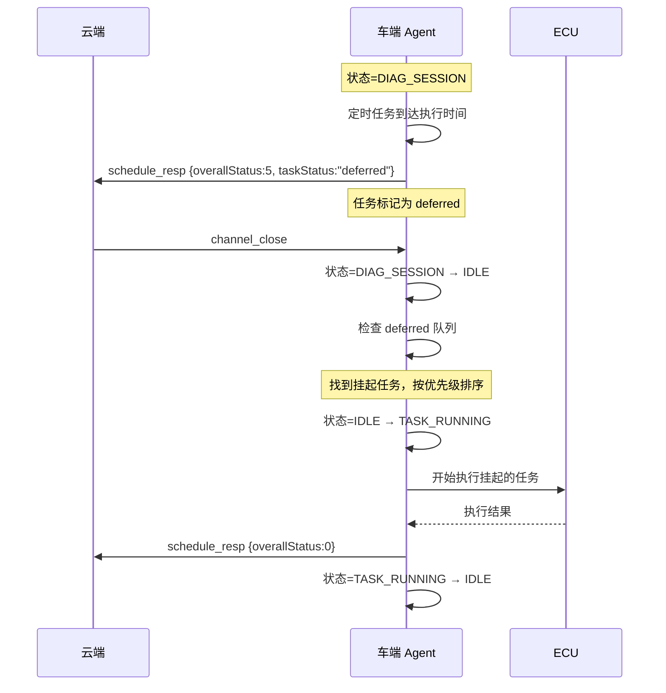
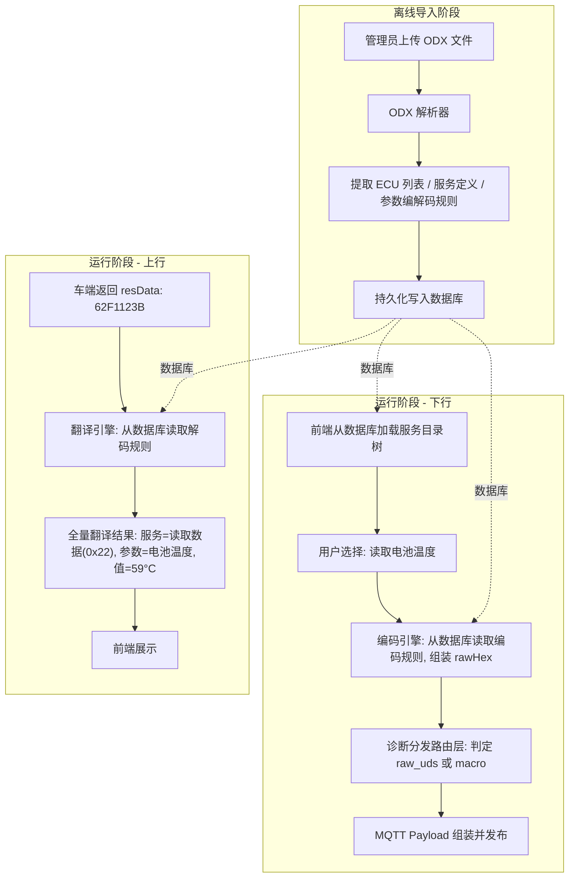
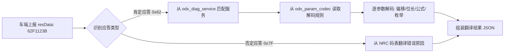
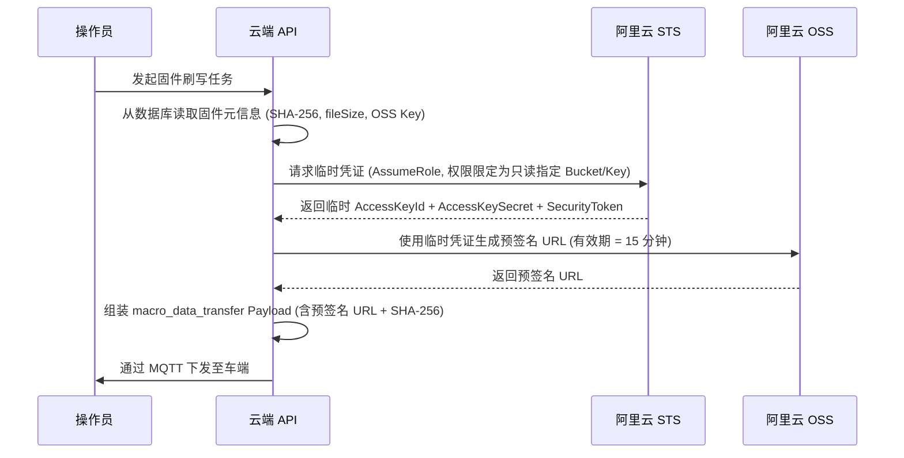
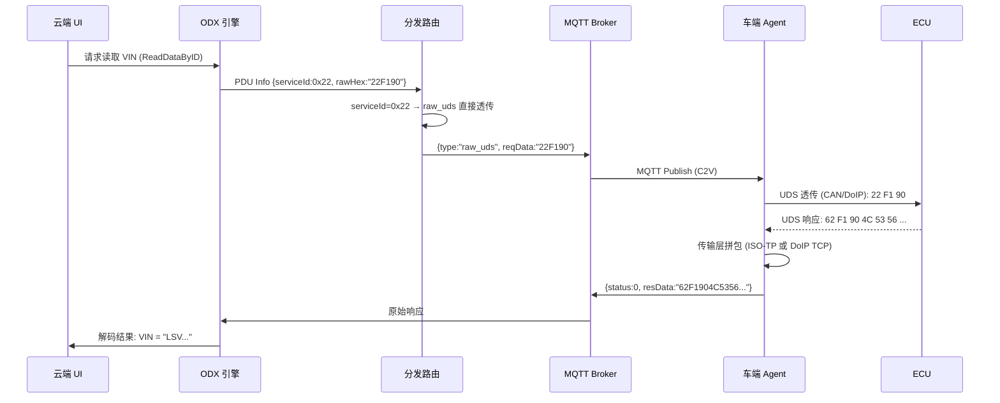
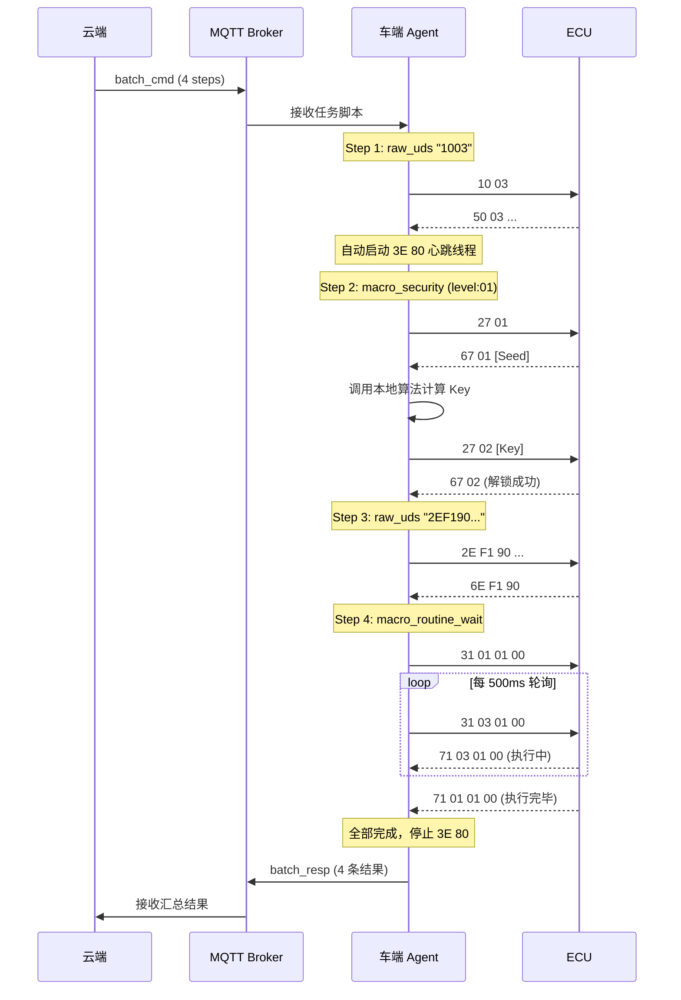

# OpenDOTA 车云诊断通讯协议工程规范

> **版本**: v1.0  
> **日期**: 2026-04-16  
> **状态**: 设计评审中  
> **适用范围**: 云端平台 ↔ 车端 Agent 之间基于 MQTT 的远程诊断通讯

---

## 目录

1. [系统架构总览](#1-系统架构总览)
2. [MQTT Topic 路由设计](#2-mqtt-topic-路由设计)
3. [消息封包协议 (Message Envelope)](#3-消息封包协议-message-envelope)
4. [诊断通道生命周期管理](#4-诊断通道生命周期管理)
5. [单步诊断交互协议 (Single Diagnostic)](#5-单步诊断交互协议-single-diagnostic)
6. [批量诊断任务协议 (Batch Diagnostic)](#6-批量诊断任务协议-batch-diagnostic)
7. [车端宏指令体系 (Macro Command System)](#7-车端宏指令体系-macro-command-system)
8. [定时与周期任务调度 (Scheduled Task)](#8-定时与周期任务调度-scheduled-task)
9. [多 ECU 编排脚本协议 (Multi-ECU Script)](#9-多-ecu-编排脚本协议-multi-ecu-script)
10. [车端资源仲裁与互斥机制 (Resource Arbitration)](#10-车端资源仲裁与互斥机制-resource-arbitration)
11. [车端任务队列与操控协议 (Queue Control)](#11-车端任务队列与操控协议-queue-control)
12. [任务控制协议 (Task Control)](#12-任务控制协议-task-control)
13. [云端 ODX 引擎与分发路由架构](#13-云端-odx-引擎与分发路由架构)
14. [错误码与状态码定义](#14-错误码与状态码定义)
15. [安全与审计要求](#15-安全与审计要求)

---

## 1. 系统架构总览

### 1.1 架构分层

系统严格分为三个纵向层次，各层职责边界清晰，严禁越界：

| 层级 | 名称 | 职责 | 关键特征 |
|:---:|:---|:---|:---|
| **L1** | 业务配置层（云端） | ODX 解析、DBC/CDD 翻译、报文编解码、人机交互 | 理解业务语义，管理车型配置 |
| **L2** | 车云协议层（MQTT 通道） | 标准化 JSON 封包的传输与路由 | 纯运输通道，不关心业务语义 |
| **L3** | 车端执行层（车端 Agent） | 原生 UDS 透传、宏命令执行、ISO-TP / DoIP 底层处理、心跳维持 | 不懂 ODX，不处理业务翻译；支持 CAN/CAN-FD 与 DoIP 双传输栈 |

### 1.2 架构示意图



### 1.3 核心设计原则

> [!IMPORTANT]
> **"公网 MQTT 里只跑'指令意图（Intent）'和'结果汇总（Summary）'，绝不跑'毫秒级的交互闭环'。"**

1. **车端是无状态的搬运工**：车端 Agent 不解析 ODX，不翻译报文含义，只执行传输和宏逻辑。
2. **时效敏感操作必须下沉**：所有需要在毫秒级完成多次握手的操作（安全访问、大包传输、例程轮询），必须封装为车端宏，在车内总线本地闭环。
3. **协议层与业务层解耦**：引入新车型只需更新云端 ODX 配置，车端代码零修改（除新增算法插件外）。

---

## 2. MQTT Topic 路由设计

### 2.1 Topic 命名规范

采用基于**动作方向 + 业务场景 + VIN 码**的 RESTful 风格层级结构。

**格式**: `dota/v{版本}/{方向}/{业务场景}/{vin}`

### 2.2 Topic 注册表

| 数据流向 | 业务场景 | Topic | QoS | 说明 |
|:---:|:---|:---|:---:|:---|
| **C2V** ↓ | 诊断通道管理 | `dota/v1/cmd/channel/{vin}` | 1 | 开启/关闭诊断通道 |
| **C2V** ↓ | 单步诊断指令 | `dota/v1/cmd/single/{vin}` | 1 | 单条 UDS 指令下发 |
| **C2V** ↓ | 批量任务下发 | `dota/v1/cmd/batch/{vin}` | 1 | 批量诊断任务脚本下发 |
| **C2V** ↓ | 定时任务策略 | `dota/v1/cmd/schedule/{vin}` | 1 | 周期/定时任务策略下发 |
| **C2V** ↓ | 任务控制 | `dota/v1/cmd/control/{vin}` | 1 | 取消/暂停/恢复任务 |
| **C2V** ↓ | 多 ECU 脚本下发 | `dota/v1/cmd/script/{vin}` | 1 | 多 ECU 编排脚本下发 |
| **C2V** ↓ | 车端队列操控 | `dota/v1/cmd/queue/{vin}` | 1 | 车端任务队列查询/操控 |
| **V2C** ↑ | 指令到达回执 | `dota/v1/ack/{vin}` | 1 | 车端确认收到报文（可选） |
| **V2C** ↑ | 单步诊断结果 | `dota/v1/resp/single/{vin}` | 1 | 单条 UDS 执行结果上报 |
| **V2C** ↑ | 批量任务结果 | `dota/v1/resp/batch/{vin}` | 1 | 批量任务执行结果上报 |
| **V2C** ↑ | 通道状态通知 | `dota/v1/event/channel/{vin}` | 1 | 诊断通道状态变更事件 |
| **V2C** ↑ | 多 ECU 脚本结果 | `dota/v1/resp/script/{vin}` | 1 | 编排脚本执行结果上报 |
| **V2C** ↑ | 队列状态上报 | `dota/v1/resp/queue/{vin}` | 1 | 车端任务队列状态上报 |

### 2.3 QoS 策略

- 所有诊断指令统一使用 **QoS 1**（至少投递一次）。
- 报文中通过 `msgId` 实现业务层去重，保证**幂等性**。
- 不使用 QoS 2（性能开销过大且 MQTT Broker 集群下一致性难以保障）。

---

## 3. 消息封包协议 (Message Envelope)

### 3.1 公共封包结构

所有车云交互报文（无论上行下行）都必须遵循统一的最外层 JSON 骨架：

```json
{
  "msgId": "550e8400-e29b-41d4-a716-446655440000",
  "timestamp": 1713258654000,
  "vin": "LSVWA234567890123",
  "act": "single_cmd",
  "payload": { }
}
```

### 3.2 字段说明

| 字段 | 类型 | 必填 | 说明 |
|:---|:---:|:---:|:---|
| `msgId` | string (UUID) | ✅ | 全局唯一消息 ID，用于日志追踪、防重放去重 |
| `timestamp` | int64 | ✅ | 报文生成时的 Unix 毫秒级时间戳 |
| `vin` | string (17位) | ✅ | 目标车架号 |
| `act` | string (enum) | ✅ | 业务动作类型，见下方枚举 |
| `payload` | object | ✅ | 具体的业务数据对象 |

### 3.3 `act` 枚举定义

| act 值 | 方向 | 说明 |
|:---|:---:|:---|
| `channel_open` | C2V | 请求开启诊断通道 |
| `channel_close` | C2V | 请求关闭诊断通道 |
| `channel_event` | V2C | 通道状态变更事件通知 |
| `single_cmd` | C2V | 单步诊断指令下发 |
| `single_resp` | V2C | 单步诊断结果上报 |
| `batch_cmd` | C2V | 批量诊断任务下发 |
| `batch_resp` | V2C | 批量诊断结果上报 |
| `schedule_set` | C2V | 定时/周期任务策略下发 |
| `schedule_cancel` | C2V | 取消定时/周期任务 |
| `schedule_resp` | V2C | 定时任务执行结果上报 |
| `script_cmd` | C2V | 多 ECU 编排脚本下发 |
| `script_resp` | V2C | 多 ECU 编排脚本结果上报 |
| `queue_query` | C2V | 查询车端任务队列状态 |
| `queue_delete` | C2V | 删除队列中指定任务 |
| `queue_pause` | C2V | 暂停队列中指定任务 |
| `queue_resume` | C2V | 恢复队列中指定任务 |
| `queue_status` | V2C | 车端上报队列状态 |
| `task_pause` | C2V | 暂停指定任务 |
| `task_resume` | C2V | 恢复指定任务 |
| `task_cancel` | C2V | 取消指定任务（覆盖 `schedule_cancel`，适用于所有任务类型） |
| `task_query` | C2V | 查询指定任务或全部任务的状态 |

---

## 4. 诊断通道生命周期管理

### 4.1 设计背景

> [!WARNING]
> UDS 协议中，ECU 的 **S3 Server Timer** 通常为 4~5 秒。如果在此时间内 ECU 未收到任何诊断请求，会自动退回默认会话 `0x01`。云端通过公网无法以毫秒级精度发送心跳，因此**心跳维持（Tester Present `3E 80`）必须由车端 Agent 在本地托管**。

### 4.2 通道开启 (`channel_open`)

**云端 → 车端（CAN 示例）**

```json
{
  "act": "channel_open",
  "payload": {
    "channelId": "ch-uuid-001",
    "ecuName": "VCU",
    "transport": "UDS_ON_CAN",
    "txId": "0x7E0",
    "rxId": "0x7E8",
    "globalTimeoutMs": 300000
  }
}
```

**云端 → 车端（DoIP 示例）**

```json
{
  "act": "channel_open",
  "payload": {
    "channelId": "ch-uuid-002",
    "ecuName": "GW",
    "transport": "UDS_ON_DOIP",
    "txId": "0x0E80",
    "rxId": "0x1001",
    "doipConfig": {
      "ecuIp": "169.254.100.10",
      "ecuPort": 13400,
      "activationType": "0x00"
    },
    "globalTimeoutMs": 300000
  }
}
```

| 字段 | 类型 | 必填 | 说明 |
|:---|:---:|:---:|:---|
| `channelId` | string | ✅ | 通道唯一标识，用于后续操作关联 |
| `ecuName` | string | ✅ | 目标 ECU 逻辑名称 |
| `transport` | string (enum) | ❌ | 传输层协议类型，默认 `UDS_ON_CAN`。可选值：`UDS_ON_CAN` / `UDS_ON_DOIP` |
| `txId` | string (hex) | ✅ | UDS 源寻址标识。CAN 模式下为请求 Arbitration ID（如 `0x7E0`）；DoIP 模式下为 Tester Logical Address（如 `0x0E80`） |
| `rxId` | string (hex) | ✅ | UDS 目标寻址标识。CAN 模式下为期望响应 Arbitration ID（如 `0x7E8`）；DoIP 模式下为 ECU Logical Address（如 `0x1001`） |
| `doipConfig` | object | 条件 | `transport=UDS_ON_DOIP` 时必填。DoIP 连接配置 |
| `doipConfig.ecuIp` | string | ✅ | DoIP 实体（ECU / 网关）的 IP 地址 |
| `doipConfig.ecuPort` | int | ❌ | TCP 端口，默认 `13400`（ISO 13400 标准端口） |
| `doipConfig.activationType` | string (hex) | ❌ | Routing Activation Type，默认 `0x00`（Default）。`0x01` = WWH-OBD |
| `globalTimeoutMs` | int | ✅ | 全局空闲超时（毫秒），超过此时间无任何指令下发，车端自动释放通道 |

**车端收到后的动作**：

- **CAN 模式** (`transport=UDS_ON_CAN`)：
  1. 锁定该 ECU 的 CAN 通道资源。
  2. 启动后台线程，以 2~3 秒间隔向目标 ECU 发送 `3E 80`（抑制正响应的 Tester Present）。
  3. 启动空闲定时器，倒计时 `globalTimeoutMs`；每收到一条新的指令则重置定时器。
  4. 向云端回传通道开启确认。

- **DoIP 模式** (`transport=UDS_ON_DOIP`)：
  1. 建立 TCP 连接至 `doipConfig.ecuIp:ecuPort`。
  2. 发送 DoIP Routing Activation Request（`activationType`），等待 Routing Activation Response。
     - 若响应码 = `0x10`（成功），继续下一步。
     - 若响应码非 `0x10` 或超时，上报 `DOIP_ROUTING_FAILED` 错误并终止。
  3. 启动后台线程，以 2~3 秒间隔向目标 ECU 发送 `3E 80`（通过 DoIP Diagnostic Message 封装）。
  4. 启动空闲定时器，倒计时 `globalTimeoutMs`；每收到一条新的指令则重置定时器。
  5. 向云端回传通道开启确认。

**车端 → 云端（通道确认）**

```json
{
  "act": "channel_event",
  "payload": {
    "channelId": "ch-uuid-001",
    "event": "opened",
    "status": 0,
    "msg": "通道已建立，3E 80 心跳已启动"
  }
}
```

### 4.3 通道关闭 (`channel_close`)

**云端 → 车端**

```json
{
  "act": "channel_close",
  "payload": {
    "channelId": "ch-uuid-001",
    "resetSession": true
  }
}
```

| 字段 | 说明 |
|:---|:---|
| `resetSession` | 布尔值。若为 `true`，车端在停止 `3E 80` 前主动发送 `10 01` 将 ECU 踢回默认会话 |

### 4.4 通道异常关闭（车端主动上报）

当车端因以下原因自动关闭通道时，必须上报云端：

| 场景 | `event` 值 | 适用传输层 | 说明 |
|:---|:---|:---:|:---|
| 空闲超时 | `idle_timeout` | 全部 | 云端长时间未下发新指令，超过 `globalTimeoutMs` |
| ECU 通讯中断 | `ecu_lost` | 全部 | `3E 80` 连续 N 次未收到 ECU 响应 |
| 车辆休眠 | `vehicle_sleep` | 全部 | 检测到 KL15 OFF，整车进入休眠 |
| DoIP TCP 断连 | `doip_tcp_disconnect` | DoIP | TCP 连接意外断开（对端 RST / FIN） |
| DoIP 路由激活失败 | `doip_routing_failed` | DoIP | Routing Activation 被 ECU 拒绝或超时 |

### 4.5 传输层适配策略

> [!IMPORTANT]
> 协议层（MQTT Envelope）通过 `transport` 字段声明传输类型，车端 Agent 据此选择对应的传输协议栈。**云端不感知底层是 CAN 还是 DoIP**——对云端而言，`txId`/`rxId` 始终是「逻辑寻址标识」，`reqData`/`resData` 始终是完整的 UDS PDU 十六进制字符串。

#### 4.5.1 CAN / CAN-FD 传输路径

```
云端 MQTT Envelope
  └─ transport = UDS_ON_CAN
  └─ txId = CAN Arbitration ID (如 0x7E0)
  └─ rxId = CAN Arbitration ID (如 0x7E8)
       │
       ▼
车端 Agent (ISO-TP 协议栈)
  └─ ISO 15765-2 分帧/拼包（FF → FC → CF）
  └─ 单帧上限：CAN = 7 字节，CAN-FD = 63 字节
  └─ 多帧上限：理论 4095 字节
```

#### 4.5.2 DoIP (以太网) 传输路径

```
云端 MQTT Envelope
  └─ transport = UDS_ON_DOIP
  └─ txId = Tester Logical Address (如 0x0E80)
  └─ rxId = ECU Logical Address (如 0x1001)
  └─ doipConfig = { ecuIp, ecuPort, activationType }
       │
       ▼
车端 Agent (DoIP 协议栈)
  └─ TCP 连接至 ecuIp:ecuPort
  └─ Routing Activation (activationType)
  └─ DoIP Generic Header (Payload Type = 0x8001) 封装 UDS PDU
  └─ 无 ISO-TP 分帧，TCP 流式传输，单次可传输 2^32 字节
```

#### 4.5.3 DoIP 通道建立详细流程



#### 4.5.4 DoIP 通道关闭流程

1. 若 `resetSession=true`：先通过 DoIP Diagnostic Message 发送 `10 01` 将 ECU 踢回默认会话。
2. 停止 `3E 80` 心跳。
3. 发送 TCP FIN 关闭连接。
4. 上报 `channel_event` (`event=closed`)。

#### 4.5.5 DoIP vs CAN 行为差异汇总

| 维度 | CAN / CAN-FD | DoIP |
|:---|:---|:---|
| 连接建立 | 无需显式连接（广播总线） | TCP 三次握手 + Routing Activation |
| 分帧处理 | ISO-TP（FF/FC/CF），车端自动拼包 | 无分帧，DoIP Header 携带长度字段 |
| 最大 UDS PDU | ISO-TP 理论上限 4095 字节 | TCP 流式，无硬上限 |
| 心跳维持 | UDS `3E 80` | UDS `3E 80` + DoIP Alive Check（TCP 层面） |
| 断连检测 | `3E 80` 无响应 | TCP FIN/RST + `3E 80` 无响应 |
| 通道关闭 | 停止 `3E 80` 即可 | `10 01` → 停止 `3E 80` → TCP FIN |


---

## 5. 单步诊断交互协议 (Single Diagnostic)

### 5.1 适用场景

模拟诊断仪的一问一答模式：工程师在云端 UI 上手动点击按钮，发送一条 UDS 指令，车端执行后返回结果。

> [!NOTE]
> 使用单步诊断前，**必须先通过 `channel_open` 建立诊断通道**。

### 5.2 指令下发 (`single_cmd`)

**云端 → 车端**

```json
{
  "act": "single_cmd",
  "payload": {
    "cmdId": "cmd-88bb-5541",
    "channelId": "ch-uuid-001",
    "type": "raw_uds",
    "reqData": "22F190",
    "timeoutMs": 5000
  }
}
```

| 字段 | 类型 | 必填 | 说明 |
|:---|:---:|:---:|:---|
| `cmdId` | string | ✅ | 指令业务唯一 ID，用于请求-响应匹配 |
| `channelId` | string | ✅ | 关联的诊断通道 ID |
| `type` | string (enum) | ✅ | 指令类型：`raw_uds` 或 `macro_*`（见第 7 章） |
| `reqData` | string (hex) | 条件 | `type=raw_uds` 时必填，原始 UDS 十六进制数据 |
| `timeoutMs` | int | ✅ | 单条指令的车端最大等待超时时间 |

### 5.3 结果上报 (`single_resp`)

**车端 → 云端**

```json
{
  "act": "single_resp",
  "payload": {
    "cmdId": "cmd-88bb-5541",
    "channelId": "ch-uuid-001",
    "status": 0,
    "errorCode": "",
    "resData": "62F19001020304",
    "execDuration": 120
  }
}
```

| 字段 | 类型 | 说明 |
|:---|:---:|:---|
| `cmdId` | string | 必须原样带回，云端依此匹配等待中的请求 |
| `status` | int | 执行状态码（见第 14 章） |
| `errorCode` | string | UDS NRC 码或车端自定义错误码 |
| `resData` | string (hex) | 原始 UDS 十六进制响应数据 |
| `execDuration` | int | 车端实际执行耗时（毫秒） |

---

## 6. 批量诊断任务协议 (Batch Diagnostic)

### 6.1 适用场景

批量诊断针对需要执行一连串 UDS 指令的场景（如整车自检、标定写入序列）。云端将全部指令以**脚本清单**的形式一次性下发，车端本地按序执行，全部完成后打包上报结果。

> [!NOTE]
> 批量任务**不需要**预先建立诊断通道。车端收到批量任务后，自行管理 ECU 连接、Session 维持和释放的全生命周期。

### 6.2 任务下发 (`batch_cmd`)

**云端 → 车端**

```json
{
  "act": "batch_cmd",
  "payload": {
    "taskId": "task-v4-batch2026",
    "priority": 3,
    "ecuName": "VCU",
    "transport": "UDS_ON_CAN",
    "txId": "0x7E0",
    "rxId": "0x7E8",
    "strategy": 1,
    "steps": [
      {
        "seqId": 1,
        "type": "raw_uds",
        "data": "1003",
        "timeoutMs": 2000
      },
      {
        "seqId": 2,
        "type": "macro_security",
        "level": "01",
        "algoId": "algo_vcu_1"
      },
      {
        "seqId": 3,
        "type": "raw_uds",
        "data": "2EF19001020304",
        "timeoutMs": 3000
      },
      {
        "seqId": 4,
        "type": "macro_routine_wait",
        "data": "31010100",
        "maxWaitMs": 15000
      }
    ]
  }
}
```

| 字段 | 类型 | 必填 | 说明 |
|:---|:---:|:---:|:---|
| `taskId` | string | ✅ | 批次任务全局唯一标识 |
| `priority` | int | ❌ | 任务优先级（0-9，0=最高，9=最低）。默认 5。在线诊断仪隐含 `priority=0` |
| `ecuName` | string | ✅ | 目标 ECU 逻辑名称 |
| `transport` | string (enum) | ❌ | 传输层协议类型，默认 `UDS_ON_CAN`。可选值：`UDS_ON_CAN` / `UDS_ON_DOIP`。详见 [4.5 节](#45-传输层适配策略) |
| `txId` / `rxId` | string (hex) | ✅ | UDS 源/目标寻址标识。CAN 模式下为 Arbitration ID；DoIP 模式下为 Logical Address |
| `doipConfig` | object | 条件 | `transport=UDS_ON_DOIP` 时必填，结构同 `channel_open`。详见 [4.2 节](#42-通道开启-channel_open) |
| `strategy` | int | ✅ | 错误处理策略：`0` = 遇错立即终止 (Abort)；`1` = 遇错跳过继续 (Continue) |
| `steps` | array | ✅ | 有序的指令步骤列表（支持 `raw_uds` 与 `macro_*` 混写） |

#### `steps[n]` 通用字段

| 字段 | 类型 | 必填 | 说明 |
|:---|:---:|:---:|:---|
| `seqId` | int | ✅ | 步骤序号（全局唯一，用于结果一一对应） |
| `type` | string (enum) | ✅ | 指令类型：`raw_uds` / `macro_security` / `macro_routine_wait` / `macro_data_transfer` |
| `data` | string (hex) | 条件 | `type=raw_uds` 时为原始 UDS 数据；宏类型时为启动指令（如有） |
| `timeoutMs` | int | 条件 | 单步超时（`raw_uds` 时必填） |

### 6.3 任务结果上报 (`batch_resp`)

**车端 → 云端**

```json
{
  "act": "batch_resp",
  "payload": {
    "taskId": "task-v4-batch2026",
    "overallStatus": 1,
    "taskDuration": 24500,
    "results": [
      {
        "seqId": 1,
        "status": 0,
        "resData": "500300C80014"
      },
      {
        "seqId": 2,
        "status": 0,
        "resData": "",
        "msg": "Security Level 01 解锁成功"
      },
      {
        "seqId": 3,
        "status": 0,
        "resData": "6EF190"
      },
      {
        "seqId": 4,
        "status": 3,
        "errorCode": "NRC_22",
        "resData": "7F3122"
      }
    ]
  }
}
```

| 字段 | 类型 | 说明 |
|:---|:---:|:---|
| `overallStatus` | int | 整体状态：`0` 全部成功 / `1` 部分成功 / `2` 全部失败 / `3` 任务被终止 |
| `taskDuration` | int | 车端整体执行耗时（毫秒） |
| `results` | array | 与 `steps` 中 `seqId` 一一对应的执行结果 |

---

## 7. 车端宏指令体系 (Macro Command System)

### 7.1 设计背景

> [!CAUTION]
> 以下 UDS 服务因涉及**毫秒级多步握手**、**动态参数计算**、**大包分帧传输**或**长时间轮询等待**，如果通过云端逐条下发将严重受限于公网延迟，**必须封装为车端本地宏命令，在车内总线侧闭环执行**。

### 7.2 宏指令类型汇总

| 宏类型标识 | 对应 UDS 服务 | 核心原因 | 车端动作 |
|:---|:---|:---|:---|
| `macro_security` | `0x27` Security Access | Seed-to-Key 有严格的时间窗口限制（通常 < 2秒），公网延迟必超时 | 车端本地完成 27 XX → 拿 Seed → 调算法算 Key → 27 XX+1 全流程 |
| `macro_routine_wait` | `0x31` Routine Control | 例程执行耗时长（可达数十秒），期间需要反复发 `31 03` 轮询 + `3E 80` 维持心跳 | 车端发 `31 01` → 循环发 `31 03` 查状态 → 等结果出炉后上报 |
| `macro_data_transfer` | `0x34/0x36/0x37` Data Transfer | 大文件需要拆成上百帧 `36` 逐帧发送，每帧都有 ACK，公网无法承受 | 车端从指定 URL 下载文件至本地 → 本地高速传输 → 上报结果 |

### 7.3 `macro_security` — 安全访问宏

**用途**：在单步或批量场景中，完成 `27` 服务的全自动安全解锁。

**参数化设计**（适配所有 Level，无需为每个 Level 单独开发）：

```json
{
  "type": "macro_security",
  "level": "03",
  "algoId": "Algo_Chery_V2",
  "maxRetry": 3
}
```

| 字段 | 类型 | 必填 | 说明 |
|:---|:---:|:---:|:---|
| `level` | string (hex) | ✅ | 安全访问级别（如 `"01"`, `"03"`, `"11"` 等）。车端自动推算其 SubFunction：请求 Seed 为 `level`，发送 Key 为 `level + 1` |
| `algoId` | string | ✅ | 车端本地算法插件标识。车端据此从本地算法库（`.so` / `.dll`）中动态加载对应的 Seed-to-Key 计算函数 |
| `maxRetry` | int | ❌ | 最大重试次数（默认 1）。如果首次失败，车端可等待 `attemptDelay` 后重新走一遍 |

**车端执行流程**：
1. 发送 `27 {level}` 请求 Seed。
2. 拿到 Seed 后立即调用本地 `algoId` 对应的算法函数计算 Key。
3. 发送 `27 {level+1} [Key]` 完成认证。
4. 判定肯定响应 `67 {level+1}` 即为成功。

**上报结果格式**：

```json
{
  "seqId": 2,
  "status": 0,
  "msg": "Security Level 03 解锁成功"
}
```

### 7.4 `macro_routine_wait` — 例程等待宏

**用途**：启动车端 ECU 的自检、标定、排气等耗时例程，并自动等待执行完成。

```json
{
  "type": "macro_routine_wait",
  "data": "31010203",
  "pollIntervalMs": 500,
  "maxWaitMs": 15000
}
```

| 字段 | 类型 | 必填 | 说明 |
|:---|:---:|:---:|:---|
| `data` | string (hex) | ✅ | 例程启动指令（`31 01 XX XX`） |
| `pollIntervalMs` | int | ❌ | 轮询间隔（默认 500ms），车端每隔此时间发 `31 03` 查询结果 |
| `maxWaitMs` | int | ✅ | 最大等待时间，超时后视为执行失败 |

**车端执行流程**：
1. 发送 `31 01 XX XX` 启动例程。
2. 每隔 `pollIntervalMs` 发送 `31 03 XX XX` 查询执行状态。
3. 期间持续发送 `3E 80` 维持会话。
4. 收到明确的完成响应或超过 `maxWaitMs` 时结束。

### 7.5 `macro_data_transfer` — 数据传输宏

**用途**：远程刷写（Flash）或大数据块读取。

> [!CAUTION]
> 固件刷写是**高危操作**——写入错误的数据到 ECU 内存可能导致车辆变砖。因此本协议对固件传输链路施加了严格的安全约束：**SHA-256 完整性校验 + OSS 预签名 URL 时效控制**。详见 [15.3 固件传输安全](#153-固件传输安全)。

```json
{
  "type": "macro_data_transfer",
  "direction": "download",
  "fileUrl": "https://oss.example.com/firmware/vcu_v2.3.bin?Expires=1713262254&OSSAccessKeyId=STS.xxx&Signature=yyy",
  "fileSha256": "a3f2b8c9d0e1f2a3b4c5d6e7f8091a2b3c4d5e6f708192a3b4c5d6e7f8091a2b",
  "fileSize": 131072,
  "memoryAddress": "0x00080000",
  "memorySize": "0x00020000"
}
```

| 字段 | 类型 | 必填 | 说明 |
|:---|:---:|:---:|:---|
| `direction` | string | ✅ | `"download"` (云→ECU 写入) / `"upload"` (ECU→云 读取) |
| `fileUrl` | string | 条件 | 下载时必填。**必须为带时效的 OSS 预签名 URL**（有效期 ≤ 15 分钟），不得使用永久直链。详见 [15.3 节](#153-固件传输安全) |
| `fileSha256` | string | ✅ | 文件的 **SHA-256** 校验值（64 位十六进制字符串）。车端下载后**必须**校验，不一致则拒绝刷写 |
| `fileSize` | int | ✅ | 文件大小（字节）。车端下载前可用于预检磁盘空间，下载后校验文件完整性 |
| `memoryAddress` | string (hex) | 条件 | ECU 内存起始地址（下载时必填） |
| `memorySize` | string (hex) | 条件 | 内存块大小 |

**车端执行流程**（以 download 为例）：
1. 校验 `fileUrl` 是否为预签名 URL（含 `Expires` / `Signature` 参数），非预签名 URL 直接拒绝。
2. 检查本地磁盘剩余空间是否 ≥ `fileSize`。
3. 从 `fileUrl` 下载固件文件至车端本地磁盘。
4. 计算下载文件的 SHA-256，与 `fileSha256` 比对，**不一致则终止任务并上报错误**。
5. 发送 `34`（Request Download）协商传输参数。
6. 循环发送 `36`（Transfer Data）逐块写入。
7. 发送 `37`（Request Transfer Exit）结束传输。
8. 上报最终结果与校验状态。

### 7.6 底层传输协议处理（对云端完全透明）

> [!IMPORTANT]
> 无论底层传输是 CAN 还是 DoIP，车端向云端上报的 `resData` **始终必须是完整拼装好的单一十六进制字符串**，云端绝不参与底层分帧/拼包逻辑。

**CAN / CAN-FD 场景（ISO-TP 分帧）**：

当 UDS 响应数据超过单帧长度（CAN 为 7 字节，CAN-FD 为 63 字节）时，CAN 物理总线上会触发 ISO 15765-2（ISO-TP）的多帧切包流程：首帧（FF）→ 流控帧（FC）→ 连续帧（CF）。此底层握手必须由车端 ISO-TP 协议栈自动处理拼包。

**DoIP 场景（TCP 流式传输）**：

DoIP 基于 TCP 流式传输，UDS PDU 由 DoIP Generic Header（含 `payload length` 字段）封装，**不存在** ISO-TP 的 FF/FC/CF 分帧过程。单次可传输的 UDS PDU 大小远超 ISO-TP 的 4095 字节上限（DoIP Header 支持 2^32 字节）。车端 DoIP 协议栈仅需从 TCP 流中按 DoIP Header 长度字段截取完整 PDU 即可。

---

## 8. 定时与周期任务调度 (Scheduled Task)

### 8.1 设计原则

> [!IMPORTANT]
> 定时/周期任务的调度引擎**必须驻留在车端**。云端只负责下发"策略配置"（圣旨），车端根据本地 RTC 时钟自行判断执行时机，执行结果离线缓存，待网络恢复后批量上报。

**原因**：
- 车辆可能停在无信号区域（地下车库）。
- 云端定时触发完全依赖实时网络，不可靠。
- 高频周期任务（如每分钟采集）会导致公网流量爆炸。

### 8.2 策略下发 (`schedule_set`)

**云端 → 车端**

```json
{
  "act": "schedule_set",
  "payload": {
    "taskId": "task-cron-001",
    "priority": 3,
    "scheduleCondition": {
      "mode": "periodic",
      "cronExpression": "0 */5 * * * ?",
      "maxExecutions": 100,
      "currentExecutionCount": 0,
      "validWindow": {
        "startTime": 1713300000000,
        "endTime": 1713800000000
      },
      "vehicleState": {
        "ignition": "ON",
        "speedMax": 120,
        "gear": "ANY"
      }
    },
    "ecuName": "BMS",
    "transport": "UDS_ON_CAN",
    "txId": "0x7E3",
    "rxId": "0x7EB",
    "strategy": 1,
    "steps": [
      {
        "seqId": 1,
        "type": "raw_uds",
        "data": "220101",
        "timeoutMs": 2000
      },
      {
        "seqId": 2,
        "type": "raw_uds",
        "data": "220102",
        "timeoutMs": 2000
      }
    ]
  }
}
```

> [!NOTE]
> `schedule_set` 同样支持 `transport` 和 `doipConfig` 字段，语义与 `channel_open` / `batch_cmd` 完全一致。详见 [4.5 节](#45-传输层适配策略)。

#### `scheduleCondition` 字段说明

| 字段 | 类型 | 必填 | 说明 |
|:---|:---:|:---:|:---|
| `mode` | string (enum) | ✅ | 任务模式：`"once"`=单次执行；`"periodic"`=周期执行；`"timed"`=定时执行；`"conditional"`=条件触发 |
| `cronExpression` | string | 条件 | `mode=periodic` 时必填（与 `intervalMs` 二选一）。标准 Cron 表达式 |
| `intervalMs` | int64 | 条件 | `mode=periodic` 时可选（与 `cronExpression` 二选一）。执行间隔毫秒数 |
| `executeAt` | int64 | 条件 | `mode=once` 时必填。指定的执行时间戳 |
| `executeAtList` | int64[] | 条件 | `mode=timed` 时必填。指定时间点列表（毫秒级时间戳数组），车端依次在各时间点执行 |
| `triggerCondition` | object | 条件 | `mode=conditional` 时必填。触发条件定义，详见下方说明 |
| `maxExecutions` | int | ❌ | 最大执行次数。`-1`=无限执行，`1` 等价于 `once`。默认 `-1`。车端本地维护计数器，达到上限后自动停止 |
| `currentExecutionCount` | int | — | 当前已执行次数（车端本地维护，上报时携带，下发时无需填写） |
| `validWindow.startTime` | int64 | ✅ | 任务有效期起始时间 |
| `validWindow.endTime` | int64 | ✅ | 任务有效期截止时间，过期后车端自动删除该任务 |
| `vehicleState.ignition` | string | ❌ | 车辆点火状态要求：`"ON"` / `"OFF"` / `"ANY"` |
| `vehicleState.speedMax` | int | ❌ | 最大允许车速（km/h），超速时跳过执行 |
| `vehicleState.gear` | string | ❌ | 挡位要求：`"P"` / `"N"` / `"D"` / `"ANY"` |

#### 8.2.1 定时任务示例 (`mode=timed`)

```json
{
  "scheduleCondition": {
    "mode": "timed",
    "executeAtList": [1713300000000, 1713386400000, 1713472800000],
    "maxExecutions": 3,
    "validWindow": {
      "startTime": 1713300000000,
      "endTime": 1713800000000
    }
  }
}
```

> [!NOTE]
> 定时任务与单次任务 (`once`) 的区别：`once` 只有一个执行时间点，`timed` 支持多个预定时间点依次执行。

#### 8.2.2 条件任务示例 (`mode=conditional`)

```json
{
  "scheduleCondition": {
    "mode": "conditional",
    "triggerCondition": {
      "type": "signal",
      "signalName": "KL15_STATUS",
      "operator": "==",
      "value": "ON",
      "description": "上电自检：检测到 KL15 上电时触发"
    },
    "maxExecutions": -1,
    "validWindow": {
      "startTime": 1713300000000,
      "endTime": 1713800000000
    }
  }
}
```

#### 8.2.3 `triggerCondition` 触发条件类型枚举

| `type` 值 | 说明 | 示例 |
|:---|:---|:---|
| `power_on` | 上电自检 | 检测到 KL15 = ON |
| `signal` | 信号值触发 | 某信号值达到阈值 |
| `dtc` | DTC 触发 | 检测到特定故障码出现 |
| `timer` | 运行时长触发 | 累计运行 N 小时后 |
| `geo_fence` | 地理围栏触发 | 车辆进入/离开指定区域 |

**`triggerCondition` 字段说明**：

| 字段 | 类型 | 必填 | 说明 |
|:---|:---:|:---:|:---|
| `type` | string (enum) | ✅ | 触发条件类型，见上方枚举 |
| `signalName` | string | 条件 | `type=signal` 时必填。信号名称 |
| `operator` | string | 条件 | `type=signal` 时必填。比较运算符：`"=="` / `"!="` / `">"` / `"<"` / `">="` / `"<="` |
| `value` | string | 条件 | `type=signal` / `type=dtc` 时必填。触发值 |
| `description` | string | ❌ | 触发条件的人类可读描述 |

### 8.3 车端调度流程

1. **持久化存储**：车端收到策略后，解析并写入本地 SQLite 数据库。
2. **定时扫描**：车端 Agent 后台线程每 60 秒扫描一次活跃任务表。
3. **条件校验**：时间到达 → 检查 `vehicleState` 所有前置条件 → 全部满足则执行 → 任何条件不满足则跳过本轮。
4. **结果缓存**：执行结果写入本地 Offline Cache（附带真实执行时间戳）。
5. **汇聚上报**：网络恢复时（MQTT 重连），将缓存中待上报的结果合并后批量发送。

### 8.4 周期任务结果上报 (`schedule_resp`)

**车端 → 云端**

```json
{
  "act": "schedule_resp",
  "payload": {
    "taskId": "task-cron-001",
    "batchUploadMode": "aggregated",
    "resultsHistory": [
      {
        "triggerTime": 1713300100000,
        "overallStatus": 0,
        "results": [
          { "seqId": 1, "status": 0, "resData": "620101AABB" },
          { "seqId": 2, "status": 0, "resData": "620102CCDD" }
        ]
      },
      {
        "triggerTime": 1713300400000,
        "overallStatus": 1,
        "results": [
          { "seqId": 1, "status": 0, "resData": "620101EEFF" },
          { "seqId": 2, "status": 2, "errorCode": "TIMEOUT", "resData": "" }
        ]
      }
    ]
  }
}
```

### 8.5 任务取消 (`schedule_cancel`)

**云端 → 车端**

```json
{
  "act": "schedule_cancel",
  "payload": {
    "taskId": "task-cron-001"
  }
}
```

车端收到后，从本地 SQLite 中删除该任务，并停止后续所有调度。

---

## 9. 多 ECU 编排脚本协议 (Multi-ECU Script)

### 9.1 适用场景

多 ECU 编排脚本针对需要跨多个 ECU 执行诊断操作的场景（如读取整车所有 ECU 的 DTC、全车 EOL 自检脚本）。云端将多个 ECU 的诊断步骤以编排脚本方式一次性下发，车端本地按 ECU 分组执行，全部完成后打包上报结果。

> [!NOTE]
> 与 `batch_cmd` 的区别：`batch_cmd` 仅针对**单个 ECU** 的多步骤序列；`script_cmd` 支持**多个 ECU** 的并行/串行编排。

### 9.2 脚本下发 (`script_cmd`)

**云端 → 车端**

Topic: `dota/v1/cmd/script/{vin}`

```json
{
  "act": "script_cmd",
  "payload": {
    "scriptId": "script-read-all-dtc",
    "priority": 3,
    "executionMode": "parallel",
    "globalTimeoutMs": 60000,
    "ecus": [
      {
        "ecuName": "VCU",
        "transport": "UDS_ON_CAN",
        "txId": "0x7E0",
        "rxId": "0x7E8",
        "strategy": 1,
        "steps": [
          { "seqId": 1, "type": "raw_uds", "data": "190209", "timeoutMs": 3000 }
        ]
      },
      {
        "ecuName": "BMS",
        "transport": "UDS_ON_CAN",
        "txId": "0x7E3",
        "rxId": "0x7EB",
        "strategy": 1,
        "steps": [
          { "seqId": 1, "type": "raw_uds", "data": "190209", "timeoutMs": 3000 }
        ]
      },
      {
        "ecuName": "EPS",
        "transport": "UDS_ON_CAN",
        "txId": "0x7A0",
        "rxId": "0x7A8",
        "strategy": 1,
        "steps": [
          { "seqId": 1, "type": "raw_uds", "data": "190209", "timeoutMs": 3000 }
        ]
      }
    ]
  }
}
```

| 字段 | 类型 | 必填 | 说明 |
|:---|:---:|:---:|:---|
| `scriptId` | string | ✅ | 脚本全局唯一标识 |
| `priority` | int | ❌ | 任务优先级（0-9，0=最高），默认 5 |
| `executionMode` | string (enum) | ✅ | 执行模式：`"parallel"`=各 ECU 并行执行；`"sequential"`=各 ECU 按数组顺序串行执行 |
| `globalTimeoutMs` | int | ✅ | 全局超时时间（毫秒），超过此时间未完成的 ECU 步骤视为超时 |
| `ecus` | array | ✅ | ECU 编排列表，每个元素为一个 ECU 的诊断步骤组 |

#### `ecus[n]` 元素字段

| 字段 | 类型 | 必填 | 说明 |
|:---|:---:|:---:|:---|
| `ecuName` | string | ✅ | ECU 逻辑名称 |
| `transport` | string (enum) | ❌ | 传输层协议类型，默认 `UDS_ON_CAN` |
| `txId` / `rxId` | string (hex) | ✅ | UDS 源/目标寻址标识 |
| `doipConfig` | object | 条件 | `transport=UDS_ON_DOIP` 时必填，结构同 `channel_open` |
| `strategy` | int | ❌ | 错误处理策略：`0`=遇错终止该 ECU 步骤；`1`=遇错跳过继续。默认 `1` |
| `steps` | array | ✅ | 该 ECU 的有序指令步骤列表（格式同 `batch_cmd.steps`） |

### 9.3 脚本结果上报 (`script_resp`)

**车端 → 云端**

Topic: `dota/v1/resp/script/{vin}`

```json
{
  "act": "script_resp",
  "payload": {
    "scriptId": "script-read-all-dtc",
    "overallStatus": 1,
    "scriptDuration": 8500,
    "ecuResults": [
      {
        "ecuName": "VCU",
        "overallStatus": 0,
        "ecuDuration": 2100,
        "results": [
          { "seqId": 1, "status": 0, "resData": "5902090100018F" }
        ]
      },
      {
        "ecuName": "BMS",
        "overallStatus": 0,
        "ecuDuration": 1800,
        "results": [
          { "seqId": 1, "status": 0, "resData": "590209" }
        ]
      },
      {
        "ecuName": "EPS",
        "overallStatus": 2,
        "ecuDuration": 3000,
        "results": [
          { "seqId": 1, "status": 2, "errorCode": "TIMEOUT", "resData": "" }
        ]
      }
    ]
  }
}
```

| 字段 | 类型 | 说明 |
|:---|:---:|:---|
| `scriptId` | string | 原样带回脚本 ID |
| `overallStatus` | int | 整体状态：`0` 全部成功 / `1` 部分成功 / `2` 全部失败 / `3` 被终止 |
| `scriptDuration` | int | 整体执行耗时（毫秒） |
| `ecuResults` | array | 每个 ECU 的执行结果 |
| `ecuResults[n].ecuName` | string | ECU 名称 |
| `ecuResults[n].overallStatus` | int | 该 ECU 的整体执行状态 |
| `ecuResults[n].ecuDuration` | int | 该 ECU 的执行耗时（毫秒） |
| `ecuResults[n].results` | array | 该 ECU 每个步骤的结果（格式同 `batch_resp.results`） |

### 9.4 与定时任务的组合

`schedule_set` 的 payload 中可以使用 `script_cmd` 格式来定义多 ECU 的定时/周期任务。通过增加 `payloadType` 字段区分：

| `payloadType` 值 | 说明 |
|:---|:---|
| `"batch"`（默认） | 使用现有的单 ECU `ecuName`/`txId`/`rxId`/`steps` 字段 |
| `"script"` | 使用 `ecus[]` 数组格式，支持多 ECU 编排 |

---

## 10. 车端资源仲裁与互斥机制 (Resource Arbitration)

### 10.1 设计背景

> [!CAUTION]
> 在线诊断仪（实时人工操作）和后台批量/定时任务可能同时请求占用同一车辆的诊断资源。如果不定义明确的互斥机制，会导致资源竞争、UDS 会话冲突和不可预测的行为。本章定义了车端的资源仲裁协议，确保任意时刻只有一种诊断活动占用车端总线资源。

### 10.2 车端资源状态机

车端维护一个全局的诊断资源状态机，拥有三个互斥状态：

```
                    ┌───────────┐
        ┌──────────>│   IDLE    │<──────────┐
        │           └─────┬─────┘           │
        │                 │                 │
   channel_close    channel_open     task_complete
        │                 │                 │
        │                 ▼                 │
        │           ┌───────────┐           │
        ├───────────│  DIAG_    │           │
        │           │  SESSION  │           │
        │           └───────────┘           │
        │                                   │
        │           ┌───────────┐           │
        └───────────│   TASK_   ├───────────┘
                    │  RUNNING  │
                    └───────────┘
```

| 状态 | 说明 |
|:---|:---|
| `IDLE` | 空闲状态，可接受任何诊断请求 |
| `DIAG_SESSION` | 在线诊断仪占用中（`channel_open` 已建立），视为最高优先级 |
| `TASK_RUNNING` | 后台批量/定时/脚本任务正在执行 |

### 10.3 冲突裁决规则

| 当前状态 | 到达请求 | 裁决结果 | 车端行为 |
|:---|:---|:---|:---|
| IDLE | `channel_open` | ✅ 接受 | 进入 DIAG_SESSION |
| IDLE | 任务触发执行 | ✅ 接受 | 进入 TASK_RUNNING |
| **TASK_RUNNING** | `channel_open` | ❌ **拒绝** | 回复 `channel_event { event: "rejected", reason: "TASK_IN_PROGRESS" }` |
| **DIAG_SESSION** | 任务到达执行时间 | ⏸️ **挂起不执行** | 任务标记为 `deferred`，上报 `schedule_resp { overallStatus: 5, taskStatus: "deferred" }` |
| DIAG_SESSION | `channel_close` | → IDLE | 检查是否有被挂起的任务，按优先级恢复执行 |
| TASK_RUNNING | 任务完成/失败 | → IDLE | 检查是否有排队中的任务，按优先级执行下一个 |

> [!IMPORTANT]
> **在线诊断仪的优先级规则**：诊断仪 (`channel_open`) 视为 `priority=0`（最高优先级），但**不会抢占正在执行的任务**。已开始执行的任务不可被中断，只能等待其完成。这是为了避免任务执行到一半被打断导致 ECU 状态不一致。

### 10.4 通道拒绝响应格式

当车端因任务正在执行而拒绝 `channel_open` 时，通过 `channel_event` 上报拒绝原因：

```json
{
  "act": "channel_event",
  "payload": {
    "channelId": "ch-uuid-001",
    "event": "rejected",
    "status": 1,
    "reason": "TASK_IN_PROGRESS",
    "currentTaskId": "task-cron-001",
    "msg": "车端正在执行定时任务，诊断通道请求被拒绝"
  }
}
```

| 字段 | 类型 | 说明 |
|:---|:---:|:---|
| `event` | string | 固定值 `"rejected"` |
| `reason` | string | 拒绝原因枚举：`"TASK_IN_PROGRESS"` |
| `currentTaskId` | string | 当前正在执行的任务 ID |
| `msg` | string | 人类可读的拒绝说明 |

### 10.5 任务挂起响应格式

当诊断通道活跃期间任务到达执行时间时，车端将任务标记为挂起并上报：

```json
{
  "act": "schedule_resp",
  "payload": {
    "taskId": "task-cron-001",
    "overallStatus": 5,
    "taskStatus": "deferred",
    "reason": "DIAG_SESSION_ACTIVE",
    "deferredAt": 1713300100000,
    "msg": "在线诊断会话活跃中，任务执行被挂起"
  }
}
```

| 字段 | 类型 | 说明 |
|:---|:---:|:---|
| `overallStatus` | int | 固定值 `5`（DEFERRED），与 [14.2 节](#142-批量任务整体状态码-overallstatus) 统一 |
| `taskStatus` | string | 车端队列状态字符串，固定值 `"deferred"`，与 [14.4 节](#144-任务状态域总表与跨域映射) 统一 |
| `reason` | string | 挂起原因枚举：`"DIAG_SESSION_ACTIVE"` |
| `deferredAt` | int64 | 挂起时刻的 Unix 毫秒时间戳 |

### 10.6 挂起任务恢复流程



---

## 11. 车端任务队列与操控协议 (Queue Control)

### 11.1 设计背景

> [!IMPORTANT]
> 车端需要维护一个本地任务队列来管理待执行和已调度的任务。云端需要具备远程查询、删除、暂停和恢复车端队列中任务的能力，以实现对车端任务的全生命周期管控。

### 11.2 Topic 与 act 类型

| Topic | act | 方向 | 说明 |
|:---|:---|:---:|:---|
| `dota/v1/cmd/queue/{vin}` | `queue_query` | C2V | 查询车端当前任务队列状态 |
| `dota/v1/cmd/queue/{vin}` | `queue_delete` | C2V | 删除队列中指定任务 |
| `dota/v1/cmd/queue/{vin}` | `queue_pause` | C2V | 暂停队列中指定任务 |
| `dota/v1/cmd/queue/{vin}` | `queue_resume` | C2V | 恢复队列中指定任务 |
| `dota/v1/resp/queue/{vin}` | `queue_status` | V2C | 车端上报队列状态 |

### 11.3 队列查询 (`queue_query`)

**云端 → 车端**

```json
{
  "act": "queue_query",
  "payload": {}
}
```

**车端 → 云端** (`queue_status`)

```json
{
  "act": "queue_status",
  "payload": {
    "queueSize": 3,
    "currentExecuting": "task-001",
    "resourceState": "TASK_RUNNING",
    "tasks": [
      {
        "taskId": "task-001",
        "priority": 1,
        "status": "executing",
        "progress": "step 3/5",
        "taskType": "batch_cmd"
      },
      {
        "taskId": "task-002",
        "priority": 3,
        "status": "queued",
        "taskType": "schedule_set"
      },
      {
        "taskId": "task-003",
        "priority": 5,
        "status": "paused",
        "taskType": "script_cmd"
      }
    ]
  }
}
```

| 字段 | 类型 | 说明 |
|:---|:---:|:---|
| `queueSize` | int | 队列中的任务总数 |
| `currentExecuting` | string | 当前正在执行的任务 ID（无则为空） |
| `resourceState` | string | 当前资源状态（`"IDLE"` / `"DIAG_SESSION"` / `"TASK_RUNNING"`） |
| `tasks[n].taskId` | string | 任务 ID |
| `tasks[n].priority` | int | 任务优先级 |
| `tasks[n].status` | string | 任务状态：`"executing"` / `"queued"` / `"paused"` / `"deferred"`。详见 [14.4 节](#144-任务状态域总表与跨域映射) |
| `tasks[n].progress` | string | 执行进度描述（可选） |
| `tasks[n].taskType` | string | 任务类型：`"batch_cmd"` / `"schedule_set"` / `"script_cmd"` |

> [!IMPORTANT]
> **车端→云端状态映射规则**：云端收到 `queue_status` 上报后，**必须**根据 `tasks[n].status` 同步更新对应的 `task_dispatch_record.dispatch_status`。映射关系如下：
>
> | 车端 `tasks[n].status` | 云端 `dispatch_status` 映射 |
> |:---|:---|
> | `queued` | `queued` |
> | `executing` | `executing` |
> | `paused` | `paused` |
> | `deferred` | `deferred` |
>
> 当任务从队列中消失（即上一次上报存在但本次上报不存在），且未收到对应的结果上报（`batch_resp`/`schedule_resp`/`script_resp`），云端应将该记录标记为 `failed` 并触发告警。

### 11.4 队列删除 (`queue_delete`)

**云端 → 车端**

```json
{
  "act": "queue_delete",
  "payload": {
    "taskId": "task-003"
  }
}
```

车端行为：从本地队列和 SQLite 中移除指定任务。如果任务正在执行（`status=executing`），则先终止执行再移除。删除完成后通过 `queue_status` 上报更新后的队列状态。

### 11.5 队列暂停 (`queue_pause`)

**云端 → 车端**

```json
{
  "act": "queue_pause",
  "payload": {
    "taskId": "task-002"
  }
}
```

车端行为：将指定任务标记为 `paused` 状态。暂停的任务不会被调度执行，但仍保留在队列中。如果暂停的是正在执行的任务，则在当前步骤完成后停止后续步骤。

### 11.6 队列恢复 (`queue_resume`)

**云端 → 车端**

```json
{
  "act": "queue_resume",
  "payload": {
    "taskId": "task-002"
  }
}
```

车端行为：将暂停的任务恢复为 `queued` 状态，重新参与调度。

### 11.7 车端队列模型

车端任务队列基于 SQLite 持久化存储，具备以下特性：

1. **优先级排序**：任务按 `priority` 值升序排列（数值越小优先级越高），相同优先级按入队时间排序。
2. **持久化保障**：所有任务状态写入 SQLite，车端重启后队列自动恢复。
3. **容量限制**：队列默认最大容量 100 个任务。队列满时新任务将被拒绝，车端上报 `QUEUE_FULL` 错误。
4. **自动清理**：已过 `validWindow.endTime` 的任务自动从队列中移除。

---

## 12. 任务控制协议 (Task Control)

### 12.1 设计背景

`dota/v1/cmd/control/{vin}` Topic 用于云端对车端任务进行生命周期控制。本章完善该 Topic 的所有报文格式定义，覆盖任务的暂停、恢复、取消和查询操作。

> [!NOTE]
> 任务控制协议与队列操控协议（第 11 章）的区别：**任务控制**直接操作指定任务的生命周期状态（暂停/恢复/取消），**队列操控**管理整个队列的组织结构（查询全景/批量操作）。

### 12.2 任务暂停 (`task_pause`)

**云端 → 车端**

Topic: `dota/v1/cmd/control/{vin}`

```json
{
  "act": "task_pause",
  "payload": {
    "taskId": "task-cron-001"
  }
}
```

车端行为：
- 如果任务正在执行，在当前步骤完成后暂停后续步骤执行。
- 如果任务在队列中等待，将其标记为 `paused`。
- 周期性任务暂停后，后续周期不再触发。

### 12.3 任务恢复 (`task_resume`)

**云端 → 车端**

```json
{
  "act": "task_resume",
  "payload": {
    "taskId": "task-cron-001"
  }
}
```

车端行为：将暂停的任务恢复为活跃状态。周期性任务恢复后，从下一个 Cron 周期开始继续调度。

### 12.4 任务取消 (`task_cancel`)

**云端 → 车端**

```json
{
  "act": "task_cancel",
  "payload": {
    "taskId": "task-cron-001",
    "reason": "MANUAL_CANCEL"
  }
}
```

| 字段 | 类型 | 必填 | 说明 |
|:---|:---:|:---:|:---|
| `taskId` | string | ✅ | 要取消的任务 ID |
| `reason` | string | ❌ | 取消原因：`"MANUAL_CANCEL"` / `"EXPIRED"` / `"SUPERSEDED"` |

车端行为：
- 如果任务正在执行，立即终止并清理资源（释放 ECU 通道、停止 `3E 80` 心跳）。
- 从本地 SQLite 中删除该任务。
- 通过对应类型的结果 Topic 上报取消确认（`overallStatus=4`，即 CANCELED）。具体上报的 `act` 和 Topic 取决于被取消任务的原始类型：
  - `batch_cmd` 任务 → `batch_resp`（Topic: `dota/v1/resp/batch/{vin}`）
  - `schedule_set` 任务 → `schedule_resp`（Topic: `dota/v1/resp/batch/{vin}`）
  - `script_cmd` 任务 → `script_resp`（Topic: `dota/v1/resp/script/{vin}`）

> [!NOTE]
> `task_cancel` 是 `schedule_cancel` 的超集。`schedule_cancel` 仅能取消定时/周期任务，`task_cancel` 可以取消所有类型的任务（batch、schedule、script）。建议统一使用 `task_cancel`。

### 12.5 任务查询 (`task_query`)

**云端 → 车端**

```json
{
  "act": "task_query",
  "payload": {
    "taskId": "task-cron-001"
  }
}
```

- 若 `taskId` 有值：返回指定任务的详细状态。
- 若 `taskId` 为空或不传：返回所有任务的状态概要。

**车端 → 云端**：通过 `dota/v1/resp/queue/{vin}` 的 `queue_status` 上报，格式同 [第 11.3 节](#113-队列查询-queue_query)。

---

## 13. 云端 ODX 引擎与分发路由架构

### 13.1 架构定位

ODX 引擎属于**云端业务配置层 (L1)**，与车云协议层 (L2) 严格解耦。ODX 引擎并非运行时实时解析 XML，而是采用**"离线导入 → 结构化提取 → 持久化存储 → 运行时查库"**的工程化模式。

核心职责：
1. **离线阶段**：导入 ODX 文件，解析并提取所有 ECU 支持的诊断服务定义，持久化到关系型数据库。
2. **运行阶段**：前端从数据库读取该车型/ECU 的可用服务目录，展示给用户选择；用户选择后，系统从数据库读取对应的编码规则组装指令下发。
3. **翻译阶段**：对所有 UDS 服务的请求和响应进行全量人类可读翻译，而非仅翻译响应数据。

### 13.2 整体处理流水线



### 13.3 ODX 离线导入与持久化

#### 13.3.1 导入流程

管理员通过平台管理后台上传 ODX 文件包（通常为 `.pdx` 压缩包，内含 `.odx-d`、`.odx-c`、`.odx-cs` 等文件）。系统执行以下处理：

1. **解压与校验**：解压 `.pdx` 包，校验文件完整性。
2. **解析 XML 结构**：按 ISO 22901 标准递归解析 ODX XML 节点树。
3. **提取核心数据**：从 XML 中提取以下四类核心结构化数据。
4. **持久化入库**：将提取的结构化数据写入关系型数据库。

#### 13.3.2 数据库持久化模型

从 ODX 中需要提取并持久化的核心数据表：

**表 1：`odx_vehicle_model` — 车型基础信息**

| 字段 | 类型 | 说明 |
|:---|:---|:---|
| `id` | bigint (PK) | 主键 |
| `modelCode` | varchar | 车型编码（如 `"CHERY_EQ7"`） |
| `modelName` | varchar | 车型名称（如 `"奇瑞 星途瑶光"`） |
| `odxVersion` | varchar | ODX 文件版本号 |
| `importTime` | datetime | 导入时间 |
| `sourceFile` | varchar | 源 ODX 文件名 |

**表 2：`odx_ecu` — ECU 定义**

| 字段 | 类型 | 说明 |
|:---|:---|:---|
| `id` | bigint (PK) | 主键 |
| `modelId` | bigint (FK) | 关联车型 ID |
| `ecuCode` | varchar | ECU 内部标识（ODX 中的 `BASE-VARIANT` / `ECU-VARIANT`） |
| `ecuName` | varchar | ECU 显示名称（如 `"VCU 整车控制器"`） |
| `txId` | varchar | UDS 源寻址标识。CAN 模式下为请求 Arbitration ID（如 `"0x7E0"`）；DoIP 模式下为 Tester Logical Address（如 `"0x0E80"`） |
| `rxId` | varchar | UDS 目标寻址标识。CAN 模式下为期望响应 Arbitration ID（如 `"0x7E8"`）；DoIP 模式下为 ECU Logical Address（如 `"0x1001"`） |
| `protocol` | varchar | 通讯协议（`"UDS_ON_CAN"` / `"UDS_ON_DOIP"`） |
| `secAlgoRef` | varchar | 安全访问算法引用标识 |

**表 3：`odx_diag_service` — 诊断服务定义（核心表）**

| 字段 | 类型 | 说明 |
|:---|:---|:---|
| `id` | bigint (PK) | 主键 |
| `ecuId` | bigint (FK) | 关联 ECU ID |
| `serviceCode` | varchar | UDS 服务 ID（如 `"0x22"`） |
| `subFunction` | varchar | 子功能码（如有，如 `"F190"`，即 DID） |
| `serviceName` | varchar | 服务内部标识名（ODX 中的 `SHORT-NAME`，如 `"Read_VIN"` ） |
| `displayName` | varchar | 人类可读的中文名称（如 `"读取车辆识别码 (VIN)"`） |
| `description` | text | 服务详细说明 |
| `category` | varchar | 服务分类（如 `"识别信息"` / `"故障诊断"` / `"标定写入"` / `"安全访问"` / `"例程控制"`） |
| `requestRawHex` | varchar | 编码后的完整请求 Hex（如 `"22F190"`） |
| `responseIdHex` | varchar | 期望肯定响应头 Hex（如 `"62F190"`） |
| `requiresSecurity` | boolean | 是否需要安全解锁才可执行 |
| `requiredSecLevel` | varchar | 前置安全等级（如 `"01"`，无则为空） |
| `requiredSession` | varchar | 前置会话等级（如 `"03"` 扩展会话） |
| `macroType` | varchar | 分发路由类型（`"raw_uds"` / `"macro_security"` / `"macro_routine_wait"` / `"macro_data_transfer"` / `"blocked"`），由导入时根据 serviceCode 自动判定 |
| `isEnabled` | boolean | 是否启用（管理员可手动禁用某些危险服务） |

**表 4：`odx_param_codec` — 参数编解码规则**

| 字段 | 类型 | 说明 |
|:---|:---|:---|
| `id` | bigint (PK) | 主键 |
| `serviceId` | bigint (FK) | 关联服务 ID |
| `paramName` | varchar | 参数内部名称（如 `"BatteryVoltage"`） |
| `displayName` | varchar | 参数中文显示名（如 `"动力电池电压"`） |
| `byteOffset` | int | 在响应数据中的字节偏移位置 |
| `bitOffset` | int | 位偏移（如有位域字段） |
| `bitLength` | int | 参数占用的位长度 |
| `dataType` | varchar | 数据类型：`"unsigned"` / `"signed"` / `"ascii"` / `"bcd"` / `"enum"` |
| `formula` | varchar | 物理值转换公式（如 `"raw * 0.1 + 0"`） |
| `unit` | varchar | 单位（如 `"V"` / `"°C"` / `"km/h"`） |
| `enumMapping` | json | 当 dataType=enum 时的枚举映射表（如 `{"0":"OFF", "1":"ON"}`） |
| `minValue` | decimal | 物理值有效范围下限 |
| `maxValue` | decimal | 物理值有效范围上限 |

#### 13.3.3 导入时自动标注 `macroType`

> [!IMPORTANT]
> 在 ODX 导入阶段，系统必须根据 `serviceCode` **自动判定**每个服务的分发路由类型（`macroType`），写入 `odx_diag_service` 表。前端和分发路由层在运行时无需再做判断，直接读取该字段即可。

**自动标注规则**：

| serviceCode | 自动标注的 macroType | 规则说明 |
|:---|:---|:---|
| `0x27` | `macro_security` | 安全访问服务，必须车端本地闭环 |
| `0x31`（SubFunc=`01`） | `macro_routine_wait` | 例程启动，需要车端自动轮询等待 |
| `0x31`（SubFunc=`02`/`03`） | `raw_uds` | 例程停止/查询结果，可透传 |
| `0x34` / `0x36` / `0x37` | `macro_data_transfer` | 数据传输服务 |
| `0x3E` | `blocked` | 心跳服务，云端禁止下发 |
| 其余所有 | `raw_uds` | 默认透传 |

### 13.4 前端服务目录展示

#### 13.4.1 前端交互流程

1. 用户在前端选择**车型**（从 `odx_vehicle_model` 表加载）。
2. 系统展示该车型下所有的 **ECU 列表**（从 `odx_ecu` 表加载）。
3. 用户选择某个 ECU 后，系统展示该 ECU 支持的**服务目录树**（从 `odx_diag_service` 表加载，按 `category` 分组展示）。
4. 用户点击某个服务（如"读取电池温度"），系统读取该服务的 `requestRawHex`、`macroType`、`requiredSession`、`requiresSecurity` 等字段，**自动组装**完整的下发指令。

#### 13.4.2 服务目录 API 返回示例

**接口**: `GET /api/odx/services?ecuId=123`

```json
{
  "ecuName": "BMS 电池管理系统",
  "txId": "0x7E3",
  "rxId": "0x7EB",
  "categories": [
    {
      "category": "识别信息",
      "services": [
        {
          "id": 1001,
          "displayName": "读取 ECU 硬件版本号",
          "serviceCode": "0x22",
          "requestRawHex": "22F193",
          "macroType": "raw_uds",
          "requiredSession": "01",
          "requiresSecurity": false
        },
        {
          "id": 1002,
          "displayName": "读取 ECU 软件版本号",
          "serviceCode": "0x22",
          "requestRawHex": "22F195",
          "macroType": "raw_uds",
          "requiredSession": "01",
          "requiresSecurity": false
        }
      ]
    },
    {
      "category": "故障诊断",
      "services": [
        {
          "id": 2001,
          "displayName": "读取所有已存储故障码 (DTC)",
          "serviceCode": "0x19",
          "requestRawHex": "190209",
          "macroType": "raw_uds",
          "requiredSession": "01",
          "requiresSecurity": false
        },
        {
          "id": 2002,
          "displayName": "清除所有故障码",
          "serviceCode": "0x14",
          "requestRawHex": "14FFFFFF",
          "macroType": "raw_uds",
          "requiredSession": "03",
          "requiresSecurity": false
        }
      ]
    },
    {
      "category": "安全访问",
      "services": [
        {
          "id": 3001,
          "displayName": "安全解锁 Level 01 (读取级)",
          "serviceCode": "0x27",
          "macroType": "macro_security",
          "requiredSession": "03",
          "requiresSecurity": false
        }
      ]
    },
    {
      "category": "标定写入",
      "services": [
        {
          "id": 4001,
          "displayName": "写入充电电流上限",
          "serviceCode": "0x2E",
          "requestRawHex": "2E0100",
          "macroType": "raw_uds",
          "requiredSession": "03",
          "requiresSecurity": true,
          "requiredSecLevel": "01"
        }
      ]
    },
    {
      "category": "例程控制",
      "services": [
        {
          "id": 5001,
          "displayName": "执行高压绝缘检测",
          "serviceCode": "0x31",
          "requestRawHex": "31010300",
          "macroType": "macro_routine_wait",
          "requiredSession": "03",
          "requiresSecurity": true,
          "requiredSecLevel": "01"
        }
      ]
    }
  ]
}
```

#### 13.4.3 前端自动编排前置依赖

> [!TIP]
> 当用户点击的服务带有 `requiredSession` 或 `requiresSecurity` 前置条件时，前端（或后端编排层）应**自动在该指令前插入所需的前置步骤**，用户无需手动处理。

例如用户点击"写入充电电流上限"（需要 `session=03` + `security=01`），系统自动编排为：

```
Step 1: channel_open (建立诊断通道)
Step 2: raw_uds "1003" (切换到扩展会话)
Step 3: macro_security level="01" (安全解锁)
Step 4: raw_uds "2E0100XX" (执行写入)
```

### 13.5 编码引擎（下行：请求编码）

**功能**：根据用户选择的服务，从数据库读取编码规则，组装完整的 UDS 请求字节。

**输入**：`(serviceId: 4001, 用户填写的参数值: chargeCurrentLimit=120)`  
**处理过程**：
1. 从 `odx_diag_service` 读取 `requestRawHex = "2E0100"`。
2. 从 `odx_param_codec` 读取该服务的写入参数编码规则（公式反向运算）。
3. 将物理值 `120A` 按公式反算为原始值，编码为 Hex 追加到请求尾部。

**输出**：`PDU Info 对象`

```json
{
  "serviceId": "0x2E",
  "subFunction": "0100",
  "rawHex": "2E010078",
  "macroType": "raw_uds",
  "displayName": "写入充电电流上限",
  "requiredSession": "03",
  "requiresSecurity": true,
  "requiredSecLevel": "01"
}
```

### 13.6 诊断分发路由层（核心中间件）

**功能**：接收 PDU Info 对象，根据其 `macroType` 字段（在 ODX 导入时已预标注）直接路由，无需再做 serviceId 判断。

**路由逻辑**：

```
if pduInfo.macroType == "blocked":
    拒绝下发，返回错误提示
elif pduInfo.macroType == "raw_uds":
    包装为 {"type": "raw_uds", "reqData": pduInfo.rawHex}
elif pduInfo.macroType == "macro_security":
    包装为 {"type": "macro_security", "level": ..., "algoId": ...}
elif pduInfo.macroType == "macro_routine_wait":
    包装为 {"type": "macro_routine_wait", "data": pduInfo.rawHex, ...}
elif pduInfo.macroType == "macro_data_transfer":
    包装为 {"type": "macro_data_transfer", ...}
```

**完整的 serviceId 拦截参考表**（用于 ODX 导入时自动标注 `macroType`，以及运行时的兜底校验）：

| serviceId | UDS 服务名称 | macroType | 路由说明 |
|:---|:---|:---|:---|
| `0x10` | DiagnosticSessionControl | `raw_uds` | 透传，但需联动触发通道管理 |
| `0x11` | ECUReset | `raw_uds` | 直接透传 |
| `0x14` | ClearDTC | `raw_uds` | 直接透传 |
| `0x19` | ReadDTCInformation | `raw_uds` | 直接透传 |
| `0x22` | ReadDataByIdentifier | `raw_uds` | 直接透传 |
| `0x23` | ReadMemoryByAddress | `raw_uds` | 直接透传 |
| `0x27` | SecurityAccess | `macro_security` | **宏** → 车端本地闭环解锁 |
| `0x2E` | WriteDataByIdentifier | `raw_uds` | 直接透传 |
| `0x2F` | IOControlByIdentifier | `raw_uds` | 直接透传 |
| `0x31` | RoutineControl (启动) | `macro_routine_wait` | **宏** → 车端自动轮询等待 |
| `0x31` | RoutineControl (查询/停止) | `raw_uds` | 直接透传 |
| `0x34/0x36/0x37` | Upload/Download | `macro_data_transfer` | **宏** → 车端本地分帧传输 |
| `0x3E` | TesterPresent | `blocked` | **阻断** → 由通道管理自动托管 |
| 其他 | — | `raw_uds` | 默认透传 |

### 13.7 翻译引擎（上行：全量解码与翻译）

> [!IMPORTANT]
> 翻译引擎需要对**所有 UDS 服务**的请求和响应都进行人类可读翻译，而不仅仅是 `0x22` 读数据类服务的参数值解码。包括故障码翻译、会话状态翻译、安全访问状态翻译、例程结果翻译等。

#### 13.7.1 翻译覆盖范围

| UDS 服务 | 请求翻译 | 响应翻译 | 翻译内容示例 |
|:---|:---:|:---:|:---|
| `0x10` 会话控制 | ✅ | ✅ | 请求: `"切换到扩展诊断会话 (0x03)"`；响应: `"会话切换成功, P2=50ms"` |
| `0x11` ECU 复位 | ✅ | ✅ | 请求: `"硬复位 (0x01)"`；响应: `"复位已接受"` |
| `0x14` 清除 DTC | ✅ | ✅ | 请求: `"清除所有 DTC (0xFFFFFF)"`；响应: `"清除成功"` |
| `0x19` 读 DTC | ✅ | ✅ | 请求: `"读取所有已确认 DTC"`；响应: `"共 3 个故障码: P0100 - 进气流量传感器电路故障, ..."` |
| `0x22` 读数据 | ✅ | ✅ | 请求: `"读取电池温度 (DID: F112)"`；响应: `"电池温度 = 59°C"` |
| `0x27` 安全访问 | ✅ | ✅ | 请求: `"请求安全解锁 Level 01"`；响应: `"解锁成功"` 或 `"密钥无效 (NRC 35)"` |
| `0x2E` 写数据 | ✅ | ✅ | 请求: `"写入充电电流上限 = 120A"`；响应: `"写入成功"` |
| `0x31` 例程控制 | ✅ | ✅ | 请求: `"启动高压绝缘检测"`；响应: `"检测完成, 绝缘电阻 = 500kΩ, 结果: 合格"` |
| `0x7F` 否定应答 | — | ✅ | 响应: `"服务 0x22 被拒绝, 原因: 当前条件不满足 (NRC 0x22)"` |

#### 13.7.2 翻译引擎处理流程



#### 13.7.3 翻译结果输出格式

**肯定响应翻译示例**（读取数据 `0x22`）：

```json
{
  "translationType": "positive",
  "serviceCode": "0x22",
  "serviceDisplayName": "读取数据 (ReadDataByIdentifier)",
  "subFunction": "F112",
  "subFunctionDisplayName": "读取电池温度",
  "rawRequest": "22F112",
  "rawResponse": "62F1123B",
  "parameters": [
    {
      "paramName": "BatteryTemperature",
      "displayName": "电池温度",
      "rawHex": "3B",
      "rawDecimal": 59,
      "physicalValue": 59.0,
      "unit": "°C",
      "formula": "raw * 1.0 + 0",
      "status": "normal",
      "validRange": "[-40, 120]"
    }
  ]
}
```

**否定响应翻译示例**（`0x7F`）：

```json
{
  "translationType": "negative",
  "serviceCode": "0x22",
  "serviceDisplayName": "读取数据 (ReadDataByIdentifier)",
  "rawResponse": "7F2222",
  "nrcCode": "0x22",
  "nrcName": "ConditionsNotCorrect",
  "nrcDisplayName": "当前条件不满足",
  "nrcDescription": "ECU 当前的运行状态不满足执行该服务请求所需的条件。可能需要先切换到扩展诊断会话 (0x03) 或进行安全解锁。"
}
```

**故障码翻译示例**（`0x19` 读 DTC）：

```json
{
  "translationType": "positive",
  "serviceCode": "0x19",
  "serviceDisplayName": "读取故障信息 (ReadDTCInformation)",
  "rawResponse": "5902090100018F...",
  "dtcCount": 3,
  "dtcList": [
    {
      "dtcCode": "P0100",
      "dtcHex": "010001",
      "dtcDisplayName": "进气流量传感器电路故障",
      "dtcStatus": "0x8F",
      "statusFlags": {
        "testFailed": true,
        "confirmedDTC": true,
        "testNotCompletedSinceLastClear": false,
        "testFailedSinceLastClear": true
      }
    }
  ]
}
```

### 13.8 ODX 引擎实现路径建议

| 阶段 | 实现方案 | 适用场景 |
|:---|:---|:---|
| **MVP 阶段** | 编写 Python/Go 离线脚本，从 ODX XML 中提取关注的服务和参数编解码规则，导入 MySQL。运行时 `SELECT` 查库。前端服务目录和翻译规则全部从数据库驱动 | 车型少（< 10 个），服务定义相对固定 |
| **成长阶段** | 开发平台化的 ODX 管理后台：支持拖拽上传 `.pdx` 包 → 自动解析 → 可视化预览提取结果 → 确认后入库。支持版本管理和差异对比 | 多车型并行，频繁更新 ODX |
| **成熟阶段** | 引入完整的 ODX 解析 SDK（如基于 ISO 22901 的第三方库），支持动态解析复杂的 Compu Method（LINEAR / TAB-INTP / COMPUCODE 等），以及 Structure / Mux / End-of-PDU Field 等高级参数结构 | 需要支持所有主机厂的全量 ODX 规范 |

---

## 14. 错误码与状态码定义

### 14.1 通用执行状态码 (`status`)

| 码值 | 名称 | 说明 |
|:---:|:---|:---|
| `0` | SUCCESS | 执行成功，`resData` 包含有效的肯定响应 |
| `1` | REJECTED | 车端主动拒绝执行（如车辆行驶中、条件不满足） |
| `2` | TIMEOUT | UDS 请求超时，ECU 未在规定时间内响应 |
| `3` | NRC | ECU 返回了否定响应（Negative Response），具体错误码见 `errorCode` |
| `4` | CHANNEL_NOT_FOUND | 指定的 `channelId` 不存在或已关闭 |
| `5` | ALGO_ERROR | 宏执行时，安全算法插件加载失败或计算异常 |
| `6` | NETWORK_ERROR | 车端内部 CAN/DoIP 总线通讯异常 |
| `7` | CANCELED | 任务被云端主动取消 |
| `8` | DOIP_ROUTING_FAILED | DoIP Routing Activation 失败（ECU 拒绝激活或超时） |
| `9` | DOIP_TCP_DISCONNECT | DoIP TCP 连接意外断开（对端 RST / 网络异常） |

### 14.2 批量任务整体状态码 (`overallStatus`)

| 码值 | 名称 | 说明 |
|:---:|:---|:---|
| `0` | ALL_SUCCESS | 所有步骤全部执行成功 |
| `1` | PARTIAL_SUCCESS | 部分步骤成功，部分步骤失败 |
| `2` | ALL_FAILED | 所有步骤全部失败 |
| `3` | ABORTED | 因 `strategy=0` 遇错后任务被终止 |
| `4` | CANCELED | 任务被云端主动取消（`task_cancel`），车端已终止执行并清理资源 |
| `5` | DEFERRED | 任务被诊断会话挂起（仅 `schedule_resp` 使用），待诊断通道关闭后恢复执行 |

### 14.3 常见 UDS NRC 错误码 (`errorCode`)

| NRC | 名称 | 说明 |
|:---|:---|:---|
| `NRC_12` | SubFunctionNotSupported | 子功能不支持 |
| `NRC_13` | IncorrectMessageLengthOrInvalidFormat | 报文长度或格式不正确 |
| `NRC_22` | ConditionsNotCorrect | 当前条件不满足 |
| `NRC_24` | RequestSequenceError | 请求顺序错误 |
| `NRC_25` | NoResponseFromSubnetComponent | 子网组件无响应 |
| `NRC_31` | RequestOutOfRange | 请求超出范围 |
| `NRC_33` | SecurityAccessDenied | 安全访问被拒绝 |
| `NRC_35` | InvalidKey | 密钥无效 |
| `NRC_36` | ExceededNumberOfAttempts | 超出最大尝试次数 |
| `NRC_37` | RequiredTimeDelayNotExpired | 安全锁定延迟未到期 |
| `NRC_72` | GeneralProgrammingFailure | 编程失败 |
| `NRC_78` | RequestCorrectlyReceived_ResponsePending | 请求已接收，响应待处理 |

### 14.4 任务状态域总表与跨域映射

> [!IMPORTANT]
> OpenDOTA 系统中存在**四个独立的状态域**，各域职责不同、状态值不同。所有代码和文档必须严格区分，**禁止跨域混用**。

#### 14.4.1 四个状态域定义

| # | 状态域 | 归属 | 作用范围 | 数据类型 |
|:---:|:---|:---|:---|:---|
| 1 | `task_definition.status` | 云端数据库 | 任务定义的生命周期管理 | string (小写下划线) |
| 2 | `task_dispatch_record.dispatch_status` | 云端数据库 | 每辆车的分发记录追踪 | string (小写下划线) |
| 3 | `tasks[n].status`（车端队列状态） | 车端 SQLite / MQTT 上报 | 车端本地任务队列状态 | string (小写下划线) |
| 4 | `resourceState`（车端资源状态） | 车端内存 / MQTT 上报 | 车端诊断硬件资源占用 | string (全大写下划线) |

#### 14.4.2 域 1：任务定义状态 (`task_definition.status`)

| 状态值 | 含义 | 转换条件 |
|:---|:---|:---|
| `draft` | 草稿 | 初始状态 |
| `active` | 已激活 | 操作员发布任务 |
| `paused` | 已暂停 | 操作员暂停任务分发 |
| `completed` | 已完成 | 所有目标车辆的分发记录均达到终态 |
| `expired` | 已过期 | `valid_until < now()` 自动标记 |

#### 14.4.3 域 2：分发记录状态 (`task_dispatch_record.dispatch_status`)

```
                                    ┌───────────┐
                            ┌──────►│  expired  │ (过期未下发)
                            │       └───────────┘
                     valid_until到期
                            │
┌────────────┐    下发成功   ┌────┴───┐   车端上报   ┌─────────┐
│pending_    ├──────────────►│dispatched├───────────►│  queued  │
│online      │              └────┬───┘              └────┬────┘
└─────┬──────┘                   │                      │
      │                    下发失败                  开始执行
      │                          │                      ▼
      │                   ┌──────▼──┐            ┌──────────┐
      │                   │ failed  │            │executing  │
      │                   └─────────┘            └──┬───┬───┘
      │                                             │   │
      │           ┌────────────────┬────────────────┘   │
      │      诊断仪挂起        云端暂停              执行完成/失败
      │           ▼                ▼                    ▼
      │    ┌──────────┐    ┌──────────┐         ┌───────────┐
      │    │ deferred  │    │ paused   │         │completed/ │
      │    └──────────┘    └──────────┘         │ failed    │
      │                                         └───────────┘
      │         ┌──────────┐
      └────────►│ canceled │◄──── 任何非终态均可取消
                └──────────┘
```

| 状态值 | 含义 | 终态 |
|:---|:---|:---:|
| `pending_online` | 等待车辆上线后下发 | |
| `dispatched` | 已通过 MQTT 下发，等待车端确认 | |
| `queued` | 车端已确认收到，在队列中排队等待执行 | |
| `executing` | 车端正在执行 | |
| `paused` | 被云端暂停（`task_pause` / `queue_pause`） | |
| `deferred` | 被诊断会话挂起，待通道关闭后自动恢复 | |
| `completed` | 执行完成（不区分全部成功/部分成功，通过 `result_payload` 查看详情） | ✅ |
| `failed` | 执行失败或下发失败 | ✅ |
| `canceled` | 被云端主动取消（`task_cancel`） | ✅ |
| `expired` | 有效期截止前未完成下发，自动过期 | ✅ |

#### 14.4.4 域 3：车端队列状态 (`tasks[n].status`)

| 状态值 | 含义 | 说明 |
|:---|:---|:---|
| `queued` | 在队列中排队 | 等待资源空闲 |
| `executing` | 正在执行 | 占用诊断资源 |
| `paused` | 已暂停 | 不参与调度，但保留在队列中 |
| `deferred` | 被诊断会话挂起 | 诊断通道关闭后自动恢复为 `queued` |

> [!NOTE]
> 车端队列中**不存在终态**。任务完成/失败/取消后立即从队列中移除，通过对应的结果 Topic（`batch_resp` / `schedule_resp` / `script_resp`）上报最终结果。

#### 14.4.5 域 4：车端资源状态 (`resourceState`)

| 状态值 | 含义 |
|:---|:---|
| `IDLE` | 空闲，可接受任何诊断请求 |
| `DIAG_SESSION` | 在线诊断仪占用中（`channel_open` 已建立） |
| `TASK_RUNNING` | 后台任务正在执行 |

> [!NOTE]
> `resourceState` 使用**全大写下划线**命名风格，与其他三个状态域区分。这是因为 `resourceState` 描述的是车端硬件资源层面的互斥状态，属于不同的抽象维度。

#### 14.4.6 车端上报 → 云端分发记录状态映射表

| 触发事件 | 车端队列状态 | 云端 `dispatch_status` 映射 |
|:---|:---|:---|
| `queue_status` 上报中 `status=queued` | `queued` | → `queued` |
| `queue_status` 上报中 `status=executing` | `executing` | → `executing` |
| `queue_status` 上报中 `status=paused` | `paused` | → `paused` |
| `schedule_resp` 上报 `overallStatus=5`（DEFERRED） | `deferred` | → `deferred` |
| `batch_resp` / `script_resp` 上报 `overallStatus=0/1` | 已从队列移除 | → `completed` |
| `schedule_resp` 上报 `overallStatus=0/1`（周期任务单次完成） | 仍在队列中 | → `executing`（周期任务持续运行） |
| `*_resp` 上报 `overallStatus=2/3` | 已从队列移除 | → `failed` |
| `*_resp` 上报 `overallStatus=4`（CANCELED） | 已从队列移除 | → `canceled` |

---

## 15. 安全与审计要求

### 15.1 通讯安全

| 安全措施 | 实施方案 | 优先级 |
|:---|:---|:---:|
| **传输加密** | 车端与 MQTT Broker 之间使用 TLS 1.2+ 加密通道 | P0 |
| **双向认证** | 基于 X.509 证书的 mTLS 双向认证，杜绝设备伪造 | P0 |
| **Payload 签名** | 下发指令的 Payload 使用 HMAC-SHA256 签名，`msgId` + `timestamp` 参与签名防重放 | P1 |
| **时间窗口校验** | 车端校验 `timestamp`，超过 5 分钟的报文视为过期直接丢弃 | P1 |

### 15.2 操作审计

所有诊断操作必须记录审计日志，存入不可篡改的日志存储（如 Elasticsearch / ClickHouse）：

| 审计字段 | 说明 |
|:---|:---|
| `operatorId` | 操作人员 ID |
| `operatorRole` | 操作人员角色（管理员 / 普通工程师） |
| `vin` | 目标车辆 VIN 码 |
| `action` | 执行的动作（单步 / 批量 / 刷写） |
| `reqPayload` | 下发的完整 Payload（脱敏后） |
| `resPayload` | 车端返回的完整结果 |
| `timestamp` | 操作时间 |
| `result` | 操作结果（成功 / 失败 / 超时） |
| `clientIp` | 操作人员的 IP 地址 |

### 15.3 固件传输安全

> [!CAUTION]
> 固件刷写直接操作 ECU 内存，是整个诊断系统中**风险最高的操作**。如果固件文件在传输途中被篡改，或 URL 泄露后被恶意方利用，可能导致车辆功能丧失甚至安全事故。

#### 15.3.1 设计原则

| 安全维度 | 旧方案（已废弃） | 新方案 | 安全边界提升 |
|:---|:---|:---|:---|
| **完整性校验** | MD5 | **SHA-256** | MD5 已被证明可碰撞伪造（2017 年 Google SHAttered 攻击），SHA-256 目前无已知碰撞攻击 |
| **URL 时效性** | OSS 永久直链 | **预签名 URL（≤ 15 分钟有效期）** | 永久直链泄露后可无限访问；预签名 URL 过期即失效 |
| **文件大小校验** | 无 | **`fileSize` 字段** | 防止下载截断或拼接攻击 |

#### 15.3.2 云端预签名 URL 生成流程



**云端实现要点**（以阿里云 OSS Java SDK 为例）：

```java
/**
 * 生成固件下载预签名 URL
 * 使用 STS 临时凭证，限定权限范围和有效期
 */
public String generatePresignedUrl(String bucketName, String objectKey) {
    // 有效期 15 分钟
    Date expiration = new Date(System.currentTimeMillis() + 15 * 60 * 1000);

    GeneratePresignedUrlRequest request = new GeneratePresignedUrlRequest(
        bucketName, objectKey, HttpMethod.GET);
    request.setExpiration(expiration);

    // 使用 STS 临时凭证初始化的 OSS Client
    URL signedUrl = ossClient.generatePresignedUrl(request);
    return signedUrl.toString();
}
```

#### 15.3.3 车端校验链

车端在执行 `macro_data_transfer` 宏时，**必须**按以下顺序执行校验，任一步骤失败则终止刷写：

```
1. [URL 格式校验]  fileUrl 必须包含 Expires/Signature 参数 → 否则拒绝（status=1, errorCode="INVALID_URL"）
2. [磁盘空间预检]  剩余空间 ≥ fileSize → 否则拒绝（status=1, errorCode="DISK_FULL"）
3. [文件下载]      HTTP GET fileUrl → 下载失败（如 URL 过期 403）则终止（status=6, errorCode="DOWNLOAD_FAILED"）
4. [大小校验]      下载文件大小 == fileSize → 否则终止（status=1, errorCode="SIZE_MISMATCH"）
5. [SHA-256 校验]  计算下载文件的 SHA-256 == fileSha256 → 否则终止（status=1, errorCode="HASH_MISMATCH"）
6. [UDS 刷写]     34 → 36 (循环) → 37
```

---

## 附录 A：车端 Agent 算法插件规范

### 插件部署

车端算法插件以**动态链接库**形式部署在车端 Agent 的指定目录下：

```
/opt/dota-agent/plugins/security/
├── algo_vcu_1.so
├── algo_bms_v2.so
├── Algo_Chery_V2.so
└── ...
```

### 插件接口约定

所有算法插件必须实现以下统一函数签名（C ABI）：

```c
/**
 * @brief 根据 ECU 返回的 Seed 计算 Key
 * @param seed      输入：ECU 返回的种子字节数组
 * @param seedLen   输入：种子长度
 * @param key       输出：计算后的密钥字节数组（调用方分配内存）
 * @param keyLen    输出：密钥实际长度
 * @param level     输入：安全访问级别
 * @return          0=成功, 非0=失败错误码
 */
int CalculateKey(
    const unsigned char* seed, int seedLen,
    unsigned char* key, int* keyLen,
    int level
);
```

---

## 附录 B：数据存储建议

| 数据类型 | 推荐存储 | 说明 |
|:---|:---|:---|
| 任务元数据（Task） | MySQL / PostgreSQL | 任务 ID、状态机、创建人、定时策略等 |
| 设备与车型关系 | MySQL / PostgreSQL | VIN 码、ECU 列表、寻址 ID 映射 |
| 诊断报文流水 | ClickHouse / TDengine | 海量时序数据，支持高速写入与聚合查询 |
| ODX 配置 | MongoDB / MySQL | 车型诊断服务定义、编解码规则 |
| 审计日志 | Elasticsearch / ClickHouse | 不可篡改，支持全文检索 |
| 刷写固件文件 | MinIO / 阿里云 OSS | 对象存储，通过 URL 下发给车端 |

---

## 附录 C：完整交互时序示例

### C.1 单步诊断：读取 VIN 码完整流程



### C.2 批量任务：安全解锁 + 标定写入完整流程



---

> **文档维护说明**：本文档应随协议版本迭代持续更新。MQTT Topic 中 `v1` 版本号为协议主版本标识，当发生不兼容的 Breaking Change（如 Envelope 结构变更）时，应递增至 `v2`。
