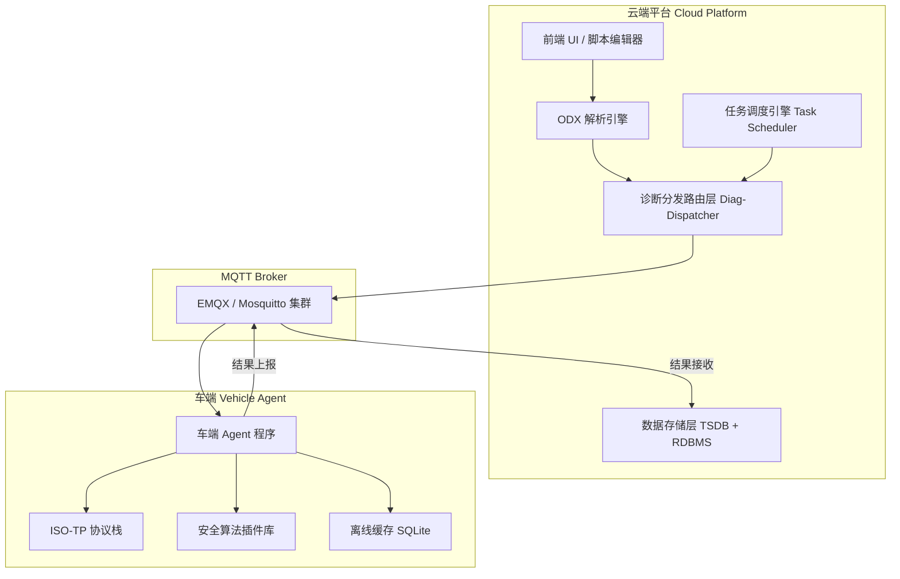
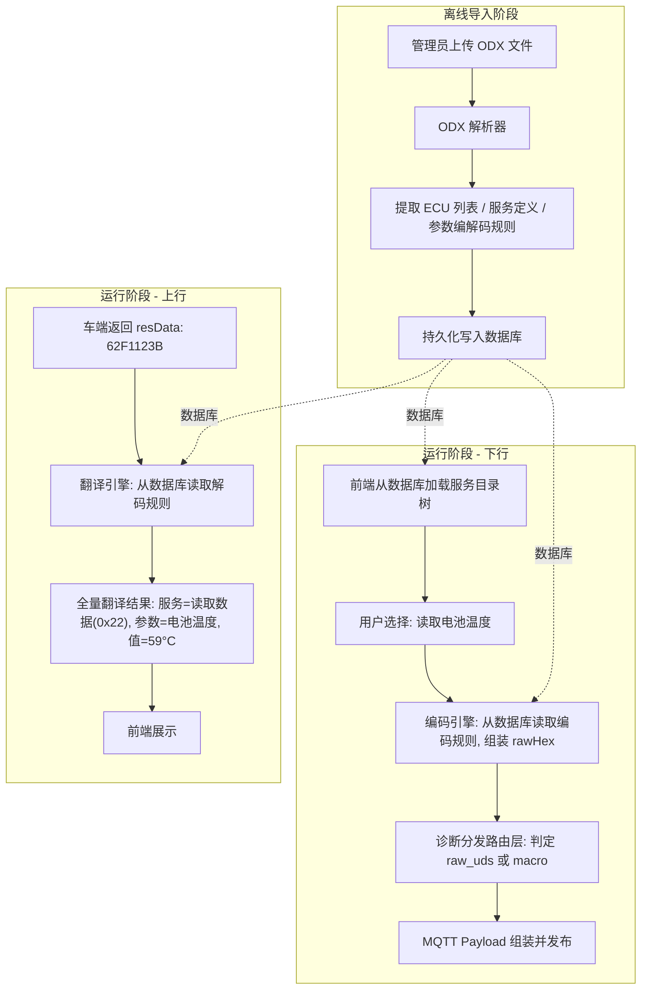
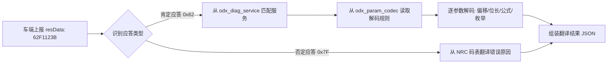
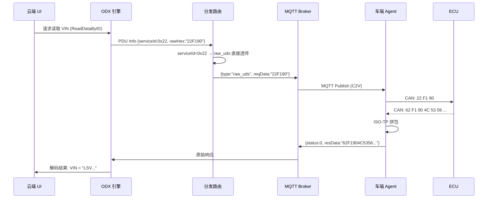
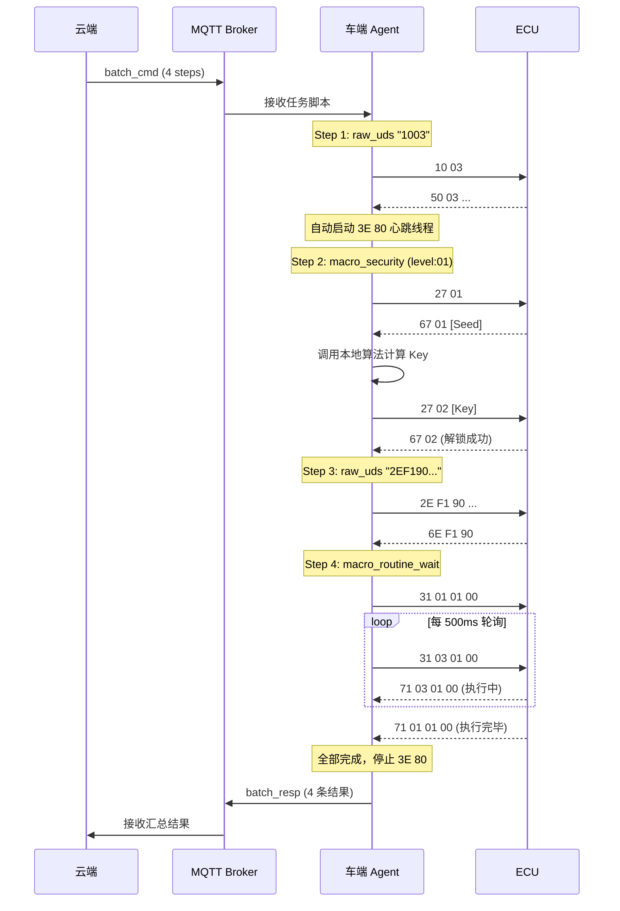

# OpenDOTA 车云诊断通讯协议工程规范

> **版本**: v1.0  
> **日期**: 2026-04-16  
> **状态**: 设计评审中  
> **适用范围**: 云端平台 ↔ 车端 Agent 之间基于 MQTT 的远程诊断通讯

---

## 目录

1. [系统架构总览](#1-系统架构总览)
2. [MQTT Topic 路由设计](#2-mqtt-topic-路由设计)
3. [消息封包协议 (Message Envelope)](#3-消息封包协议-message-envelope)
4. [诊断通道生命周期管理](#4-诊断通道生命周期管理)
5. [单步诊断交互协议 (Single Diagnostic)](#5-单步诊断交互协议-single-diagnostic)
6. [批量诊断任务协议 (Batch Diagnostic)](#6-批量诊断任务协议-batch-diagnostic)
7. [车端宏指令体系 (Macro Command System)](#7-车端宏指令体系-macro-command-system)
8. [定时与周期任务调度 (Scheduled Task)](#8-定时与周期任务调度-scheduled-task)
9. [云端 ODX 引擎与分发路由架构](#9-云端-odx-引擎与分发路由架构)
10. [错误码与状态码定义](#10-错误码与状态码定义)
11. [安全与审计要求](#11-安全与审计要求)

---

## 1. 系统架构总览

### 1.1 架构分层

系统严格分为三个纵向层次，各层职责边界清晰，严禁越界：

| 层级 | 名称 | 职责 | 关键特征 |
|:---:|:---|:---|:---|
| **L1** | 业务配置层（云端） | ODX 解析、DBC/CDD 翻译、报文编解码、人机交互 | 理解业务语义，管理车型配置 |
| **L2** | 车云协议层（MQTT 通道） | 标准化 JSON 封包的传输与路由 | 纯运输通道，不关心业务语义 |
| **L3** | 车端执行层（车端 Agent） | 原生 UDS 透传、宏命令执行、ISO-TP 底层处理、心跳维持 | 不懂 ODX，不处理业务翻译 |

### 1.2 架构示意图



### 1.3 核心设计原则

> [!IMPORTANT]
> **"公网 MQTT 里只跑'指令意图（Intent）'和'结果汇总（Summary）'，绝不跑'毫秒级的交互闭环'。"**

1. **车端是无状态的搬运工**：车端 Agent 不解析 ODX，不翻译报文含义，只执行传输和宏逻辑。
2. **时效敏感操作必须下沉**：所有需要在毫秒级完成多次握手的操作（安全访问、大包传输、例程轮询），必须封装为车端宏，在车内总线本地闭环。
3. **协议层与业务层解耦**：引入新车型只需更新云端 ODX 配置，车端代码零修改（除新增算法插件外）。

---

## 2. MQTT Topic 路由设计

### 2.1 Topic 命名规范

采用基于**动作方向 + 业务场景 + VIN 码**的 RESTful 风格层级结构。

**格式**: `dota/v{版本}/{方向}/{业务场景}/{vin}`

### 2.2 Topic 注册表

| 数据流向 | 业务场景 | Topic | QoS | 说明 |
|:---:|:---|:---|:---:|:---|
| **C2V** ↓ | 诊断通道管理 | `dota/v1/cmd/channel/{vin}` | 1 | 开启/关闭诊断通道 |
| **C2V** ↓ | 单步诊断指令 | `dota/v1/cmd/single/{vin}` | 1 | 单条 UDS 指令下发 |
| **C2V** ↓ | 批量任务下发 | `dota/v1/cmd/batch/{vin}` | 1 | 批量诊断任务脚本下发 |
| **C2V** ↓ | 定时任务策略 | `dota/v1/cmd/schedule/{vin}` | 1 | 周期/定时任务策略下发 |
| **C2V** ↓ | 任务控制 | `dota/v1/cmd/control/{vin}` | 1 | 取消/暂停/恢复任务 |
| **V2C** ↑ | 指令到达回执 | `dota/v1/ack/{vin}` | 1 | 车端确认收到报文（可选） |
| **V2C** ↑ | 单步诊断结果 | `dota/v1/resp/single/{vin}` | 1 | 单条 UDS 执行结果上报 |
| **V2C** ↑ | 批量任务结果 | `dota/v1/resp/batch/{vin}` | 1 | 批量任务执行结果上报 |
| **V2C** ↑ | 通道状态通知 | `dota/v1/event/channel/{vin}` | 1 | 诊断通道状态变更事件 |

### 2.3 QoS 策略

- 所有诊断指令统一使用 **QoS 1**（至少投递一次）。
- 报文中通过 `msgId` 实现业务层去重，保证**幂等性**。
- 不使用 QoS 2（性能开销过大且 MQTT Broker 集群下一致性难以保障）。

---

## 3. 消息封包协议 (Message Envelope)

### 3.1 公共封包结构

所有车云交互报文（无论上行下行）都必须遵循统一的最外层 JSON 骨架：

```json
{
  "msgId": "550e8400-e29b-41d4-a716-446655440000",
  "timestamp": 1713258654000,
  "vin": "LSVWA234567890123",
  "act": "single_cmd",
  "payload": { }
}
```

### 3.2 字段说明

| 字段 | 类型 | 必填 | 说明 |
|:---|:---:|:---:|:---|
| `msgId` | string (UUID) | ✅ | 全局唯一消息 ID，用于日志追踪、防重放去重 |
| `timestamp` | int64 | ✅ | 报文生成时的 Unix 毫秒级时间戳 |
| `vin` | string (17位) | ✅ | 目标车架号 |
| `act` | string (enum) | ✅ | 业务动作类型，见下方枚举 |
| `payload` | object | ✅ | 具体的业务数据对象 |

### 3.3 `act` 枚举定义

| act 值 | 方向 | 说明 |
|:---|:---:|:---|
| `channel_open` | C2V | 请求开启诊断通道 |
| `channel_close` | C2V | 请求关闭诊断通道 |
| `channel_event` | V2C | 通道状态变更事件通知 |
| `single_cmd` | C2V | 单步诊断指令下发 |
| `single_resp` | V2C | 单步诊断结果上报 |
| `batch_cmd` | C2V | 批量诊断任务下发 |
| `batch_resp` | V2C | 批量诊断结果上报 |
| `schedule_set` | C2V | 定时/周期任务策略下发 |
| `schedule_cancel` | C2V | 取消定时/周期任务 |
| `schedule_resp` | V2C | 定时任务执行结果上报 |

---

## 4. 诊断通道生命周期管理

### 4.1 设计背景

> [!WARNING]
> UDS 协议中，ECU 的 **S3 Server Timer** 通常为 4~5 秒。如果在此时间内 ECU 未收到任何诊断请求，会自动退回默认会话 `0x01`。云端通过公网无法以毫秒级精度发送心跳，因此**心跳维持（Tester Present `3E 80`）必须由车端 Agent 在本地托管**。

### 4.2 通道开启 (`channel_open`)

**云端 → 车端**

```json
{
  "act": "channel_open",
  "payload": {
    "channelId": "ch-uuid-001",
    "ecuName": "VCU",
    "txId": "0x7E0",
    "rxId": "0x7E8",
    "globalTimeoutMs": 300000
  }
}
```

| 字段 | 类型 | 必填 | 说明 |
|:---|:---:|:---:|:---|
| `channelId` | string | ✅ | 通道唯一标识，用于后续操作关联 |
| `ecuName` | string | ✅ | 目标 ECU 逻辑名称 |
| `txId` | string (hex) | ✅ | UDS 请求物理寻址 ID |
| `rxId` | string (hex) | ✅ | UDS 期望响应 ID |
| `globalTimeoutMs` | int | ✅ | 全局空闲超时（毫秒），超过此时间无任何指令下发，车端自动释放通道 |

**车端收到后的动作**：
1. 锁定该 ECU 的 CAN 通道资源。
2. 启动后台线程，以 2~3 秒间隔向目标 ECU 发送 `3E 80`（抑制正响应的 Tester Present）。
3. 启动空闲定时器，倒计时 `globalTimeoutMs`；每收到一条新的指令则重置定时器。
4. 向云端回传通道开启确认。

**车端 → 云端（通道确认）**

```json
{
  "act": "channel_event",
  "payload": {
    "channelId": "ch-uuid-001",
    "event": "opened",
    "status": 0,
    "msg": "通道已建立，3E 80 心跳已启动"
  }
}
```

### 4.3 通道关闭 (`channel_close`)

**云端 → 车端**

```json
{
  "act": "channel_close",
  "payload": {
    "channelId": "ch-uuid-001",
    "resetSession": true
  }
}
```

| 字段 | 说明 |
|:---|:---|
| `resetSession` | 布尔值。若为 `true`，车端在停止 `3E 80` 前主动发送 `10 01` 将 ECU 踢回默认会话 |

### 4.4 通道异常关闭（车端主动上报）

当车端因以下原因自动关闭通道时，必须上报云端：

| 场景 | `event` 值 | 说明 |
|:---|:---|:---|
| 空闲超时 | `idle_timeout` | 云端长时间未下发新指令，超过 `globalTimeoutMs` |
| ECU 通讯中断 | `ecu_lost` | `3E 80` 连续 N 次未收到 ECU 响应 |
| 车辆休眠 | `vehicle_sleep` | 检测到 KL15 OFF，整车进入休眠 |

---

## 5. 单步诊断交互协议 (Single Diagnostic)

### 5.1 适用场景

模拟诊断仪的一问一答模式：工程师在云端 UI 上手动点击按钮，发送一条 UDS 指令，车端执行后返回结果。

> [!NOTE]
> 使用单步诊断前，**必须先通过 `channel_open` 建立诊断通道**。

### 5.2 指令下发 (`single_cmd`)

**云端 → 车端**

```json
{
  "act": "single_cmd",
  "payload": {
    "cmdId": "cmd-88bb-5541",
    "channelId": "ch-uuid-001",
    "type": "raw_uds",
    "reqData": "22F190",
    "timeoutMs": 5000
  }
}
```

| 字段 | 类型 | 必填 | 说明 |
|:---|:---:|:---:|:---|
| `cmdId` | string | ✅ | 指令业务唯一 ID，用于请求-响应匹配 |
| `channelId` | string | ✅ | 关联的诊断通道 ID |
| `type` | string (enum) | ✅ | 指令类型：`raw_uds` 或 `macro_*`（见第 7 章） |
| `reqData` | string (hex) | 条件 | `type=raw_uds` 时必填，原始 UDS 十六进制数据 |
| `timeoutMs` | int | ✅ | 单条指令的车端最大等待超时时间 |

### 5.3 结果上报 (`single_resp`)

**车端 → 云端**

```json
{
  "act": "single_resp",
  "payload": {
    "cmdId": "cmd-88bb-5541",
    "channelId": "ch-uuid-001",
    "status": 0,
    "errorCode": "",
    "resData": "62F19001020304",
    "execDuration": 120
  }
}
```

| 字段 | 类型 | 说明 |
|:---|:---:|:---|
| `cmdId` | string | 必须原样带回，云端依此匹配等待中的请求 |
| `status` | int | 执行状态码（见第 10 章） |
| `errorCode` | string | UDS NRC 码或车端自定义错误码 |
| `resData` | string (hex) | 原始 UDS 十六进制响应数据 |
| `execDuration` | int | 车端实际执行耗时（毫秒） |

---

## 6. 批量诊断任务协议 (Batch Diagnostic)

### 6.1 适用场景

批量诊断针对需要执行一连串 UDS 指令的场景（如整车自检、标定写入序列）。云端将全部指令以**脚本清单**的形式一次性下发，车端本地按序执行，全部完成后打包上报结果。

> [!NOTE]
> 批量任务**不需要**预先建立诊断通道。车端收到批量任务后，自行管理 ECU 连接、Session 维持和释放的全生命周期。

### 6.2 任务下发 (`batch_cmd`)

**云端 → 车端**

```json
{
  "act": "batch_cmd",
  "payload": {
    "taskId": "task-v4-batch2026",
    "ecuName": "VCU",
    "txId": "0x7E0",
    "rxId": "0x7E8",
    "strategy": 1,
    "steps": [
      {
        "seqId": 1,
        "type": "raw_uds",
        "data": "1003",
        "timeoutMs": 2000
      },
      {
        "seqId": 2,
        "type": "macro_security",
        "level": "01",
        "algoId": "algo_vcu_1"
      },
      {
        "seqId": 3,
        "type": "raw_uds",
        "data": "2EF19001020304",
        "timeoutMs": 3000
      },
      {
        "seqId": 4,
        "type": "macro_routine_wait",
        "data": "31010100",
        "maxWaitMs": 15000
      }
    ]
  }
}
```

| 字段 | 类型 | 必填 | 说明 |
|:---|:---:|:---:|:---|
| `taskId` | string | ✅ | 批次任务全局唯一标识 |
| `ecuName` | string | ✅ | 目标 ECU 逻辑名称 |
| `txId` / `rxId` | string (hex) | ✅ | UDS 寻址 ID |
| `strategy` | int | ✅ | 错误处理策略：`0` = 遇错立即终止 (Abort)；`1` = 遇错跳过继续 (Continue) |
| `steps` | array | ✅ | 有序的指令步骤列表（支持 `raw_uds` 与 `macro_*` 混写） |

#### `steps[n]` 通用字段

| 字段 | 类型 | 必填 | 说明 |
|:---|:---:|:---:|:---|
| `seqId` | int | ✅ | 步骤序号（全局唯一，用于结果一一对应） |
| `type` | string (enum) | ✅ | 指令类型：`raw_uds` / `macro_security` / `macro_routine_wait` / `macro_data_transfer` |
| `data` | string (hex) | 条件 | `type=raw_uds` 时为原始 UDS 数据；宏类型时为启动指令（如有） |
| `timeoutMs` | int | 条件 | 单步超时（`raw_uds` 时必填） |

### 6.3 任务结果上报 (`batch_resp`)

**车端 → 云端**

```json
{
  "act": "batch_resp",
  "payload": {
    "taskId": "task-v4-batch2026",
    "overallStatus": 1,
    "taskDuration": 24500,
    "results": [
      {
        "seqId": 1,
        "status": 0,
        "resData": "500300C80014"
      },
      {
        "seqId": 2,
        "status": 0,
        "resData": "",
        "msg": "Security Level 01 解锁成功"
      },
      {
        "seqId": 3,
        "status": 0,
        "resData": "6EF190"
      },
      {
        "seqId": 4,
        "status": 3,
        "errorCode": "NRC_22",
        "resData": "7F3122"
      }
    ]
  }
}
```

| 字段 | 类型 | 说明 |
|:---|:---:|:---|
| `overallStatus` | int | 整体状态：`0` 全部成功 / `1` 部分成功 / `2` 全部失败 / `3` 任务被终止 |
| `taskDuration` | int | 车端整体执行耗时（毫秒） |
| `results` | array | 与 `steps` 中 `seqId` 一一对应的执行结果 |

---

## 7. 车端宏指令体系 (Macro Command System)

### 7.1 设计背景

> [!CAUTION]
> 以下 UDS 服务因涉及**毫秒级多步握手**、**动态参数计算**、**大包分帧传输**或**长时间轮询等待**，如果通过云端逐条下发将严重受限于公网延迟，**必须封装为车端本地宏命令，在车内总线侧闭环执行**。

### 7.2 宏指令类型汇总

| 宏类型标识 | 对应 UDS 服务 | 核心原因 | 车端动作 |
|:---|:---|:---|:---|
| `macro_security` | `0x27` Security Access | Seed-to-Key 有严格的时间窗口限制（通常 < 2秒），公网延迟必超时 | 车端本地完成 27 XX → 拿 Seed → 调算法算 Key → 27 XX+1 全流程 |
| `macro_routine_wait` | `0x31` Routine Control | 例程执行耗时长（可达数十秒），期间需要反复发 `31 03` 轮询 + `3E 80` 维持心跳 | 车端发 `31 01` → 循环发 `31 03` 查状态 → 等结果出炉后上报 |
| `macro_data_transfer` | `0x34/0x36/0x37` Data Transfer | 大文件需要拆成上百帧 `36` 逐帧发送，每帧都有 ACK，公网无法承受 | 车端从指定 URL 下载文件至本地 → 本地高速传输 → 上报结果 |

### 7.3 `macro_security` — 安全访问宏

**用途**：在单步或批量场景中，完成 `27` 服务的全自动安全解锁。

**参数化设计**（适配所有 Level，无需为每个 Level 单独开发）：

```json
{
  "type": "macro_security",
  "level": "03",
  "algoId": "Algo_Chery_V2",
  "maxRetry": 3
}
```

| 字段 | 类型 | 必填 | 说明 |
|:---|:---:|:---:|:---|
| `level` | string (hex) | ✅ | 安全访问级别（如 `"01"`, `"03"`, `"11"` 等）。车端自动推算其 SubFunction：请求 Seed 为 `level`，发送 Key 为 `level + 1` |
| `algoId` | string | ✅ | 车端本地算法插件标识。车端据此从本地算法库（`.so` / `.dll`）中动态加载对应的 Seed-to-Key 计算函数 |
| `maxRetry` | int | ❌ | 最大重试次数（默认 1）。如果首次失败，车端可等待 `attemptDelay` 后重新走一遍 |

**车端执行流程**：
1. 发送 `27 {level}` 请求 Seed。
2. 拿到 Seed 后立即调用本地 `algoId` 对应的算法函数计算 Key。
3. 发送 `27 {level+1} [Key]` 完成认证。
4. 判定肯定响应 `67 {level+1}` 即为成功。

**上报结果格式**：

```json
{
  "seqId": 2,
  "status": 0,
  "msg": "Security Level 03 解锁成功"
}
```

### 7.4 `macro_routine_wait` — 例程等待宏

**用途**：启动车端 ECU 的自检、标定、排气等耗时例程，并自动等待执行完成。

```json
{
  "type": "macro_routine_wait",
  "data": "31010203",
  "pollIntervalMs": 500,
  "maxWaitMs": 15000
}
```

| 字段 | 类型 | 必填 | 说明 |
|:---|:---:|:---:|:---|
| `data` | string (hex) | ✅ | 例程启动指令（`31 01 XX XX`） |
| `pollIntervalMs` | int | ❌ | 轮询间隔（默认 500ms），车端每隔此时间发 `31 03` 查询结果 |
| `maxWaitMs` | int | ✅ | 最大等待时间，超时后视为执行失败 |

**车端执行流程**：
1. 发送 `31 01 XX XX` 启动例程。
2. 每隔 `pollIntervalMs` 发送 `31 03 XX XX` 查询执行状态。
3. 期间持续发送 `3E 80` 维持会话。
4. 收到明确的完成响应或超过 `maxWaitMs` 时结束。

### 7.5 `macro_data_transfer` — 数据传输宏

**用途**：远程刷写（Flash）或大数据块读取。

```json
{
  "type": "macro_data_transfer",
  "direction": "download",
  "fileUrl": "https://oss.example.com/firmware/vcu_v2.3.bin",
  "fileMd5": "d41d8cd98f00b204e9800998ecf8427e",
  "memoryAddress": "0x00080000",
  "memorySize": "0x00020000"
}
```

| 字段 | 类型 | 必填 | 说明 |
|:---|:---:|:---:|:---|
| `direction` | string | ✅ | `"download"` (云→ECU 写入) / `"upload"` (ECU→云 读取) |
| `fileUrl` | string | 条件 | 下载时必填，文件的对象存储地址 |
| `fileMd5` | string | ❌ | 文件 MD5 校验值 |
| `memoryAddress` | string (hex) | 条件 | ECU 内存起始地址（下载时必填） |
| `memorySize` | string (hex) | 条件 | 内存块大小 |

**车端执行流程**（以 download 为例）：
1. 从 `fileUrl` 下载固件文件至车端本地磁盘。
2. 校验 MD5。
3. 发送 `34`（Request Download）协商传输参数。
4. 循环发送 `36`（Transfer Data）逐块写入。
5. 发送 `37`（Request Transfer Exit）结束传输。
6. 上报最终结果与校验状态。

### 7.6 ISO-TP 底层多帧处理（隐式宏，对云端完全透明）

> [!IMPORTANT]
> 当 UDS 响应数据超过单帧长度（CAN 为 7 字节，CAN-FD 为 63 字节）时，CAN 物理总线上会触发 ISO 15765-2（ISO-TP）的多帧切包流程：首帧（FF）→ 流控帧（FC）→ 连续帧（CF）。**此底层握手必须由车端 ISO-TP 协议栈自动处理拼包，最终向云端上报的 `resData` 必须是完整拼装好的单一十六进制字符串，云端绝不参与底层分帧逻辑。**

---

## 8. 定时与周期任务调度 (Scheduled Task)

### 8.1 设计原则

> [!IMPORTANT]
> 定时/周期任务的调度引擎**必须驻留在车端**。云端只负责下发"策略配置"（圣旨），车端根据本地 RTC 时钟自行判断执行时机，执行结果离线缓存，待网络恢复后批量上报。

**原因**：
- 车辆可能停在无信号区域（地下车库）。
- 云端定时触发完全依赖实时网络，不可靠。
- 高频周期任务（如每分钟采集）会导致公网流量爆炸。

### 8.2 策略下发 (`schedule_set`)

**云端 → 车端**

```json
{
  "act": "schedule_set",
  "payload": {
    "taskId": "task-cron-001",
    "scheduleCondition": {
      "mode": "periodic",
      "cronExpression": "0 */5 * * * ?",
      "validWindow": {
        "startTime": 1713300000000,
        "endTime": 1713800000000
      },
      "vehicleState": {
        "ignition": "ON",
        "speedMax": 120,
        "gear": "ANY"
      }
    },
    "ecuName": "BMS",
    "txId": "0x7E3",
    "rxId": "0x7EB",
    "strategy": 1,
    "steps": [
      {
        "seqId": 1,
        "type": "raw_uds",
        "data": "220101",
        "timeoutMs": 2000
      },
      {
        "seqId": 2,
        "type": "raw_uds",
        "data": "220102",
        "timeoutMs": 2000
      }
    ]
  }
}
```

#### `scheduleCondition` 字段说明

| 字段 | 类型 | 必填 | 说明 |
|:---|:---:|:---:|:---|
| `mode` | string (enum) | ✅ | `"once"`：定时执行一次；`"periodic"`：周期性执行 |
| `cronExpression` | string | 条件 | `mode=periodic` 时必填。标准 Cron 表达式 |
| `executeAt` | int64 | 条件 | `mode=once` 时必填。指定的执行时间戳 |
| `validWindow.startTime` | int64 | ✅ | 任务有效期起始时间 |
| `validWindow.endTime` | int64 | ✅ | 任务有效期截止时间，过期后车端自动删除该任务 |
| `vehicleState.ignition` | string | ❌ | 车辆点火状态要求：`"ON"` / `"OFF"` / `"ANY"` |
| `vehicleState.speedMax` | int | ❌ | 最大允许车速（km/h），超速时跳过执行 |
| `vehicleState.gear` | string | ❌ | 挡位要求：`"P"` / `"N"` / `"D"` / `"ANY"` |

### 8.3 车端调度流程

1. **持久化存储**：车端收到策略后，解析并写入本地 SQLite 数据库。
2. **定时扫描**：车端 Agent 后台线程每 60 秒扫描一次活跃任务表。
3. **条件校验**：时间到达 → 检查 `vehicleState` 所有前置条件 → 全部满足则执行 → 任何条件不满足则跳过本轮。
4. **结果缓存**：执行结果写入本地 Offline Cache（附带真实执行时间戳）。
5. **汇聚上报**：网络恢复时（MQTT 重连），将缓存中待上报的结果合并后批量发送。

### 8.4 周期任务结果上报 (`schedule_resp`)

**车端 → 云端**

```json
{
  "act": "schedule_resp",
  "payload": {
    "taskId": "task-cron-001",
    "batchUploadMode": "aggregated",
    "resultsHistory": [
      {
        "triggerTime": 1713300100000,
        "overallStatus": 0,
        "results": [
          { "seqId": 1, "status": 0, "resData": "620101AABB" },
          { "seqId": 2, "status": 0, "resData": "620102CCDD" }
        ]
      },
      {
        "triggerTime": 1713300400000,
        "overallStatus": 1,
        "results": [
          { "seqId": 1, "status": 0, "resData": "620101EEFF" },
          { "seqId": 2, "status": 2, "errorCode": "TIMEOUT", "resData": "" }
        ]
      }
    ]
  }
}
```

### 8.5 任务取消 (`schedule_cancel`)

**云端 → 车端**

```json
{
  "act": "schedule_cancel",
  "payload": {
    "taskId": "task-cron-001"
  }
}
```

车端收到后，从本地 SQLite 中删除该任务，并停止后续所有调度。

---

## 9. 云端 ODX 引擎与分发路由架构

### 9.1 架构定位

ODX 引擎属于**云端业务配置层 (L1)**，与车云协议层 (L2) 严格解耦。ODX 引擎并非运行时实时解析 XML，而是采用**"离线导入 → 结构化提取 → 持久化存储 → 运行时查库"**的工程化模式。

核心职责：
1. **离线阶段**：导入 ODX 文件，解析并提取所有 ECU 支持的诊断服务定义，持久化到关系型数据库。
2. **运行阶段**：前端从数据库读取该车型/ECU 的可用服务目录，展示给用户选择；用户选择后，系统从数据库读取对应的编码规则组装指令下发。
3. **翻译阶段**：对所有 UDS 服务的请求和响应进行全量人类可读翻译，而非仅翻译响应数据。

### 9.2 整体处理流水线



### 9.3 ODX 离线导入与持久化

#### 9.3.1 导入流程

管理员通过平台管理后台上传 ODX 文件包（通常为 `.pdx` 压缩包，内含 `.odx-d`、`.odx-c`、`.odx-cs` 等文件）。系统执行以下处理：

1. **解压与校验**：解压 `.pdx` 包，校验文件完整性。
2. **解析 XML 结构**：按 ISO 22901 标准递归解析 ODX XML 节点树。
3. **提取核心数据**：从 XML 中提取以下四类核心结构化数据。
4. **持久化入库**：将提取的结构化数据写入关系型数据库。

#### 9.3.2 数据库持久化模型

从 ODX 中需要提取并持久化的核心数据表：

**表 1：`odx_vehicle_model` — 车型基础信息**

| 字段 | 类型 | 说明 |
|:---|:---|:---|
| `id` | bigint (PK) | 主键 |
| `modelCode` | varchar | 车型编码（如 `"CHERY_EQ7"`） |
| `modelName` | varchar | 车型名称（如 `"奇瑞 星途瑶光"`） |
| `odxVersion` | varchar | ODX 文件版本号 |
| `importTime` | datetime | 导入时间 |
| `sourceFile` | varchar | 源 ODX 文件名 |

**表 2：`odx_ecu` — ECU 定义**

| 字段 | 类型 | 说明 |
|:---|:---|:---|
| `id` | bigint (PK) | 主键 |
| `modelId` | bigint (FK) | 关联车型 ID |
| `ecuCode` | varchar | ECU 内部标识（ODX 中的 `BASE-VARIANT` / `ECU-VARIANT`） |
| `ecuName` | varchar | ECU 显示名称（如 `"VCU 整车控制器"`） |
| `txId` | varchar | UDS 请求物理寻址 ID（如 `"0x7E0"`） |
| `rxId` | varchar | UDS 期望响应 ID（如 `"0x7E8"`） |
| `protocol` | varchar | 通讯协议（`"UDS_ON_CAN"` / `"UDS_ON_DOIP"`） |
| `secAlgoRef` | varchar | 安全访问算法引用标识 |

**表 3：`odx_diag_service` — 诊断服务定义（核心表）**

| 字段 | 类型 | 说明 |
|:---|:---|:---|
| `id` | bigint (PK) | 主键 |
| `ecuId` | bigint (FK) | 关联 ECU ID |
| `serviceCode` | varchar | UDS 服务 ID（如 `"0x22"`） |
| `subFunction` | varchar | 子功能码（如有，如 `"F190"`，即 DID） |
| `serviceName` | varchar | 服务内部标识名（ODX 中的 `SHORT-NAME`，如 `"Read_VIN"` ） |
| `displayName` | varchar | 人类可读的中文名称（如 `"读取车辆识别码 (VIN)"`） |
| `description` | text | 服务详细说明 |
| `category` | varchar | 服务分类（如 `"识别信息"` / `"故障诊断"` / `"标定写入"` / `"安全访问"` / `"例程控制"`） |
| `requestRawHex` | varchar | 编码后的完整请求 Hex（如 `"22F190"`） |
| `responseIdHex` | varchar | 期望肯定响应头 Hex（如 `"62F190"`） |
| `requiresSecurity` | boolean | 是否需要安全解锁才可执行 |
| `requiredSecLevel` | varchar | 前置安全等级（如 `"01"`，无则为空） |
| `requiredSession` | varchar | 前置会话等级（如 `"03"` 扩展会话） |
| `macroType` | varchar | 分发路由类型（`"raw_uds"` / `"macro_security"` / `"macro_routine_wait"` / `"macro_data_transfer"` / `"blocked"`），由导入时根据 serviceCode 自动判定 |
| `isEnabled` | boolean | 是否启用（管理员可手动禁用某些危险服务） |

**表 4：`odx_param_codec` — 参数编解码规则**

| 字段 | 类型 | 说明 |
|:---|:---|:---|
| `id` | bigint (PK) | 主键 |
| `serviceId` | bigint (FK) | 关联服务 ID |
| `paramName` | varchar | 参数内部名称（如 `"BatteryVoltage"`） |
| `displayName` | varchar | 参数中文显示名（如 `"动力电池电压"`） |
| `byteOffset` | int | 在响应数据中的字节偏移位置 |
| `bitOffset` | int | 位偏移（如有位域字段） |
| `bitLength` | int | 参数占用的位长度 |
| `dataType` | varchar | 数据类型：`"unsigned"` / `"signed"` / `"ascii"` / `"bcd"` / `"enum"` |
| `formula` | varchar | 物理值转换公式（如 `"raw * 0.1 + 0"`） |
| `unit` | varchar | 单位（如 `"V"` / `"°C"` / `"km/h"`） |
| `enumMapping` | json | 当 dataType=enum 时的枚举映射表（如 `{"0":"OFF", "1":"ON"}`） |
| `minValue` | decimal | 物理值有效范围下限 |
| `maxValue` | decimal | 物理值有效范围上限 |

#### 9.3.3 导入时自动标注 `macroType`

> [!IMPORTANT]
> 在 ODX 导入阶段，系统必须根据 `serviceCode` **自动判定**每个服务的分发路由类型（`macroType`），写入 `odx_diag_service` 表。前端和分发路由层在运行时无需再做判断，直接读取该字段即可。

**自动标注规则**：

| serviceCode | 自动标注的 macroType | 规则说明 |
|:---|:---|:---|
| `0x27` | `macro_security` | 安全访问服务，必须车端本地闭环 |
| `0x31`（SubFunc=`01`） | `macro_routine_wait` | 例程启动，需要车端自动轮询等待 |
| `0x31`（SubFunc=`02`/`03`） | `raw_uds` | 例程停止/查询结果，可透传 |
| `0x34` / `0x36` / `0x37` | `macro_data_transfer` | 数据传输服务 |
| `0x3E` | `blocked` | 心跳服务，云端禁止下发 |
| 其余所有 | `raw_uds` | 默认透传 |

### 9.4 前端服务目录展示

#### 9.4.1 前端交互流程

1. 用户在前端选择**车型**（从 `odx_vehicle_model` 表加载）。
2. 系统展示该车型下所有的 **ECU 列表**（从 `odx_ecu` 表加载）。
3. 用户选择某个 ECU 后，系统展示该 ECU 支持的**服务目录树**（从 `odx_diag_service` 表加载，按 `category` 分组展示）。
4. 用户点击某个服务（如"读取电池温度"），系统读取该服务的 `requestRawHex`、`macroType`、`requiredSession`、`requiresSecurity` 等字段，**自动组装**完整的下发指令。

#### 9.4.2 服务目录 API 返回示例

**接口**: `GET /api/odx/services?ecuId=123`

```json
{
  "ecuName": "BMS 电池管理系统",
  "txId": "0x7E3",
  "rxId": "0x7EB",
  "categories": [
    {
      "category": "识别信息",
      "services": [
        {
          "id": 1001,
          "displayName": "读取 ECU 硬件版本号",
          "serviceCode": "0x22",
          "requestRawHex": "22F193",
          "macroType": "raw_uds",
          "requiredSession": "01",
          "requiresSecurity": false
        },
        {
          "id": 1002,
          "displayName": "读取 ECU 软件版本号",
          "serviceCode": "0x22",
          "requestRawHex": "22F195",
          "macroType": "raw_uds",
          "requiredSession": "01",
          "requiresSecurity": false
        }
      ]
    },
    {
      "category": "故障诊断",
      "services": [
        {
          "id": 2001,
          "displayName": "读取所有已存储故障码 (DTC)",
          "serviceCode": "0x19",
          "requestRawHex": "190209",
          "macroType": "raw_uds",
          "requiredSession": "01",
          "requiresSecurity": false
        },
        {
          "id": 2002,
          "displayName": "清除所有故障码",
          "serviceCode": "0x14",
          "requestRawHex": "14FFFFFF",
          "macroType": "raw_uds",
          "requiredSession": "03",
          "requiresSecurity": false
        }
      ]
    },
    {
      "category": "安全访问",
      "services": [
        {
          "id": 3001,
          "displayName": "安全解锁 Level 01 (读取级)",
          "serviceCode": "0x27",
          "macroType": "macro_security",
          "requiredSession": "03",
          "requiresSecurity": false
        }
      ]
    },
    {
      "category": "标定写入",
      "services": [
        {
          "id": 4001,
          "displayName": "写入充电电流上限",
          "serviceCode": "0x2E",
          "requestRawHex": "2E0100",
          "macroType": "raw_uds",
          "requiredSession": "03",
          "requiresSecurity": true,
          "requiredSecLevel": "01"
        }
      ]
    },
    {
      "category": "例程控制",
      "services": [
        {
          "id": 5001,
          "displayName": "执行高压绝缘检测",
          "serviceCode": "0x31",
          "requestRawHex": "31010300",
          "macroType": "macro_routine_wait",
          "requiredSession": "03",
          "requiresSecurity": true,
          "requiredSecLevel": "01"
        }
      ]
    }
  ]
}
```

#### 9.4.3 前端自动编排前置依赖

> [!TIP]
> 当用户点击的服务带有 `requiredSession` 或 `requiresSecurity` 前置条件时，前端（或后端编排层）应**自动在该指令前插入所需的前置步骤**，用户无需手动处理。

例如用户点击"写入充电电流上限"（需要 `session=03` + `security=01`），系统自动编排为：

```
Step 1: channel_open (建立诊断通道)
Step 2: raw_uds "1003" (切换到扩展会话)
Step 3: macro_security level="01" (安全解锁)
Step 4: raw_uds "2E0100XX" (执行写入)
```

### 9.5 编码引擎（下行：请求编码）

**功能**：根据用户选择的服务，从数据库读取编码规则，组装完整的 UDS 请求字节。

**输入**：`(serviceId: 4001, 用户填写的参数值: chargeCurrentLimit=120)`  
**处理过程**：
1. 从 `odx_diag_service` 读取 `requestRawHex = "2E0100"`。
2. 从 `odx_param_codec` 读取该服务的写入参数编码规则（公式反向运算）。
3. 将物理值 `120A` 按公式反算为原始值，编码为 Hex 追加到请求尾部。

**输出**：`PDU Info 对象`

```json
{
  "serviceId": "0x2E",
  "subFunction": "0100",
  "rawHex": "2E010078",
  "macroType": "raw_uds",
  "displayName": "写入充电电流上限",
  "requiredSession": "03",
  "requiresSecurity": true,
  "requiredSecLevel": "01"
}
```

### 9.6 诊断分发路由层（核心中间件）

**功能**：接收 PDU Info 对象，根据其 `macroType` 字段（在 ODX 导入时已预标注）直接路由，无需再做 serviceId 判断。

**路由逻辑**：

```
if pduInfo.macroType == "blocked":
    拒绝下发，返回错误提示
elif pduInfo.macroType == "raw_uds":
    包装为 {"type": "raw_uds", "reqData": pduInfo.rawHex}
elif pduInfo.macroType == "macro_security":
    包装为 {"type": "macro_security", "level": ..., "algoId": ...}
elif pduInfo.macroType == "macro_routine_wait":
    包装为 {"type": "macro_routine_wait", "data": pduInfo.rawHex, ...}
elif pduInfo.macroType == "macro_data_transfer":
    包装为 {"type": "macro_data_transfer", ...}
```

**完整的 serviceId 拦截参考表**（用于 ODX 导入时自动标注 `macroType`，以及运行时的兜底校验）：

| serviceId | UDS 服务名称 | macroType | 路由说明 |
|:---|:---|:---|:---|
| `0x10` | DiagnosticSessionControl | `raw_uds` | 透传，但需联动触发通道管理 |
| `0x11` | ECUReset | `raw_uds` | 直接透传 |
| `0x14` | ClearDTC | `raw_uds` | 直接透传 |
| `0x19` | ReadDTCInformation | `raw_uds` | 直接透传 |
| `0x22` | ReadDataByIdentifier | `raw_uds` | 直接透传 |
| `0x23` | ReadMemoryByAddress | `raw_uds` | 直接透传 |
| `0x27` | SecurityAccess | `macro_security` | **宏** → 车端本地闭环解锁 |
| `0x2E` | WriteDataByIdentifier | `raw_uds` | 直接透传 |
| `0x2F` | IOControlByIdentifier | `raw_uds` | 直接透传 |
| `0x31` | RoutineControl (启动) | `macro_routine_wait` | **宏** → 车端自动轮询等待 |
| `0x31` | RoutineControl (查询/停止) | `raw_uds` | 直接透传 |
| `0x34/0x36/0x37` | Upload/Download | `macro_data_transfer` | **宏** → 车端本地分帧传输 |
| `0x3E` | TesterPresent | `blocked` | **阻断** → 由通道管理自动托管 |
| 其他 | — | `raw_uds` | 默认透传 |

### 9.7 翻译引擎（上行：全量解码与翻译）

> [!IMPORTANT]
> 翻译引擎需要对**所有 UDS 服务**的请求和响应都进行人类可读翻译，而不仅仅是 `0x22` 读数据类服务的参数值解码。包括故障码翻译、会话状态翻译、安全访问状态翻译、例程结果翻译等。

#### 9.7.1 翻译覆盖范围

| UDS 服务 | 请求翻译 | 响应翻译 | 翻译内容示例 |
|:---|:---:|:---:|:---|
| `0x10` 会话控制 | ✅ | ✅ | 请求: `"切换到扩展诊断会话 (0x03)"`；响应: `"会话切换成功, P2=50ms"` |
| `0x11` ECU 复位 | ✅ | ✅ | 请求: `"硬复位 (0x01)"`；响应: `"复位已接受"` |
| `0x14` 清除 DTC | ✅ | ✅ | 请求: `"清除所有 DTC (0xFFFFFF)"`；响应: `"清除成功"` |
| `0x19` 读 DTC | ✅ | ✅ | 请求: `"读取所有已确认 DTC"`；响应: `"共 3 个故障码: P0100 - 进气流量传感器电路故障, ..."` |
| `0x22` 读数据 | ✅ | ✅ | 请求: `"读取电池温度 (DID: F112)"`；响应: `"电池温度 = 59°C"` |
| `0x27` 安全访问 | ✅ | ✅ | 请求: `"请求安全解锁 Level 01"`；响应: `"解锁成功"` 或 `"密钥无效 (NRC 35)"` |
| `0x2E` 写数据 | ✅ | ✅ | 请求: `"写入充电电流上限 = 120A"`；响应: `"写入成功"` |
| `0x31` 例程控制 | ✅ | ✅ | 请求: `"启动高压绝缘检测"`；响应: `"检测完成, 绝缘电阻 = 500kΩ, 结果: 合格"` |
| `0x7F` 否定应答 | — | ✅ | 响应: `"服务 0x22 被拒绝, 原因: 当前条件不满足 (NRC 0x22)"` |

#### 9.7.2 翻译引擎处理流程



#### 9.7.3 翻译结果输出格式

**肯定响应翻译示例**（读取数据 `0x22`）：

```json
{
  "translationType": "positive",
  "serviceCode": "0x22",
  "serviceDisplayName": "读取数据 (ReadDataByIdentifier)",
  "subFunction": "F112",
  "subFunctionDisplayName": "读取电池温度",
  "rawRequest": "22F112",
  "rawResponse": "62F1123B",
  "parameters": [
    {
      "paramName": "BatteryTemperature",
      "displayName": "电池温度",
      "rawHex": "3B",
      "rawDecimal": 59,
      "physicalValue": 59.0,
      "unit": "°C",
      "formula": "raw * 1.0 + 0",
      "status": "normal",
      "validRange": "[-40, 120]"
    }
  ]
}
```

**否定响应翻译示例**（`0x7F`）：

```json
{
  "translationType": "negative",
  "serviceCode": "0x22",
  "serviceDisplayName": "读取数据 (ReadDataByIdentifier)",
  "rawResponse": "7F2222",
  "nrcCode": "0x22",
  "nrcName": "ConditionsNotCorrect",
  "nrcDisplayName": "当前条件不满足",
  "nrcDescription": "ECU 当前的运行状态不满足执行该服务请求所需的条件。可能需要先切换到扩展诊断会话 (0x03) 或进行安全解锁。"
}
```

**故障码翻译示例**（`0x19` 读 DTC）：

```json
{
  "translationType": "positive",
  "serviceCode": "0x19",
  "serviceDisplayName": "读取故障信息 (ReadDTCInformation)",
  "rawResponse": "5902090100018F...",
  "dtcCount": 3,
  "dtcList": [
    {
      "dtcCode": "P0100",
      "dtcHex": "010001",
      "dtcDisplayName": "进气流量传感器电路故障",
      "dtcStatus": "0x8F",
      "statusFlags": {
        "testFailed": true,
        "confirmedDTC": true,
        "testNotCompletedSinceLastClear": false,
        "testFailedSinceLastClear": true
      }
    }
  ]
}
```

### 9.8 ODX 引擎实现路径建议

| 阶段 | 实现方案 | 适用场景 |
|:---|:---|:---|
| **MVP 阶段** | 编写 Python/Go 离线脚本，从 ODX XML 中提取关注的服务和参数编解码规则，导入 MySQL。运行时 `SELECT` 查库。前端服务目录和翻译规则全部从数据库驱动 | 车型少（< 10 个），服务定义相对固定 |
| **成长阶段** | 开发平台化的 ODX 管理后台：支持拖拽上传 `.pdx` 包 → 自动解析 → 可视化预览提取结果 → 确认后入库。支持版本管理和差异对比 | 多车型并行，频繁更新 ODX |
| **成熟阶段** | 引入完整的 ODX 解析 SDK（如基于 ISO 22901 的第三方库），支持动态解析复杂的 Compu Method（LINEAR / TAB-INTP / COMPUCODE 等），以及 Structure / Mux / End-of-PDU Field 等高级参数结构 | 需要支持所有主机厂的全量 ODX 规范 |

---

## 10. 错误码与状态码定义

### 10.1 通用执行状态码 (`status`)

| 码值 | 名称 | 说明 |
|:---:|:---|:---|
| `0` | SUCCESS | 执行成功，`resData` 包含有效的肯定响应 |
| `1` | REJECTED | 车端主动拒绝执行（如车辆行驶中、条件不满足） |
| `2` | TIMEOUT | UDS 请求超时，ECU 未在规定时间内响应 |
| `3` | NRC | ECU 返回了否定响应（Negative Response），具体错误码见 `errorCode` |
| `4` | CHANNEL_NOT_FOUND | 指定的 `channelId` 不存在或已关闭 |
| `5` | ALGO_ERROR | 宏执行时，安全算法插件加载失败或计算异常 |
| `6` | NETWORK_ERROR | 车端内部 CAN/DoIP 总线通讯异常 |
| `7` | CANCELED | 任务被云端主动取消 |

### 10.2 批量任务整体状态码 (`overallStatus`)

| 码值 | 名称 | 说明 |
|:---:|:---|:---|
| `0` | ALL_SUCCESS | 所有步骤全部执行成功 |
| `1` | PARTIAL_SUCCESS | 部分步骤成功，部分步骤失败 |
| `2` | ALL_FAILED | 所有步骤全部失败 |
| `3` | ABORTED | 因 `strategy=0` 遇错后任务被终止 |

### 10.3 常见 UDS NRC 错误码 (`errorCode`)

| NRC | 名称 | 说明 |
|:---|:---|:---|
| `NRC_12` | SubFunctionNotSupported | 子功能不支持 |
| `NRC_13` | IncorrectMessageLengthOrInvalidFormat | 报文长度或格式不正确 |
| `NRC_22` | ConditionsNotCorrect | 当前条件不满足 |
| `NRC_24` | RequestSequenceError | 请求顺序错误 |
| `NRC_25` | NoResponseFromSubnetComponent | 子网组件无响应 |
| `NRC_31` | RequestOutOfRange | 请求超出范围 |
| `NRC_33` | SecurityAccessDenied | 安全访问被拒绝 |
| `NRC_35` | InvalidKey | 密钥无效 |
| `NRC_36` | ExceededNumberOfAttempts | 超出最大尝试次数 |
| `NRC_37` | RequiredTimeDelayNotExpired | 安全锁定延迟未到期 |
| `NRC_72` | GeneralProgrammingFailure | 编程失败 |
| `NRC_78` | RequestCorrectlyReceived_ResponsePending | 请求已接收，响应待处理 |

---

## 11. 安全与审计要求

### 11.1 通讯安全

| 安全措施 | 实施方案 | 优先级 |
|:---|:---|:---:|
| **传输加密** | 车端与 MQTT Broker 之间使用 TLS 1.2+ 加密通道 | P0 |
| **双向认证** | 基于 X.509 证书的 mTLS 双向认证，杜绝设备伪造 | P0 |
| **Payload 签名** | 下发指令的 Payload 使用 HMAC-SHA256 签名，`msgId` + `timestamp` 参与签名防重放 | P1 |
| **时间窗口校验** | 车端校验 `timestamp`，超过 5 分钟的报文视为过期直接丢弃 | P1 |

### 11.2 操作审计

所有诊断操作必须记录审计日志，存入不可篡改的日志存储（如 Elasticsearch / ClickHouse）：

| 审计字段 | 说明 |
|:---|:---|
| `operatorId` | 操作人员 ID |
| `operatorRole` | 操作人员角色（管理员 / 普通工程师） |
| `vin` | 目标车辆 VIN 码 |
| `action` | 执行的动作（单步 / 批量 / 刷写） |
| `reqPayload` | 下发的完整 Payload（脱敏后） |
| `resPayload` | 车端返回的完整结果 |
| `timestamp` | 操作时间 |
| `result` | 操作结果（成功 / 失败 / 超时） |
| `clientIp` | 操作人员的 IP 地址 |

---

## 附录 A：车端 Agent 算法插件规范

### 插件部署

车端算法插件以**动态链接库**形式部署在车端 Agent 的指定目录下：

```
/opt/dota-agent/plugins/security/
├── algo_vcu_1.so
├── algo_bms_v2.so
├── Algo_Chery_V2.so
└── ...
```

### 插件接口约定

所有算法插件必须实现以下统一函数签名（C ABI）：

```c
/**
 * @brief 根据 ECU 返回的 Seed 计算 Key
 * @param seed      输入：ECU 返回的种子字节数组
 * @param seedLen   输入：种子长度
 * @param key       输出：计算后的密钥字节数组（调用方分配内存）
 * @param keyLen    输出：密钥实际长度
 * @param level     输入：安全访问级别
 * @return          0=成功, 非0=失败错误码
 */
int CalculateKey(
    const unsigned char* seed, int seedLen,
    unsigned char* key, int* keyLen,
    int level
);
```

---

## 附录 B：数据存储建议

| 数据类型 | 推荐存储 | 说明 |
|:---|:---|:---|
| 任务元数据（Task） | MySQL / PostgreSQL | 任务 ID、状态机、创建人、定时策略等 |
| 设备与车型关系 | MySQL / PostgreSQL | VIN 码、ECU 列表、寻址 ID 映射 |
| 诊断报文流水 | ClickHouse / TDengine | 海量时序数据，支持高速写入与聚合查询 |
| ODX 配置 | MongoDB / MySQL | 车型诊断服务定义、编解码规则 |
| 审计日志 | Elasticsearch / ClickHouse | 不可篡改，支持全文检索 |
| 刷写固件文件 | MinIO / 阿里云 OSS | 对象存储，通过 URL 下发给车端 |

---

## 附录 C：完整交互时序示例

### C.1 单步诊断：读取 VIN 码完整流程



### C.2 批量任务：安全解锁 + 标定写入完整流程



---

> **文档维护说明**：本文档应随协议版本迭代持续更新。MQTT Topic 中 `v1` 版本号为协议主版本标识，当发生不兼容的 Breaking Change（如 Envelope 结构变更）时，应递增至 `v2`。
