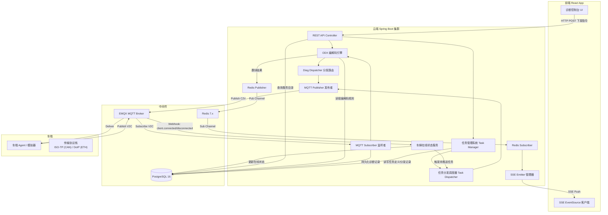
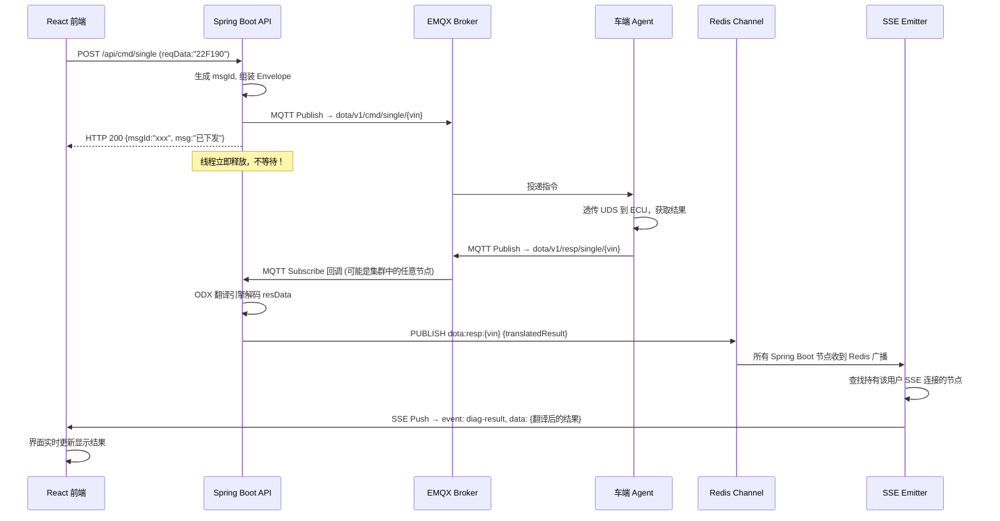
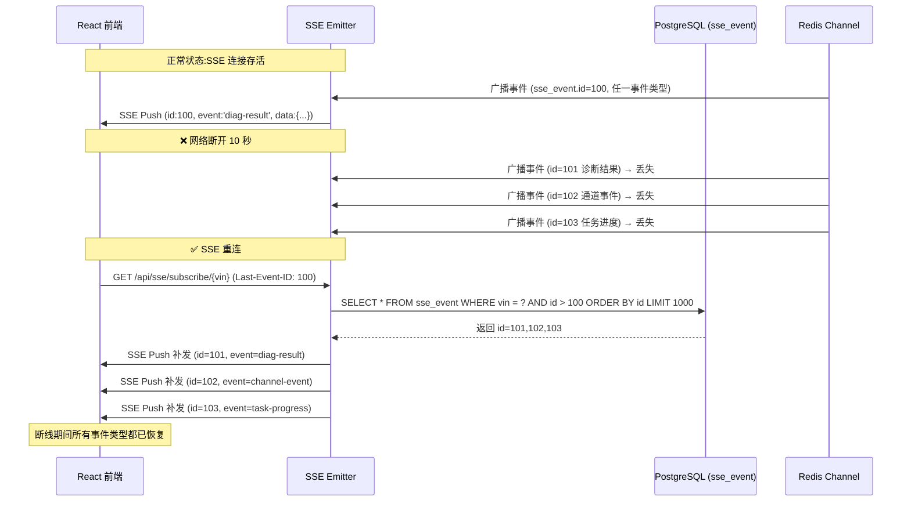
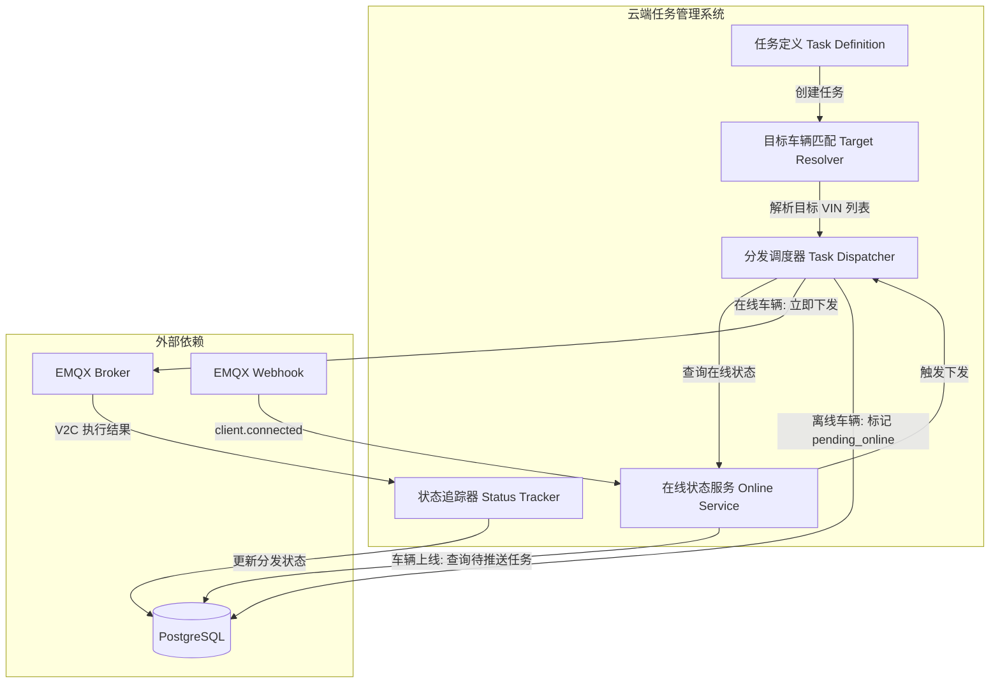
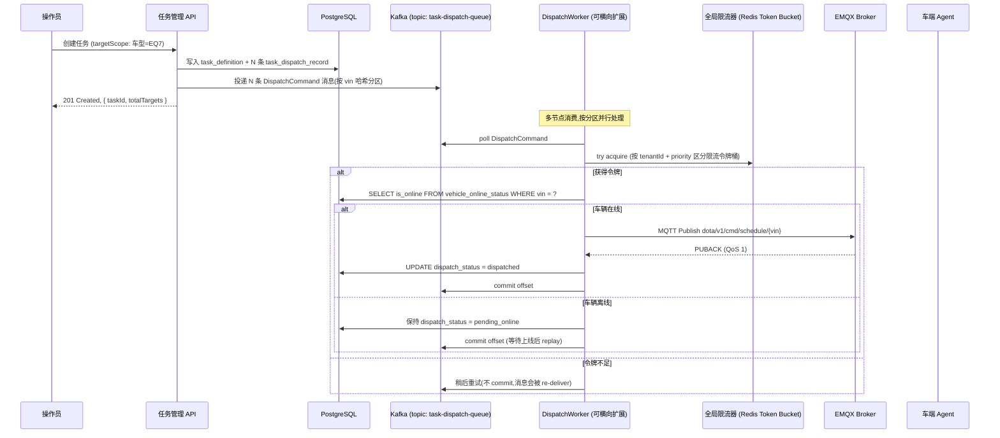
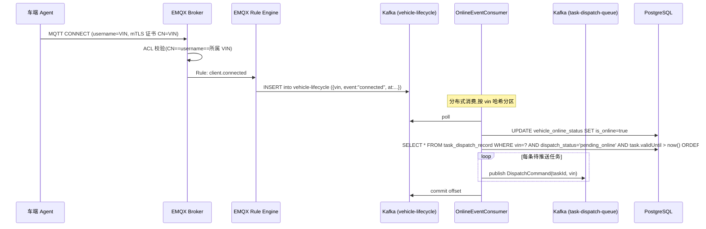
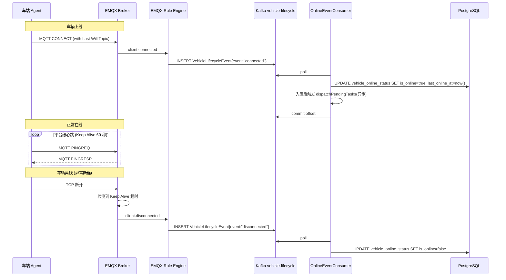
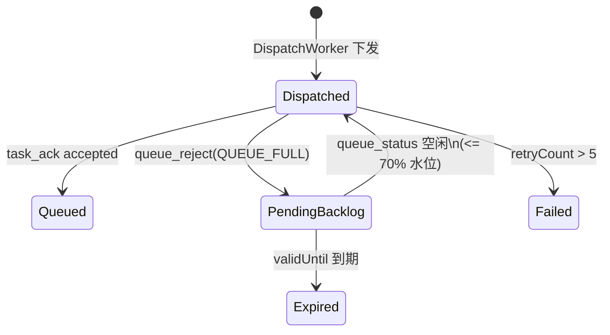
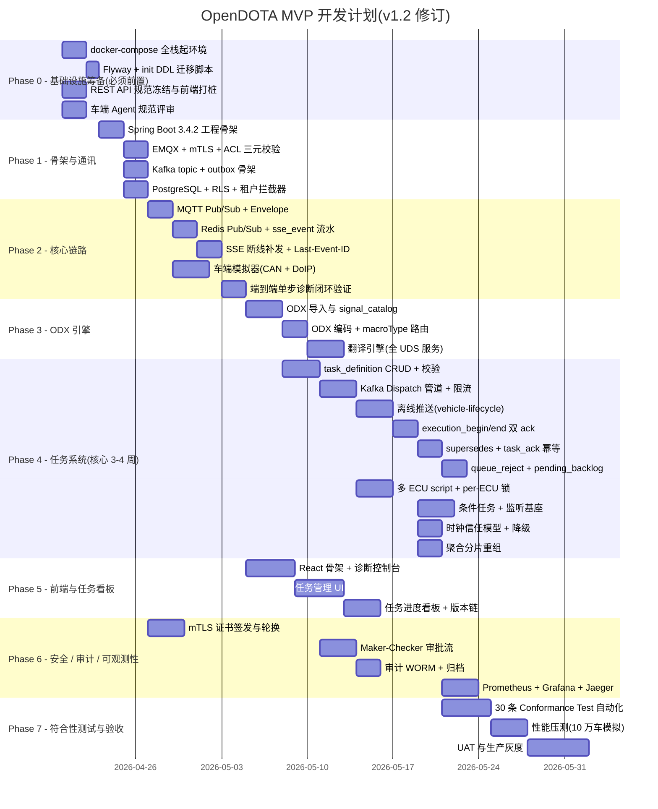

# OpenDOTA 平台技术架构与开发指南

> **版本**: v1.2  
> **日期**: 2026-04-17  
> **状态**: 已定稿(生产级加固版: ECU 级互斥 / 周期计数一致性 / 聚合分片 / 时钟信任),可指导编码  
> **配套文档**: [车云通讯协议规范](./opendota_protocol_spec.md)

---

## 目录

1. [技术选型总览](#1-技术选型总览)
2. [系统架构设计](#2-系统架构设计)
3. [核心异步通信架构](#3-核心异步通信架构)
4. [云端任务管理系统](#4-云端任务管理系统)
5. [后端工程结构设计](#5-后端工程结构设计)
6. [数据库设计](#6-数据库设计)
7. [前端工程设计](#7-前端工程设计)
8. [车端模拟器](#8-车端模拟器)
9. [日志、可观测性与 SLO](#9-日志与可观测性)
10. [MVP 开发路线图](#10-mvp-开发路线图)
11. [开发规约与约定](#11-开发规约与约定)

---

## 1. 技术选型总览

### 1.1 技术栈全景

| 层级 | 技术选型 | 版本要求 | 选型理由 |
|:---|:---|:---:|:---|
| **语言** | Java | **21 LTS** | 虚拟线程(Virtual Threads)自 Java 21 GA,公版无须 `--enable-preview`;LTS 保障 5 年安全更新 |
| **后端框架** | Spring Boot | **3.4.2 (GA)** | Maven Central 可直接解析;Spring Framework 6.2,Jakarta EE 10。SB 4.0 GA(Java 25 + Jakarta EE 11)稳定后按部署规范升级 |
| **消息队列** | Apache Kafka | **3.8+** | 任务分发管道(`task-dispatch-queue`)、车辆生命周期事件(`vehicle-lifecycle`)、死信(`task-dispatch-dlq`)的削峰与可靠消费;EMQX Rule Engine 的 Kafka Sink 原生支持。生产环境至少 3 broker 集群 |
| **MQTT Broker** | EMQX | **5.x** | 单机百万级连接,原生集群,内置 Rule Engine 和 Webhook |
| **MQTT Client** | Eclipse Paho | 1.2.5+ | Java 生态最成熟的 MQTT Client,支持 QoS 0/1/2 |
| **关系型数据库** | PostgreSQL | **16+** | JSONB 原生支持;RLS 多租户隔离;适合 ODX 半结构化编解码规则存储 |
| **数据库迁移** | Flyway | **10.x** | 版本化 DDL 与 Mock 数据拆分(见 §6.6) |
| **时序数据库** | TimescaleDB (PG 扩展) | 2.16+ | 无缝扩展 PG,零额外运维成本,后期用于诊断报文日志归档 |
| **缓存与消息** | Redis | **7.x** | Pub/Sub 通道 + Redisson 分布式 Token Bucket 四级限流 + 分布式锁 |
| **分布式限流/锁** | Redisson | 3.41+ | Redis 客户端,生产级限流与锁 |
| **集成测试** | Testcontainers | 1.20+ | 一键起 PG/EMQX/Kafka/Redis 环境,配套符合性测试 |
| **前端框架** | React | 19.x | 组件化架构,生态成熟 |
| **前端 UI 库** | Ant Design | 5.x | 企业级 UI 组件,表格/树形控件/表单完善 |
| **前端构建** | Vite | 6.x | 极速 HMR,开发体验极佳 |
| **API 文档** | SpringDoc (OpenAPI 3) | 2.7+ | 自动生成 Swagger UI,前后端联调;OpenAPI 规范见 `doc/opendota_rest_api_spec.md` |
| **可观测性** | Prometheus + Grafana + Jaeger + OTEL | 最新稳定版 | SLI/SLO 度量与分布式追踪,详见 §9 |

### 1.2 虚拟线程的核心价值

> [!IMPORTANT]
> 本项目选用 Java 21 LTS 虚拟线程(Project Loom)的核心原因:在车云诊断场景中,云端下发一条单步 UDS 指令后,需要阻塞等待车端通过 MQTT 异步回调返回结果(通常 1~5 秒)。传统的平台线程(Platform Thread)模型下,每一个等待中的请求都会占用一个操作系统线程(约 1MB 栈空间),100 个并发就是 100MB。而虚拟线程在 I/O 阻塞时会自动释放底层平台线程,百万级虚拟线程的内存开销仅约数十 MB。

**Spring Boot 中启用虚拟线程**：

```yaml
# application.yml
spring:
  threads:
    virtual:
      enabled: true
```

启用后,Tomcat 会自动使用虚拟线程处理所有 HTTP 请求,无需修改任何业务代码。

> [!NOTE]
> **未来升级路径**:Spring Boot 4.0 GA(预计 2026 Q2-Q3 稳定)引入 Jakarta EE 11 与 Java 25 LTS。升级评估由 `opendota_deployment_spec.md` 的"版本升级矩阵"跟踪,包含兼容性测试向量与回滚策略。

---

## 2. 系统架构设计

### 2.1 整体架构图



### 2.2 核心设计原则

1. **全异步非阻塞**：HTTP 下发触发即返回，结果通过 Redis Channel + SSE 异步推送。
2. **无状态后端**：Spring Boot 节点之间不共享内存状态，所有跨节点通信通过 Redis 通道完成，天然支持水平扩展。
3. **数据库驱动的业务配置**：ODX 导入后持久化到 PG，前端服务目录和翻译规则全部从数据库动态加载。
4. **协议层与业务层严格解耦**：参见 [车云通讯协议规范](./opendota_protocol_spec.md)。

---

## 3. 核心异步通信架构

### 3.1 单步诊断全链路时序

这是整个平台最核心、最高频的交互路径。



### 3.2 Redis Pub/Sub 通道设计

| Redis Channel 名称 | 用途 | 消息内容 |
|:---|:---|:---|
| `dota:resp:single:{vin}` | 单步诊断结果广播 | 翻译后的诊断结果 JSON |
| `dota:resp:batch:{vin}` | 批量任务结果广播 | 批量任务汇总结果 JSON |
| `dota:event:channel:{vin}` | 诊断通道状态变更 | 通道开启/关闭/超时事件 |

#### 3.2.1 Pub/Sub 广播丢失风险与缓解策略

> [!WARNING]
> Redis Pub/Sub 是**纯广播模型**——消息不持久化,不为离线订阅者缓存。如果用户的 SSE 连接断开了 10 秒后重连,这 10 秒内通过 Redis Channel 广播的诊断结果会**永久丢失**,用户将看不到这些结果。

#### 3.2.1.1 生产方案:基于 `sse_event` 流水表的多源断线补发

> [!IMPORTANT]
> 早期版本只用 `diag_record` 作为回填源,会**丢失通道事件、任务状态跃迁、条件触发等非 MQTT 响应类事件**。生产级方案要求所有推送给 SSE 的事件都**先落库到统一的 `sse_event` 流水表**,再触发 Redis 广播——这样断线补发只需要针对单表查询,而不用跨多表 join。

**设计约定**:

1. 后端每条 SSE 推送之前,**先 INSERT `sse_event`** 获取自增 ID,这个 ID 用作 SSE `id` 字段(即 Last-Event-ID 的值)。
2. `sse_event` 表是**append-only**,只写不改,冷数据按 30 天滚动删除。
3. 断线补发 SQL 只按 `WHERE vin = ? AND id > ? ORDER BY id ASC LIMIT 1000`,保证补发有序且有上限(避免断线几小时后一次补发爆炸)。
4. 对应的 `diag_record` / `task_execution_log` / `channel_event_log` 记录通过 `sse_event.source_type` + `source_id` 反查,UI 需要详情时再 lazy load。

**表结构**(完整 DDL 见 [6.2 节](#62-任务管理相关表新增)):

```sql
CREATE TABLE sse_event (
    id              BIGSERIAL PRIMARY KEY,
    vin             VARCHAR(17) NOT NULL,
    event_type      VARCHAR(32) NOT NULL,    -- diag-result / channel-event / task-progress / condition-fired
    source_type     VARCHAR(32) NOT NULL,    -- diag_record / task_execution_log / channel_event_log / vehicle_online_status
    source_id       BIGINT NOT NULL,         -- 关联记录的主键
    payload_summary JSONB NOT NULL,          -- 推送给前端的精简数据(完整数据按需 lazy load)
    created_at      TIMESTAMP DEFAULT CURRENT_TIMESTAMP
);
CREATE INDEX idx_sse_event_vin_id ON sse_event(vin, id);
```



**后端实现要点**:

```java
@GetMapping(value = "/api/sse/subscribe/{vin}", produces = MediaType.TEXT_EVENT_STREAM_VALUE)
public SseEmitter subscribe(
        @PathVariable String vin,
        @RequestHeader(value = "Last-Event-ID", required = false) String lastEventId) {

    SseEmitter emitter = new SseEmitter(0L);
    sseEmitterManager.register(vin, emitter);

    if (lastEventId != null && !lastEventId.isBlank()) {
        long lastId = Long.parseLong(lastEventId);
        // 单表查询,按 id 升序补发;单次最多 1000 条防 OOM
        List<SseEvent> missed = sseEventRepository
            .findByVinAndIdGreaterThanOrderByIdAsc(vin, lastId, PageRequest.of(0, 1000));
        for (SseEvent e : missed) {
            emitter.send(SseEmitter.event()
                .id(String.valueOf(e.getId()))
                .name(e.getEventType())
                .data(e.getPayloadSummary()));
        }
        if (missed.size() == 1000) {
            // 超 1000 条未补发完,提示前端整页刷新拉取历史记录
            emitter.send(SseEmitter.event()
                .name("replay-truncated")
                .data(Map.of("suggestFullReload", true, "resumeFromId", missed.getLast().getId())));
        }
    }

    emitter.onCompletion(() -> sseEmitterManager.remove(vin, emitter));
    emitter.onTimeout(() -> sseEmitterManager.remove(vin, emitter));
    return emitter;
}
```

> [!TIP]
> **演进路线**：当系统规模增长到需要支撑高并发、多消费者组时，可从 Redis Pub/Sub 迁移到 **Redis Stream**（`XADD` / `XREAD` / `XACK`），Redis Stream 原生支持消息持久化、消费者组和断点续读，无需再依赖 PG 回填。但 MVP 阶段 PG 回填方案已足够可靠，且零额外组件引入。

#### 3.2.1.2 Redis 故障降级:`sse_event` 直接扫描模式(补 P1-6)

Redis Pub/Sub 本身是**单点依赖**(即便集群,也会有连接全断的瞬间)。如果不降级,Redis 抖动期间所有 SSE 推送全部丢失,只能靠前端重连补发——但**如果用户在 Redis 恢复前一直不断线**,那些事件永远不会触发补发逻辑,永久丢失。

**降级策略**(`SseEventWriter` + `RedisHealthProbe`):

```java
@Component
public class SseEventDispatcher {
    private final AtomicBoolean redisHealthy = new AtomicBoolean(true);
    private final StringRedisTemplate redis;
    private final SseEmitterManager emitters;
    private final SseEventRepository repo;

    // 正常路径:事件落库后,PUBLISH
    public void dispatch(SseEvent event) {
        repo.save(event); // §3.3.2 事务内已落库,这里只是安全兜底
        if (redisHealthy.get()) {
            try {
                redis.convertAndSend("dota:sse:" + event.getVin(),
                                     Map.of("id", event.getId(), "type", event.getEventType()));
                return;
            } catch (RedisConnectionFailureException e) {
                redisHealthy.set(false);
                log.warn("Redis 故障,切换到直扫 sse_event 模式", e);
            }
        }
        // 降级路径:本节点直接扫表推给本地订阅者;跨节点订阅者由 FallbackSseScanner 覆盖
        emitters.pushLocal(event.getVin(), event);
    }
}

@Component
public class FallbackSseScanner {
    private long lastScannedId = 0;

    // 降级期间每 500ms 扫一次全量 sse_event,推给所有本机 SSE 连接
    @Scheduled(fixedDelay = 500)
    public void scan() {
        if (redisHealthy.get()) return; // 正常态不扫
        List<SseEvent> rows = repo.findByIdGreaterThanOrderByIdAsc(lastScannedId, 500);
        for (SseEvent e : rows) {
            emitters.pushLocal(e.getVin(), e);
            lastScannedId = e.getId();
        }
    }
}

@Component
public class RedisHealthProbe {
    // 每 2s ping 一次 Redis;连续 3 次成功才恢复
    @Scheduled(fixedDelay = 2000)
    public void probe() {
        try {
            redis.getConnectionFactory().getConnection().ping();
            if (!redisHealthy.get() && ++successStreak >= 3) {
                redisHealthy.set(true);
                successStreak = 0;
                log.info("Redis 恢复,停用直扫模式");
            }
        } catch (Exception e) {
            redisHealthy.set(false);
            successStreak = 0;
        }
    }
}
```

**权衡**:

- 降级期间每个 Spring node 独立扫 `sse_event`,因此推送延迟上限 = 500ms(可接受)
- 扫全表会按 `id > lastScannedId` 增量,配合 `idx_sse_event_vin_id`(vin 前导)足够;如果扫描成为瓶颈,临时 fallback 到只扫近 10 秒数据
- Redis 恢复后 PUB/SUB 自动恢复,扫描器静默退出
- 客户端无感知:Last-Event-ID 补发逻辑在重连时依然工作

此机制保证 Redis **任何级别的故障**都不会导致诊断结果永久丢失,是生产级 SSE 链路必备。

### 3.3 事务边界与 Outbox 模式(v1.2 R6)

> [!CAUTION]
> 异步流水线横跨 **PostgreSQL + Kafka + Redis + MQTT Broker** 四个系统,任何一步失败都不能留下不一致状态。本节明确三大关键流程的事务边界。

#### 3.3.1 任务创建流程(`POST /task`)

不存在"跨 PG+Kafka 的分布式事务",必须用 **Transactional Outbox Pattern**:

```
┌─────────────────────── @Transactional (PG) ──────────────────────────┐
│ 1. INSERT task_definition                                            │
│ 2. INSERT N × task_dispatch_record (target_scope 解析后的每辆车)     │
│ 3. INSERT N × outbox_event (payload=DispatchCommand, status='new')   │
│ 4. 计算 payload_hash,校验 R3 约束                                    │
└──────────────────────────────────────────────────────────────────────┘
                                ↓ commit
┌──── OutboxPublisher 后台作业 (独立事务) ───┐
│ 5. SELECT ... FROM outbox_event WHERE status='new' FOR UPDATE SKIP LOCKED
│ 6. Kafka producer.send(dispatch-queue, DispatchCommand)
│ 7. 等 RecordMetadata 成功 → UPDATE outbox_event SET status='sent'
│ 8. 失败: status 不变, 下次扫描重试
└──────────────────────────────────────────┘
```

**outbox_event 表定义**(新增):

```sql
CREATE TABLE outbox_event (
    id              BIGSERIAL PRIMARY KEY,
    tenant_id       VARCHAR(64) NOT NULL,
    aggregate_type  VARCHAR(32) NOT NULL,          -- task_definition / execution / ...
    aggregate_id    VARCHAR(64) NOT NULL,
    event_type      VARCHAR(64) NOT NULL,          -- DispatchCommand / TaskRevised / ...
    payload         JSONB NOT NULL,
    status          VARCHAR(16) DEFAULT 'new',     -- new/sent/failed
    attempts        INT DEFAULT 0,
    next_retry_at   TIMESTAMP,
    created_at      TIMESTAMP DEFAULT CURRENT_TIMESTAMP,
    sent_at         TIMESTAMP
);
CREATE INDEX idx_outbox_pending ON outbox_event(status, next_retry_at) WHERE status IN ('new','failed');
```

**至少一次语义**:Kafka 消费端必须幂等(用 `taskId+vin` 去重)。

#### 3.3.1.1 Outbox Relay 实现选型(自研)

**决策**:采用**自研 Relay Worker**,不引入 Debezium / Kafka Connect。理由:

| 维度 | 自研 Relay | Debezium CDC |
|:-----|:----------|:-------------|
| 运维复杂度 | 无新增组件,Spring Bean 随 opendota-task 启动 | 需独立部署 Kafka Connect 集群 + 管理 publication/slot |
| 延迟 | 100-500ms(可调轮询) | <50ms |
| 开发成本 | ~200 行代码 | 配置 + 运维文档 + 失败恢复流程 |
| 多租户 | 原生支持(查询加 tenant_id 过滤) | 需额外路由规则 |

**Relay Worker 骨架**(`opendota-task/.../OutboxRelayWorker.java`):

```java
@Component
@RequiredArgsConstructor
public class OutboxRelayWorker {
    private final JdbcTemplate jdbc;
    private final KafkaTemplate<String, String> kafka;
    private final ObjectMapper mapper;

    // 多节点部署:FOR UPDATE SKIP LOCKED 保证同一条只被一个节点抓到
    @Scheduled(fixedDelay = 200) // 200ms 轮询,高峰时可调 100ms
    @Transactional
    public void drain() {
        List<OutboxRow> rows = jdbc.query("""
            SELECT id, tenant_id, aggregate_type, aggregate_id, event_type, payload, attempts
            FROM outbox_event
            WHERE status IN ('new','failed')
              AND (next_retry_at IS NULL OR next_retry_at <= NOW())
            ORDER BY id
            LIMIT 500
            FOR UPDATE SKIP LOCKED
            """, outboxRowMapper);

        for (OutboxRow row : rows) {
            try {
                String topic = topicFor(row.eventType); // DispatchCommand → task-dispatch-queue
                ProducerRecord<String, String> rec = new ProducerRecord<>(
                    topic, row.aggregateId, row.payload);
                rec.headers()
                   .add("tenant-id", row.tenantId.getBytes(UTF_8))  // §6.3.2 header 规范
                   .add("event-id", Long.toString(row.id).getBytes(UTF_8));
                kafka.send(rec).get(5, TimeUnit.SECONDS); // 同步等 Kafka ack
                jdbc.update("UPDATE outbox_event SET status='sent', sent_at=NOW() WHERE id=?", row.id);
            } catch (Exception e) {
                jdbc.update("""
                    UPDATE outbox_event
                    SET status='failed', attempts=attempts+1,
                        next_retry_at = NOW() + (LEAST(attempts, 8) * INTERVAL '30 seconds')
                    WHERE id=?
                    """, row.id);
                log.warn("outbox relay failed id={} attempts={}", row.id, row.attempts + 1, e);
            }
        }
    }
}
```

**关键保证**:

1. **SKIP LOCKED** 让多节点并发消费同一批不冲突,无需 leader 选举
2. **Kafka Producer idempotence**:`enable.idempotence=true` + `acks=all`,避免重复发送
3. **指数退避**:`next_retry_at = NOW() + min(attempts, 8) × 30s`,最长 4 分钟一次,避免被卡住的事件霸占扫描窗口
4. **GC**:已 `sent` 的记录 7 天后由 `OutboxArchiveJob` 搬到冷表,防止 `outbox_event` 膨胀
5. **监控**:Prometheus 指标 `outbox_pending_total{status}` / `outbox_relay_latency_seconds`,`pending > 10000` 或 `latency_p99 > 5s` 触发告警

#### 3.3.2 execution_begin / execution_end 处理

```
┌─────────────── @Transactional (PG) ───────────────┐
│ 1. INSERT task_execution_log ON CONFLICT DO NOTHING
│ 2. UPDATE task_dispatch_record SET current_execution_count = GREATEST(...)
│ 3. INSERT sse_event (event_type='task-progress', source=task_execution_log, id=#1 的 id)
└───────────────────────────────────────────────────┘
             ↓ commit
     Redis PUBLISH dota:resp:task-progress:<vin> { sseEventId, taskId, ... }
```

**Redis PUB 在事务外**——PG 事务提交后再发 Pub/Sub。如果 Redis 发送失败,SSE 断线补发从 `sse_event` 表回填,保证最终一致。

#### 3.3.3 task_result_chunk 重组

```
Kafka consumer receives aggregated_chunked message
             ↓
┌────────── @Transactional (PG) ──────────┐
│ 1. INSERT task_result_chunk ON CONFLICT DO NOTHING
│ 2. SELECT count(*) WHERE aggregation_id=?
│ 3. 若 count == chunk_total:
│      a. SELECT * ORDER BY chunk_seq
│      b. INSERT task_execution_log (merged result)
│      c. DELETE FROM task_result_chunk WHERE aggregation_id=?
│ 4. Kafka ack.acknowledge()  (事务后,失败会 re-deliver)
└────────────────────────────────────────┘
```

**关键规则**:

- 永远不做 "写 PG 后再写 Kafka / MQTT"——用 outbox pattern
- 永远不做 "写 Kafka 后再写 PG"——用 idempotent consumer
- Redis Pub/Sub 始终是"PG 事务提交后的最后一步",失败不影响正确性(只影响实时性,由补发兜底)

---

### 3.4 SSE (Server-Sent Events) 设计

> [!TIP]
> 选择 SSE 而非 WebSocket 的原因：本场景为典型的**单向推送**（Server → Client），SSE 直接复用 HTTP 协议，无需心跳保活，React 端用原生 `EventSource` 几行代码即可接入，开发维护成本远低于 WebSocket。

**Spring Boot 端**（基础版本，断线补发逻辑见 3.2.1 节）：

```java
@GetMapping(value = "/api/sse/subscribe/{vin}", produces = MediaType.TEXT_EVENT_STREAM_VALUE)
public SseEmitter subscribe(
        @PathVariable String vin,
        @RequestHeader(value = "Last-Event-ID", required = false) String lastEventId) {
    SseEmitter emitter = new SseEmitter(0L); // 永不超时，靠前端重连
    sseEmitterManager.register(vin, emitter);

    // 断线重连补发逻辑（详见 3.2.1 节）
    if (lastEventId != null) {
        sseEmitterManager.replayMissedEvents(vin, lastEventId, emitter);
    }

    emitter.onCompletion(() -> sseEmitterManager.remove(vin, emitter));
    emitter.onTimeout(() -> sseEmitterManager.remove(vin, emitter));
    return emitter;
}
```

**React 端**：

```javascript
useEffect(() => {
  const eventSource = new EventSource(`/api/sse/subscribe/${vin}`);
  
  eventSource.addEventListener('diag-result', (event) => {
    const result = JSON.parse(event.data);
    // 更新诊断结果到界面
    setDiagResult(result);
  });

  eventSource.addEventListener('channel-event', (event) => {
    const channelStatus = JSON.parse(event.data);
    // 更新通道状态
    setChannelStatus(channelStatus);
  });

  return () => eventSource.close();
}, [vin]);
```

---

## 4. 云端任务管理系统

> [!IMPORTANT]
> 云端任务管理系统是「远程诊断 + 批量任务调度平台」的核心上层管理能力。协议层（第 8-12 章）定义了车云之间的通讯报文格式，本章定义**云端侧**的任务编排、分发、追踪和在线状态管理的技术架构。

### 4.1 系统架构概览



### 4.2 核心数据模型

#### Task(任务定义)

| 字段 | 说明 |
|:---|:---|
| `taskId` | 全局唯一标识(ULID 或 `tsk_` + 12 位 base32,便于日志肉眼读) |
| `taskName` | 任务名称 |
| `version` | 任务版本号,从 1 递增。修改时必须递增,保证幂等可判断 |
| `supersedesTaskId` | 被当前任务替换的旧任务 ID(详见[协议 §12.6.3](./opendota_protocol_spec.md#1263-任务版本替换-supersedes)) |
| `priority` | 优先级 (0=最高, 9=最低) |
| `validFrom` / `validUntil` | 云端下发有效期(协议 `task_definition.valid_until`) |
| `executeValidFrom` / `executeValidUntil` | 车端执行有效期(协议 `scheduleCondition.validWindow`)。默认 `executeValidUntil = validUntil + 7 天` |
| `targetScope` | 目标范围(VIN 列表 / 车型 / 标签 / 全量) |
| `scheduleType` | 调度类型(`once` / `periodic` / `timed` / `conditional`) |
| `scheduleConfig` | 调度配置 JSON |
| `missPolicy` | 错过补偿策略:`skip_all` / `fire_once`(默认) / `fire_all` |
| `payloadType` | 诊断载荷类型(`batch` / `script`) |
| `diagPayload` | 诊断执行内容(`batch_cmd` 或 `script_cmd` 的 payload) |
| `payloadHash` | `diagPayload` 的 SHA-256,用于车端幂等校验(见[协议 §12.6.1](./opendota_protocol_spec.md#1261-车端收到新任务的处理流程)) |
| `requiresApproval` | 是否需要 Maker-Checker 二次审批(见[协议 §15.4.2](./opendota_protocol_spec.md#1542-操作权限表)) |
| `approvalId` | 已批准的审批记录 ID,缺失则不允许下发 |
| `status` | 任务状态(`draft` / `pending_approval` / `active` / `paused` / `completed` / `expired`) |
| `createdBy` | 创建人 operator ID |
| `tenantId` | 租户隔离键 |

#### TaskDispatchRecord(分发记录)

| 字段 | 说明 |
|:---|:---|
| `taskId` | 关联任务 ID |
| `vin` | 目标车辆 |
| `ecuScope` | **v1.2** 任务锁定的 ECU 集合(JSONB,如 `["VCU","BMS"]`),与协议 `ecuScope` 对齐,用于 ECU 级互斥仲裁 |
| `dispatchStatus` | 分发状态(详见 [车云协议 14.4.3 节](./opendota_protocol_spec.md#1443-域-2分发记录状态-task_dispatch_recorddispatch_status)):`pending_online` / `dispatched` / `queued` / `scheduling` / `executing` / `paused` / `deferred` / `superseding` / `completed` / `failed` / `canceled` / `expired` |
| `dispatchedAt` | 实际下发时间 |
| `completedAt` | 完成时间 |
| `resultPayload` | 执行结果 JSON |
| `retryCount` | 已重试次数 |
| `lastError` | 最近一次失败原因(如 `QUEUE_FULL` / `SUPERSEDED` / `ECU_LOST` / `MULTI_ECU_LOCK_FAILED`) |
| `supersededBy` | 被哪个新 taskId 替换(若 status=canceled 且 reason=SUPERSEDED) |
| `currentExecutionCount` | **v1.2** 周期任务已执行次数。云端以 `GREATEST(旧值, 车端 executionSeq)` 更新,车端 SQLite 崩溃不会导致计数倒退 |

### 4.3 任务优先级模型

| 优先级 | 值 | 说明 |
|:---|:---:|:---|
| **在线诊断仪** | 0 | 最高优先级,人工实时操作(隐含,非任务系统管理) |
| 紧急任务 | 1-2 | 紧急召回检测、安全相关自检 |
| 普通任务 | 3-5 | 常规远程诊断、批量 DTC 读取 |
| 低优先级任务 | 6-9 | 数据采集、统计类任务 |

**优先级执行规则**:
- 车端任务队列按 `priority` 值升序排列(数值越小越优先)。
- 相同优先级按入队时间排序(FIFO)。
- 高优先级任务到达时**默认不中断**正在执行的低优先级任务(原因见[协议规范第 10.3 节](./opendota_protocol_spec.md#103-冲突裁决规则))。
- **例外 1**:`senior_engineer` / `admin` 可通过 `channel_open { force: true }` 显式抢占(详见[协议规范 §10.7.1](./opendota_protocol_spec.md#1071-force-抢占流程))。
- **例外 2(v1.2)**:自动抢占矩阵——`priority ≤ 2` 的新任务,对 `priority ≥ 6` 的运行中任务**自动抢占**,不需要角色提升(详见[协议规范 §10.7.5](./opendota_protocol_spec.md#1075-自动抢占规则))。
- 在线诊断仪受特殊互斥规则约束(详见[协议规范第 10 章](./opendota_protocol_spec.md#10-车端资源仲裁与互斥机制-resource-arbitration))。

#### 4.3.1 v1.2 自动抢占决策矩阵

| 新任务 priority | 运行中任务 priority | 运行中任务类型 | 决策 |
|:---:|:---:|:---|:---:|
| ≤ 2 | ≥ 6 | `raw_uds` / `macro_routine_wait`(轮询中) | ✅ 自动抢占,车端发 `31 02` 停止例程,旧任务 re-queue |
| ≤ 2 | ≥ 6 | `macro_security` 半程(已发 27 XX 未完成 27 XX+1) | ❌ 拒绝,等待当前 security 握手完成后再抢占 |
| ≤ 2 | ≥ 6 | `macro_data_transfer` 执行中 | ❌ 拒绝(会 brick ECU) |
| 2 < new ≤ 5 | 任意 | 任意 | ❌ 不自动抢占,正常排队 |
| 任意 | 任意 | 任意(需跨越上表边界) | 必须显式 `force=true` 并校验角色 |

#### 4.3.2 preemptPolicy=wait 云端持久化(补 P1-5)

当 `channel_open { preemptPolicy: "wait" }` 被车端拒绝(`channel_event rejected`),云端必须把 pending 通道请求持久化,等 `channel_ready` 到达再 replay。**不能仅靠内存状态**——请求端 Spring node 与收到 `channel_ready` 的节点通常不是同一台。

**新增表** `diag_channel_pending`(写入 `V2__diag_channel_pending.sql` 迁移):

```sql
CREATE TABLE diag_channel_pending (
    id               BIGSERIAL PRIMARY KEY,
    channel_id       VARCHAR(64) NOT NULL UNIQUE,     -- 原始 channel_open 的 channelId
    tenant_id        VARCHAR(64) NOT NULL,
    vin              VARCHAR(17) NOT NULL,
    ecu_scope        JSONB NOT NULL,
    operator_id      VARCHAR(64) NOT NULL,
    original_request JSONB NOT NULL,                   -- 原始 channel_open payload,用于 replay
    rejected_at      TIMESTAMP DEFAULT CURRENT_TIMESTAMP,
    conflict_task_id VARCHAR(64),                      -- 拒绝时占用 ECU 的任务 ID
    expires_at       TIMESTAMP NOT NULL,               -- rejected_at + 3min
    status           VARCHAR(16) DEFAULT 'waiting'
        CHECK (status IN ('waiting','replayed','timeout','canceled')),
    replayed_at      TIMESTAMP,
    sse_client_id    VARCHAR(64)                        -- 前端 SSE 订阅者,replay 后定向推送
);
CREATE INDEX idx_dcp_vin_status ON diag_channel_pending(vin, status)
    WHERE status = 'waiting';
CREATE INDEX idx_dcp_expires ON diag_channel_pending(expires_at)
    WHERE status = 'waiting';
ALTER TABLE diag_channel_pending ENABLE ROW LEVEL SECURITY;
CREATE POLICY rls_tenant_dcp ON diag_channel_pending
    USING (tenant_id = current_setting('app.tenant_id', true));
```

**三条生命周期路径**(`ChannelPendingService`):

```
rejected 路径          channel_ready 路径              超时路径
───────────────        ──────────────────             ──────
RejectedListener       ChannelReadyListener            PendingTimeoutSweeper
  ↓                       ↓ (MQTT dota/v1/event/        ↓ (每 30s)
INSERT diag_           channel/{vin})                  SELECT ... WHERE
channel_pending        ↓                               expires_at < NOW()
  status=waiting       SELECT ... FOR UPDATE SKIP      AND status='waiting'
  expires_at=          LOCKED WHERE vin=? AND            ↓
  rejected_at+3min     status='waiting' ORDER BY         UPDATE status='timeout'
  ↓                    priority, rejected_at             ↓
SSE emit               LIMIT 1                           SSE emit 'channel-
'channel-rejected'       ↓                              timeout' 通知前端
with retryAt           若有 → 重发原始 channel_open       "车端长期繁忙"
                       到 MQTT;UPDATE status=
                       'replayed', replayed_at=NOW()
                         ↓
                       SSE emit 'channel-ready' +
                       自动 replay 成功提示
```

**关键保证**:

- **多节点一致**:`FOR UPDATE SKIP LOCKED` 保证同一 `channel_ready` 只被一个 Spring node 处理,避免重复 replay
- **优先级排队**:同一 VIN 若有多个 pending,按 `original_request.priority` 升序 replay(低 priority 诊断仪请求先复活,避免饿死)
- **幂等 replay**:replay 使用原 `channelId`,车端收到后先查本地 `task/channel` 表,若已开通则静默忽略(协议 §4.2 二次 `channel_open` 行为)
- **超时 3 分钟**:与协议 §10.7.2 `wait` 的 3 分钟对齐,到期推 SSE `channel-timeout` 让前端提示用户
- **前端可取消**:`POST /diag/channel/pending/{channelId}/cancel` 将 `status` 置 `canceled`,避免用户关闭页面后还在后台等着抢占

此设计闭环了协议 §10.7.2 `wait` 语义,SSE/REST/持久化三层联动,Phase 2 末即可交付。

**实现要点**(Java 伪代码):

```java
public PreemptDecision evaluate(Task incoming, Task running) {
    if (incoming.priority() > 2 || running.priority() < 6) {
        return PreemptDecision.NORMAL_QUEUE;
    }
    return switch (running.kind()) {
        case MACRO_DATA_TRANSFER -> PreemptDecision.REJECTED_NON_PREEMPTIBLE;
        case MACRO_SECURITY when running.isMidHandshake()
                -> PreemptDecision.REJECTED_NON_PREEMPTIBLE;
        default -> PreemptDecision.AUTO_PREEMPT;
    };
}
```

### 4.4 大批量车辆分发机制

#### 4.4.1 分发全链路(含 Kafka 可靠管道)



**关键设计点**:

1. **API 快速返回**:API 层只写 PG + Kafka,不直接调 MQTT,百万级任务 API 响应 < 1 秒。
2. **按 VIN 分区**:Kafka topic `task-dispatch-queue` 按 `vin` 哈希,同一辆车的任务串行处理,避免并发下发乱序。
3. **水平扩展**:DispatchWorker 加节点即自动增加消费能力,Kafka 消费组自动 rebalance。
4. **失败重试**:DispatchWorker 未 commit offset 前异常 → 消息自动 re-deliver;达到 `retryCount=5` 后转入死信 topic 人工介入。

#### 4.4.2 全局限流器(Redis Token Bucket)

> [!IMPORTANT]
> 单节点限流无效——集群部署下每个节点都限 100 辆/秒,100 节点就是 10000 辆/秒。必须用**分布式限流**:Redis 实现 Token Bucket,所有 DispatchWorker 共用一个 bucket。

| 限流维度 | Key 模板 | 默认配额 | 说明 |
|:---|:---|:---|:---|
| 全局 | `rate:dispatch:global` | 500/秒 | 保护 MQTT Broker |
| 租户 | `rate:dispatch:tenant:{tenantId}` | 100/秒 | 避免单租户挤占全局资源 |
| 优先级 | `rate:dispatch:priority:{0-9}` | P0 200/秒, P1 150/秒, ..., P9 20/秒 | 高优先级有独立配额,不会被低优先级挤占 |
| 单 VIN replay | `rate:dispatch:vin:{vin}` | 10/分钟 | 防止对同一辆车反复重试打爆 MQTT |

```java
// 示例:Token Bucket 获取,使用 Redisson RateLimiter
@Component
public class DispatchRateLimiter {
    private final RedissonClient redisson;

    public boolean tryAcquire(String tenantId, int priority, String vin) {
        if (!rate("rate:dispatch:global").tryAcquire(1, 500, 1, SECONDS)) return false;
        if (!rate("rate:dispatch:tenant:" + tenantId).tryAcquire(1, 100, 1, SECONDS)) return false;
        if (!rate("rate:dispatch:priority:" + priority).tryAcquire(...)) return false;
        if (!rate("rate:dispatch:vin:" + vin).tryAcquire(1, 10, 1, MINUTES)) return false;
        return true;
    }
    // ...
}
```

#### 4.4.3 流量控制策略总览

| 策略 | 实现 | 说明 |
|:---|:---|:---|
| **分批限流** | Redis Token Bucket | 全局/租户/优先级/VIN 四级限流 |
| **分时段下发** | 任务创建时设置 `earliestDispatchAt` | API 入 Kafka 时 delay delivery 到指定时间点 |
| **优先级排序** | Kafka 分区+独立令牌桶 | 每个优先级独立占用 bucket,不会饿死 |
| **失败重试** | DispatchWorker 未 commit offset 触发 re-deliver | 指数退避:1s → 2s → 4s → 8s → 16s,超过 5 次转死信 |
| **死信处理** | 独立 topic `task-dispatch-dlq` + 告警 | 运维介入,分析失败原因后手动 retry |

#### 4.4.4 分桶 Jitter 惊群防护(v1.2 + v1.4 A1/B2 修正)

对应协议 [§13.9](./opendota_protocol_spec.md#139-大规模车辆惊群防护v12)。大停车场清晨上电场景:单靠 Token Bucket 不够,下行 publish 仍是集中爆发。加入 hash 分桶 + random jitter。

> [!IMPORTANT]
> **v1.4 关键修正**:jitter **仅作用于"离线→上线"的 pending_online → dispatched replay 路径**,不影响:
> - 在线车辆的首次任务下发(dispatchMode ∈ {single_immediate, batch_eager})
> - `channel_open` 等在线诊断仪实时操作
>
> 这是 `dota_offline_task_push_latency P95 < 10s`(SLO 定位为"**单车上线首个任务**")与 `jitterMaxMs=30000`(惊群防护)并存的数学前提。见 `rest_api_spec §6.1 dispatchMode` 分层 SLO 表。

```java
@Component
public class TaskDispatchScheduler {
    @Value("${opendota.dispatch.bucket-count:60}")
    private int bucketCount;          // 默认 60 桶
    @Value("${opendota.dispatch.jitter-max-ms:30000}")
    private long jitterMaxMs;         // 30s 窗口错峰

    /**
     * v1.4:区分在线立即下发和离线 replay 两条路径
     *
     * @param vin 车辆
     * @param task 要执行的下发动作
     * @param source "online_immediate" | "offline_replay" | "batch_throttled"
     */
    public void schedule(String vin, Runnable task, DispatchSource source) {
        switch (source) {
            case ONLINE_IMMEDIATE, BATCH_EAGER_ONLINE ->
                scheduler.execute(task);   // 不延迟,立即执行
            case OFFLINE_REPLAY, BATCH_THROTTLED -> {
                int bucket = Math.abs(vin.hashCode()) % bucketCount;
                long base = bucket * (jitterMaxMs / bucketCount);
                long jitter = ThreadLocalRandom.current().nextLong(0, jitterMaxMs / bucketCount);
                scheduler.schedule(task, base + jitter, MILLISECONDS);
            }
        }
    }

    public enum DispatchSource {
        ONLINE_IMMEDIATE,       // 在线车首次下发或 channel_open
        BATCH_EAGER_ONLINE,     // 100-10000 批量的在线车即时下发
        OFFLINE_REPLAY,         // client.connected 触发的 pending_online replay(走 jitter)
        BATCH_THROTTLED         // >10000 批量的全员削峰(走 jitter)
    }
}
```

**调用点检查清单**(实现时需审查):

| 调用来源 | 正确的 `DispatchSource` |
|:---|:---|
| `POST /task` + 在线车解析 | `ONLINE_IMMEDIATE` 或 `BATCH_EAGER_ONLINE`(按 totalTargets) |
| `POST /diag/channel/open` | `ONLINE_IMMEDIATE`(强制) |
| `OnlineEventConsumer`(vehicle-lifecycle connected) | `OFFLINE_REPLAY` |
| `POST /task` + 目标 > 10000 | `BATCH_THROTTLED`(全部) |
| `DynamicTargetScopeWorker` 补发新车 | `OFFLINE_REPLAY`(新车大概率刚上线) |

**Prometheus 监控**:
- `dota_online_dispatch_latency_seconds`(SLO P95 < 10s)
- `dota_batch_dispatch_latency_seconds`(SLO P95 < 30s / 60s 按 dispatchMode 分桶)
- `dota_offline_replay_latency_seconds`(SLO P95 < 30s)
- `dota_dispatch_bucket_queue_depth{bucket="$n"}` 任一桶 > 200 告警

#### 4.4.4.1 DynamicTargetScopeWorker(v1.4 A3)

> [!IMPORTANT]
> `targetScope.mode = 'dynamic'` 的任务需要在后台周期扫描,为新匹配的 VIN 补发 `task_dispatch_record`。本 Worker 是实现这一语义的核心组件。

```java
@Component
@RequiredArgsConstructor
public class DynamicTargetScopeWorker {

    private final JdbcTemplate jdbc;
    private final TaskDispatchService dispatchService;
    private final OutboxRelayWorker outbox;

    // 每小时扫描一次;高峰可调 30 分钟,或改为车辆注册事件驱动
    @Scheduled(cron = "${opendota.dynamic-scope.cron:0 5 * * * ?}")
    @Transactional
    public void resolve() {
        // 1. 拉出所有 mode=dynamic 且关联任务处于活跃态的 task_target
        List<TaskTargetRow> targets = jdbc.query("""
            SELECT tt.id, tt.task_id, tt.target_type, tt.target_value, tt.dynamic_last_resolved_at,
                   td.tenant_id, td.valid_until
            FROM task_target tt
            JOIN task_definition td ON td.task_id = tt.task_id
            WHERE tt.mode = 'dynamic'
              AND td.status = 'active'
              AND td.valid_until > now()
            FOR UPDATE SKIP LOCKED
            """, targetRowMapper);

        for (TaskTargetRow t : targets) {
            try {
                TenantContext.set(t.tenantId());
                // 2. 按 target_type 解析当前时刻的全量匹配 VIN
                Set<String> currentMatches = resolveTargetScope(t.targetType(), t.targetValue());

                // 3. 减去已有 task_dispatch_record
                Set<String> existing = jdbc.queryForList(
                    "SELECT vin FROM task_dispatch_record WHERE task_id = ?",
                    String.class, t.taskId()).stream().collect(toSet());

                Set<String> newcomers = Sets.difference(currentMatches, existing);

                // 4. 为新车补发 dispatch_record + outbox_event(OFFLINE_REPLAY 路径,走 jitter)
                for (String vin : newcomers) {
                    dispatchService.createPendingDispatchRecord(t.taskId(), vin);
                    // 新增 outbox 事件,Relay 异步投递到 task-dispatch-queue
                    dispatchService.enqueueDispatchEvent(t.taskId(), vin,
                        DispatchSource.OFFLINE_REPLAY);
                }

                // 5. 更新扫描锚点
                jdbc.update("""
                    UPDATE task_target
                    SET dynamic_last_resolved_at = now(),
                        dynamic_resolution_count = dynamic_resolution_count + 1
                    WHERE id = ?
                    """, t.id());

                log.info("dynamic target resolved: task_id={} newcomers={}",
                    t.taskId(), newcomers.size());
                metrics.counter("dota_dynamic_target_newcomers_total",
                    "task_id", t.taskId()).increment(newcomers.size());
            } catch (Exception e) {
                log.error("dynamic target resolve failed: task_id={}", t.taskId(), e);
                // 单个失败不影响其它,下次重试;SKIP LOCKED 保证其它 Spring 节点不会阻塞
            } finally {
                TenantContext.clear();
            }
        }
    }
}
```

**关键保证**:
- `FOR UPDATE SKIP LOCKED`:多节点并发安全,一行只被一个 Worker 抓到
- 任务进入终态(`completed/expired/canceled`)立即停止扫描(WHERE 条件过滤)
- `dynamic_resolution_count` 监控 Worker 是否卡住(Prometheus `dota_dynamic_scope_worker_last_run_timestamp`)
- 新车补发的 dispatch 走 `OFFLINE_REPLAY` 路径,默认 jitter 错峰(新车投产高峰场景,100 辆同日出厂不会瞬间触发)

#### 4.4.4.2 操作员停用 × 活跃通道处理(v1.4 A9)

> [!CAUTION]
> 场景:工程师张三持有 `DIAG_SESSION` 通道 `ch-001` 正在读 BMS 数据,此时 HR 系统通过 `PUT /admin/operator/{id}/disable` 禁用他的账号。通道必须立即安全关闭,否则:(1) 前端 SSE 继续推送结果到已注销用户的浏览器;(2) 占用的 ECU 锁无人释放,后续高优先级任务一直被 deferred。

**停用流程**:

```java
@Transactional
public void disableOperator(String operatorId, String disabledBy, String reason) {
    // 1. 查询该 operator 当前持有的活跃通道
    List<String> activeChannels = jdbc.queryForList("""
        SELECT channel_id FROM channel_event_log
        WHERE operator_id = ?
          AND event = 'opened'
          AND channel_id NOT IN (
              SELECT channel_id FROM channel_event_log
              WHERE event IN ('closed', 'idle_timeout', 'ecu_lost', 'preempted')
          )
        """, String.class, operatorId);

    // 2. 以 system operator 身份下发 channel_close(resetSession=true) 到车端
    for (String channelId : activeChannels) {
        DiagMessage<ChannelClosePayload> env = envelopeBuilder.buildAsSystem(
            vin, DiagAction.CHANNEL_CLOSE,
            new ChannelClosePayload(channelId, true),
            tenantContext.current(),
            "operator_disabled:" + operatorId
        );
        mqttPublisher.publish(env);

        // 3. 写入 channel_event_log,event=force_closed_operator_disabled,reason=DISABLE
        log.warn("Force-closing channel {} due to operator {} disabled by {}",
            channelId, operatorId, disabledBy);
    }

    // 4. 取消该 operator 创建的所有 diag_channel_pending(waiting 态)
    jdbc.update("""
        UPDATE diag_channel_pending
        SET status = 'canceled', replayed_at = now()
        WHERE operator_id = ? AND status = 'waiting'
        """, operatorId);

    // 5. operator 表置 status=disabled
    jdbc.update("""
        UPDATE operator SET status = 'disabled', disabled_at = now()
        WHERE id = ?
        """, operatorId);

    // 6. 作废所有未过期的 JWT(写入 Redis jti 黑名单,对应 §9 MDC/auth)
    jwtBlacklistService.revokeAllForOperator(operatorId);

    // 7. 该 operator 持有的任务分发记录(未结束)—— 按架构 §4.R10 规则 fallback 到 system
    //    这部分已由 sql/init_opendota.sql 的 operator_snapshot 字段支持,任务下发仍有审计链
    auditService.record("operator_disabled", operatorId, disabledBy, reason);
}
```

**前端约定**:被停用的 operator 再次刷新页面时,API 网关返回 `code=40103` Token 撤销,前端跳登录页。正在持有 SSE 连接的浏览器在收到 `channel_event { event:"closed", reason:"operator_disabled" }` 后自动关闭当前面板并提示"账号已停用"。

**审计链保留**:`channel_event_log.operator_id` **保持原值**(不改写为 system),方便事后追查"谁持有过这个通道"。

#### 4.4.5 聚合报文分片消费(v1.2)

对应协议 [§8.5.2](./opendota_protocol_spec.md#852-聚合报文分片协议)。MQTT Subscriber 收到 `schedule_resp { batchUploadMode: "aggregated_chunked" }` 时,不立即解析业务,而是暂存分片:

```java
@Component
public class ChunkReassemblyService {
    private final TaskResultChunkRepository repo;
    private final TaskExecutionLogRepository logRepo;

    @Transactional
    public void onChunk(ScheduleRespChunk chunk) {
        repo.upsert(chunk);  // ON CONFLICT (aggregation_id, chunk_seq) DO NOTHING
        long received = repo.countByAggregationId(chunk.aggregationId());
        if (received >= chunk.chunkTotal()) {
            var merged = repo.loadAllOrdered(chunk.aggregationId());
            logRepo.persistMergedResults(chunk.taskId(), chunk.vin(), merged);
            repo.deleteByAggregationId(chunk.aggregationId());
        }
    }

    @Scheduled(fixedDelay = 60_000)
    public void alertStaleReassembly() {
        var stale = repo.findAggregationsOlderThan(Duration.ofMinutes(5));
        stale.forEach(agg -> {
            log.warn("chunk reassembly timeout: aggregation_id={}, received={}/{}",
                agg.id(), agg.received(), agg.total());
            metrics.counter("dota_chunk_reassembly_timeout_total").increment();
        });
    }
}
```

**注意事项**:

- 分片乱序到达时,`upsert` 保证幂等,不会丢片
- 车端重传同 `aggregation_id` 的分片时 `ON CONFLICT DO NOTHING` 忽略
- 超过 5 分钟未齐的分片**不清理**,保留给运维人工排查(可能是车端 SQLite 损坏)

### 4.5 离线车辆任务推送机制

> [!IMPORTANT]
> v1.0 版本的"Webhook → 直接调 `dispatchPendingTasks`"模型在万级车辆并发上线时会打爆 Spring Boot(参考"场站充电早晨集中上线"场景)。v1.1 改造为**事件驱动 + Kafka 削峰**模型,保证 10 万辆车 1 分钟集中上线时云端依然平稳。



**幂等保障**:
- 车端 SQLite 已存在的 `taskId` 返回 `task_ack { status: "duplicate_ignored" }`,云端 DispatchWorker 收到后标记 `dispatch_status=queued`(而非重复入队)。
- Kafka `vehicle-lifecycle` 消息按 VIN 分区,避免同一辆车的 connected/disconnected 事件乱序。

### 4.6 心跳、在线状态与可靠事件消费

> [!IMPORTANT]
> v1.0 使用"EMQX Webhook → HTTP POST"是 at-most-once 投递,Spring Boot 崩溃/重启/升级期间事件会**永久丢失**——这是不可接受的。v1.1 采用 **EMQX Rule Engine → Kafka** 模式,事件先可靠落 Kafka,Spring Boot 异步消费,保证 at-least-once 语义。

#### 4.6.1 在线状态维护方案(可靠队列版)



#### 4.6.2 EMQX Rule Engine 配置(Kafka Sink)

```sql
-- EMQX Dashboard → Rules → Create Rule
-- SQL 语法:从 client.connected / client.disconnected 事件中提取字段投递到 Kafka

SELECT
    clientid as client_id,
    username as vin,
    event as lifecycle_event,
    peername as client_ip,
    cert_subject as cert_info,
    now_timestamp() as event_time
FROM
    "$events/client_connected", "$events/client_disconnected"

-- Action: Kafka Producer
-- Topic: vehicle-lifecycle
-- Partition Strategy: hash by VIN (username)
-- Key: ${username}
-- Payload: JSON
```

#### 4.6.3 可靠消费者实现

```java
/**
 * 车辆生命周期事件消费者
 * 从 Kafka vehicle-lifecycle topic 消费 EMQX 投递的 client.connected / client.disconnected
 * 至少一次语义(at-least-once),消费者幂等
 */
@Component
@KafkaListener(
    topics = "vehicle-lifecycle",
    groupId = "opendota-online-status-consumer",
    concurrency = "8"  // 8 个分区并行消费
)
public class OnlineEventConsumer {

    @KafkaHandler
    public void handle(
            @Payload VehicleLifecycleEvent event,
            Acknowledgment ack) {
        try {
            String vin = event.getVin();
            // 幂等处理:先查当前状态,相同则跳过
            if ("connected".equals(event.getLifecycleEvent())) {
                int updated = vehicleOnlineService.markOnlineIfChanged(
                    vin, event.getClientId(), event.getEventTime());
                if (updated > 0) {
                    // 异步触发 pending_online 任务推送(投递到 task-dispatch-queue)
                    taskDispatchService.enqueuePendingTasks(vin);
                }
            } else if ("disconnected".equals(event.getLifecycleEvent())) {
                vehicleOnlineService.markOfflineIfChanged(vin, event.getEventTime());
            }
            ack.acknowledge();
        } catch (Exception e) {
            log.error("处理车辆生命周期事件失败,将自动重试 vin={}", event.getVin(), e);
            // 不 ack,Kafka 会自动 re-deliver;达到 maxAttempts 后进入 DLQ
            throw e;
        }
    }
}
```

#### 4.6.4 兜底 Reconcile 作业

即便 Kafka 消费可靠,仍有**极低概率**漏事件(如 Rule Engine 故障、Kafka broker 宕机)。加一个定时 Reconcile 作业作为最后防线:

```java
/**
 * 每 5 分钟扫描 EMQX 当前连接列表 API,与 PG 的 is_online 对账
 * 发现不一致则补正
 */
@Scheduled(cron = "0 */5 * * * ?")
public void reconcileOnlineStatus() {
    Set<String> emqxOnline = emqxAdminApi.listConnectedClients();
    List<String> pgOnline = vehicleOnlineService.findAllOnlineVins();
    // 补发 pending tasks 给 EMQX 在线但 PG 未标 online 的车
    emqxOnline.stream()
        .filter(vin -> !pgOnline.contains(vin))
        .forEach(vin -> {
            log.warn("检测到 EMQX 在线但 PG 未记录 vin={}, 触发补正", vin);
            vehicleOnlineService.markOnline(vin, null, Instant.now());
            taskDispatchService.enqueuePendingTasks(vin);
        });
    // 将 EMQX 已离线但 PG 未更新的车标离线
    pgOnline.stream()
        .filter(vin -> !emqxOnline.contains(vin))
        .forEach(vehicleOnlineService::markOffline);
}
```

### 4.7 任务反压候补表(pending backlog)

车端队列满时上报 `queue_reject`(详见[协议 §11.8](./opendota_protocol_spec.md#118-队列满反压协议-queue_full)),云端不能简单放弃重试——需要维护候补表,等车端有空位后 replay。



**候补表触发 replay 的两个入口**:
1. **主动**:`QueueStatusConsumer` 订阅车端 `queue_status`,当 `queueSize < maxQueueSize*0.7` 时查询 backlog 按优先级 replay。
2. **被动**:定时作业 `replayPendingBacklog` 每分钟扫描 `backlog.enqueued_at > 60s ago` 的记录,按优先级重试。

### 4.8 任务状态聚合看板

任务管理系统需提供任务维度的执行进度看板 API:

| API | 说明 |
|:---|:---|
| `GET /api/task/{taskId}/progress` | 单个任务的分发进度聚合 |
| `GET /api/task/list` | 任务列表(分页、筛选) |
| `GET /api/task/{taskId}/versions` | 任务版本链(supersedes 追溯) |
| `POST /api/task/{taskId}/revise` | 修改任务(自动生成 supersedes 关系) |

**进度聚合响应示例**:

```json
{
  "taskId": "task-dtc-scan-001",
  "taskName": "全车型 DTC 扫描",
  "version": 2,
  "supersedesTaskId": "task-dtc-scan-000",
  "totalTargets": 5000,
  "progress": {
    "pending_online": 1200,
    "dispatched": 300,
    "queued": 500,
    "scheduling": 20,
    "executing": 150,
    "paused": 30,
    "deferred": 20,
    "completed": 2700,
    "failed": 50,
    "canceled": 10,
    "expired": 40
  },
  "completionRate": "54.0%"
}
```

> [!NOTE]
> 进度字段的状态值与 `task_dispatch_record.dispatch_status` 的 11 个枚举值一一对应。详见 [车云协议 14.4.3 节](./opendota_protocol_spec.md#1443-域-2分发记录状态-task_dispatch_recorddispatch_status)。

#### 4.8.1 `task_definition.status` 终态判定规则(v1.2)

`task_definition.status` 从 `active` 迁移到 `completed` **必须**满足:

```sql
-- 伪代码: 定时扫描作业 (每分钟)
UPDATE task_definition t
SET status = 'completed'
WHERE t.status = 'active'
  AND NOT EXISTS (
      SELECT 1 FROM task_dispatch_record r
      WHERE r.task_id = t.task_id
        AND r.dispatch_status NOT IN ('completed','failed','canceled','expired')
  )
  AND NOT EXISTS (
      SELECT 1 FROM task_dispatch_record r
      WHERE r.task_id = t.task_id
        AND r.dispatch_status = 'pending_online'
  );
```

**关键点**:

- 所有 `task_dispatch_record` 必须到达 4 终态之一
- 存在任何 `pending_online`(即使是过期的)都不视为 completed,只有 `valid_until` 触发 expired 后才计入终态
- `partial_completed` **不是数据库状态**,仅存在于看板视图:

```sql
CREATE VIEW v_task_board_progress AS
SELECT
    task_id,
    SUM(CASE WHEN dispatch_status = 'completed' THEN 1 ELSE 0 END) AS completed_cnt,
    SUM(CASE WHEN dispatch_status = 'failed'    THEN 1 ELSE 0 END) AS failed_cnt,
    SUM(CASE WHEN dispatch_status = 'expired'   THEN 1 ELSE 0 END) AS expired_cnt,
    SUM(CASE WHEN dispatch_status = 'canceled'  THEN 1 ELSE 0 END) AS canceled_cnt,
    COUNT(*) AS total_cnt,
    CASE
        WHEN SUM(CASE WHEN dispatch_status NOT IN ('completed','failed','canceled','expired') THEN 1 ELSE 0 END) > 0
             THEN 'in_progress'
        WHEN SUM(CASE WHEN dispatch_status = 'completed' THEN 1 ELSE 0 END) = COUNT(*)
             THEN 'all_completed'
        WHEN SUM(CASE WHEN dispatch_status = 'completed' THEN 1 ELSE 0 END) > 0
             THEN 'partial_completed'
        ELSE 'all_failed'
    END AS board_status
FROM task_dispatch_record
GROUP BY task_id;
```

### 4.9 周期任务计数一致性实现(v1.2)

> [!IMPORTANT]
> 对应协议 [§8.5.1](./opendota_protocol_spec.md#851-周期任务执行双-ack-execution_begin--execution_end)。车端 SQLite 崩溃或迁移重装时 `currentExecutionCount` 可能丢失或回退;云端必须作为**权威计数器**抵御这种数据回退。

#### 4.9.1 幂等 upsert

Spring Boot 收到 `execution_begin` 时:

```java
@Transactional
public void onExecutionBegin(ExecutionBeginPayload p, String tenantId) {
    // 幂等插入 task_execution_log
    jdbc.update("""
        INSERT INTO task_execution_log
            (task_id, tenant_id, vin, execution_seq, trigger_time, begin_msg_id, begin_reported_at)
        VALUES (?, ?, ?, ?, ?, ?, now())
        ON CONFLICT (task_id, vin, execution_seq) DO NOTHING
        """, p.taskId(), tenantId, p.vin(), p.executionSeq(),
             Timestamp.from(Instant.ofEpochMilli(p.triggerAt())),
             p.msgId());

    // 计数只升不降 -- 关键约束
    jdbc.update("""
        UPDATE task_dispatch_record
        SET current_execution_count = GREATEST(current_execution_count, ?),
            last_reported_at = now()
        WHERE task_id = ? AND vin = ?
        """, p.executionSeq(), p.taskId(), p.vin());
}
```

#### 4.9.2 孤儿 execution_begin 对账

`execution_begin` 后若 `maxExecutionMs × 3` 内未收到 `execution_end`,cron 作业补齐:

```java
@Scheduled(fixedDelay = 60000)
public void reconcileStaleExecutions() {
    jdbc.update("""
        UPDATE task_execution_log
        SET overall_status = 2,
            end_reported_at = now(),
            result_payload = jsonb_build_object('reason', 'EXECUTION_TIMEOUT')
        WHERE end_reported_at IS NULL
          AND begin_reported_at < now() - INTERVAL '1 hour'
        """);
}
```

指标:`dota_execution_reconcile_total{ reason="TIMEOUT" }`,突增告警。

### 4.10 车端时钟信任模型实现(v1.2)

对应协议 [§17](./opendota_protocol_spec.md#17-车端时钟信任模型v12)。

#### 4.10.1 Spring Bean 划分

```
opendota-task/
 └── clock/
      ├── TimeSyncController.java          -- REST: GET /api/time/authoritative (返回权威时间)
      ├── TimeSyncMqttHandler.java         -- 订阅 dota/v1/resp/time/+, 处理 time_sync_response
      ├── VehicleClockTrustService.java    -- 读写 vehicle_clock_trust, 计算 trust_status
      └── ClockDegradationGuard.java       -- 拦截器: 检查 trust_status 决定是否执行定时任务
```

#### 4.10.2 漂移判定核心逻辑

```java
public TrustStatus evaluate(String vin, long vehicleRtcAtMs, long rttEstimateMs) {
    long cloudNow = Instant.now().toEpochMilli();
    long oneWayLatencyMs = rttEstimateMs / 2;
    long driftMs = vehicleRtcAtMs - (cloudNow - oneWayLatencyMs);
    long absDrift = Math.abs(driftMs);
    long maxDrift = clockConfig.getMaxDriftMs();  // 默认 60000

    TrustStatus status;
    if (absDrift <= maxDrift) {
        status = TrustStatus.TRUSTED;
    } else if (absDrift <= 3 * maxDrift) {
        status = TrustStatus.DRIFTING;
    } else {
        status = TrustStatus.UNTRUSTED;
    }
    repo.upsertClockTrust(vin, vehicleRtcAtMs, driftMs, status);
    return status;
}
```

#### 4.10.3 定时任务挂起钩子

`TaskScheduler` 在 dispatch 定时任务前先查 `vehicle_clock_trust`:

```java
if (clockTrustService.getStatus(vin) == TrustStatus.UNTRUSTED
        && task.scheduleMode() == ScheduleMode.TIMED) {
    // 不下发,直接标记 dispatch_record
    dispatchRepo.markDeferred(task.taskId(), vin, "CLOCK_UNTRUSTED");
    alertService.warn("task %s on %s deferred due to untrusted clock", task.taskId(), vin);
    return;
}
```

周期任务仍可下发(车端基于单调时钟执行)。

### 4.11 Operator 离职后任务归属迁移(v1.2 R10)

> [!IMPORTANT]
> 合规要求 `operator` 表禁止物理删除,离职只能 `status=disabled`。但周期/条件任务仍会持续触发,若 `operator` 字段继续挂 disabled 的人员,审计链会出现"已离职人员在事后不断下发指令"的异常语义。本节规定归属迁移规则。

#### 4.11.1 迁移规则

当操作员 `status` 从 `active` → `disabled` 时:

| 操作员创建的任务类型 | 归属迁移动作 |
|:---|:---|
| `once` / `timed`(未执行) | 保留原 `operator.id`;执行时若已 disabled,触发时 fallback 到 `system(tenantId)`,审计 `chain_id` 指向原创建者 |
| `periodic`(active) | 下次触发的 `operator` 切换为 `system(tenantId)`,`ticketId` 保留原值 |
| `conditional`(active) | 同 `periodic` |
| 正在执行的 `batch_cmd`(非任务触发) | 不变(已在途,执行完即止) |
| `task_definition.status=paused/completed/expired/canceled` | 不处理 |

#### 4.11.2 数据库层实现

方式一:Trigger(推荐,保证实时性):

```sql
CREATE OR REPLACE FUNCTION trg_operator_disabled_migrate() RETURNS TRIGGER AS $$
BEGIN
    IF NEW.status = 'disabled' AND OLD.status = 'active' THEN
        -- 记录迁移事件到审计
        INSERT INTO security_audit_log (audit_id, tenant_id, operator_id, action, resource_type, result, timestamp)
        VALUES (gen_random_uuid()::text, NEW.tenant_id, NEW.id,
                'operator_disabled_migration', 'operator', 'triggered', CURRENT_TIMESTAMP);
    END IF;
    RETURN NEW;
END;
$$ LANGUAGE plpgsql;

CREATE TRIGGER trg_operator_disabled
    AFTER UPDATE OF status ON operator
    FOR EACH ROW EXECUTE FUNCTION trg_operator_disabled_migrate();
```

方式二:下发时运行时判定(Java):

```java
public Operator resolveDispatchOperator(TaskDefinition task) {
    Operator creator = operatorRepo.findById(task.getCreatedBy()).orElseThrow();
    if (creator.getStatus() == OperatorStatus.DISABLED) {
        return Operator.system(task.getTenantId())
            .withTicketId(task.getOriginalTicketId())
            .withChainId(creator.getLastAuditId());   // 审计链保留原创建者
    }
    return creator;
}
```

**硬性约束**:

1. `Envelope.operator` 的 `id` 字段允许 `system`,车端 RBAC 校验对 `system` 放行(system 不能手动下发,只能由任务引擎触发)
2. 审计日志 `chain_id` 必须指向原创建者的最近 `audit_id`,便于事后追溯"谁在什么工单下创建了这个周期任务"
---

## 5. 后端工程结构设计

### 5.1 Maven 多模块结构

```
opendota-server/
├── pom.xml                          # 父 POM (Spring Boot 4.x Parent)
│
├── opendota-common/                 # 公共模块：通用模型、枚举、工具类
│   └── src/main/java/
│       └── com.opendota.common/
│           ├── model/
│           │   ├── DiagMessage.java          # 信封协议 Envelope Java Bean
│           │   ├── DiagAction.java           # act 枚举定义
│           │   ├── SingleCmdPayload.java     # 单步指令 Payload
│           │   ├── BatchCmdPayload.java      # 批量任务 Payload
│           │   └── ...
│           ├── enums/
│           │   ├── DiagStatus.java           # 通用状态码枚举
│           │   └── MacroType.java            # 宏类型枚举
│           └── util/
│               ├── HexUtils.java             # Hex 编解码工具
│               └── UdsUtils.java             # UDS 报文解析工具
│
├── opendota-mqtt/                   # MQTT 通信模块
│   └── src/main/java/
│       └── com.opendota.mqtt/
│           ├── config/
│           │   └── MqttConfig.java           # MQTT 连接配置与 Bean 定义
│           ├── publisher/
│           │   └── MqttDiagPublisher.java     # 诊断指令发布者
│           └── subscriber/
│               └── MqttDiagSubscriber.java    # 诊断结果订阅监听者
│
├── opendota-odx/                    # ODX 引擎模块
│   └── src/main/java/
│       └── com.opendota.odx/
│           ├── importer/
│           │   └── OdxImportService.java      # ODX 文件导入与持久化
│           ├── encoder/
│           │   └── OdxEncoderService.java     # 下行编码：业务意图 → rawHex
│           ├── decoder/
│           │   └── OdxDecoderService.java     # 上行解码：resData → 人类可读
│           └── translator/
│               └── UdsTranslator.java         # 全量 UDS 服务翻译器
│
├── opendota-diag/                   # 诊断业务核心模块
│   └── src/main/java/
│       └── com.opendota.diag/
│           ├── controller/
│           │   ├── SingleDiagController.java  # 单步诊断 API
│           │   ├── BatchDiagController.java   # 批量诊断 API
│           │   ├── ScriptDiagController.java  # 多 ECU 编排脚本 API
│           │   ├── ScheduleController.java    # 定时任务 API
│           │   └── SseController.java         # SSE 订阅端点
│           ├── service/
│           │   ├── DiagDispatcher.java        # 诊断分发路由中间件
│           │   ├── ChannelManager.java        # 诊断通道生命周期管理
│           │   └── TaskManager.java           # 批量/定时任务状态管理
│           └── sse/
│               └── SseEmitterManager.java     # SSE 连接池管理
│
├── opendota-admin/                  # 管理后台模块 (ODX 导入、车型管理)
│   └── src/main/java/
│       └── com.opendota.admin/
│           ├── controller/
│           │   ├── OdxManageController.java   # ODX 文件上传与管理
│           │   ├── VehicleModelController.java # 车型管理
│           │   └── EcuController.java         # ECU 管理
│           └── service/
│               └── ...
│
├── opendota-security/               # 安全 / 身份 / 权限(v1.1 新增)
│   └── src/main/java/
│       └── com.opendota.security/
│           ├── model/
│           │   ├── Operator.java           # Envelope.operator record
│           │   └── OperatorRole.java
│           ├── service/
│           │   ├── RbacService.java        # @rbac.canExecute(act) SpEL 支持
│           │   ├── TenantContext.java      # RLS tenant_id 注入
│           │   └── ApprovalService.java    # Maker-Checker 审批
│           ├── filter/
│           │   ├── OperatorInjectionFilter.java  # 从 JWT 提取 operator 到 Envelope
│           │   └── EnvelopeSigningFilter.java    # Payload HMAC-SHA256 签名
│           ├── audit/
│           │   └── SecurityAuditService.java     # 独立账号写 security_audit_log
│           └── mtls/
│               └── CertificateValidator.java    # 验证 CN/Tenant/VIN 三元一致
│
├── opendota-observability/          # 可观测性(v1.1 新增)
│   └── src/main/java/
│       └── com.opendota.observability/
│           ├── metrics/
│           │   ├── DiagMetrics.java       # 协议 §16.1.1 的 SLI 指标埋点
│           │   ├── TaskMetrics.java       # §16.1.2
│           │   ├── ArbitrationMetrics.java # §16.1.3
│           │   └── SecurityMetrics.java   # §16.1.4
│           ├── tracing/
│           │   └── OtelPropagator.java    # Envelope.traceparent 跨端传播
│           └── sse/
│               └── SseEventWriter.java    # 统一 sse_event 落库 + Redis PUB
│
├── opendota-task/                   # 任务管理模块(v1.1 重要扩展)
│   └── src/main/java/
│       └── com.opendota.task/
│           ├── controller/
│           │   ├── TaskDefinitionController.java
│           │   ├── TaskDispatchController.java
│           │   └── VehicleQueueController.java
│           ├── service/
│           │   ├── TaskDefinitionService.java
│           │   ├── TaskDispatchService.java
│           │   ├── DispatchWorker.java            # 消费 task-dispatch-queue Kafka
│           │   ├── OnlineEventConsumer.java       # 消费 vehicle-lifecycle Kafka
│           │   ├── QueueStatusConsumer.java       # 订阅车端 queue_status 处理 backlog
│           │   ├── BacklogReplayScheduler.java    # 候补表 replay 定时作业
│           │   ├── ReconcileScheduler.java        # EMQX vs PG 对账定时作业
│           │   ├── DispatchRateLimiter.java       # 四级 Redis Token Bucket
│           │   └── VehicleOnlineService.java
│           ├── listener/
│           │   └── V2CRespListener.java           # MQTT V2C 结果处理,更新 dispatch_status
│           └── model/
│               ├── TaskDefinition.java
│               ├── TaskDispatchRecord.java
│               ├── TaskDispatchPendingBacklog.java
│               └── VehicleOnlineStatus.java
│
└── opendota-app/                    # 启动模块 (聚合打包)
    ├── src/main/java/
    │   └── com.opendota/
    │       └── OpenDotaApplication.java
    └── src/main/resources/
        ├── application.yml
        └── application-dev.yml
```

### 5.2 核心 Java Bean 定义

#### 信封协议（Envelope）

```java
/**
 * 车云通讯统一消息信封
 * 所有 MQTT 交互报文的最外层 JSON 结构
 *
 * @param <T> Payload 业务数据泛型
 */
public record DiagMessage<T>(
    String msgId,       // 全局唯一消息 ID (UUID)
    Long timestamp,     // 毫秒级时间戳
    String vin,         // 17 位车架号
    DiagAction act,     // 业务动作枚举
    T payload           // 具体业务数据
) {
    /**
     * 工厂方法：创建下发消息
     */
    public static <T> DiagMessage<T> of(String vin, DiagAction act, T payload) {
        return new DiagMessage<>(
            UUID.randomUUID().toString(),
            System.currentTimeMillis(),
            vin,
            act,
            payload
        );
    }
}
```

#### 动作类型枚举

```java
/**
 * 车云通讯动作类型 - 所有协议层 act 枚举,与 opendota_protocol_spec.md §3.4 同步
 */
public enum DiagAction {
    // 通道管理
    CHANNEL_OPEN("channel_open"),
    CHANNEL_CLOSE("channel_close"),
    CHANNEL_EVENT("channel_event"),
    CHANNEL_READY("channel_ready"),       // v1.1 新增:车端资源空闲主动通知

    // 单步诊断
    SINGLE_CMD("single_cmd"),
    SINGLE_RESP("single_resp"),

    // 批量诊断
    BATCH_CMD("batch_cmd"),
    BATCH_RESP("batch_resp"),

    // 定时/条件任务
    SCHEDULE_SET("schedule_set"),
    SCHEDULE_CANCEL("schedule_cancel"),   // 保留别名,推荐 TASK_CANCEL
    SCHEDULE_RESP("schedule_resp"),

    // 多 ECU 编排脚本
    SCRIPT_CMD("script_cmd"),
    SCRIPT_RESP("script_resp"),

    // 车端队列操控
    QUEUE_QUERY("queue_query"),
    QUEUE_DELETE("queue_delete"),
    QUEUE_PAUSE("queue_pause"),
    QUEUE_RESUME("queue_resume"),
    QUEUE_STATUS("queue_status"),
    QUEUE_REJECT("queue_reject"),         // v1.1 新增:队列满反压

    // 任务控制
    TASK_PAUSE("task_pause"),
    TASK_RESUME("task_resume"),
    TASK_CANCEL("task_cancel"),
    TASK_QUERY("task_query"),
    TASK_ACK("task_ack"),                 // v1.1 新增:任务接收确认(含幂等)

    // 条件任务事件
    CONDITION_FIRED("condition_fired"),   // v1.1 新增:条件触发命中

    // v1.2 新增: 周期任务执行双 ack (§8.5.1)
    EXECUTION_BEGIN("execution_begin"),
    EXECUTION_END("execution_end"),

    // v1.2 新增: 车端时钟信任模型 (§17)
    TIME_SYNC_REQUEST("time_sync_request"),
    TIME_SYNC_RESPONSE("time_sync_response");

    @JsonValue
    private final String value;
    // ...
}
```

#### Operator 操作者上下文 Record

```java
/**
 * 操作者上下文,注入到 Envelope.operator 字段
 * 与 opendota_protocol_spec.md §3.3 对齐
 */
public record Operator(
    String id,
    OperatorRole role,
    String tenantId,
    String ticketId
) {
    public static Operator from(Authentication auth, String ticketId) {
        JwtPrincipal jwt = (JwtPrincipal) auth.getPrincipal();
        return new Operator(
            jwt.getSubject(),
            OperatorRole.valueOf(jwt.getClaim("role")),
            jwt.getClaim("tenantId"),
            ticketId
        );
    }

    /**
     * 系统操作者,用于任务触发的周期性下发、上线事件处理等非人工触发场景
     */
    public static Operator system(String tenantId) {
        return new Operator("system", OperatorRole.SYSTEM, tenantId, null);
    }
}

public enum OperatorRole {
    VIEWER, ENGINEER, SENIOR_ENGINEER, ADMIN, SYSTEM;
}
```

---

## 6. 数据库设计

### 6.1 PostgreSQL 核心表

详细的 ODX 表结构定义见 [车云通讯协议规范 - 13.3.2 节](./opendota_protocol_spec.md)。此处补充工程实现相关的表。

> [!IMPORTANT]
> v1.1 起所有业务表新增 `tenant_id` 列,并在核心查询加租户过滤的 RLS (Row-Level Security) 策略。多租户隔离是企业级合规的硬性要求。

#### 诊断记录表 (`diag_record`)

用于持久化每一次诊断交互的完整记录(含请求和响应),并作为审计链的主锚点。

```sql
CREATE TABLE diag_record (
    id                BIGSERIAL PRIMARY KEY,
    msg_id            VARCHAR(64) NOT NULL UNIQUE,       -- 消息唯一 ID
    tenant_id         VARCHAR(64) NOT NULL,              -- 租户隔离
    vin               VARCHAR(17) NOT NULL,              -- 车架号
    ecu_name          VARCHAR(64),                       -- ECU 名称
    act               VARCHAR(32) NOT NULL,              -- 动作类型
    req_raw_hex       TEXT,                              -- 下发的原始 Hex
    res_raw_hex       TEXT,                              -- 上报的原始 Hex
    translated        JSONB,                             -- 翻译后的结构化结果
    status            INT DEFAULT -1,                    -- 执行状态码 (-1=等待中)
    error_code        VARCHAR(32),                       -- 错误码
    operator_id       VARCHAR(64),                       -- 操作人员 ID (FK -> operator.id)
    operator_role     VARCHAR(32),                       -- 操作人员角色(冗余便于审计筛选)
    ticket_id         VARCHAR(64),                       -- 关联工单号
    task_id           VARCHAR(64),                       -- FK -> task_definition.task_id (为任务触发的下发链路关联)
    execution_seq     INT,                               -- 该任务第 N 次执行时产生的诊断(周期任务场景)
    script_id         VARCHAR(64),                       -- 关联的 script_cmd.scriptId (多 ECU 脚本场景)
    trace_id          VARCHAR(32),                       -- OpenTelemetry traceId,用于跨服务追踪
    created_at        TIMESTAMP DEFAULT CURRENT_TIMESTAMP,
    responded_at      TIMESTAMP                          -- 收到响应的时间
);

-- 索引:按 VIN + 时间范围查询
CREATE INDEX idx_diag_record_vin_time ON diag_record(vin, created_at DESC);
-- 索引:按 msgId 精确查找(用于 MQTT 回调匹配)
CREATE UNIQUE INDEX idx_diag_record_msgid ON diag_record(msg_id);
-- 索引:按 task + 执行序号查找(审计任务执行链)
CREATE INDEX idx_diag_record_task ON diag_record(task_id, execution_seq) WHERE task_id IS NOT NULL;
-- 索引:按租户 + 操作者查询(权限审计)
CREATE INDEX idx_diag_record_tenant_op ON diag_record(tenant_id, operator_id, created_at DESC);
```

#### 批量任务表 (`batch_task`)

> [!WARNING]
> **v1.2 R8 弃用通知**:`batch_task` 是 v1.0 遗留表,v1.2 后所有批量/周期/脚本任务统一走 `task_definition` + `task_dispatch_record` + `task_execution_log`。新代码**禁止**插入此表。本表仅为历史数据保留,MVP 完成后的下个里程碑将迁移历史并物理删除。所有 REST API(`/diag/cmd/batch` 等)内部走 task 主流程。

```sql
CREATE TABLE batch_task (
    id                BIGSERIAL PRIMARY KEY,
    task_id           VARCHAR(64) NOT NULL UNIQUE,
    tenant_id         VARCHAR(64) NOT NULL,
    vin               VARCHAR(17) NOT NULL,
    ecu_name          VARCHAR(64),
    overall_status    INT DEFAULT -1,                    -- -1=未开始, 0=全部成功, 1=部分成功, 2=全部失败, 3=终止, 4=CANCELED, 5=DEFERRED
    total_steps       INT NOT NULL,
    strategy          INT DEFAULT 1,                     -- 0=遇错终止, 1=遇错继续
    request_payload   JSONB NOT NULL,
    result_payload    JSONB,
    operator_id       VARCHAR(64),
    created_at        TIMESTAMP DEFAULT CURRENT_TIMESTAMP,
    completed_at      TIMESTAMP
);
```

### 6.2 任务管理相关表(新增)

#### 操作者与角色表 (`operator`, `role`, `operator_role`)

> [!IMPORTANT]
> Operator 表是审计链的起点。**所有审计相关的外键都指向这里,一旦用户离职不允许物理删除,只能 `status=disabled`**。

```sql
-- 角色定义(只读字典)
CREATE TABLE role (
    id                SERIAL PRIMARY KEY,
    role_name         VARCHAR(32) NOT NULL UNIQUE,       -- viewer / engineer / senior_engineer / admin / system
    description       TEXT
);

INSERT INTO role (role_name, description) VALUES
    ('viewer', '只读查看,售后客服'),
    ('engineer', '一线诊断工程师,可执行常规诊断'),
    ('senior_engineer', '资深工程师,可 force 抢占、取消他人任务'),
    ('admin', '平台管理员,可刷写 ECU 固件、导入 ODX、导出审计'),
    ('system', '系统账号,任务触发的下发使用');

-- 操作者主表
CREATE TABLE operator (
    id                VARCHAR(64) PRIMARY KEY,           -- 与 JWT sub claim 一致
    tenant_id         VARCHAR(64) NOT NULL,              -- 租户隔离
    display_name      VARCHAR(128) NOT NULL,
    email             VARCHAR(256),
    phone             VARCHAR(32),
    status            VARCHAR(16) DEFAULT 'active',      -- active / disabled / locked
    created_at        TIMESTAMP DEFAULT CURRENT_TIMESTAMP,
    last_login_at     TIMESTAMP,
    disabled_at       TIMESTAMP,
    UNIQUE (tenant_id, email)
);
CREATE INDEX idx_operator_tenant ON operator(tenant_id, status);

-- 操作者 ↔ 角色(多对多)
CREATE TABLE operator_role (
    operator_id       VARCHAR(64) REFERENCES operator(id),
    role_id           INT REFERENCES role(id),
    granted_at        TIMESTAMP DEFAULT CURRENT_TIMESTAMP,
    granted_by        VARCHAR(64) REFERENCES operator(id),
    PRIMARY KEY (operator_id, role_id)
);

-- 审批流记录(Maker-Checker,用于固件刷写等高危操作)
CREATE TABLE approval_record (
    id                BIGSERIAL PRIMARY KEY,
    approval_id       VARCHAR(64) NOT NULL UNIQUE,
    tenant_id         VARCHAR(64) NOT NULL,
    action            VARCHAR(64) NOT NULL,              -- 动作类型(如 firmware_flash)
    resource_ref      VARCHAR(128) NOT NULL,             -- 资源引用(如 task_id / firmware_id)
    requested_by      VARCHAR(64) REFERENCES operator(id),
    requested_at      TIMESTAMP DEFAULT CURRENT_TIMESTAMP,
    approved_by       VARCHAR(64) REFERENCES operator(id),
    approved_at       TIMESTAMP,
    status            VARCHAR(16) DEFAULT 'pending',     -- pending / approved / rejected / expired
    expires_at        TIMESTAMP,                         -- 审批有效期(通常 24 小时)
    approval_note     TEXT,
    CHECK (requested_by != approved_by)                  -- Maker != Checker 的强约束
);
CREATE INDEX idx_approval_status ON approval_record(status, expires_at);
```

#### 任务定义表 (`task_definition`)

```sql
CREATE TABLE task_definition (
    id                BIGSERIAL PRIMARY KEY,
    task_id           VARCHAR(64) NOT NULL UNIQUE,
    tenant_id         VARCHAR(64) NOT NULL,
    task_name         VARCHAR(256) NOT NULL,
    version           INT NOT NULL DEFAULT 1,            -- 任务版本号,修改时递增
    supersedes_task_id VARCHAR(64),                      -- 被本任务替换的旧 taskId
    priority          INT DEFAULT 5 CHECK (priority BETWEEN 0 AND 9),
    valid_from        TIMESTAMP,
    valid_until       TIMESTAMP,                         -- 云端可下发有效期
    execute_valid_from  TIMESTAMP,                       -- 车端可执行有效期开始(协议 validWindow.startTime)
    execute_valid_until TIMESTAMP,                       -- 车端可执行有效期截止(协议 validWindow.endTime)
    schedule_type     VARCHAR(32) NOT NULL,              -- once/periodic/timed/conditional
    schedule_config   JSONB NOT NULL,                    -- scheduleCondition JSON
    miss_policy       VARCHAR(32) DEFAULT 'fire_once',   -- skip_all / fire_once / fire_all
    payload_type      VARCHAR(32) DEFAULT 'batch',       -- batch / script
    diag_payload      JSONB NOT NULL,
    payload_hash      CHAR(64) NOT NULL,                 -- diag_payload 的 SHA-256(车端幂等校验)
    requires_approval BOOLEAN DEFAULT false,
    approval_id       VARCHAR(64),                       -- 引用 approval_record.approval_id
    status            VARCHAR(32) DEFAULT 'draft',       -- draft/pending_approval/active/paused/completed/expired
    created_by        VARCHAR(64) REFERENCES operator(id),
    created_at        TIMESTAMP DEFAULT CURRENT_TIMESTAMP,
    updated_at        TIMESTAMP DEFAULT CURRENT_TIMESTAMP,
    CHECK (execute_valid_until IS NULL OR valid_until IS NULL OR execute_valid_until >= valid_until)
);

CREATE INDEX idx_task_def_status ON task_definition(status);
CREATE INDEX idx_task_def_priority ON task_definition(priority, created_at);
CREATE INDEX idx_task_def_tenant ON task_definition(tenant_id, status);
CREATE INDEX idx_task_def_supersedes ON task_definition(supersedes_task_id) WHERE supersedes_task_id IS NOT NULL;
```

#### 任务目标车辆关联表 (`task_target`)

```sql
CREATE TABLE task_target (
    id                BIGSERIAL PRIMARY KEY,
    task_id           VARCHAR(64) NOT NULL REFERENCES task_definition(task_id),
    target_type       VARCHAR(32) NOT NULL,              -- vin_list/model/tag/all
    target_value      JSONB NOT NULL
);

CREATE INDEX idx_task_target_task ON task_target(task_id);
```

#### 任务分发记录表 (`task_dispatch_record`)

```sql
-- v1.2: ecu_scope 新增(协议 §10.2);dispatch_status 扩充 superseding
CREATE TABLE task_dispatch_record (
    id                BIGSERIAL PRIMARY KEY,
    task_id           VARCHAR(64) NOT NULL REFERENCES task_definition(task_id),
    tenant_id         VARCHAR(64) NOT NULL,
    vin               VARCHAR(17) NOT NULL,
    ecu_scope         JSONB,                                -- v1.2: ECU 名数组,如 ["VCU","BMS"]
    dispatch_status   VARCHAR(32) DEFAULT 'pending_online'
        CHECK (dispatch_status IN (
            'pending_online','dispatched','queued','scheduling','executing',
            'paused','deferred','superseding',
            'completed','failed','canceled','expired')),
    dispatched_at     TIMESTAMP,
    completed_at      TIMESTAMP,
    result_payload    JSONB,
    retry_count       INT DEFAULT 0,
    last_error        VARCHAR(128),                         -- 最近一次失败原因
    superseded_by     VARCHAR(64),                          -- 被哪个新 taskId 替换
    current_execution_count INT DEFAULT 0,                  -- v1.2: 云端以 GREATEST(旧, 车端 executionSeq) 更新
    last_reported_at  TIMESTAMP,                            -- 最近一次车端上报
    created_at        TIMESTAMP DEFAULT CURRENT_TIMESTAMP,
    UNIQUE (task_id, vin)
);

CREATE INDEX idx_dispatch_task_vin ON task_dispatch_record(task_id, vin);
CREATE INDEX idx_dispatch_status ON task_dispatch_record(dispatch_status);
CREATE INDEX idx_dispatch_vin_pending ON task_dispatch_record(vin, dispatch_status)
    WHERE dispatch_status = 'pending_online';
CREATE INDEX idx_dispatch_ecu_scope ON task_dispatch_record USING GIN (ecu_scope);
```

#### 任务分发候补表 (`task_dispatch_pending_backlog`)

> [!IMPORTANT]
> 车端 `queue_reject` 时的候补队列,等车端空闲后 replay。详见[协议 §11.8.1](./opendota_protocol_spec.md#1181-云端候补表pending-backlog机制)。

```sql
CREATE TABLE task_dispatch_pending_backlog (
    id                BIGSERIAL PRIMARY KEY,
    task_id           VARCHAR(64) NOT NULL REFERENCES task_definition(task_id),
    vin               VARCHAR(17) NOT NULL,
    priority          INT NOT NULL,
    reject_reason     VARCHAR(32) NOT NULL,              -- QUEUE_FULL / SOFT_WATERMARK_LOW_PRIO / ...
    rejected_at       TIMESTAMP DEFAULT CURRENT_TIMESTAMP,
    retry_after_at    TIMESTAMP,                         -- 建议下次 replay 时间
    attempt_count     INT DEFAULT 1,
    UNIQUE (task_id, vin)
);
CREATE INDEX idx_backlog_replay ON task_dispatch_pending_backlog(vin, retry_after_at, priority);
```

#### 任务执行日志表 (`task_execution_log`)

```sql
-- v1.2: 新增 begin/end 双 ack 列,支持周期计数一致性(协议 §8.5.1)
CREATE TABLE task_execution_log (
    id                BIGSERIAL PRIMARY KEY,
    task_id           VARCHAR(64) NOT NULL REFERENCES task_definition(task_id),
    tenant_id         VARCHAR(64) NOT NULL,
    vin               VARCHAR(17) NOT NULL,
    execution_seq     INT NOT NULL,
    trigger_time      TIMESTAMP NOT NULL,
    overall_status    INT,
    result_payload    JSONB,
    execution_duration INT,
    miss_compensation JSONB,                             -- 若本次为 miss 补偿,携带合并的触发时间列表(协议 §10.7.4)
    begin_reported_at TIMESTAMP,                         -- v1.2: execution_begin 到达时间
    end_reported_at   TIMESTAMP,                         -- v1.2: execution_end 到达时间
    begin_msg_id      VARCHAR(64),                       -- v1.2: execution_begin 报文 msgId
    end_msg_id        VARCHAR(64),                       -- v1.2: execution_end 报文 msgId
    created_at        TIMESTAMP DEFAULT CURRENT_TIMESTAMP,
    UNIQUE (task_id, vin, execution_seq)                 -- 幂等锚点, ON CONFLICT DO NOTHING
);

CREATE INDEX idx_exec_log_task_vin ON task_execution_log(task_id, vin, execution_seq);
CREATE INDEX idx_exec_log_tenant_time ON task_execution_log(tenant_id, created_at DESC);
CREATE INDEX idx_exec_log_pending_end ON task_execution_log(task_id, vin)
    WHERE end_reported_at IS NULL;                       -- 找出 begin 后超时未 end 的执行
```

#### 聚合报文分片表 (`task_result_chunk`) — v1.2

对应协议 [§8.5.2](./opendota_protocol_spec.md#852-聚合报文分片协议)。车端离线累积 `schedule_resp` 超过 200KB 时拆包上报,云端以 `aggregation_id` 重组。

```sql
CREATE TABLE task_result_chunk (
    id                BIGSERIAL PRIMARY KEY,
    aggregation_id    VARCHAR(64) NOT NULL,
    tenant_id         VARCHAR(64) NOT NULL,
    vin               VARCHAR(17) NOT NULL,
    task_id           VARCHAR(64) NOT NULL REFERENCES task_definition(task_id),
    chunk_seq         INT NOT NULL,
    chunk_total       INT NOT NULL,
    payload           JSONB NOT NULL,
    truncated         BOOLEAN DEFAULT FALSE,
    dropped_count     INT DEFAULT 0,
    received_at       TIMESTAMP DEFAULT CURRENT_TIMESTAMP,
    UNIQUE (aggregation_id, chunk_seq)
);
CREATE INDEX idx_chunk_agg_id ON task_result_chunk(aggregation_id, chunk_seq);
CREATE INDEX idx_chunk_task_vin ON task_result_chunk(task_id, vin, received_at DESC);
```

#### 车端时钟信任表 (`vehicle_clock_trust`) — v1.2

对应协议 [§17](./opendota_protocol_spec.md#17-车端时钟信任模型v12)。车端每 24h 或启动时上报 `time_sync_response`,云端比对后更新此表。

```sql
CREATE TABLE vehicle_clock_trust (
    vin               VARCHAR(17) PRIMARY KEY,
    tenant_id         VARCHAR(64) NOT NULL,
    last_sync_at      TIMESTAMP,
    drift_ms          BIGINT,
    trust_status      VARCHAR(16) DEFAULT 'unknown'
        CHECK (trust_status IN ('trusted','drifting','untrusted','unknown')),
    max_drift_ms      BIGINT DEFAULT 60000,
    last_sync_msg_id  VARCHAR(64),
    updated_at        TIMESTAMP DEFAULT CURRENT_TIMESTAMP
);
CREATE INDEX idx_clock_trust_status ON vehicle_clock_trust(trust_status, last_sync_at);
```

#### 通道事件日志表 (`channel_event_log`)

用于 SSE 多源回填(见 [3.2.1](#321-pubsub-广播丢失风险与缓解策略))。

```sql
CREATE TABLE channel_event_log (
    id                BIGSERIAL PRIMARY KEY,
    tenant_id         VARCHAR(64) NOT NULL,
    vin               VARCHAR(17) NOT NULL,
    channel_id        VARCHAR(64),
    event             VARCHAR(32) NOT NULL,              -- opened/closed/rejected/idle_timeout/ecu_lost/
                                                          -- vehicle_sleep/doip_*/session_changed/preempted/ready
    current_session   VARCHAR(8),                        -- UDS 会话等级,如 0x03
    current_sec_level VARCHAR(8),
    reason            VARCHAR(64),                       -- 拒绝/抢占原因
    related_task_id   VARCHAR(64),
    operator_id       VARCHAR(64),
    created_at        TIMESTAMP DEFAULT CURRENT_TIMESTAMP
);
CREATE INDEX idx_channel_event_vin ON channel_event_log(vin, created_at DESC);
```

#### 条件任务触发日志表 (`condition_fired_log`)

```sql
CREATE TABLE condition_fired_log (
    id                BIGSERIAL PRIMARY KEY,
    task_id           VARCHAR(64) NOT NULL REFERENCES task_definition(task_id),
    tenant_id         VARCHAR(64) NOT NULL,
    vin               VARCHAR(17) NOT NULL,
    trigger_type      VARCHAR(32) NOT NULL,              -- power_on/signal/dtc/timer/geo_fence
    trigger_snapshot  JSONB NOT NULL,                    -- 命中时的上下文(信号值/DTC/GPS)
    action_taken      VARCHAR(16) NOT NULL,              -- queued/deferred/skipped
    execution_seq     INT,                               -- 关联 task_execution_log.execution_seq
    fired_at          TIMESTAMP DEFAULT CURRENT_TIMESTAMP
);
CREATE INDEX idx_cond_fired_task ON condition_fired_log(task_id, fired_at DESC);
CREATE INDEX idx_cond_fired_vin ON condition_fired_log(vin, fired_at DESC);
```

#### 车辆在线状态表 (`vehicle_online_status`)

```sql
CREATE TABLE vehicle_online_status (
    id                BIGSERIAL PRIMARY KEY,
    vin               VARCHAR(17) NOT NULL UNIQUE,
    tenant_id         VARCHAR(64) NOT NULL,
    is_online         BOOLEAN DEFAULT false,
    last_online_at    TIMESTAMP,
    last_offline_at   TIMESTAMP,
    mqtt_client_id    VARCHAR(128),
    cert_cn           VARCHAR(64),                       -- mTLS 证书 CN,应等于 vin
    cert_expires_at   TIMESTAMP,                         -- 证书到期时间(用于 SLI 16.1.4 监控)
    agent_version     VARCHAR(32),                       -- 车端 Agent 版本(排查兼容性问题)
    updated_at        TIMESTAMP DEFAULT CURRENT_TIMESTAMP
);

CREATE INDEX idx_vehicle_online ON vehicle_online_status(is_online);
CREATE INDEX idx_vehicle_cert_expiry ON vehicle_online_status(cert_expires_at)
    WHERE cert_expires_at IS NOT NULL;
```

#### 固件传输会话表 (`flash_session`)

用于支持 `macro_data_transfer` 的断点续传(协议 [§7.5](./opendota_protocol_spec.md#75-macro_data_transfer--数据传输宏))。

```sql
CREATE TABLE flash_session (
    id                BIGSERIAL PRIMARY KEY,
    transfer_session_id VARCHAR(64) NOT NULL UNIQUE,
    tenant_id         VARCHAR(64) NOT NULL,
    vin               VARCHAR(17) NOT NULL,
    task_id           VARCHAR(64) REFERENCES task_definition(task_id),
    file_sha256       CHAR(64) NOT NULL,
    file_size         BIGINT NOT NULL,
    last_confirmed_offset BIGINT DEFAULT 0,              -- 车端上报的最近一个已确认写入的偏移
    status            VARCHAR(32) DEFAULT 'in_progress', -- in_progress/completed/rolled_back/failed
    target_partition  VARCHAR(8),                        -- A/B
    rollback_on_failure BOOLEAN DEFAULT true,
    approval_id       VARCHAR(64),                       -- 刷写必须走 Maker-Checker
    started_at        TIMESTAMP DEFAULT CURRENT_TIMESTAMP,
    completed_at      TIMESTAMP,
    last_heartbeat_at TIMESTAMP                          -- 长时间无心跳 → 告警介入
);
CREATE INDEX idx_flash_session_status ON flash_session(status, last_heartbeat_at);
```

#### SSE 事件流水表 (`sse_event`)

```sql
CREATE TABLE sse_event (
    id                BIGSERIAL PRIMARY KEY,
    tenant_id         VARCHAR(64) NOT NULL,
    vin               VARCHAR(17) NOT NULL,
    event_type        VARCHAR(32) NOT NULL,              -- diag-result/channel-event/task-progress/condition-fired
    source_type       VARCHAR(32) NOT NULL,              -- diag_record/task_execution_log/channel_event_log/...
    source_id         BIGINT NOT NULL,
    payload_summary   JSONB NOT NULL,
    created_at        TIMESTAMP DEFAULT CURRENT_TIMESTAMP
);
CREATE INDEX idx_sse_event_vin_id ON sse_event(vin, id);

-- 滚动删除(30 天前的事件),避免表无限增长
SELECT add_retention_policy('sse_event', INTERVAL '30 days');
```

#### 安全审计日志表 (`security_audit_log`)

> [!CAUTION]
> 此表使用**独立 DB 账号 append-only**,业务账号无 DELETE 权限。物理隔离存储账号。
> **v1.2 新增 WORM 加固**(详见协议 [§15.2.1](./opendota_protocol_spec.md#1521-wormwrite-once-read-many与灾备v12)):
> 1. **独立 tablespace**:`CREATE TABLESPACE ts_audit LOCATION '/pgdata/audit'; ALTER TABLE security_audit_log SET TABLESPACE ts_audit;`
> 2. **Append-only trigger**:`BEFORE UPDATE OR DELETE OR TRUNCATE` 触发器抛 EXCEPTION,业务 DB 账号即使被攻破也无法篡改。
> 3. **冷归档 WORM**:> 90 天的数据搬到 S3 Object Lock(Compliance 模式,Retention=3 年),跨区复制 RPO ≤ 5 分钟。
> 4. DBA 启用样板见 `sql/init_opendota.sql` 第 8 节(默认注释,按环境打开)。

```sql
CREATE TABLE security_audit_log (
    id                BIGSERIAL PRIMARY KEY,
    audit_id          VARCHAR(64) NOT NULL UNIQUE,
    msg_id            VARCHAR(64),
    tenant_id         VARCHAR(64) NOT NULL,
    operator_id       VARCHAR(64),
    operator_role     VARCHAR(32),
    ticket_id         VARCHAR(64),
    vin               VARCHAR(17),
    action            VARCHAR(64) NOT NULL,              -- act 值 或 API 动作名
    resource_type     VARCHAR(32),                       -- channel/single/batch/script/schedule/task/queue/firmware
    req_payload       JSONB,                             -- 脱敏后的请求内容
    res_payload       JSONB,
    result            VARCHAR(16) NOT NULL,              -- success/failed/timeout/rejected
    client_ip         VARCHAR(45),
    user_agent        VARCHAR(512),
    chain_id          VARCHAR(64),                       -- 审计链 ID(任务触发时关联创建者的审计 ID)
    timestamp         TIMESTAMP DEFAULT CURRENT_TIMESTAMP
);
CREATE INDEX idx_audit_vin_time ON security_audit_log(vin, timestamp DESC);
CREATE INDEX idx_audit_operator_time ON security_audit_log(operator_id, timestamp DESC);
CREATE INDEX idx_audit_tenant_action ON security_audit_log(tenant_id, action, timestamp DESC);

-- 强制保留 3 年(合规要求)
-- 不使用 retention policy,改用冷归档流程
```

### 6.3 行级安全策略 (RLS)

> [!IMPORTANT]
> 多租户隔离必须做到即便 SQL 注入也无法跨租户读取。PG RLS 在所有查询层自动注入 `tenant_id = current_setting('app.tenant_id')` 过滤。

```sql
ALTER TABLE task_definition ENABLE ROW LEVEL SECURITY;
CREATE POLICY rls_task_definition ON task_definition
    USING (tenant_id = current_setting('app.tenant_id', true));

-- 同样应用于 task_dispatch_record, task_execution_log, diag_record, security_audit_log, 
-- vehicle_online_status, flash_session, sse_event, channel_event_log, condition_fired_log
```

Spring Boot 侧通过 `@Transactional` 拦截器,从 JWT 的 `tenantId` 自动设置 `SET LOCAL app.tenant_id = ?`。

#### 6.3.1 HTTP 入口的 tenant_id 注入

```java
@Aspect
@Component
public class TenantRlsAspect {

    @Around("@annotation(org.springframework.transaction.annotation.Transactional)")
    public Object injectTenant(ProceedingJoinPoint pjp) throws Throwable {
        String tenantId = TenantContext.current();   // 从 JWT / Kafka header 放入
        if (tenantId != null) {
            jdbc.execute("SET LOCAL app.tenant_id = '" + tenantId.replace("'", "''") + "'");
        }
        return pjp.proceed();
    }
}
```

#### 6.3.2 Kafka 消费者的 tenant_id 注入(v1.2 R7)

> [!CAUTION]
> Kafka consumer 会并行消费**全租户**的消息(task-dispatch-queue / vehicle-lifecycle 等),若消费处理方法忘记注入 `app.tenant_id`,后续查询会**绕过 RLS 读到其它租户数据**。必须在 KafkaListener 的拦截器里按消息体自动注入。

```java
/**
 * Kafka 消费者租户上下文注入拦截器
 * 放在所有业务 @KafkaListener 的前面
 */
@Component
public class TenantKafkaInterceptor implements ConsumerInterceptor<String, byte[]> {

    @Override
    public ConsumerRecords<String, byte[]> onConsume(ConsumerRecords<String, byte[]> records) {
        // 仅打点,不修改消息;真正的注入在 @KafkaListener 方法入口
        return records;
    }
}

/**
 * 所有 Kafka 业务监听器的基类,提取 tenantId 注入 TenantContext
 */
public abstract class TenantAwareKafkaListener<T> {

    @Autowired JdbcTemplate jdbc;

    protected final void handleWithTenant(T message, Supplier<String> tenantExtractor, Runnable body) {
        String tenantId = tenantExtractor.get();
        if (tenantId == null || tenantId.isBlank()) {
            throw new IllegalStateException("Kafka message missing tenantId, rejected for RLS safety");
        }
        TenantContext.set(tenantId);
        try {
            body.run();   // 内部的 @Transactional 方法会自动 SET LOCAL app.tenant_id
        } finally {
            TenantContext.clear();
        }
    }
}

// 实际监听器示例
@Component
public class DispatchCommandListener extends TenantAwareKafkaListener<DispatchCommand> {

    @KafkaListener(topics = "task-dispatch-queue", groupId = "dispatch-worker")
    public void onMessage(DispatchCommand cmd, Acknowledgment ack) {
        handleWithTenant(cmd, cmd::getTenantId, () -> {
            dispatchService.dispatch(cmd);   // 内部的 @Transactional 自动受 RLS 保护
            ack.acknowledge();
        });
    }
}
```

**强制约束**:

1. 所有 Kafka 消息的 payload 必须含 `tenantId` 字段(或 header `X-Tenant-Id`)
2. `TenantAwareKafkaListener.handleWithTenant` 在 tenantId 缺失时**立即抛异常**,消息进 DLQ 人工介入——不允许默认值/兜底,避免默认值导致的跨租户泄漏
3. 集成测试(Testcontainers)必须覆盖"跨租户消息混合投递不泄漏"的用例

#### 6.3.3 Kafka Record Header 规范(补 P1-10)

为统一 `tenantId` 读取路径并避免 payload 反序列化失败时的上下文丢失,**所有** OpenDOTA 生产的 Kafka 记录必须携带固定 header 集合。`OutboxRelayWorker`(§3.3.1.1)和其它 producer 统一写入:

| Header 名 | 类型 | 来源 | 必填 | 说明 |
|:----------|:-----|:-----|:----:|:-----|
| `tenant-id` | UTF-8 bytes | Envelope / outbox_event | ✅ | `TenantAwareKafkaListener` 读取注入 `TenantContext`,优先级高于 payload 字段 |
| `trace-id` | UTF-8 bytes | OTEL Context | ✅ | 跨端链路追踪,通过 `W3CTraceContextPropagator` 写入 `traceparent` 等价值 |
| `msg-id` | UTF-8 bytes | Envelope.msgId | ✅ | 幂等锚点,消费者去重 |
| `operator-id` | UTF-8 bytes | Envelope.operator.id | ❌ | 系统产生的消息为空;审计链需要则写入 |
| `event-type` | UTF-8 bytes | outbox_event.event_type | ✅ | 路由 / 监控分类使用 |
| `schema-version` | UTF-8 bytes | 常量 `"1"` | ✅ | payload JSON schema 版本;消费者按版本分派反序列化逻辑 |

**消费者侧读取**(放入 `TenantKafkaHeaderInterceptor`):

```java
@Component
public class TenantKafkaHeaderInterceptor implements RecordInterceptor<String, byte[]> {
    @Override
    public ConsumerRecord<String, byte[]> intercept(ConsumerRecord<String, byte[]> record,
                                                    Consumer<String, byte[]> consumer) {
        String tenantId = headerAsString(record, "tenant-id");
        String traceId  = headerAsString(record, "trace-id");
        String msgId    = headerAsString(record, "msg-id");
        if (tenantId == null) {
            throw new IllegalStateException("Kafka record missing tenant-id header, DLQ");
        }
        TenantContext.set(tenantId);
        MDC.put("traceId", traceId);
        MDC.put("msgId", msgId);
        MDC.put("tenantId", tenantId);
        return record;
    }
    private static String headerAsString(ConsumerRecord<?,?> r, String k) {
        Header h = r.headers().lastHeader(k);
        return h == null ? null : new String(h.value(), StandardCharsets.UTF_8);
    }
}
```

**约束**:

- **payload 不重复放 tenantId**(保留字段但不作为主要来源,只用于 header 失配时的告警对比)
- **Kafka topic 不按租户分区**(单 topic 多租户 + header 路由),便于运维;生产 100 万车级别时再按 tenant hash 做分区路由
- Consumer config:`interceptor.classes=TenantKafkaHeaderInterceptor`,所有 @KafkaListener 自动生效
- DLQ topic 保留原 header,人工介入时可溯源租户

### 6.4 TimescaleDB 时序扩展(后期启用)

当诊断日志量达到百万级时,可对 `diag_record` / `task_execution_log` / `sse_event` / `security_audit_log` 启用 TimescaleDB 时序优化:

```sql
CREATE EXTENSION IF NOT EXISTS timescaledb;

SELECT create_hypertable('diag_record', 'created_at');
SELECT create_hypertable('task_execution_log', 'created_at');
SELECT create_hypertable('sse_event', 'created_at');
-- 审计表单独保留策略,不进入热分片

SELECT add_retention_policy('diag_record', INTERVAL '90 days');
SELECT add_retention_policy('task_execution_log', INTERVAL '180 days');
SELECT add_retention_policy('sse_event', INTERVAL '30 days');
```

### 6.6 数据库迁移(Flyway)

> [!IMPORTANT]
> 所有 DDL / 非破坏性数据变更必须通过 Flyway 版本化管理,禁止直接在生产 PG 执行 DDL。`sql/init_opendota.sql` 是 v1.0 的单体脚本,将按下列规则拆分。

#### 6.6.1 目录约定

```
opendota-app/src/main/resources/db/
 ├── migration/
 │    ├── V1__init_base_tables.sql         -- ODX / operator / role / approval
 │    ├── V2__init_task_system.sql         -- task_definition / dispatch / execution_log
 │    ├── V3__init_audit_security.sql      -- security_audit_log / channel_event_log / WORM
 │    ├── V4__init_task_result_chunk_clock_trust.sql
 │    ├── V5__init_outbox_event.sql        -- R6 outbox
 │    ├── V6__init_rls_policies.sql
 │    └── V{n}__{feature}.sql              -- 后续迭代新增
 └── data/
      └── R__mock_data.sql                 -- 可重复的样例数据(dev/test)
```

`V__` 前缀为版本迁移,一旦执行不可修改;`R__` 前缀为可重复脚本(Flyway 按校验和触发重放)。

#### 6.6.2 Spring Boot 集成

```yaml
spring:
  flyway:
    enabled: true
    baseline-on-migrate: true
    locations: classpath:db/migration,classpath:db/data
    validate-on-migrate: true
    table: flyway_schema_history
```

#### 6.6.3 迁移规则

- **不可变的 V__ 脚本**:一旦提交到 main 分支并在任一环境执行,不可修改。修正要新增 V_{n+1}__ 。
- **审计表禁止 DROP / TRUNCATE**:`security_audit_log` 在迁移脚本中也不得被修改,只能 `ALTER TABLE ADD COLUMN`。
- **破坏性迁移(DROP / RENAME)必须加 flag**:生产默认关闭,手动评审后开启。

---


### 7.1 工程结构

```
opendota-web/
├── package.json
├── vite.config.ts
├── tsconfig.json
├── public/
└── src/
    ├── main.tsx
    ├── App.tsx
    ├── api/                          # HTTP API 调用封装
    │   ├── diagApi.ts                # 诊断相关 API
    │   ├── odxApi.ts                 # ODX 服务目录 API
    │   └── vehicleApi.ts            # 车辆管理 API
    ├── hooks/
    │   ├── useSse.ts                 # SSE 订阅 Hook
    │   └── useDiagSession.ts         # 诊断会话状态 Hook
    ├── components/
    │   ├── DiagConsole/              # 诊断控制台（核心组件）
    │   │   ├── ServiceTree.tsx       # 左侧：ECU + 服务目录树
    │   │   ├── CommandPanel.tsx      # 中间：指令发送面板
    │   │   └── ResultTerminal.tsx    # 右侧：结果终端（实时显示）
    │   ├── BatchTaskPanel/           # 批量任务面板
    │   │   ├── ScriptEditor.tsx      # JSON 脚本编辑器
    │   │   └── TaskResultTable.tsx   # 批量结果展示表格
    │   └── common/
    │       ├── HexViewer.tsx         # Hex 数据查看器
    │       └── StatusBadge.tsx       # 状态标签组件
    ├── pages/
    │   ├── DiagPage.tsx              # 单步诊断页面
    │   ├── BatchPage.tsx             # 批量任务页面
    │   ├── OdxManagePage.tsx         # ODX 管理页面
    │   └── VehiclePage.tsx           # 车辆管理页面
    ├── stores/                       # 状态管理 (Zustand 或 Redux)
    │   ├── diagStore.ts
    │   └── vehicleStore.ts
    └── types/
        └── diag.d.ts                 # TypeScript 类型定义
```

### 7.2 核心 SSE Hook

```typescript
// hooks/useSse.ts
import { useEffect, useRef } from 'react';

/**
 * SSE 订阅 Hook
 *
 * 断线重连的关键规则(v1.2 R9 修正):
 * ──────────────────────────────────────────────────────────────────
 *   浏览器原生 EventSource 的 Last-Event-ID **只在同一个实例内**生效:
 *   实例内部自动保存最近一个事件的 id,重连时自动放到 Last-Event-ID 头。
 *
 *   一旦手动 close() + new EventSource(),实例被销毁,下次重连就不再带
 *   Last-Event-ID 头,后端无法补发 → 断线期间所有事件永久丢失。
 *
 *   正确做法:
 *   A. 不手动 close/new — 依赖浏览器原生自动重连(默认 3s 退避)
 *   B. 若业务必须自定义退避策略,则每次重连时从 ref 读上次的 lastEventId,
 *      以 query 参数形式拼到 URL(?lastEventId=xxx),后端兼容 header 或 query 两种取值
 * ──────────────────────────────────────────────────────────────────
 */
export function useSse(vin: string, onMessage: (event: string, data: any) => void) {
  const esRef = useRef<EventSource | null>(null);
  const lastEventIdRef = useRef<string | null>(null);

  useEffect(() => {
    if (!vin) return;

    // 首次打开:浏览器后续会自动携带 Last-Event-ID 重连,我们只需保证不销毁实例
    const open = (resumeFromId: string | null) => {
      const url = resumeFromId
        ? `/api/sse/subscribe/${vin}?lastEventId=${encodeURIComponent(resumeFromId)}`
        : `/api/sse/subscribe/${vin}`;
      const es = new EventSource(url, { withCredentials: true });

      // 监听所有事件类型时,onmessage 用于 default;具名事件用 addEventListener
      const handle = (type: string) => (e: MessageEvent) => {
        if (e.lastEventId) lastEventIdRef.current = e.lastEventId;
        onMessage(type, JSON.parse(e.data));
      };
      ['diag-result', 'batch-result', 'script-result', 'channel-event',
       'task-progress', 'queue-status', 'condition-fired', 'clock-trust']
        .forEach(t => es.addEventListener(t, handle(t)));

      es.addEventListener('replay-truncated', (e: MessageEvent) => {
        const data = JSON.parse(e.data);
        // 断线期间事件超过 1000 条,后端让前端整页刷新走历史 API
        window.dispatchEvent(new CustomEvent('sse:replay-truncated', { detail: data }));
      });

      // onerror 不销毁实例 — 让浏览器原生重连携带 Last-Event-ID
      // 若超过某阈值(如 5 分钟累计失败 > 20 次)再考虑整页刷新
      es.onerror = () => {
        // 不做任何销毁动作,浏览器会在 retry 间隔后自动重连
        // 若服务端返回 401/403,EventSource 会永久关闭,此时需上层登出处理
        if (es.readyState === EventSource.CLOSED) {
          // readyState=CLOSED 意味着浏览器判定为终态(通常是 auth 问题)
          // 自定义退避重连,携带已保存的 lastEventId
          setTimeout(() => {
            esRef.current = open(lastEventIdRef.current);
          }, 5000);
        }
      };

      return es;
    };

    esRef.current = open(null);

    return () => {
      esRef.current?.close();
      esRef.current = null;
    };
  }, [vin, onMessage]);
}
```

**后端配套要求**:`/api/sse/subscribe/{vin}` 同时接受 header `Last-Event-ID` 和 query `?lastEventId=`;若 header 有值优先,否则用 query。详见 [REST API 规范 §8.3](./opendota_rest_api_spec.md#83-last-event-id-重连契约)。

---

## 8. 车端模拟器

### 8.1 定位

在 MVP 阶段，不涉及真实的车端程序开发。但为了端到端验证云端的全链路（下发 → MQTT → 回调 → Redis → SSE → 前端），需要一个**简单的 MQTT 客户端模拟器**来伪装成车端 Agent。

### 8.2 模拟器功能

| 功能 | 说明 |
|:---|:---|
| 订阅 C2V Topic | 监听 `dota/v1/cmd/single/{vin}`、`dota/v1/cmd/batch/{vin}` 等 |
| 解析 Envelope | 解析收到的 JSON，提取 `act` 和 `payload` |
| 模拟 UDS 响应 | 根据 `reqData` 的 Service ID 返回预设的固定响应 |
| 发布 V2C 结果 | 将模拟结果组装为 Envelope 发布到 `dota/v1/resp/single/{vin}` |
| 可配置延迟 | 模拟真实的车端执行耗时（1~3 秒随机延迟） |

### 8.3 预置的模拟响应表

| 请求 reqData 前缀 | 模拟返回的 resData | 说明 |
|:---|:---|:---|
| `22F190` | `62F1904C535657413233...` | 读 VIN：返回 "LSVWA23..." |
| `22F191` | `62F19148575F56312E30` | 读硬件版本号 |
| `22F193` | `62F19342415454` | 读系统供应商 ID |
| `1003` | `500300C80014` | 切换扩展会话：成功 |
| `1001` | `500100C80014` | 切换默认会话：成功 |
| `14FFFFFF` | `54` | 清除所有 DTC：成功 |
| `190209` | `5902090100018F` | 读 DTC：返回 1 个故障码 |
| 其他 | `7F{SID}31` | 默认返回 NRC：RequestOutOfRange |

### 8.4 实现建议

可直接使用 Java 编写一个简易的 Spring Boot CLI 应用。也可以复用你们已有的 `vehicle-mqtt-simulator` 项目,仅需适配本协议的 Envelope 格式即可。

### 8.5 DoIP 模拟器(v1.2 E6)

> [!IMPORTANT]
> Phase 2 端到端验证必须覆盖 CAN **和** DoIP 双传输栈。若模拟器只实现 CAN,Phase 5 集成阶段才发现 DoIP 相关代码(Routing Activation / 双工位互斥 / TCP 断连事件)的 bug,返工成本极高。

#### 8.5.1 DoIP 模拟器的最小实现

```java
@Component
public class DoipMockServer {
    @Value("${opendota.simulator.doip.port:13400}")
    int port;

    @PostConstruct public void start() {
        Thread.ofVirtual().start(() -> {
            try (ServerSocket server = new ServerSocket(port)) {
                while (!Thread.currentThread().isInterrupted()) {
                    Socket client = server.accept();
                    Thread.ofVirtual().start(() -> handleClient(client));
                }
            } catch (IOException e) { log.error("DoIP mock server crashed", e); }
        });
    }

    private void handleClient(Socket client) {
        try (var in = client.getInputStream(); var out = client.getOutputStream()) {
            // 1. 读 DoIP Generic Header (8 bytes: protocolVersion, inverse, payloadType(2), payloadLength(4))
            // 2. payloadType=0x0005 (RoutingActivationReq) → 回 0x0006 with code=0x10
            // 3. payloadType=0x8001 (DiagnosticMessage) → 解 SA/TA/UDS PDU → 查预设响应表 → 回 0x8002 ack + 0x8001 resp
            // 4. 支持 payloadType=0x0007 (Alive Check) → 回 0x0008
            // 5. TCP 断连自动触发 channel_event { doip_tcp_disconnect }

            doipFrameLoop(in, out);
        } catch (IOException ignored) {}
    }
}
```

#### 8.5.2 `workstationId` 支持

模拟器按 TCP 连接隔离"工位":每个 TCP 连接视为独立 workstation,模拟多诊断仪并发场景。

#### 8.5.3 模拟器配置

```yaml
opendota:
  simulator:
    can:
      enabled: true
      mock-responses-file: classpath:mock-can-responses.yml
    doip:
      enabled: true
      port: 13400
      mock-ecus:
        - ecuName: VCU
          logicalAddress: 0x1001
          mock-responses-file: classpath:mock-vcu-doip-responses.yml
        - ecuName: GW
          logicalAddress: 0x1010
          mock-responses-file: classpath:mock-gw-doip-responses.yml
```

#### 8.5.4 验收标准

| 用例 | 通过判据 |
|:---|:---|
| Routing Activation 成功 | 云端 `channel_event { opened }` 到达 |
| Routing Activation 失败(模拟器主动返回 code!=0x10) | 云端 `channel_event { doip_routing_failed }` 到达,且关联 task 转 failed |
| 诊断 PDU 双向 | 下发 `22F190`,收到 `62F190...` |
| TCP 断连检测 | 模拟器强制 `client.close()` → 云端 5s 内收到 `doip_tcp_disconnect` |
| workstationId 隔离 | 两个 TCP 连接操作不同 ECU 并行;同 ECU 收到 `ECU_LOCKED_BY_OTHER_WORKSTATION` |

---

## 9. 日志与可观测性

### 9.1 日志规范

> [!CAUTION]
> 车云远程诊断涉及直接操作车辆 ECU,所有下发和回传必须留痕。日志是事故追责和问题排查的唯一依据。**SLI/SLO 清单详见[协议规范 §16](./opendota_protocol_spec.md#16-可观测性与-slo)**,此处不重复,只补工程侧埋点和栈路径。

#### MDC 上下文注入

在整个请求链路中,使用 SLF4J MDC 注入关键追踪字段(必须包含):

```java
/**
 * 诊断链路追踪过滤器
 * 从 OTEL traceparent / JWT / 请求头 提取上下文,注入 MDC 贯穿整个请求生命周期
 */
@Component
public class DiagTraceFilter implements Filter {
    @Override
    public void doFilter(ServletRequest request, ServletResponse response, FilterChain chain) {
        HttpServletRequest req = (HttpServletRequest) request;
        try {
            // OTEL W3C Trace Context
            String traceId = extractOrGenerateTraceId(req.getHeader("traceparent"));
            MDC.put("traceId", traceId);
            // JWT 里的操作者上下文
            Authentication auth = SecurityContextHolder.getContext().getAuthentication();
            if (auth != null && auth.getPrincipal() instanceof JwtPrincipal jwt) {
                MDC.put("operatorId", jwt.getSubject());
                MDC.put("tenantId", jwt.getClaim("tenantId"));
                MDC.put("ticketId", Optional.ofNullable(req.getHeader("X-Ticket-Id")).orElse("-"));
            }
            chain.doFilter(request, response);
        } finally {
            MDC.clear();
        }
    }
}
```

对 MQTT V2C 处理,从 Envelope 重新恢复 MDC:

```java
public void onMessageArrived(String topic, MqttMessage mqttMessage) {
    DiagMessage<?> env = parseEnvelope(mqttMessage);
    try {
        MDC.put("traceId", env.traceparent() != null ? extractTraceId(env.traceparent()) : "-");
        MDC.put("msgId", env.msgId());
        MDC.put("vin", env.vin());
        if (env.operator() != null) {
            MDC.put("operatorId", env.operator().id());
            MDC.put("tenantId", env.operator().tenantId());
        }
        handleResponse(env);
    } finally {
        MDC.clear();
    }
}
```

#### 关键日志埋点

| 埋点位置 | 日志级别 | 必须包含的字段 | 说明 |
|:---|:---:|:---|:---|
| MQTT Publish 前 | INFO | `msgId`, `vin`, `act`, `reqData`, `operatorId`, `tenantId`, `ticketId` | 下发指令的完整内容 |
| MQTT Subscribe 回调 | INFO | `msgId`, `vin`, `act`, `resData`, `status` | 车端返回的完整内容 |
| ODX 翻译完成 | DEBUG | `msgId`, `translatedResult` | 翻译后的结构化结果 |
| Redis Pub 发送 | DEBUG | `channel`, `msgId`, `sseEventId` | Redis 广播追踪 |
| SSE Push 到前端 | DEBUG | `vin`, `eventType`, `sseEventId` | 前端推送追踪 |
| Kafka Produce / Consume | INFO | `topic`, `partition`, `offset`, `vin` | 分发管道追踪 |
| RBAC 拒绝 | WARN | `operatorId`, `role`, `action`, `vin`, `reason` | 安全审计 |
| 安全违规(CN/VIN 不符、tenant 不符) | ERROR | `topic`, `cert_cn`, `username`, `vin` | 安全告警 |
| force 抢占 | WARN | `channelId`, `preemptingOperatorId`, `preemptedTaskId` | 审计链 |
| 异常/超时 | ERROR | `msgId`, `vin`, `errorMsg`, `stackTrace` | 异常链路还原 |

#### 日志格式

```
# logback-spring.xml 格式
%d{yyyy-MM-dd HH:mm:ss.SSS} [%thread] [%X{traceId}/%X{msgId}/%X{vin}/%X{operatorId}/%X{tenantId}] %-5level %logger{36} - %msg%n
```

### 9.2 Prometheus / Grafana / Jaeger 对接

| 组件 | 部署方式 | 用途 |
|:---|:---|:---|
| Prometheus | K8s Operator 部署,每 15 秒拉取 | 抓取 `/actuator/prometheus` 指标 |
| Grafana | K8s Operator 部署 | 看板:诊断链路、任务分发、资源仲裁、安全告警 |
| Jaeger / Tempo | K8s 部署 | OTEL Traces 采集与查询 |
| Alertmanager | K8s 部署 | 对接即时通讯 / 电话 / 短信渠道 |

Spring Boot 集成:

```yaml
# application.yml
management:
  endpoints:
    web:
      exposure:
        include: health, info, prometheus, metrics
  metrics:
    tags:
      application: opendota-server
      environment: ${ENV:dev}
  tracing:
    enabled: true
    sampling:
      probability: 0.1  # 生产环境 10% 采样(高流量场景)
  otlp:
    tracing:
      endpoint: http://otel-collector:4317
```

### 9.3 Prometheus AlertRule 样例(v1.2 E5)

> 以下规则作为部署模板,对齐协议 §16 的 SLO 目标。实际阈值按租户流量调整。

```yaml
# deploy/prometheus/opendota-alerts.yml
groups:
  - name: opendota-diag-critical
    interval: 30s
    rules:
      - alert: SingleCmdLatencyP99High
        expr: histogram_quantile(0.99, sum by (le)(rate(dota_single_cmd_latency_seconds_bucket[5m]))) > 5
        for: 5m
        labels: { severity: P1 }
        annotations:
          summary: "单步诊断 P99 延迟 > 5s"
          runbook: "https://wiki.internal/opendota/runbook/single-cmd-latency"

      - alert: MqttPublishFailRateHigh
        expr: sum(rate(dota_mqtt_publish_failed_total[5m])) / sum(rate(dota_mqtt_publish_total[5m])) > 0.001
        for: 3m
        labels: { severity: P1 }
        annotations: { summary: "MQTT 发布失败率 > 0.1%" }

      - alert: SseReplayTriggerSpike
        expr: increase(dota_sse_replay_triggered_total[1h]) / increase(dota_sse_connections_total[1h]) > 0.05
        for: 10m
        labels: { severity: P2 }
        annotations: { summary: "单小时内 > 5% SSE 连接触发断线补发,可能 Redis 故障" }

  - name: opendota-task-system
    interval: 30s
    rules:
      - alert: TaskDispatchSuccessRateLow
        expr: dota_task_dispatch_success_ratio < 0.995
        for: 5m
        labels: { severity: P1 }
        annotations: { summary: "任务下发成功率 < 99.5%" }

      - alert: OfflineTaskPushLatencyHigh
        expr: histogram_quantile(0.95, sum by (le)(rate(dota_offline_task_push_latency_seconds_bucket[5m]))) > 10
        for: 5m
        labels: { severity: P2 }
        annotations: { summary: "车辆上线后首个任务下发 P95 > 10s" }

      - alert: QueueRejectStorm
        expr: sum by (vin)(rate(dota_queue_reject_total[5m])) > 1/86400
        for: 10m
        labels: { severity: P2 }
        annotations: { summary: "单车 QUEUE_FULL 触发率 > 1 次/天" }

      - alert: ChunkReassemblyTimeout
        expr: increase(dota_chunk_reassembly_timeout_total[10m]) > 0
        for: 1m
        labels: { severity: P1 }
        annotations: { summary: "聚合分片 5 分钟未重组,车端可能异常" }

      - alert: ExecutionReconcileSpike
        expr: increase(dota_execution_reconcile_total{reason="TIMEOUT"}[30m]) > 10
        for: 5m
        labels: { severity: P1 }
        annotations: { summary: "30 分钟内 > 10 个孤儿 execution_begin 对账超时" }

  - name: opendota-security
    interval: 15s
    rules:
      - alert: CertExpiringSoon
        expr: dota_cert_expiry_days <= 30
        labels: { severity: P2 }
        annotations: { summary: "证书将于 {{ $value }} 天内过期,尽快轮换" }

      - alert: VinTopicMismatch
        expr: increase(dota_security_vin_mismatch_total[5m]) > 0
        for: 0s
        labels: { severity: P0 }
        annotations: { summary: "检测到 VIN 与 Topic 不一致,可能的攻击" }

      - alert: TenantMismatch
        expr: increase(dota_security_tenant_mismatch_total[5m]) > 0
        for: 0s
        labels: { severity: P0 }
        annotations: { summary: "检测到租户不一致,立即调查" }

      - alert: RbacDeniedSpike
        expr: sum by (operator_id)(rate(dota_rbac_denied_total[5m])) > 20/300
        for: 5m
        labels: { severity: P1 }
        annotations: { summary: "单操作员 5 分钟内 RBAC 拒绝 > 20 次,可能凭据泄漏" }

      - alert: AuditWriteFailed
        expr: increase(dota_audit_write_failed_total[1m]) > 0
        for: 0s
        labels: { severity: P0 }
        annotations: { summary: "审计日志落盘失败,合规风险" }
```

**路由到通知渠道**(AlertManager):

```yaml
route:
  group_by: ['alertname', 'severity']
  receiver: 'default'
  routes:
    - match: { severity: P0 }
      receiver: 'phone-and-im'       # 电话 + 即时通讯
    - match: { severity: P1 }
      receiver: 'im-and-email'
    - match: { severity: P2 }
      receiver: 'email-digest'
```

---

## 10. MVP 开发路线图

### 10.1 阶段划分(v1.2 R11 重新排期)

> [!IMPORTANT]
> v1.0 的"18 天完成 MVP"严重低估任务系统复杂度(Kafka 可靠管道 + 四级限流 + 离线推送 + RLS + 审计 WORM + 30 条符合性测试)。v1.2 重新分阶段,任务系统独立占 3-4 周。基础设施和文档齐全的 Phase 0 强制前置。



### 10.2 Phase 级验收标准

#### Phase 0 — 基础设施筹备(1 周)
**交付**:可本地 `docker-compose up` 启动 EMQX/Kafka/Redis/PG/Grafana/Jaeger;Flyway V1__init.sql 建表成功;REST API OpenAPI 3 规范冻结;车端 Agent 规范评审通过。

#### Phase 1 — 骨架与通讯(1 周)
**交付**:Spring Boot 3.4.2 启动成功;EMQX mTLS + 三元校验通过 Postman 模拟;Kafka topic 建好;PG RLS 跨租户隔离测试通过。

#### Phase 2 — 核心链路(2 周)⭐ 最关键
**交付**:"前端→API→MQTT→模拟车端→Redis→SSE→前端"的完整异步闭环;`22F190` 读 VIN 成功;断线 10 秒后 SSE 自动补发;DoIP 通道也能走通。

#### Phase 3 — ODX 引擎(1.5 周)
**交付**:导入一份真实 ODX 生成 `odx_diag_service` 数据;前端服务目录树展示;下发请求被正确编码,响应被翻译为中文。

#### Phase 4 — 任务系统(3-4 周)⭐⭐ 最难
**交付**:
- 单次 / 周期 / 定时 / 条件 任务全部能创建并落盘
- 离线车辆上线后自动推送 `pending_online` 任务
- 10 万辆模拟车发起任务,Kafka 削峰成功,无打爆 MQTT 的情况
- 多 ECU 脚本并行执行,锁获取按字典序原子
- `execution_begin/end` 双 ack 幂等;车端 SQLite 损坏场景可恢复
- `supersedes` 三分支(queued/executing/non-interruptible)符合协议
- `queue_reject` 触发后 `pending_backlog` 自动 replay
- 条件任务 DTC 触发保真(`dtc_pending_capture` 表不丢首次时间戳)

#### Phase 5 — 前端(3 周,可与 P4 并行)
**交付**:诊断控制台;任务 CRUD + 进度看板;版本链溯源。

#### Phase 6 — 安全/审计/可观测性(2 周,可与 P4/P5 并行)
**交付**:mTLS 证书签发平台;Maker-Checker 审批流上线;审计日志归档到 S3 Object Lock;Prometheus 全部 §16 SLI 指标接通;Grafana 仪表盘 4 类(诊断链路 / 任务系统 / 资源仲裁 / 安全合规)。

#### Phase 7 — 符合性测试与验收(2 周)
**交付**:协议附录 D 全部 30 条用例自动化通过;压测模拟 10 万车 24 小时稳定;生产灰度 5% 租户观察 1 周无异常。

### 10.3 时间总账

| 阶段 | 人周 | 关键依赖 |
|:---|:---:|:---|
| Phase 0 | 1 | 无 |
| Phase 1 | 1 | Phase 0 |
| Phase 2 | 2 | Phase 1 |
| Phase 3 | 1.5 | Phase 2 |
| Phase 4 | 3-4 | Phase 2, Phase 3(部分) |
| Phase 5 | 3 | Phase 2 |
| Phase 6 | 2 | Phase 1 |
| Phase 7 | 2 | Phase 4, Phase 6 |
| **总计** | **~12-14 周**(3 个月) | — |

并行压缩下总日历时间约 **10-11 周**。相比 v1.0 的 18 天,更贴近生产级复杂度。

---

## 11. 开发规约与约定

### 11.1 代码规范

| 规范项 | 约定 |
|:---|:---|
| Java 版本 | 25（必须启用 `--enable-preview` 如有需要） |
| 代码风格 | Google Java Style Guide |
| 注释语言 | **中文**（所有新增代码注释必须使用中文） |
| 包命名 | `com.opendota.{模块名}.{层级}` |
| Record 类 | 优先使用 Java Record 定义不可变 DTO |
| 枚举 | 所有协议相关的常量必须定义为枚举，禁止使用魔法数字和字符串 |

### 11.2 Git 提交规范

```
feat: 新增单步诊断 API 接口
fix: 修复 MQTT 回调中 msgId 匹配失败的问题
refactor: 重构 ODX 翻译引擎的参数解码逻辑
docs: 更新车云协议规范文档
chore: 升级 Spring Boot 至 4.0.1
```

### 11.3 API 设计规范

| 规范项 | 约定 |
|:---|:---|
| 路由风格 | RESTful，资源名使用复数 |
| 请求体 | `application/json` |
| 响应体 | 统一包装为 `{ code, msg, data }` |
| 错误处理 | 使用 `@RestControllerAdvice` 全局异常处理 |
| API 文档 | SpringDoc OpenAPI 3 自动生成，访问路径 `/swagger-ui.html` |

### 11.4 配置文件约定

```yaml
# application.yml 结构约定
spring:
  threads:
    virtual:
      enabled: true               # 启用虚拟线程
  datasource:
    url: jdbc:postgresql://localhost:5432/opendota
    username: opendota
    password: ${DB_PASSWORD}
  data:
    redis:
      host: localhost
      port: 6379

# 自定义配置命名空间
opendota:
  mqtt:
    broker-url: tcp://localhost:1883
    client-id: opendota-server-${random.uuid}
    username: ${MQTT_USERNAME}
    password: ${MQTT_PASSWORD}
    topic-prefix: dota/v1
  diag:
    single-timeout-ms: 5000       # 单步诊断默认超时
    channel-idle-timeout-ms: 300000 # 诊断通道空闲超时
```

### 11.5 测试策略(v1.2 E4)

> [!IMPORTANT]
> 没有测试策略的任务系统上线是不可接受的。本节定义单元 / 集成 / 符合性 / 压测四层策略。

#### 11.5.1 单元测试

- **工具**:JUnit 5 + Mockito + AssertJ
- **覆盖率**:`opendota-common` 工具类 > 90%;业务模块(`opendota-diag/task/security/odx`)> 70%
- **不测**:Spring 注入、外部 SDK 直调(Paho/Kafka/PG 驱动)
- **必测**:
  - `HexUtils` / `UdsUtils` 的边界用例(空帧、超长帧、ISO-TP 乱拼)
  - 状态机转换(per-ECU、task_definition、task_dispatch_record)
  - `missPolicy` 推导规则(协议 §8.3.4)
  - `executionSeq baseline` 合并规则(R1)
  - RBAC `canExecute` 对 20+ act × 4 role 的矩阵穷举

#### 11.5.2 集成测试(Testcontainers)

```java
@SpringBootTest
@Testcontainers
class TaskDispatchIntegrationTest {

    @Container static PostgreSQLContainer<?> pg = new PostgreSQLContainer<>("postgres:16-alpine");
    @Container static GenericContainer<?> redis = new GenericContainer<>("redis:7-alpine").withExposedPorts(6379);
    @Container static GenericContainer<?> emqx = new GenericContainer<>("emqx/emqx:5.8").withExposedPorts(1883);
    @Container static KafkaContainer kafka = new KafkaContainer("apache/kafka:3.8.0");

    @DynamicPropertySource
    static void props(DynamicPropertyRegistry r) {
        r.add("spring.datasource.url", pg::getJdbcUrl);
        r.add("spring.data.redis.host", redis::getHost);
        r.add("spring.data.redis.port", () -> redis.getMappedPort(6379));
        r.add("opendota.mqtt.broker-url", () -> "tcp://" + emqx.getHost() + ":" + emqx.getMappedPort(1883));
        r.add("spring.kafka.bootstrap-servers", kafka::getBootstrapServers);
    }

    @Test void task_create_then_offline_vehicle_online_triggers_dispatch() {
        // ... 完整的 HTTP → PG → Kafka → MQTT → 模拟车端 → Redis → SSE 链路
    }
}
```

**必须覆盖的集成用例**:

1. 任务创建 → 离线车辆 → 上线后自动下发
2. `queue_reject` → `pending_backlog` → 车端空闲 → replay
3. `execution_begin/end` 双 ack 幂等 — 重发 begin 不重复插入
4. `supersedes` 三分支(queued/executing/non-interruptible)
5. 多 ECU 脚本字典序原子锁 — 两 VIN 环形请求不死锁
6. 跨租户隔离 — RLS 阻断 tenant A 查 tenant B 数据
7. Kafka consumer 在 tenantId 缺失时进 DLQ,不污染状态

#### 11.5.3 符合性测试(协议附录 D)

- **位置**:`opendota-app/src/test/java/.../conformance/`
- **数据**:`src/test/resources/conformance/` 按 30 条用例组织 JSON fixture
- **执行**:`mvn test -Pconformance` 跑全部;CI 每个 PR 必须通过
- **报告**:JUnit XML,挂 GitHub Actions

#### 11.5.4 压测

- **工具**:Gatling 或 k6 模拟前端 HTTP + 模拟器 Agent 集群
- **场景**:
  - 10 万辆车持续在线,每 5 分钟一次周期任务
  - 1 万辆车 30 秒内集中上线(惊群测试,验证 §13.9 分桶 jitter 效果)
  - 1000 操作员并发点击诊断控制台
- **判据**:P99 延迟不突破 SLO;无 OOM;PG 连接池不耗尽;Kafka lag < 10 秒
- **执行**:上线前 1 周,每季度回归

---

## 12. 容量规划(v1.2 E3)

> 本节给出单节点承载能力与生产副本建议,具体数值随硬件配置与调优迭代更新。

### 12.1 目标场景

- **租户数**:10 个(主机厂)
- **车辆总数**:100 万
- **同时在线比例**:高峰 40%,即 40 万车在线
- **每车日均任务数**:~50(含周期任务的触发)
- **V2C QPS 目标**:平稳期 1500 / 高峰 5000

### 12.2 单节点承载

| 组件 | 单节点承载 | 依据 |
|:---|:---:|:---|
| **opendota-app**(Spring Boot 3.4.2 / JVM 4C8G) | HTTP QPS 3000 / V2C 消费 2000/s | 虚拟线程基准 |
| **PostgreSQL 16**(4C16G) | 5000 TPS(90% read) | PG 原厂数据 |
| **Redis 7**(2C4G) | Pub/Sub 50K QPS | Redis benchmark |
| **Kafka broker**(4C8G) | 10K msg/s/topic | 生产基准 |
| **EMQX 5**(4C8G) | 100 万 MQTT 连接 / 10 万 msg/s | 官方 |
| **PG SSE 查询**(含 sse_event 回填) | 1000 QPS/从库 | RLS + 索引 |

### 12.3 副本建议(100 万车场景)

| 组件 | 副本 | 理由 |
|:---|:---:|:---|
| opendota-app | 10-20(HPA) | 5000 V2C QPS ÷ 2000 = 至少 3;HTTP + Kafka consumer + MQTT subscriber 各占一部分 → 预留 3-4 倍 |
| PostgreSQL | 1 主 + 2 从 | 主写 5000 TPS 内;只读扩散到 2 从 |
| Redis Cluster | 3 主 + 3 从 | 分片支撑 Pub/Sub 聚合与 Token Bucket |
| Kafka broker | 3(`min.insync.replicas=2`) | 任意一 broker 挂不影响写入 |
| EMQX | 3 节点集群 | 40 万连接分散;一节点挂不影响整体 |
| Jaeger / Tempo | 按 trace 量估算 | 10% 采样 → ~500 span/s |

### 12.4 连接池与线程池

```yaml
# opendota-app 关键池子配置
spring:
  datasource:
    hikari:
      maximum-pool-size: 50          # 单实例连接数
      minimum-idle: 10
  kafka:
    consumer:
      max-poll-records: 100
      concurrency: 8                 # per @KafkaListener

opendota:
  mqtt:
    max-inflight: 1000               # Paho
    auto-reconnect: true
  redisson:
    thread-pool-size: 32
    netty-threads: 16
```

**PG 总连接估算**:单实例 50 × 15 app 实例 = 750 条;PG 主应当配置 `max_connections >= 1500` 留安全余量,或加 PgBouncer。

### 12.5 存储估算

| 表 | 单行大小(均值) | 日增量 | 3 年累计 | 对应策略 |
|:---|:---:|:---:|:---:|:---|
| `diag_record` | 2 KB | 400 万 = 8 GB/日 | 8.7 TB | PG 90 天 + 冷归档 |
| `task_execution_log` | 3 KB | 200 万 = 6 GB/日 | 6.5 TB | PG 180 天 + 冷归档 |
| `sse_event` | 1 KB | 1000 万 = 10 GB/日 | 30 天滚动 | 无冷归档 |
| `security_audit_log` | 1.5 KB | 300 万 = 4.5 GB/日 | 4.9 TB(热) + 全量 S3 | WORM |
| `task_dispatch_record` | 1 KB | 累增 50 万 | 数百 GB | 90 天清理 terminal 状态 |

TimescaleDB hypertable + retention 策略见架构 §6.4。

### 12.6 瓶颈识别与扩展路径

| 瓶颈 | 监控指标 | 扩展动作 |
|:---|:---|:---|
| app CPU | `process_cpu_usage` > 80% | HPA 扩副本 |
| PG 主 TPS | `pg_stat_database.xact_commit` 增长 | 读/写分离 + 分区 |
| Kafka lag | `kafka_consumer_lag` > 10s | 加分区 + consumer |
| EMQX 连接 | `emqx_connections` 接近 90% | 加 broker |
| Redis OPS | `redis_commands_processed_total` 斜率 | Cluster 加分片 |

---

> **文档维护说明**：本文档应随项目迭代持续更新。技术选型变更需经团队评审后同步更新本文档。
