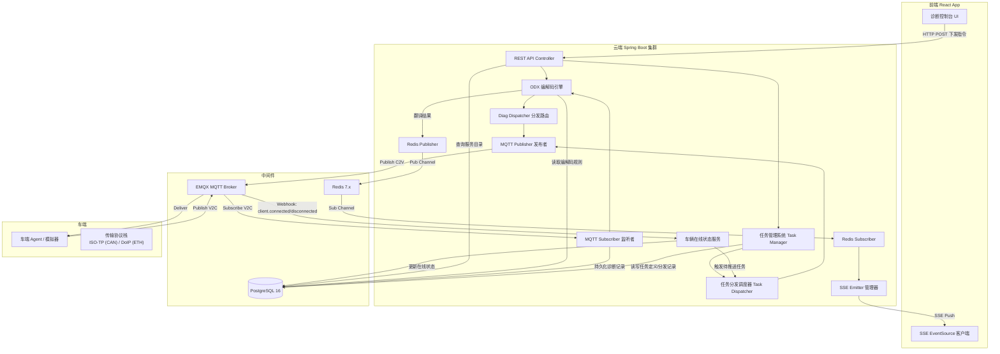
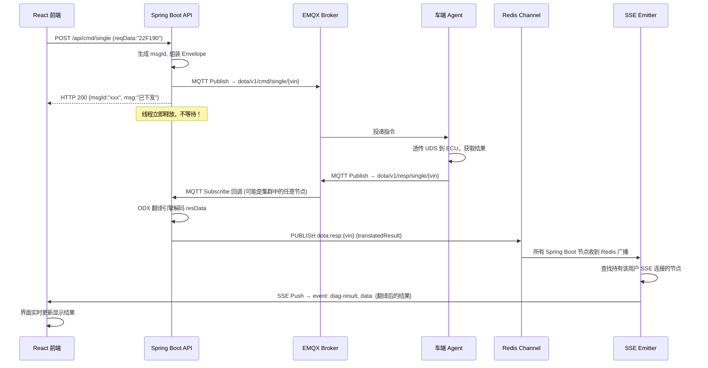
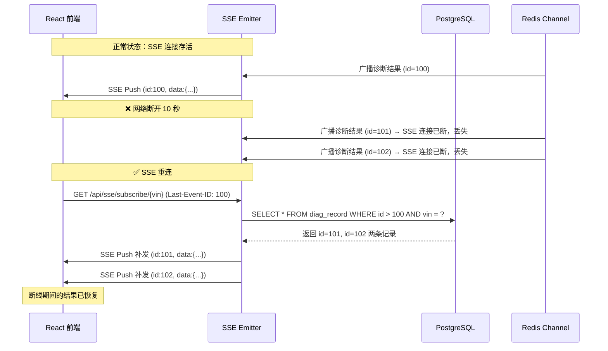
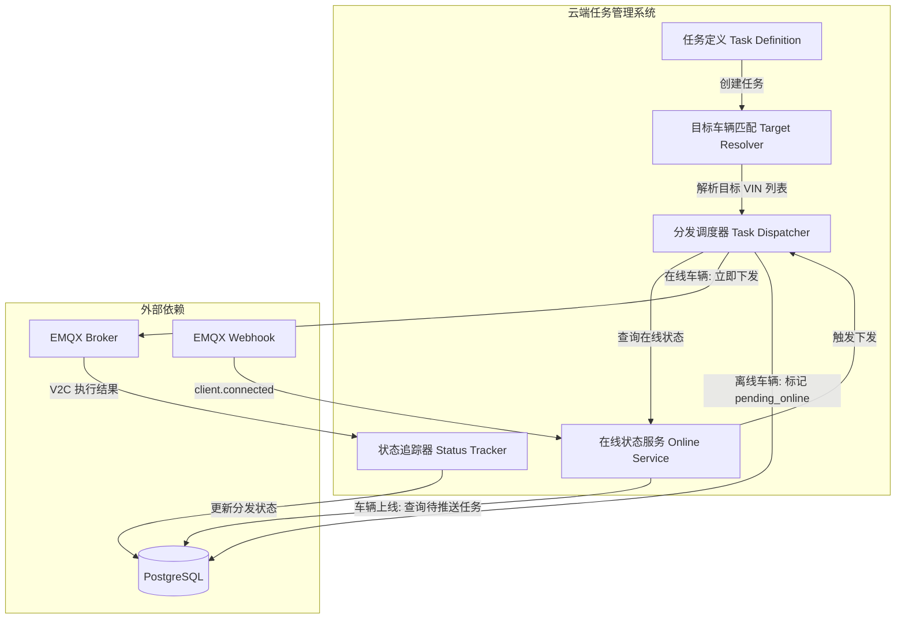
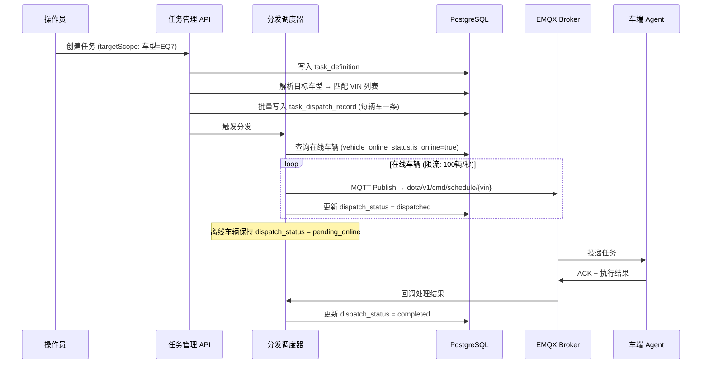
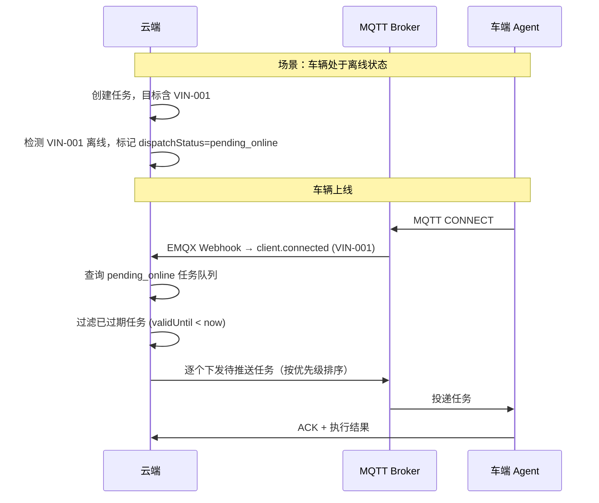
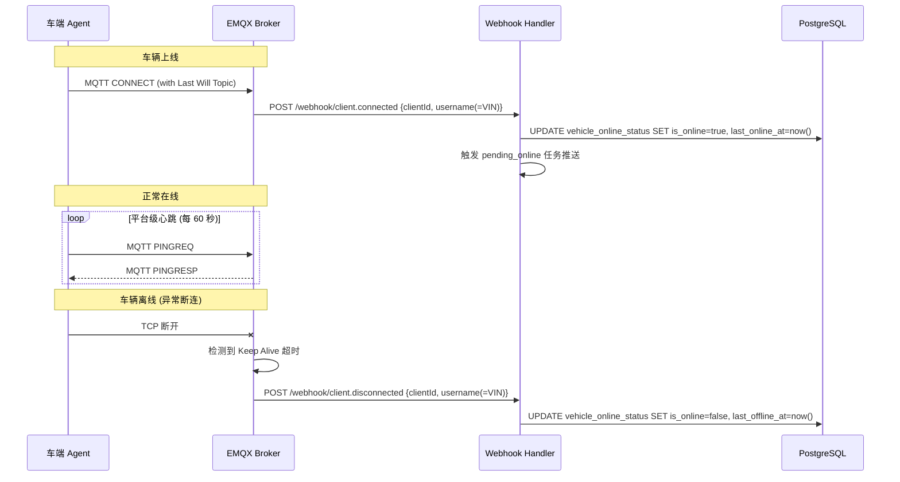
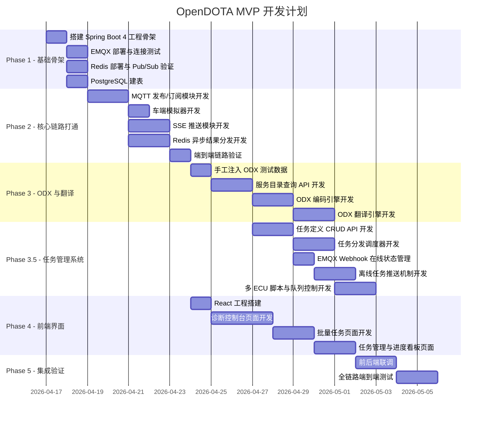

# OpenDOTA 平台技术架构与开发指南

> **版本**: v1.0  
> **日期**: 2026-04-16  
> **状态**: 已定稿，可指导编码  
> **配套文档**: [车云通讯协议规范](./opendota_protocol_spec.md)

---

## 目录

1. [技术选型总览](#1-技术选型总览)
2. [系统架构设计](#2-系统架构设计)
3. [核心异步通信架构](#3-核心异步通信架构)
4. [云端任务管理系统](#4-云端任务管理系统)
5. [后端工程结构设计](#5-后端工程结构设计)
6. [数据库设计](#6-数据库设计)
7. [前端工程设计](#7-前端工程设计)
8. [车端模拟器](#8-车端模拟器)
9. [日志与可观测性](#9-日志与可观测性)
10. [MVP 开发路线图](#10-mvp-开发路线图)
11. [开发规约与约定](#11-开发规约与约定)

---

## 1. 技术选型总览

### 1.1 技术栈全景

| 层级 | 技术选型 | 版本要求 | 选型理由 |
|:---|:---|:---:|:---|
| **语言** | Java | **25** | LTS 版本，虚拟线程（Virtual Threads）已全面成熟，性能比肩 Go 协程 |
| **后端框架** | Spring Boot | **4.x** | 原生支持虚拟线程，Jakarta EE 10 全面升级，AOT 编译支持 |
| **MQTT Broker** | EMQX | 5.x | 单机百万级连接，原生集群，内置 Rule Engine 和 Webhook |
| **MQTT Client** | Eclipse Paho | 最新稳定版 | Java 生态最成熟的 MQTT Client，支持 QoS 0/1/2 |
| **关系型数据库** | PostgreSQL | 16+ | JSONB 原生支持，适合 ODX 半结构化编解码规则存储 |
| **时序数据库** | TimescaleDB (PG 插件) | 最新稳定版 | 无缝扩展 PG，零额外运维成本，后期用于诊断报文日志归档 |
| **缓存与消息** | Redis | 7.x | Pub/Sub 通道实现异步结果分发，支持多节点集群广播 |
| **前端框架** | React | 19.x | 组件化架构，生态成熟 |
| **前端 UI 库** | Ant Design | 5.x | 企业级 UI 组件，表格/树形控件/表单完善 |
| **前端构建** | Vite | 6.x | 极速 HMR，开发体验极佳 |
| **API 文档** | SpringDoc (OpenAPI 3) | 最新稳定版 | 自动生成 Swagger UI，前后端联调利器 |

### 1.2 虚拟线程的核心价值

> [!IMPORTANT]
> 本项目选用 Java 25 虚拟线程（Project Loom）的核心原因：在车云诊断场景中，云端下发一条单步 UDS 指令后，需要阻塞等待车端通过 MQTT 异步回调返回结果（通常 1~5 秒）。传统的平台线程（Platform Thread）模型下，每一个等待中的请求都会占用一个操作系统线程（约 1MB 栈空间），100 个并发就是 100MB。而虚拟线程在 I/O 阻塞时会自动释放底层平台线程，百万级虚拟线程的内存开销仅约数十 MB。

**Spring Boot 4 中启用虚拟线程**：

```yaml
# application.yml
spring:
  threads:
    virtual:
      enabled: true
```

启用后，Tomcat 会自动使用虚拟线程处理所有 HTTP 请求，无需修改任何业务代码。

---

## 2. 系统架构设计

### 2.1 整体架构图



### 2.2 核心设计原则

1. **全异步非阻塞**：HTTP 下发触发即返回，结果通过 Redis Channel + SSE 异步推送。
2. **无状态后端**：Spring Boot 节点之间不共享内存状态，所有跨节点通信通过 Redis 通道完成，天然支持水平扩展。
3. **数据库驱动的业务配置**：ODX 导入后持久化到 PG，前端服务目录和翻译规则全部从数据库动态加载。
4. **协议层与业务层严格解耦**：参见 [车云通讯协议规范](./opendota_protocol_spec.md)。

---

## 3. 核心异步通信架构

### 3.1 单步诊断全链路时序

这是整个平台最核心、最高频的交互路径。



### 3.2 Redis Pub/Sub 通道设计

| Redis Channel 名称 | 用途 | 消息内容 |
|:---|:---|:---|
| `dota:resp:single:{vin}` | 单步诊断结果广播 | 翻译后的诊断结果 JSON |
| `dota:resp:batch:{vin}` | 批量任务结果广播 | 批量任务汇总结果 JSON |
| `dota:event:channel:{vin}` | 诊断通道状态变更 | 通道开启/关闭/超时事件 |

#### 3.2.1 Pub/Sub 广播丢失风险与缓解策略

> [!WARNING]
> Redis Pub/Sub 是**纯广播模型**——消息不持久化，不为离线订阅者缓存。如果用户的 SSE 连接断开了 10 秒后重连，这 10 秒内通过 Redis Channel 广播的诊断结果会**永久丢失**，用户将看不到这些结果。

**MVP 阶段缓解方案：基于 PG `diag_record` 的断线补发**

由于每条诊断结果在 MQTT 回调时已经持久化到 `diag_record` 表（含 `responded_at` 时间戳），可利用这张表作为**兜底数据源**实现断线补发：

1. **SSE 推送时携带事件 ID**：后端每次通过 SSE 推送结果时，在 `id` 字段中设置 `diag_record.id`（数据库自增主键）作为事件游标。
2. **前端重连时发送 `Last-Event-ID`**：浏览器原生 `EventSource` 在重连时会自动将最后一次收到的事件 ID 通过 `Last-Event-ID` 请求头发送给服务端。
3. **后端补发断线期间的记录**：SSE 重连 Handler 读取 `Last-Event-ID`，从 `diag_record` 表中查询 `id > lastEventId AND vin = ?` 的所有记录，按序补发给前端。



**后端实现要点**：

```java
@GetMapping(value = "/api/sse/subscribe/{vin}", produces = MediaType.TEXT_EVENT_STREAM_VALUE)
public SseEmitter subscribe(
        @PathVariable String vin,
        @RequestHeader(value = "Last-Event-ID", required = false) String lastEventId) {

    SseEmitter emitter = new SseEmitter(0L);
    sseEmitterManager.register(vin, emitter);

    // 如果是断线重连，补发断线期间的记录
    if (lastEventId != null && !lastEventId.isBlank()) {
        long lastId = Long.parseLong(lastEventId);
        List<DiagRecord> missed = diagRecordRepository
            .findByVinAndIdGreaterThanOrderByIdAsc(vin, lastId);
        for (DiagRecord record : missed) {
            emitter.send(SseEmitter.event()
                .id(String.valueOf(record.getId()))
                .name("diag-result")
                .data(record.getTranslated()));
        }
    }

    emitter.onCompletion(() -> sseEmitterManager.remove(vin, emitter));
    emitter.onTimeout(() -> sseEmitterManager.remove(vin, emitter));
    return emitter;
}
```

> [!TIP]
> **演进路线**：当系统规模增长到需要支撑高并发、多消费者组时，可从 Redis Pub/Sub 迁移到 **Redis Stream**（`XADD` / `XREAD` / `XACK`），Redis Stream 原生支持消息持久化、消费者组和断点续读，无需再依赖 PG 回填。但 MVP 阶段 PG 回填方案已足够可靠，且零额外组件引入。

### 3.3 SSE (Server-Sent Events) 设计

> [!TIP]
> 选择 SSE 而非 WebSocket 的原因：本场景为典型的**单向推送**（Server → Client），SSE 直接复用 HTTP 协议，无需心跳保活，React 端用原生 `EventSource` 几行代码即可接入，开发维护成本远低于 WebSocket。

**Spring Boot 端**（基础版本，断线补发逻辑见 3.2.1 节）：

```java
@GetMapping(value = "/api/sse/subscribe/{vin}", produces = MediaType.TEXT_EVENT_STREAM_VALUE)
public SseEmitter subscribe(
        @PathVariable String vin,
        @RequestHeader(value = "Last-Event-ID", required = false) String lastEventId) {
    SseEmitter emitter = new SseEmitter(0L); // 永不超时，靠前端重连
    sseEmitterManager.register(vin, emitter);

    // 断线重连补发逻辑（详见 3.2.1 节）
    if (lastEventId != null) {
        sseEmitterManager.replayMissedEvents(vin, lastEventId, emitter);
    }

    emitter.onCompletion(() -> sseEmitterManager.remove(vin, emitter));
    emitter.onTimeout(() -> sseEmitterManager.remove(vin, emitter));
    return emitter;
}
```

**React 端**：

```javascript
useEffect(() => {
  const eventSource = new EventSource(`/api/sse/subscribe/${vin}`);
  
  eventSource.addEventListener('diag-result', (event) => {
    const result = JSON.parse(event.data);
    // 更新诊断结果到界面
    setDiagResult(result);
  });

  eventSource.addEventListener('channel-event', (event) => {
    const channelStatus = JSON.parse(event.data);
    // 更新通道状态
    setChannelStatus(channelStatus);
  });

  return () => eventSource.close();
}, [vin]);
```

---

## 4. 云端任务管理系统

> [!IMPORTANT]
> 云端任务管理系统是「远程诊断 + 批量任务调度平台」的核心上层管理能力。协议层（第 8-12 章）定义了车云之间的通讯报文格式，本章定义**云端侧**的任务编排、分发、追踪和在线状态管理的技术架构。

### 4.1 系统架构概览



### 4.2 核心数据模型

#### Task（任务定义）

| 字段 | 说明 |
|:---|:---|
| `taskId` | 全局唯一标识 |
| `taskName` | 任务名称 |
| `priority` | 优先级 (0=最高, 9=最低) |
| `validFrom` / `validUntil` | 任务有效期 |
| `targetScope` | 目标范围（VIN 列表 / 车型 / 标签 / 全量） |
| `scheduleType` | 调度类型（once / periodic / timed / conditional） |
| `scheduleConfig` | 调度配置 JSON |
| `payloadType` | 诊断载荷类型（batch / script） |
| `diagPayload` | 诊断执行内容（`batch_cmd` 或 `script_cmd` 的 payload） |
| `status` | 任务状态（draft / active / paused / completed / expired） |
| `createdBy` | 创建人 |

#### TaskDispatchRecord（分发记录）

| 字段 | 说明 |
|:---|:---|
| `taskId` | 关联任务 ID |
| `vin` | 目标车辆 |
| `dispatchStatus` | 分发状态（pending_online / dispatched / ack / executing / completed / failed） |
| `dispatchedAt` | 实际下发时间 |
| `completedAt` | 完成时间 |
| `resultPayload` | 执行结果 JSON |

### 4.3 任务优先级模型

| 优先级 | 值 | 说明 |
|:---|:---:|:---|
| **在线诊断仪** | 0 | 最高优先级，人工实时操作（隐含，非任务系统管理） |
| 紧急任务 | 1-2 | 紧急召回检测、安全相关自检 |
| 普通任务 | 3-5 | 常规远程诊断、批量 DTC 读取 |
| 低优先级任务 | 6-9 | 数据采集、统计类任务 |

**优先级执行规则**：
- 车端任务队列按 `priority` 值升序排列（数值越小越优先）。
- 相同优先级按入队时间排序（FIFO）。
- 高优先级任务到达时**不中断**正在执行的低优先级任务（原因见[协议规范第 10.3 节](./opendota_protocol_spec.md#103-冲突裁决规则)）。
- 在线诊断仪受特殊互斥规则约束（详见[协议规范第 10 章](./opendota_protocol_spec.md#10-车端资源仲裁与互斥机制-resource-arbitration)）。

### 4.4 大批量车辆分发机制

#### 4.4.1 分发流程



#### 4.4.2 流量控制策略

| 策略 | 配置 | 说明 |
|:---|:---|:---|
| **分批限流** | 100 辆/秒 | 避免 MQTT Broker 瞬时过载 |
| **分时段下发** | 可配置时间窗口 | 如仅在 02:00-06:00 低峰时段下发 |
| **优先级排序** | 按 task.priority 排序 | 高优先级任务优先分发 |
| **失败重试** | 最多 3 次，指数退避 | 下发失败后自动重试 |

### 4.5 离线车辆任务推送机制



**关键设计点**：
- 利用 EMQX 的 `client.connected` Webhook 感知车辆上线。
- 云端维护 `pending_online` 队列，上线后按优先级逐个推送。
- 下发前检查任务有效期：`validUntil < now()` 的任务不再下发，标记为 `expired`。

### 4.6 心跳与在线状态管理

> [!IMPORTANT]
> 批量下发和离线推送严重依赖「知道哪些车在线」。系统通过 EMQX Webhook + MQTT Last Will 双重机制维护车辆实时在线状态。

#### 4.6.1 在线状态维护方案



#### 4.6.2 EMQX Webhook 配置

```yaml
# EMQX Dashboard → Rule Engine → Webhook
# 或 emqx.conf 配置

webhook.url = "http://opendota-server:8080/api/webhook/emqx"
webhook.events = ["client.connected", "client.disconnected"]
webhook.headers = { "Authorization": "Bearer ${WEBHOOK_TOKEN}" }
```

#### 4.6.3 后端 Webhook Handler

```java
/**
 * EMQX Webhook 回调处理器
 * 接收 EMQX 的 client.connected / client.disconnected 事件
 * 维护车辆在线状态，触发离线任务推送
 */
@RestController
@RequestMapping("/api/webhook/emqx")
public class EmqxWebhookController {

    @PostMapping
    public ResponseEntity<Void> handleWebhook(@RequestBody EmqxWebhookEvent event) {
        String vin = event.getUsername(); // MQTT 用户名即为 VIN

        if ("client.connected".equals(event.getEvent())) {
            vehicleOnlineService.markOnline(vin, event.getClientId());
            // 异步触发：查询并下发 pending_online 的任务
            taskDispatchService.dispatchPendingTasks(vin);
        } else if ("client.disconnected".equals(event.getEvent())) {
            vehicleOnlineService.markOffline(vin);
        }

        return ResponseEntity.ok().build();
    }
}
```

### 4.7 任务状态聚合看板

任务管理系统需提供任务维度的执行进度看板 API：

| API | 说明 |
|:---|:---|
| `GET /api/task/{taskId}/progress` | 单个任务的分发进度聚合 |
| `GET /api/task/list` | 任务列表（分页、筛选） |

**进度聚合响应示例**：

```json
{
  "taskId": "task-dtc-scan-001",
  "taskName": "全车型 DTC 扫描",
  "totalTargets": 5000,
  "progress": {
    "pending_online": 1200,
    "dispatched": 800,
    "executing": 150,
    "completed": 2700,
    "failed": 50,
    "expired": 100
  },
  "completionRate": "54.0%"
}
```

---

## 5. 后端工程结构设计

### 5.1 Maven 多模块结构

```
opendota-server/
├── pom.xml                          # 父 POM (Spring Boot 4.x Parent)
│
├── opendota-common/                 # 公共模块：通用模型、枚举、工具类
│   └── src/main/java/
│       └── com.opendota.common/
│           ├── model/
│           │   ├── DiagMessage.java          # 信封协议 Envelope Java Bean
│           │   ├── DiagAction.java           # act 枚举定义
│           │   ├── SingleCmdPayload.java     # 单步指令 Payload
│           │   ├── BatchCmdPayload.java      # 批量任务 Payload
│           │   └── ...
│           ├── enums/
│           │   ├── DiagStatus.java           # 通用状态码枚举
│           │   └── MacroType.java            # 宏类型枚举
│           └── util/
│               ├── HexUtils.java             # Hex 编解码工具
│               └── UdsUtils.java             # UDS 报文解析工具
│
├── opendota-mqtt/                   # MQTT 通信模块
│   └── src/main/java/
│       └── com.opendota.mqtt/
│           ├── config/
│           │   └── MqttConfig.java           # MQTT 连接配置与 Bean 定义
│           ├── publisher/
│           │   └── MqttDiagPublisher.java     # 诊断指令发布者
│           └── subscriber/
│               └── MqttDiagSubscriber.java    # 诊断结果订阅监听者
│
├── opendota-odx/                    # ODX 引擎模块
│   └── src/main/java/
│       └── com.opendota.odx/
│           ├── importer/
│           │   └── OdxImportService.java      # ODX 文件导入与持久化
│           ├── encoder/
│           │   └── OdxEncoderService.java     # 下行编码：业务意图 → rawHex
│           ├── decoder/
│           │   └── OdxDecoderService.java     # 上行解码：resData → 人类可读
│           └── translator/
│               └── UdsTranslator.java         # 全量 UDS 服务翻译器
│
├── opendota-diag/                   # 诊断业务核心模块
│   └── src/main/java/
│       └── com.opendota.diag/
│           ├── controller/
│           │   ├── SingleDiagController.java  # 单步诊断 API
│           │   ├── BatchDiagController.java   # 批量诊断 API
│           │   ├── ScriptDiagController.java  # 多 ECU 编排脚本 API
│           │   ├── ScheduleController.java    # 定时任务 API
│           │   └── SseController.java         # SSE 订阅端点
│           ├── service/
│           │   ├── DiagDispatcher.java        # 诊断分发路由中间件
│           │   ├── ChannelManager.java        # 诊断通道生命周期管理
│           │   └── TaskManager.java           # 批量/定时任务状态管理
│           └── sse/
│               └── SseEmitterManager.java     # SSE 连接池管理
│
├── opendota-task/                   # 任务管理模块（新增）
│   └── src/main/java/
│       └── com.opendota.task/
│           ├── controller/
│           │   ├── TaskDefinitionController.java  # 任务定义 CRUD API
│           │   ├── TaskDispatchController.java    # 任务分发状态查询 API
│           │   └── VehicleQueueController.java    # 车端队列操控 API
│           ├── service/
│           │   ├── TaskDefinitionService.java     # 任务定义业务逻辑
│           │   ├── TaskDispatchService.java       # 任务分发调度器（拆分下发 + 状态追踪）
│           │   └── VehicleOnlineService.java      # 车辆在线状态管理
│           ├── listener/
│           │   └── EmqxWebhookListener.java       # EMQX Webhook 回调监听
│           └── model/
│               ├── TaskDefinition.java            # 任务定义实体
│               ├── TaskDispatchRecord.java        # 分发记录实体
│               └── VehicleOnlineStatus.java       # 车辆在线状态实体
│
├── opendota-admin/                  # 管理后台模块 (ODX 导入、车型管理)
│   └── src/main/java/
│       └── com.opendota.admin/
│           ├── controller/
│           │   ├── OdxManageController.java   # ODX 文件上传与管理
│           │   ├── VehicleModelController.java # 车型管理
│           │   └── EcuController.java         # ECU 管理
│           └── service/
│               └── ...
│
└── opendota-app/                    # 启动模块 (聚合打包)
    ├── src/main/java/
    │   └── com.opendota/
    │       └── OpenDotaApplication.java
    └── src/main/resources/
        ├── application.yml
        └── application-dev.yml
```

### 5.2 核心 Java Bean 定义

#### 信封协议（Envelope）

```java
/**
 * 车云通讯统一消息信封
 * 所有 MQTT 交互报文的最外层 JSON 结构
 *
 * @param <T> Payload 业务数据泛型
 */
public record DiagMessage<T>(
    String msgId,       // 全局唯一消息 ID (UUID)
    Long timestamp,     // 毫秒级时间戳
    String vin,         // 17 位车架号
    DiagAction act,     // 业务动作枚举
    T payload           // 具体业务数据
) {
    /**
     * 工厂方法：创建下发消息
     */
    public static <T> DiagMessage<T> of(String vin, DiagAction act, T payload) {
        return new DiagMessage<>(
            UUID.randomUUID().toString(),
            System.currentTimeMillis(),
            vin,
            act,
            payload
        );
    }
}
```

#### 动作类型枚举

```java
/**
 * 车云通讯动作类型
 */
public enum DiagAction {
    // 通道管理
    CHANNEL_OPEN("channel_open"),
    CHANNEL_CLOSE("channel_close"),
    CHANNEL_EVENT("channel_event"),

    // 单步诊断
    SINGLE_CMD("single_cmd"),
    SINGLE_RESP("single_resp"),

    // 批量诊断
    BATCH_CMD("batch_cmd"),
    BATCH_RESP("batch_resp"),

    // 定时任务
    SCHEDULE_SET("schedule_set"),
    SCHEDULE_CANCEL("schedule_cancel"),
    SCHEDULE_RESP("schedule_resp"),

    // 多 ECU 编排脚本
    SCRIPT_CMD("script_cmd"),
    SCRIPT_RESP("script_resp"),

    // 车端队列操控
    QUEUE_QUERY("queue_query"),
    QUEUE_DELETE("queue_delete"),
    QUEUE_PAUSE("queue_pause"),
    QUEUE_RESUME("queue_resume"),
    QUEUE_STATUS("queue_status"),

    // 任务控制
    TASK_PAUSE("task_pause"),
    TASK_RESUME("task_resume"),
    TASK_CANCEL("task_cancel"),
    TASK_QUERY("task_query");

    @JsonValue
    private final String value;
    // ...
}
```

---

## 6. 数据库设计

### 6.1 PostgreSQL 核心表

详细的 ODX 表结构定义见 [车云通讯协议规范 - 13.3.2 节](./opendota_protocol_spec.md)。此处补充工程实现相关的表：

#### 诊断记录表 (`diag_record`)

用于持久化每一次诊断交互的完整记录（含请求和响应）。

```sql
CREATE TABLE diag_record (
    id              BIGSERIAL PRIMARY KEY,
    msg_id          VARCHAR(64) NOT NULL UNIQUE,       -- 消息唯一 ID
    vin             VARCHAR(17) NOT NULL,              -- 车架号
    ecu_name        VARCHAR(64),                       -- ECU 名称
    act             VARCHAR(32) NOT NULL,              -- 动作类型
    req_raw_hex     TEXT,                              -- 下发的原始 Hex
    res_raw_hex     TEXT,                              -- 上报的原始 Hex
    translated      JSONB,                             -- 翻译后的结构化结果
    status          INT DEFAULT -1,                    -- 执行状态码 (-1=等待中)
    error_code      VARCHAR(32),                       -- 错误码
    operator_id     VARCHAR(64),                       -- 操作人员 ID
    created_at      TIMESTAMP DEFAULT CURRENT_TIMESTAMP,
    responded_at    TIMESTAMP                          -- 收到响应的时间
);

-- 索引：按 VIN + 时间范围查询
CREATE INDEX idx_diag_record_vin_time ON diag_record(vin, created_at DESC);
-- 索引：按 msgId 精确查找（用于 MQTT 回调匹配）
CREATE UNIQUE INDEX idx_diag_record_msgid ON diag_record(msg_id);
```

#### 批量任务表 (`batch_task`)

```sql
CREATE TABLE batch_task (
    id              BIGSERIAL PRIMARY KEY,
    task_id         VARCHAR(64) NOT NULL UNIQUE,
    vin             VARCHAR(17) NOT NULL,
    ecu_name        VARCHAR(64),
    overall_status  INT DEFAULT -1,                    -- -1=未开始, 0=全部成功, 1=部分成功, 2=全部失败, 3=终止
    total_steps     INT NOT NULL,                      -- 总步骤数
    strategy        INT DEFAULT 1,                     -- 0=遇错终止, 1=遇错继续
    request_payload JSONB NOT NULL,                    -- 完整的下发 JSON (steps 数组)
    result_payload  JSONB,                             -- 车端返回的完整结果 JSON
    operator_id     VARCHAR(64),
    created_at      TIMESTAMP DEFAULT CURRENT_TIMESTAMP,
    completed_at    TIMESTAMP
);
```

### 6.2 任务管理相关表（新增）

#### 任务定义表 (`task_definition`)

用于存储厂家侧创建的任务定义（含优先级、有效期、调度类型、诊断 payload）。

```sql
CREATE TABLE task_definition (
    id                BIGSERIAL PRIMARY KEY,
    task_id           VARCHAR(64) NOT NULL UNIQUE,       -- 任务全局唯一标识
    task_name         VARCHAR(256) NOT NULL,             -- 任务名称
    priority          INT DEFAULT 5,                     -- 优先级 (0=最高, 9=最低)
    valid_from        TIMESTAMP,                         -- 任务有效期开始
    valid_until       TIMESTAMP,                         -- 任务有效期截止
    schedule_type     VARCHAR(32) NOT NULL,              -- 调度类型: once/periodic/timed/conditional
    schedule_config   JSONB NOT NULL,                    -- 调度配置 (scheduleCondition JSON)
    payload_type      VARCHAR(32) DEFAULT 'batch',       -- 诊断载荷类型: batch/script
    diag_payload      JSONB NOT NULL,                    -- 诊断执行内容 (batch_cmd 或 script_cmd 的 payload)
    status            VARCHAR(32) DEFAULT 'draft',       -- 任务状态: draft/active/paused/completed/expired
    created_by        VARCHAR(64),                       -- 创建人
    created_at        TIMESTAMP DEFAULT CURRENT_TIMESTAMP,
    updated_at        TIMESTAMP DEFAULT CURRENT_TIMESTAMP
);

CREATE INDEX idx_task_def_status ON task_definition(status);
CREATE INDEX idx_task_def_priority ON task_definition(priority, created_at);
```

#### 任务目标车辆关联表 (`task_target`)

支持按 VIN 列表、车型、标签等维度定义目标范围。

```sql
CREATE TABLE task_target (
    id                BIGSERIAL PRIMARY KEY,
    task_id           VARCHAR(64) NOT NULL,              -- 关联任务 ID
    target_type       VARCHAR(32) NOT NULL,              -- 目标类型: vin_list/model/tag/all
    target_value      JSONB NOT NULL,                    -- 目标值: VIN 数组 / 车型编码 / 标签名
    FOREIGN KEY (task_id) REFERENCES task_definition(task_id)
);

CREATE INDEX idx_task_target_task ON task_target(task_id);
```

#### 任务分发记录表 (`task_dispatch_record`)

每辆车的独立分发记录，追踪分发状态。

```sql
CREATE TABLE task_dispatch_record (
    id                BIGSERIAL PRIMARY KEY,
    task_id           VARCHAR(64) NOT NULL,              -- 关联任务 ID
    vin               VARCHAR(17) NOT NULL,              -- 目标车辆
    dispatch_status   VARCHAR(32) DEFAULT 'pending_online',  -- 分发状态:
                                                         -- pending_online (待上线)
                                                         -- dispatched (已下发)
                                                         -- ack (已确认)
                                                         -- executing (执行中)
                                                         -- completed (已完成)
                                                         -- failed (失败)
    dispatched_at     TIMESTAMP,                         -- 实际下发时间
    completed_at      TIMESTAMP,                         -- 完成时间
    result_payload    JSONB,                             -- 执行结果 JSON
    retry_count       INT DEFAULT 0,                     -- 重试次数
    created_at        TIMESTAMP DEFAULT CURRENT_TIMESTAMP,
    FOREIGN KEY (task_id) REFERENCES task_definition(task_id)
);

CREATE INDEX idx_dispatch_task_vin ON task_dispatch_record(task_id, vin);
CREATE INDEX idx_dispatch_status ON task_dispatch_record(dispatch_status);
CREATE INDEX idx_dispatch_vin_pending ON task_dispatch_record(vin, dispatch_status)
    WHERE dispatch_status = 'pending_online';
```

#### 任务执行日志表 (`task_execution_log`)

周期任务会有多次执行记录，每次执行独立记录。

```sql
CREATE TABLE task_execution_log (
    id                BIGSERIAL PRIMARY KEY,
    task_id           VARCHAR(64) NOT NULL,              -- 关联任务 ID
    vin               VARCHAR(17) NOT NULL,              -- 执行车辆
    execution_seq     INT NOT NULL,                      -- 执行序号（第 N 次执行）
    trigger_time      TIMESTAMP NOT NULL,                -- 触发时间
    overall_status    INT,                               -- 执行结果状态码
    result_payload    JSONB,                             -- 详细结果 JSON
    execution_duration INT,                              -- 执行耗时（毫秒）
    created_at        TIMESTAMP DEFAULT CURRENT_TIMESTAMP
);

CREATE INDEX idx_exec_log_task_vin ON task_execution_log(task_id, vin, execution_seq);
```

#### 车辆在线状态表 (`vehicle_online_status`)

用于维护车辆的实时在线状态，支撑离线任务推送和批量分发。

```sql
CREATE TABLE vehicle_online_status (
    id                BIGSERIAL PRIMARY KEY,
    vin               VARCHAR(17) NOT NULL UNIQUE,       -- 车架号
    is_online         BOOLEAN DEFAULT false,             -- 是否在线
    last_online_at    TIMESTAMP,                         -- 最后上线时间
    last_offline_at   TIMESTAMP,                         -- 最后离线时间
    mqtt_client_id    VARCHAR(128),                      -- MQTT 客户端 ID
    updated_at        TIMESTAMP DEFAULT CURRENT_TIMESTAMP
);

CREATE INDEX idx_vehicle_online ON vehicle_online_status(is_online);
```

### 6.3 TimescaleDB 时序扩展（后期启用）

当诊断日志量达到百万级时，可对 `diag_record` 表启用 TimescaleDB 时序优化：

```sql
-- 启用 TimescaleDB 扩展
CREATE EXTENSION IF NOT EXISTS timescaledb;

-- 将 diag_record 转换为 Hypertable（按时间自动分片）
SELECT create_hypertable('diag_record', 'created_at');

-- 自动数据保留策略：保留最近 90 天
SELECT add_retention_policy('diag_record', INTERVAL '90 days');
```

---

## 7. 前端工程设计

### 7.1 工程结构

```
opendota-web/
├── package.json
├── vite.config.ts
├── tsconfig.json
├── public/
└── src/
    ├── main.tsx
    ├── App.tsx
    ├── api/                          # HTTP API 调用封装
    │   ├── diagApi.ts                # 诊断相关 API
    │   ├── odxApi.ts                 # ODX 服务目录 API
    │   └── vehicleApi.ts            # 车辆管理 API
    ├── hooks/
    │   ├── useSse.ts                 # SSE 订阅 Hook
    │   └── useDiagSession.ts         # 诊断会话状态 Hook
    ├── components/
    │   ├── DiagConsole/              # 诊断控制台（核心组件）
    │   │   ├── ServiceTree.tsx       # 左侧：ECU + 服务目录树
    │   │   ├── CommandPanel.tsx      # 中间：指令发送面板
    │   │   └── ResultTerminal.tsx    # 右侧：结果终端（实时显示）
    │   ├── BatchTaskPanel/           # 批量任务面板
    │   │   ├── ScriptEditor.tsx      # JSON 脚本编辑器
    │   │   └── TaskResultTable.tsx   # 批量结果展示表格
    │   └── common/
    │       ├── HexViewer.tsx         # Hex 数据查看器
    │       └── StatusBadge.tsx       # 状态标签组件
    ├── pages/
    │   ├── DiagPage.tsx              # 单步诊断页面
    │   ├── BatchPage.tsx             # 批量任务页面
    │   ├── OdxManagePage.tsx         # ODX 管理页面
    │   └── VehiclePage.tsx           # 车辆管理页面
    ├── stores/                       # 状态管理 (Zustand 或 Redux)
    │   ├── diagStore.ts
    │   └── vehicleStore.ts
    └── types/
        └── diag.d.ts                 # TypeScript 类型定义
```

### 7.2 核心 SSE Hook

```typescript
// hooks/useSse.ts
import { useEffect, useRef, useCallback } from 'react';

/**
 * SSE 订阅 Hook
 * 用于接收云端推送的诊断结果
 *
 * 断线重连说明：
 * 浏览器原生 EventSource 在连接断开后会自动重连，并在重连请求中携带
 * Last-Event-ID 头（值为最后一次收到的事件 id 字段）。后端据此从 PG 中
 * 查询断线期间的记录并补发（详见 3.2.1 节）。
 *
 * 此处使用手动重连（而非 EventSource 默认重连）是为了支持指数退避策略，
 * 避免服务端故障时大量客户端同时重连导致雪崩。
 */
export function useSse(vin: string, onMessage: (event: string, data: any) => void) {
  const eventSourceRef = useRef<EventSource | null>(null);
  const retryCountRef = useRef(0);
  const maxRetryDelay = 30000; // 最大重连间隔 30 秒

  const connect = useCallback(() => {
    // 关闭已有连接
    eventSourceRef.current?.close();

    const es = new EventSource(`/api/sse/subscribe/${vin}`);

    es.onopen = () => {
      retryCountRef.current = 0; // 连接成功后重置重试计数
    };

    // 监听诊断结果推送
    es.addEventListener('diag-result', (e) => {
      onMessage('diag-result', JSON.parse(e.data));
    });

    // 监听通道状态变更
    es.addEventListener('channel-event', (e) => {
      onMessage('channel-event', JSON.parse(e.data));
    });

    // 监听批量任务结果
    es.addEventListener('batch-result', (e) => {
      onMessage('batch-result', JSON.parse(e.data));
    });

    // 断线自动重连（指数退避 + 抖动）
    // 注意：浏览器 EventSource 重连时会自动携带 Last-Event-ID，
    // 后端据此补发断线期间的消息，无需前端额外处理
    es.onerror = () => {
      es.close();
      const delay = Math.min(1000 * Math.pow(2, retryCountRef.current), maxRetryDelay);
      const jitter = delay * 0.3 * Math.random(); // 30% 随机抖动
      retryCountRef.current++;
      setTimeout(connect, delay + jitter);
    };

    eventSourceRef.current = es;
  }, [vin, onMessage]);

  useEffect(() => {
    if (vin) connect();
    return () => eventSourceRef.current?.close();
  }, [vin, connect]);
}
```

---

## 8. 车端模拟器

### 8.1 定位

在 MVP 阶段，不涉及真实的车端程序开发。但为了端到端验证云端的全链路（下发 → MQTT → 回调 → Redis → SSE → 前端），需要一个**简单的 MQTT 客户端模拟器**来伪装成车端 Agent。

### 8.2 模拟器功能

| 功能 | 说明 |
|:---|:---|
| 订阅 C2V Topic | 监听 `dota/v1/cmd/single/{vin}`、`dota/v1/cmd/batch/{vin}` 等 |
| 解析 Envelope | 解析收到的 JSON，提取 `act` 和 `payload` |
| 模拟 UDS 响应 | 根据 `reqData` 的 Service ID 返回预设的固定响应 |
| 发布 V2C 结果 | 将模拟结果组装为 Envelope 发布到 `dota/v1/resp/single/{vin}` |
| 可配置延迟 | 模拟真实的车端执行耗时（1~3 秒随机延迟） |

### 8.3 预置的模拟响应表

| 请求 reqData 前缀 | 模拟返回的 resData | 说明 |
|:---|:---|:---|
| `22F190` | `62F1904C535657413233...` | 读 VIN：返回 "LSVWA23..." |
| `22F191` | `62F19148575F56312E30` | 读硬件版本号 |
| `22F193` | `62F19342415454` | 读系统供应商 ID |
| `1003` | `500300C80014` | 切换扩展会话：成功 |
| `1001` | `500100C80014` | 切换默认会话：成功 |
| `14FFFFFF` | `54` | 清除所有 DTC：成功 |
| `190209` | `5902090100018F` | 读 DTC：返回 1 个故障码 |
| 其他 | `7F{SID}31` | 默认返回 NRC：RequestOutOfRange |

### 8.4 实现建议

可直接使用 Java 编写一个简易的 Spring Boot CLI 应用。也可以复用你们已有的 `vehicle-mqtt-simulator` 项目，仅需适配本协议的 Envelope 格式即可。

> [!NOTE]
> **DoIP 模拟说明**：MVP 阶段模拟器仅模拟 CAN 路径（`transport=UDS_ON_CAN`）。DoIP 路径的模拟（TCP Server + Routing Activation 响应 + DoIP Header 封装）计划在后续阶段实现。当前阶段若需验证 DoIP 协议字段的下发链路，可通过模拟器忽略 `transport` 字段、直接按 UDS PDU 返回固定响应的方式实现轻量级验证。

---

## 9. 日志与可观测性

### 9.1 日志规范

> [!CAUTION]
> 车云远程诊断涉及直接操作车辆 ECU，所有下发和回传必须留痕。日志是事故追责和问题排查的唯一依据。

#### MDC 上下文注入

在整个请求链路中，使用 SLF4J MDC 注入关键追踪字段：

```java
/**
 * 诊断链路追踪过滤器
 * 将 msgId 和 vin 注入 MDC，贯穿整个请求生命周期
 */
@Component
public class DiagTraceFilter implements Filter {
    @Override
    public void doFilter(ServletRequest request, ServletResponse response, FilterChain chain) {
        try {
            MDC.put("traceId", UUID.randomUUID().toString().substring(0, 8));
            chain.doFilter(request, response);
        } finally {
            MDC.clear();
        }
    }
}
```

#### 关键日志埋点

| 埋点位置 | 日志级别 | 必须包含的字段 | 说明 |
|:---|:---:|:---|:---|
| MQTT Publish 前 | INFO | `msgId`, `vin`, `act`, `reqData` | 下发指令的完整内容 |
| MQTT Subscribe 回调 | INFO | `msgId`, `vin`, `act`, `resData`, `status` | 车端返回的完整内容 |
| ODX 翻译完成 | DEBUG | `msgId`, `translatedResult` | 翻译后的结构化结果 |
| Redis Pub 发送 | DEBUG | `channel`, `msgId` | Redis 广播追踪 |
| SSE Push 到前端 | DEBUG | `vin`, `eventType` | 前端推送追踪 |
| 异常/超时 | ERROR | `msgId`, `vin`, `errorMsg`, `stackTrace` | 异常链路还原 |

#### 日志格式

```
# logback-spring.xml 格式
%d{yyyy-MM-dd HH:mm:ss.SSS} [%thread] [%X{traceId}] %-5level %logger{36} - %msg%n
```

---

## 10. MVP 开发路线图

### 10.1 阶段划分



### 10.2 Phase 优先级与验收标准

#### Phase 1：基础骨架（Day 1-2）
**目标**：所有基础设施就绪，Spring Boot 能编译启动。
- [ ] Spring Boot 4 + Java 25 工程可编译运行
- [ ] EMQX 单节点部署完成，可通过客户端工具 Pub/Sub
- [ ] Redis 可连接，`PUBLISH/SUBSCRIBE` 命令测试通过
- [ ] PostgreSQL 所有核心表建表完成

#### Phase 2：核心链路（Day 3-6）⭐ 最重要
**目标**：打通"前端发指令 → MQTT 下发 → 模拟车端回复 → Redis 广播 → SSE 推送 → 前端显示"的全异步闭环。
- [ ] 通过 Postman 调用 API 可触发 MQTT 发布
- [ ] 车端模拟器收到消息后 1 秒内自动回复
- [ ] SSE 端点可被浏览器 EventSource 连接
- [ ] 整个闭环走通：下发 `22F190` → 收到 `62F190...` → 推送到浏览器

> [!IMPORTANT]
> Phase 2 是整个 MVP 的**安全网**。只要这条链路走通了，你就可以向任何人演示"远程诊断的核心逻辑"。后续所有的功能（ODX 解析、批量任务、前端美化）都是在这条线上叠加。

#### Phase 3：ODX 与翻译（Day 7-11）
**目标**：原始 Hex 数据可被翻译为人类可读的物理值。
- [ ] 手工注入至少 5 条 ODX 服务定义数据
- [ ] 前端能展示 ECU 服务目录树
- [ ] 下发指令时自动从数据库读取 `requestRawHex`
- [ ] 返回结果可被翻译为中文描述 + 物理值

#### Phase 3.5：任务管理系统（Day 9-14，可与 Phase 3/4 并行）
**目标**：任务 CRUD、分发调度、离线推送、队列控制全流程打通。
- [ ] 任务定义 CRUD API 可用
- [ ] EMQX Webhook 车辆在线状态维护正常
- [ ] 在线车辆任务分发流程打通
- [ ] 离线车辆上线后自动推送待下发任务
- [ ] 多 ECU 编排脚本下发与结果收集
- [ ] 车端任务队列查询与操控流程验证

#### Phase 4：前端界面（Day 7-15，可与 Phase 3/3.5 并行）
**目标**：有一个可用的诊断控制台和任务管理界面。
- [ ] 左侧服务树 + 右侧结果终端的基础布局
- [ ] 点击服务可触发诊断，结果实时显示
- [ ] 批量任务 JSON 编辑与提交
- [ ] 任务创建/列表/进度看板页面

#### Phase 5：集成验证（Day 16-18）
**目标**：全部功能联调通过。
- [ ] 前端全流程可演示
- [ ] 诊断记录可持久化查询
- [ ] 任务分发与离线推送全流程验证
- [ ] 基本的错误处理和超时处理

---

## 11. 开发规约与约定

### 11.1 代码规范

| 规范项 | 约定 |
|:---|:---|
| Java 版本 | 25（必须启用 `--enable-preview` 如有需要） |
| 代码风格 | Google Java Style Guide |
| 注释语言 | **中文**（所有新增代码注释必须使用中文） |
| 包命名 | `com.opendota.{模块名}.{层级}` |
| Record 类 | 优先使用 Java Record 定义不可变 DTO |
| 枚举 | 所有协议相关的常量必须定义为枚举，禁止使用魔法数字和字符串 |

### 11.2 Git 提交规范

```
feat: 新增单步诊断 API 接口
fix: 修复 MQTT 回调中 msgId 匹配失败的问题
refactor: 重构 ODX 翻译引擎的参数解码逻辑
docs: 更新车云协议规范文档
chore: 升级 Spring Boot 至 4.0.1
```

### 11.3 API 设计规范

| 规范项 | 约定 |
|:---|:---|
| 路由风格 | RESTful，资源名使用复数 |
| 请求体 | `application/json` |
| 响应体 | 统一包装为 `{ code, msg, data }` |
| 错误处理 | 使用 `@RestControllerAdvice` 全局异常处理 |
| API 文档 | SpringDoc OpenAPI 3 自动生成，访问路径 `/swagger-ui.html` |

### 11.4 配置文件约定

```yaml
# application.yml 结构约定
spring:
  threads:
    virtual:
      enabled: true               # 启用虚拟线程
  datasource:
    url: jdbc:postgresql://localhost:5432/opendota
    username: opendota
    password: ${DB_PASSWORD}
  data:
    redis:
      host: localhost
      port: 6379

# 自定义配置命名空间
opendota:
  mqtt:
    broker-url: tcp://localhost:1883
    client-id: opendota-server-${random.uuid}
    username: ${MQTT_USERNAME}
    password: ${MQTT_PASSWORD}
    topic-prefix: dota/v1
  diag:
    single-timeout-ms: 5000       # 单步诊断默认超时
    channel-idle-timeout-ms: 300000 # 诊断通道空闲超时
```

---

> **文档维护说明**：本文档应随项目迭代持续更新。技术选型变更需经团队评审后同步更新本文档。
