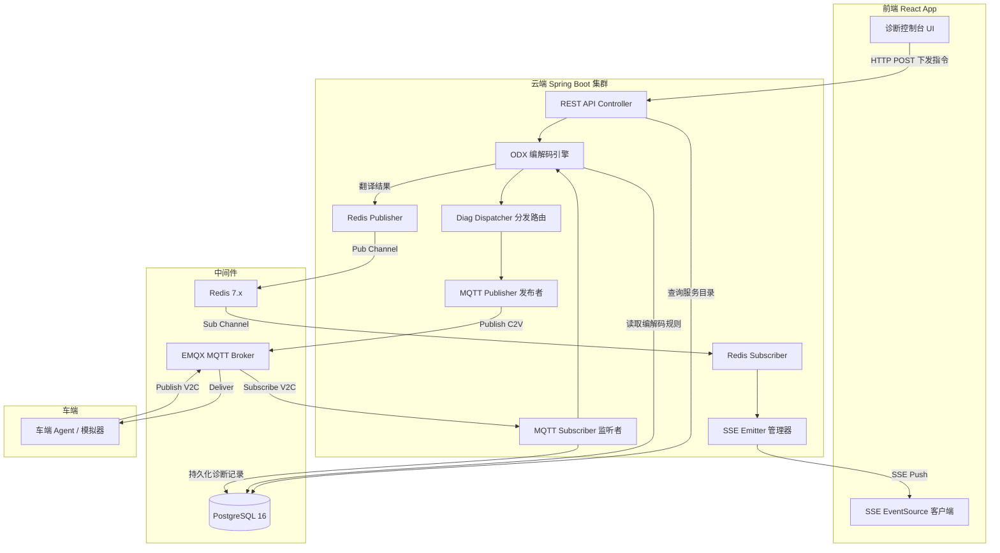
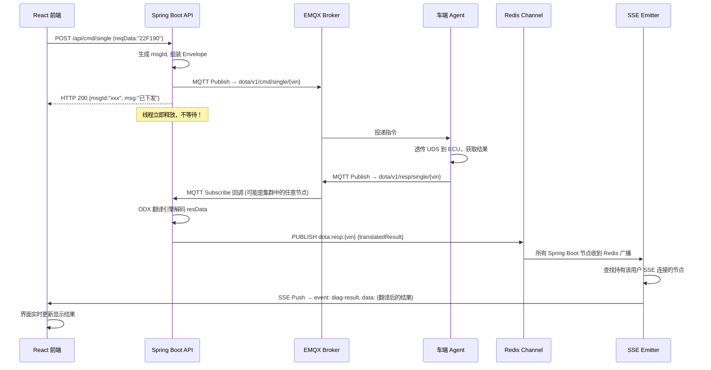
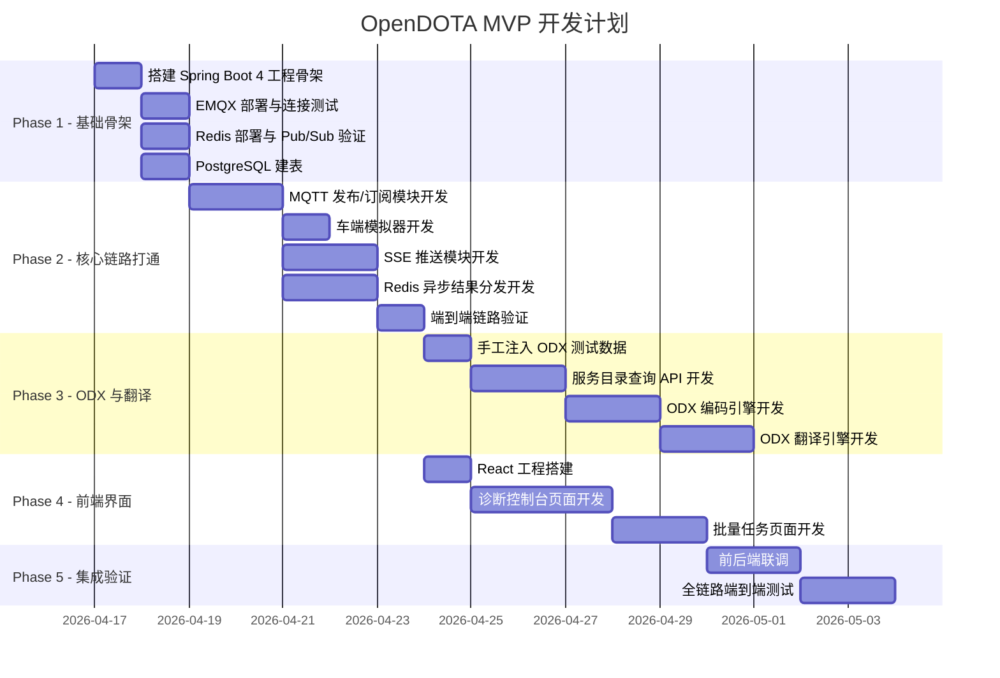

# OpenDOTA 平台技术架构与开发指南

> **版本**: v1.0  
> **日期**: 2026-04-16  
> **状态**: 已定稿，可指导编码  
> **配套文档**: [车云通讯协议规范](./opendota_protocol_spec.md)

---

## 目录

1. [技术选型总览](#1-技术选型总览)
2. [系统架构设计](#2-系统架构设计)
3. [核心异步通信架构](#3-核心异步通信架构)
4. [后端工程结构设计](#4-后端工程结构设计)
5. [数据库设计](#5-数据库设计)
6. [前端工程设计](#6-前端工程设计)
7. [车端模拟器](#7-车端模拟器)
8. [日志与可观测性](#8-日志与可观测性)
9. [MVP 开发路线图](#9-mvp-开发路线图)
10. [开发规约与约定](#10-开发规约与约定)

---

## 1. 技术选型总览

### 1.1 技术栈全景

| 层级 | 技术选型 | 版本要求 | 选型理由 |
|:---|:---|:---:|:---|
| **语言** | Java | **25** | LTS 版本，虚拟线程（Virtual Threads）已全面成熟，性能比肩 Go 协程 |
| **后端框架** | Spring Boot | **4.x** | 原生支持虚拟线程，Jakarta EE 10 全面升级，AOT 编译支持 |
| **MQTT Broker** | EMQX | 5.x | 单机百万级连接，原生集群，内置 Rule Engine 和 Webhook |
| **MQTT Client** | Eclipse Paho | 最新稳定版 | Java 生态最成熟的 MQTT Client，支持 QoS 0/1/2 |
| **关系型数据库** | PostgreSQL | 16+ | JSONB 原生支持，适合 ODX 半结构化编解码规则存储 |
| **时序数据库** | TimescaleDB (PG 插件) | 最新稳定版 | 无缝扩展 PG，零额外运维成本，后期用于诊断报文日志归档 |
| **缓存与消息** | Redis | 7.x | Pub/Sub 通道实现异步结果分发，支持多节点集群广播 |
| **前端框架** | React | 19.x | 组件化架构，生态成熟 |
| **前端 UI 库** | Ant Design | 5.x | 企业级 UI 组件，表格/树形控件/表单完善 |
| **前端构建** | Vite | 6.x | 极速 HMR，开发体验极佳 |
| **API 文档** | SpringDoc (OpenAPI 3) | 最新稳定版 | 自动生成 Swagger UI，前后端联调利器 |

### 1.2 虚拟线程的核心价值

> [!IMPORTANT]
> 本项目选用 Java 25 虚拟线程（Project Loom）的核心原因：在车云诊断场景中，云端下发一条单步 UDS 指令后，需要阻塞等待车端通过 MQTT 异步回调返回结果（通常 1~5 秒）。传统的平台线程（Platform Thread）模型下，每一个等待中的请求都会占用一个操作系统线程（约 1MB 栈空间），100 个并发就是 100MB。而虚拟线程在 I/O 阻塞时会自动释放底层平台线程，百万级虚拟线程的内存开销仅约数十 MB。

**Spring Boot 4 中启用虚拟线程**：

```yaml
# application.yml
spring:
  threads:
    virtual:
      enabled: true
```

启用后，Tomcat 会自动使用虚拟线程处理所有 HTTP 请求，无需修改任何业务代码。

---

## 2. 系统架构设计

### 2.1 整体架构图



### 2.2 核心设计原则

1. **全异步非阻塞**：HTTP 下发触发即返回，结果通过 Redis Channel + SSE 异步推送。
2. **无状态后端**：Spring Boot 节点之间不共享内存状态，所有跨节点通信通过 Redis 通道完成，天然支持水平扩展。
3. **数据库驱动的业务配置**：ODX 导入后持久化到 PG，前端服务目录和翻译规则全部从数据库动态加载。
4. **协议层与业务层严格解耦**：参见 [车云通讯协议规范](./opendota_protocol_spec.md)。

---

## 3. 核心异步通信架构

### 3.1 单步诊断全链路时序

这是整个平台最核心、最高频的交互路径。



### 3.2 Redis Pub/Sub 通道设计

| Redis Channel 名称 | 用途 | 消息内容 |
|:---|:---|:---|
| `dota:resp:single:{vin}` | 单步诊断结果广播 | 翻译后的诊断结果 JSON |
| `dota:resp:batch:{vin}` | 批量任务结果广播 | 批量任务汇总结果 JSON |
| `dota:event:channel:{vin}` | 诊断通道状态变更 | 通道开启/关闭/超时事件 |

### 3.3 SSE (Server-Sent Events) 设计

> [!TIP]
> 选择 SSE 而非 WebSocket 的原因：本场景为典型的**单向推送**（Server → Client），SSE 直接复用 HTTP 协议，无需心跳保活，React 端用原生 `EventSource` 几行代码即可接入，开发维护成本远低于 WebSocket。

**Spring Boot 端**：

```java
@GetMapping(value = "/api/sse/subscribe/{vin}", produces = MediaType.TEXT_EVENT_STREAM_VALUE)
public SseEmitter subscribe(@PathVariable String vin) {
    SseEmitter emitter = new SseEmitter(0L); // 永不超时，靠前端重连
    sseEmitterManager.register(vin, emitter);
    emitter.onCompletion(() -> sseEmitterManager.remove(vin, emitter));
    emitter.onTimeout(() -> sseEmitterManager.remove(vin, emitter));
    return emitter;
}
```

**React 端**：

```javascript
useEffect(() => {
  const eventSource = new EventSource(`/api/sse/subscribe/${vin}`);
  
  eventSource.addEventListener('diag-result', (event) => {
    const result = JSON.parse(event.data);
    // 更新诊断结果到界面
    setDiagResult(result);
  });

  eventSource.addEventListener('channel-event', (event) => {
    const channelStatus = JSON.parse(event.data);
    // 更新通道状态
    setChannelStatus(channelStatus);
  });

  return () => eventSource.close();
}, [vin]);
```

---

## 4. 后端工程结构设计

### 4.1 Maven 多模块结构

```
opendota-server/
├── pom.xml                          # 父 POM (Spring Boot 4.x Parent)
│
├── opendota-common/                 # 公共模块：通用模型、枚举、工具类
│   └── src/main/java/
│       └── com.opendota.common/
│           ├── model/
│           │   ├── DiagMessage.java          # 信封协议 Envelope Java Bean
│           │   ├── DiagAction.java           # act 枚举定义
│           │   ├── SingleCmdPayload.java     # 单步指令 Payload
│           │   ├── BatchCmdPayload.java      # 批量任务 Payload
│           │   └── ...
│           ├── enums/
│           │   ├── DiagStatus.java           # 通用状态码枚举
│           │   └── MacroType.java            # 宏类型枚举
│           └── util/
│               ├── HexUtils.java             # Hex 编解码工具
│               └── UdsUtils.java             # UDS 报文解析工具
│
├── opendota-mqtt/                   # MQTT 通信模块
│   └── src/main/java/
│       └── com.opendota.mqtt/
│           ├── config/
│           │   └── MqttConfig.java           # MQTT 连接配置与 Bean 定义
│           ├── publisher/
│           │   └── MqttDiagPublisher.java     # 诊断指令发布者
│           └── subscriber/
│               └── MqttDiagSubscriber.java    # 诊断结果订阅监听者
│
├── opendota-odx/                    # ODX 引擎模块
│   └── src/main/java/
│       └── com.opendota.odx/
│           ├── importer/
│           │   └── OdxImportService.java      # ODX 文件导入与持久化
│           ├── encoder/
│           │   └── OdxEncoderService.java     # 下行编码：业务意图 → rawHex
│           ├── decoder/
│           │   └── OdxDecoderService.java     # 上行解码：resData → 人类可读
│           └── translator/
│               └── UdsTranslator.java         # 全量 UDS 服务翻译器
│
├── opendota-diag/                   # 诊断业务核心模块
│   └── src/main/java/
│       └── com.opendota.diag/
│           ├── controller/
│           │   ├── SingleDiagController.java  # 单步诊断 API
│           │   ├── BatchDiagController.java   # 批量诊断 API
│           │   ├── ScheduleController.java    # 定时任务 API
│           │   └── SseController.java         # SSE 订阅端点
│           ├── service/
│           │   ├── DiagDispatcher.java        # 诊断分发路由中间件
│           │   ├── ChannelManager.java        # 诊断通道生命周期管理
│           │   └── TaskManager.java           # 批量/定时任务状态管理
│           └── sse/
│               └── SseEmitterManager.java     # SSE 连接池管理
│
├── opendota-admin/                  # 管理后台模块 (ODX 导入、车型管理)
│   └── src/main/java/
│       └── com.opendota.admin/
│           ├── controller/
│           │   ├── OdxManageController.java   # ODX 文件上传与管理
│           │   ├── VehicleModelController.java # 车型管理
│           │   └── EcuController.java         # ECU 管理
│           └── service/
│               └── ...
│
└── opendota-app/                    # 启动模块 (聚合打包)
    ├── src/main/java/
    │   └── com.opendota/
    │       └── OpenDotaApplication.java
    └── src/main/resources/
        ├── application.yml
        └── application-dev.yml
```

### 4.2 核心 Java Bean 定义

#### 信封协议（Envelope）

```java
/**
 * 车云通讯统一消息信封
 * 所有 MQTT 交互报文的最外层 JSON 结构
 *
 * @param <T> Payload 业务数据泛型
 */
public record DiagMessage<T>(
    String msgId,       // 全局唯一消息 ID (UUID)
    Long timestamp,     // 毫秒级时间戳
    String vin,         // 17 位车架号
    DiagAction act,     // 业务动作枚举
    T payload           // 具体业务数据
) {
    /**
     * 工厂方法：创建下发消息
     */
    public static <T> DiagMessage<T> of(String vin, DiagAction act, T payload) {
        return new DiagMessage<>(
            UUID.randomUUID().toString(),
            System.currentTimeMillis(),
            vin,
            act,
            payload
        );
    }
}
```

#### 动作类型枚举

```java
/**
 * 车云通讯动作类型
 */
public enum DiagAction {
    // 通道管理
    CHANNEL_OPEN("channel_open"),
    CHANNEL_CLOSE("channel_close"),
    CHANNEL_EVENT("channel_event"),

    // 单步诊断
    SINGLE_CMD("single_cmd"),
    SINGLE_RESP("single_resp"),

    // 批量诊断
    BATCH_CMD("batch_cmd"),
    BATCH_RESP("batch_resp"),

    // 定时任务
    SCHEDULE_SET("schedule_set"),
    SCHEDULE_CANCEL("schedule_cancel"),
    SCHEDULE_RESP("schedule_resp");

    @JsonValue
    private final String value;
    // ...
}
```

---

## 5. 数据库设计

### 5.1 PostgreSQL 核心表

详细的表结构定义见 [车云通讯协议规范 - 9.3.2 节](./opendota_protocol_spec.md)。此处补充工程实现相关的表：

#### 诊断记录表 (`diag_record`)

用于持久化每一次诊断交互的完整记录（含请求和响应）。

```sql
CREATE TABLE diag_record (
    id              BIGSERIAL PRIMARY KEY,
    msg_id          VARCHAR(64) NOT NULL UNIQUE,       -- 消息唯一 ID
    vin             VARCHAR(17) NOT NULL,              -- 车架号
    ecu_name        VARCHAR(64),                       -- ECU 名称
    act             VARCHAR(32) NOT NULL,              -- 动作类型
    req_raw_hex     TEXT,                              -- 下发的原始 Hex
    res_raw_hex     TEXT,                              -- 上报的原始 Hex
    translated      JSONB,                             -- 翻译后的结构化结果
    status          INT DEFAULT -1,                    -- 执行状态码 (-1=等待中)
    error_code      VARCHAR(32),                       -- 错误码
    operator_id     VARCHAR(64),                       -- 操作人员 ID
    created_at      TIMESTAMP DEFAULT CURRENT_TIMESTAMP,
    responded_at    TIMESTAMP                          -- 收到响应的时间
);

-- 索引：按 VIN + 时间范围查询
CREATE INDEX idx_diag_record_vin_time ON diag_record(vin, created_at DESC);
-- 索引：按 msgId 精确查找（用于 MQTT 回调匹配）
CREATE UNIQUE INDEX idx_diag_record_msgid ON diag_record(msg_id);
```

#### 批量任务表 (`batch_task`)

```sql
CREATE TABLE batch_task (
    id              BIGSERIAL PRIMARY KEY,
    task_id         VARCHAR(64) NOT NULL UNIQUE,
    vin             VARCHAR(17) NOT NULL,
    ecu_name        VARCHAR(64),
    overall_status  INT DEFAULT -1,                    -- -1=未开始, 0=全部成功, 1=部分成功, 2=全部失败, 3=终止
    total_steps     INT NOT NULL,                      -- 总步骤数
    strategy        INT DEFAULT 1,                     -- 0=遇错终止, 1=遇错继续
    request_payload JSONB NOT NULL,                    -- 完整的下发 JSON (steps 数组)
    result_payload  JSONB,                             -- 车端返回的完整结果 JSON
    operator_id     VARCHAR(64),
    created_at      TIMESTAMP DEFAULT CURRENT_TIMESTAMP,
    completed_at    TIMESTAMP
);
```

### 5.2 TimescaleDB 时序扩展（后期启用）

当诊断日志量达到百万级时，可对 `diag_record` 表启用 TimescaleDB 时序优化：

```sql
-- 启用 TimescaleDB 扩展
CREATE EXTENSION IF NOT EXISTS timescaledb;

-- 将 diag_record 转换为 Hypertable（按时间自动分片）
SELECT create_hypertable('diag_record', 'created_at');

-- 自动数据保留策略：保留最近 90 天
SELECT add_retention_policy('diag_record', INTERVAL '90 days');
```

---

## 6. 前端工程设计

### 6.1 工程结构

```
opendota-web/
├── package.json
├── vite.config.ts
├── tsconfig.json
├── public/
└── src/
    ├── main.tsx
    ├── App.tsx
    ├── api/                          # HTTP API 调用封装
    │   ├── diagApi.ts                # 诊断相关 API
    │   ├── odxApi.ts                 # ODX 服务目录 API
    │   └── vehicleApi.ts            # 车辆管理 API
    ├── hooks/
    │   ├── useSse.ts                 # SSE 订阅 Hook
    │   └── useDiagSession.ts         # 诊断会话状态 Hook
    ├── components/
    │   ├── DiagConsole/              # 诊断控制台（核心组件）
    │   │   ├── ServiceTree.tsx       # 左侧：ECU + 服务目录树
    │   │   ├── CommandPanel.tsx      # 中间：指令发送面板
    │   │   └── ResultTerminal.tsx    # 右侧：结果终端（实时显示）
    │   ├── BatchTaskPanel/           # 批量任务面板
    │   │   ├── ScriptEditor.tsx      # JSON 脚本编辑器
    │   │   └── TaskResultTable.tsx   # 批量结果展示表格
    │   └── common/
    │       ├── HexViewer.tsx         # Hex 数据查看器
    │       └── StatusBadge.tsx       # 状态标签组件
    ├── pages/
    │   ├── DiagPage.tsx              # 单步诊断页面
    │   ├── BatchPage.tsx             # 批量任务页面
    │   ├── OdxManagePage.tsx         # ODX 管理页面
    │   └── VehiclePage.tsx           # 车辆管理页面
    ├── stores/                       # 状态管理 (Zustand 或 Redux)
    │   ├── diagStore.ts
    │   └── vehicleStore.ts
    └── types/
        └── diag.d.ts                 # TypeScript 类型定义
```

### 6.2 核心 SSE Hook

```typescript
// hooks/useSse.ts
import { useEffect, useRef, useCallback } from 'react';

/**
 * SSE 订阅 Hook
 * 用于接收云端推送的诊断结果
 */
export function useSse(vin: string, onMessage: (event: string, data: any) => void) {
  const eventSourceRef = useRef<EventSource | null>(null);

  const connect = useCallback(() => {
    // 关闭已有连接
    eventSourceRef.current?.close();

    const es = new EventSource(`/api/sse/subscribe/${vin}`);

    // 监听诊断结果推送
    es.addEventListener('diag-result', (e) => {
      onMessage('diag-result', JSON.parse(e.data));
    });

    // 监听通道状态变更
    es.addEventListener('channel-event', (e) => {
      onMessage('channel-event', JSON.parse(e.data));
    });

    // 监听批量任务结果
    es.addEventListener('batch-result', (e) => {
      onMessage('batch-result', JSON.parse(e.data));
    });

    // 断线自动重连
    es.onerror = () => {
      es.close();
      setTimeout(connect, 3000); // 3 秒后重连
    };

    eventSourceRef.current = es;
  }, [vin, onMessage]);

  useEffect(() => {
    if (vin) connect();
    return () => eventSourceRef.current?.close();
  }, [vin, connect]);
}
```

---

## 7. 车端模拟器

### 7.1 定位

在 MVP 阶段，不涉及真实的车端程序开发。但为了端到端验证云端的全链路（下发 → MQTT → 回调 → Redis → SSE → 前端），需要一个**简单的 MQTT 客户端模拟器**来伪装成车端 Agent。

### 7.2 模拟器功能

| 功能 | 说明 |
|:---|:---|
| 订阅 C2V Topic | 监听 `dota/v1/cmd/single/{vin}`、`dota/v1/cmd/batch/{vin}` 等 |
| 解析 Envelope | 解析收到的 JSON，提取 `act` 和 `payload` |
| 模拟 UDS 响应 | 根据 `reqData` 的 Service ID 返回预设的固定响应 |
| 发布 V2C 结果 | 将模拟结果组装为 Envelope 发布到 `dota/v1/resp/single/{vin}` |
| 可配置延迟 | 模拟真实的车端执行耗时（1~3 秒随机延迟） |

### 7.3 预置的模拟响应表

| 请求 reqData 前缀 | 模拟返回的 resData | 说明 |
|:---|:---|:---|
| `22F190` | `62F1904C535657413233...` | 读 VIN：返回 "LSVWA23..." |
| `22F191` | `62F19148575F56312E30` | 读硬件版本号 |
| `22F193` | `62F19342415454` | 读系统供应商 ID |
| `1003` | `500300C80014` | 切换扩展会话：成功 |
| `1001` | `500100C80014` | 切换默认会话：成功 |
| `14FFFFFF` | `54` | 清除所有 DTC：成功 |
| `190209` | `5902090100018F` | 读 DTC：返回 1 个故障码 |
| 其他 | `7F{SID}31` | 默认返回 NRC：RequestOutOfRange |

### 7.4 实现建议

可直接使用 Java 编写一个简易的 Spring Boot CLI 应用。也可以复用你们已有的 `vehicle-mqtt-simulator` 项目，仅需适配本协议的 Envelope 格式即可。

---

## 8. 日志与可观测性

### 8.1 日志规范

> [!CAUTION]
> 车云远程诊断涉及直接操作车辆 ECU，所有下发和回传必须留痕。日志是事故追责和问题排查的唯一依据。

#### MDC 上下文注入

在整个请求链路中，使用 SLF4J MDC 注入关键追踪字段：

```java
/**
 * 诊断链路追踪过滤器
 * 将 msgId 和 vin 注入 MDC，贯穿整个请求生命周期
 */
@Component
public class DiagTraceFilter implements Filter {
    @Override
    public void doFilter(ServletRequest request, ServletResponse response, FilterChain chain) {
        try {
            MDC.put("traceId", UUID.randomUUID().toString().substring(0, 8));
            chain.doFilter(request, response);
        } finally {
            MDC.clear();
        }
    }
}
```

#### 关键日志埋点

| 埋点位置 | 日志级别 | 必须包含的字段 | 说明 |
|:---|:---:|:---|:---|
| MQTT Publish 前 | INFO | `msgId`, `vin`, `act`, `reqData` | 下发指令的完整内容 |
| MQTT Subscribe 回调 | INFO | `msgId`, `vin`, `act`, `resData`, `status` | 车端返回的完整内容 |
| ODX 翻译完成 | DEBUG | `msgId`, `translatedResult` | 翻译后的结构化结果 |
| Redis Pub 发送 | DEBUG | `channel`, `msgId` | Redis 广播追踪 |
| SSE Push 到前端 | DEBUG | `vin`, `eventType` | 前端推送追踪 |
| 异常/超时 | ERROR | `msgId`, `vin`, `errorMsg`, `stackTrace` | 异常链路还原 |

#### 日志格式

```
# logback-spring.xml 格式
%d{yyyy-MM-dd HH:mm:ss.SSS} [%thread] [%X{traceId}] %-5level %logger{36} - %msg%n
```

---

## 9. MVP 开发路线图

### 9.1 阶段划分



### 9.2 Phase 优先级与验收标准

#### Phase 1：基础骨架（Day 1-2）
**目标**：所有基础设施就绪，Spring Boot 能编译启动。
- [ ] Spring Boot 4 + Java 25 工程可编译运行
- [ ] EMQX 单节点部署完成，可通过客户端工具 Pub/Sub
- [ ] Redis 可连接，`PUBLISH/SUBSCRIBE` 命令测试通过
- [ ] PostgreSQL 所有核心表建表完成

#### Phase 2：核心链路（Day 3-6）⭐ 最重要
**目标**：打通"前端发指令 → MQTT 下发 → 模拟车端回复 → Redis 广播 → SSE 推送 → 前端显示"的全异步闭环。
- [ ] 通过 Postman 调用 API 可触发 MQTT 发布
- [ ] 车端模拟器收到消息后 1 秒内自动回复
- [ ] SSE 端点可被浏览器 EventSource 连接
- [ ] 整个闭环走通：下发 `22F190` → 收到 `62F190...` → 推送到浏览器

> [!IMPORTANT]
> Phase 2 是整个 MVP 的**安全网**。只要这条链路走通了，你就可以向任何人演示"远程诊断的核心逻辑"。后续所有的功能（ODX 解析、批量任务、前端美化）都是在这条线上叠加。

#### Phase 3：ODX 与翻译（Day 7-11）
**目标**：原始 Hex 数据可被翻译为人类可读的物理值。
- [ ] 手工注入至少 5 条 ODX 服务定义数据
- [ ] 前端能展示 ECU 服务目录树
- [ ] 下发指令时自动从数据库读取 `requestRawHex`
- [ ] 返回结果可被翻译为中文描述 + 物理值

#### Phase 4：前端界面（Day 7-13，可与 Phase 3 并行）
**目标**：有一个可用的诊断控制台界面。
- [ ] 左侧服务树 + 右侧结果终端的基础布局
- [ ] 点击服务可触发诊断，结果实时显示
- [ ] 批量任务 JSON 编辑与提交

#### Phase 5：集成验证（Day 14-15）
**目标**：全部功能联调通过。
- [ ] 前端全流程可演示
- [ ] 诊断记录可持久化查询
- [ ] 基本的错误处理和超时处理

---

## 10. 开发规约与约定

### 10.1 代码规范

| 规范项 | 约定 |
|:---|:---|
| Java 版本 | 25（必须启用 `--enable-preview` 如有需要） |
| 代码风格 | Google Java Style Guide |
| 注释语言 | **中文**（所有新增代码注释必须使用中文） |
| 包命名 | `com.opendota.{模块名}.{层级}` |
| Record 类 | 优先使用 Java Record 定义不可变 DTO |
| 枚举 | 所有协议相关的常量必须定义为枚举，禁止使用魔法数字和字符串 |

### 10.2 Git 提交规范

```
feat: 新增单步诊断 API 接口
fix: 修复 MQTT 回调中 msgId 匹配失败的问题
refactor: 重构 ODX 翻译引擎的参数解码逻辑
docs: 更新车云协议规范文档
chore: 升级 Spring Boot 至 4.0.1
```

### 10.3 API 设计规范

| 规范项 | 约定 |
|:---|:---|
| 路由风格 | RESTful，资源名使用复数 |
| 请求体 | `application/json` |
| 响应体 | 统一包装为 `{ code, msg, data }` |
| 错误处理 | 使用 `@RestControllerAdvice` 全局异常处理 |
| API 文档 | SpringDoc OpenAPI 3 自动生成，访问路径 `/swagger-ui.html` |

### 10.4 配置文件约定

```yaml
# application.yml 结构约定
spring:
  threads:
    virtual:
      enabled: true               # 启用虚拟线程
  datasource:
    url: jdbc:postgresql://localhost:5432/opendota
    username: opendota
    password: ${DB_PASSWORD}
  data:
    redis:
      host: localhost
      port: 6379

# 自定义配置命名空间
opendota:
  mqtt:
    broker-url: tcp://localhost:1883
    client-id: opendota-server-${random.uuid}
    username: ${MQTT_USERNAME}
    password: ${MQTT_PASSWORD}
    topic-prefix: dota/v1
  diag:
    single-timeout-ms: 5000       # 单步诊断默认超时
    channel-idle-timeout-ms: 300000 # 诊断通道空闲超时
```

---

> **文档维护说明**：本文档应随项目迭代持续更新。技术选型变更需经团队评审后同步更新本文档。
