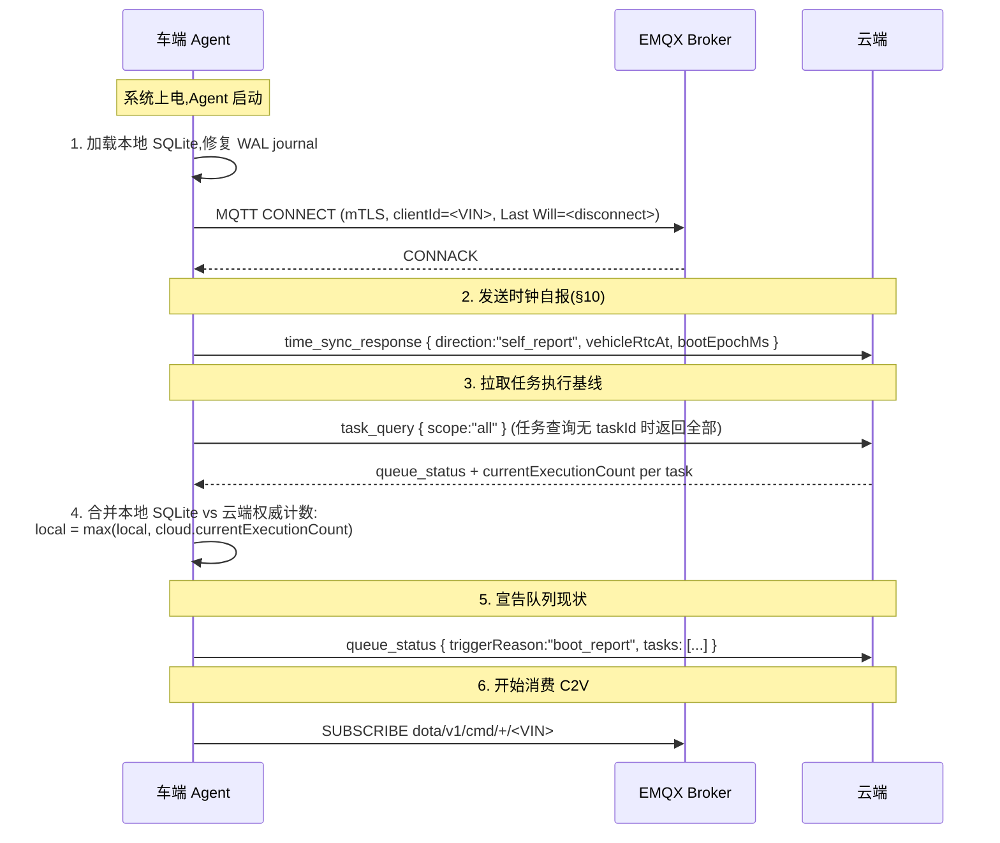

# OpenDOTA 车端 Agent 规范

> **版本**: v1.0 (对齐协议 v1.2 / 架构 v1.2)
> **日期**: 2026-04-18
> **状态**: 已定稿,车端团队按本文件实现
> **适用范围**: 车端 Agent 程序(**Rust** 实现,详见 §0)与云端 OpenDOTA 平台的对接

---

## 目录

0. [实现技术栈](#0-实现技术栈)
1. [Agent 定位与边界](#1-agent-定位与边界)
2. [启动握手协议](#2-启动握手协议)
3. [本地 SQLite Schema](#3-本地-sqlite-schema)
4. [资源状态机(per-ECU)](#4-资源状态机per-ecu)
5. [任务调度引擎](#5-任务调度引擎)
6. [监听基座(条件任务)](#6-监听基座条件任务)
7. [双 ack 执行边界](#7-双-ack-执行边界)
8. [宏指令实现要求](#8-宏指令实现要求)
9. [传输层选择(CAN/DoIP)](#9-传输层选择candoip)
10. [时钟信任维护](#10-时钟信任维护)
11. [反压与队列容量](#11-反压与队列容量)
12. [离线累积与聚合分片](#12-离线累积与聚合分片)
13. [安全校验](#13-安全校验)
14. [降级矩阵](#14-降级矩阵)
15. [诊断与日志](#15-诊断与日志)

---

## 0. 实现技术栈

车端 Agent 采用 **Rust** 实现。选择依据:内存安全 + 零成本抽象 + 生态成熟(socketcan-rs / rumqttc / rusqlite 均已在汽车 HU 商用场景验证)。

### 0.1 依赖库清单(Cargo.toml)

| 能力 | Crate | 版本 | 说明 |
|:-----|:------|:----:|:-----|
| MQTT 客户端 | `rumqttc` | 0.24+ | 支持 mTLS、QoS 1、Last Will。替代方案 `paho-mqtt` 绑定 C 库,避免 unsafe |
| CAN / ISO-TP | `socketcan` + `isotp-rs` | latest | Linux socketcan + ISO 15765-2 分帧 |
| DoIP | 自实现(参照 ISO 13400-2) | — | 用 `tokio::net::TcpStream` + 字节层封包 |
| DBC 解析 | `can-dbc` | 6.x | 订阅白名单信号 |
| 本地存储 | `rusqlite` + `r2d2_sqlite` | latest | SQLite WAL,连接池 |
| JSON 解析 | `serde_json` | 1.x | Envelope 反序列化 |
| payloadHash | `rfc8785` + `sha2` + `hex` | 见 `doc/schema/payload_hash_canonicalization.md` | 必须与云端 Java 输出字节相同 |
| 异步运行时 | `tokio` | 1.40+ | 单进程多任务,虚拟线程等价物 |
| 时间 | `chrono` + `monotonic-time` | — | 本地 RTC + 单调时钟(时钟信任模型 §10) |
| 日志 | `tracing` + `tracing-subscriber` | — | 结构化日志,兼容 OTEL |
| 配置 | `config` + `serde` | — | 支持 env + TOML 叠加 |

### 0.2 目标平台

- **架构**: `aarch64-unknown-linux-gnu`(主力,量产 HU / TBox);`x86_64-unknown-linux-gnu`(开发与模拟器)
- **链接**: 静态链接 musl(`x86_64-unknown-linux-musl`)便于部署,avoid glibc 版本锁定
- **最小内核**: Linux 5.10+(socketcan、cgroups v2)
- **产物形态**: 单个 ELF 可执行文件 + `config/agent.toml` + `signal_catalog.json`(白名单)

### 0.3 模块结构(crate 划分)

```
agent/
├── Cargo.toml                 # workspace
├── agent-core/                # 纯逻辑:状态机、调度器、监听基座
├── agent-mqtt/                # rumqttc 封装 + 重连 + LWT
├── agent-transport/           # socketcan + DoIP + ISO-TP
├── agent-storage/             # rusqlite 封装 + 迁移
├── agent-macros/              # macro_security / routine_wait / data_transfer
├── agent-listener/            # DBC 订阅 + DTC 轮询 + timer
├── agent-hash/                # payloadHash 与云端一致性校验
├── agent-bin/                 # main,组装 + CLI 参数
└── agent-test/                # 集成测试 + Conformance 向量
```

### 0.4 与云端的接口契约

- **Envelope 序列化**:字段顺序、hex 大小写、数字精度**严格遵守** `doc/schema/payload_hash_canonicalization.md` §3 / §4
- **`task.payload_hash`**:车端收到 `schedule_set` / `batch_cmd` / `script_cmd` 后必须重算一次 hash,不匹配则拒绝并上报 `task_ack.status = "hash_mismatch"`(协议 §12.6.2)
- **时钟**:单调时钟用于超时与去抖,RTC 仅用于 validWindow / executeAtList 判断;RTC 异常走 §14 降级矩阵

### 0.5 构建与发布

```bash
# 本地开发(x86)
cargo build --release --target x86_64-unknown-linux-musl

# 目标平台(车端 arm64)
cross build --release --target aarch64-unknown-linux-gnu

# 产物
./target/aarch64-unknown-linux-gnu/release/opendota-agent  # ~8MB stripped
```

CI(GitHub Actions)产出双平台二进制 + SHA-256 校验;OTA 升级时云端下发 URL + hash,车端 `macro_data_transfer` 走 A/B 分区。

---

## 1. Agent 定位与边界

### 1.1 职责

车端 Agent 是 **L3 车端执行层**(协议 §1.1):

- 维持 MQTT 连接,转发 C2V 指令到 ECU,回传 V2C 结果
- 本地持久化任务(SQLite + WAL)
- 管理诊断通道生命周期(心跳、超时、抢占)
- 执行宏指令(`macro_security` / `macro_routine_wait` / `macro_data_transfer`)
- 监听 CAN 总线广播帧与 DTC 轮询,支撑条件任务触发
- 周期任务调度,离线累积结果,联网后批量上报

### 1.2 严格不做的事

| 禁令 | 原因 |
|:---|:---|
| **不解析 ODX** | ODX 解析是云端 L1 职责;Agent 只吃 `{txId, rxId, reqData(hex)}` 或宏参数 |
| **不做 hex → 物理值翻译** | 云端 ODX Decoder 统一做,Agent 只回传原始 hex |
| **不跨 ECU 编排业务** | 车端只按 `ecus[]` 数组执行传输层编排,不理解业务含义 |
| **不发明 MQTT Topic** | Topic 注册表由协议 §2.2 管辖,Agent 只订阅/发布允许的 Topic |
| **不在 OTA 传输中断时自主回滚** | `rollbackOnFailure` 是硬件能力,Agent 只按协议字段执行,云端审批决定是否回滚 |

---

## 2. 启动握手协议

> **R1 补**:Agent 启动时必须与云端完成四步握手,其中关键是**拉回云端权威的 `executionSeq` baseline**,防止 SQLite 损坏后 `currentExecutionCount` 回退。



### 2.1 握手失败降级

| 步骤失败 | 降级行为 |
|:---|:---|
| 2 失败(时钟) | 继续握手,`trustStatus=unknown`,定时任务全部挂起 |
| 3 超时(15s 内云端未回) | 使用本地计数继续运行,5 分钟后重试拉取;此期间禁止 `execution_begin`(避免超执行风险) |
| 5 失败 | 重试 3 次,失败即进入 `offline_degraded` 状态,只接受被动监听,不主动下发任何 C2V 结果 |

### 2.2 Last Will Testament

MQTT CONNECT 时必须设置 Will:

```
Will Topic:   dota/v1/event/lifecycle/<VIN>
Will QoS:     1
Will Retain:  false
Will Payload: {"vin":"...", "event":"abnormal_disconnect", "at":<bootMonotonicMs>}
```

EMQX Rule Engine 截获后投 Kafka `vehicle-lifecycle`,云端据此标记离线。

---

## 3. 本地 SQLite Schema

> **引擎配置**:`PRAGMA journal_mode=WAL; PRAGMA synchronous=NORMAL; PRAGMA foreign_keys=ON;`

### 3.1 任务表 `task`

```sql
CREATE TABLE task (
    task_id             TEXT PRIMARY KEY,
    version             INT NOT NULL DEFAULT 1,
    supersedes_task_id  TEXT,
    priority            INT NOT NULL DEFAULT 5,
    payload_hash        TEXT NOT NULL,
    schedule_type       TEXT NOT NULL,             -- once/periodic/timed/conditional
    schedule_config     TEXT NOT NULL,             -- JSON
    miss_policy         TEXT NOT NULL,
    diag_payload        TEXT NOT NULL,             -- JSON: batch_cmd / script_cmd / schedule_set
    ecu_scope           TEXT NOT NULL,             -- JSON array
    status              TEXT NOT NULL,             -- queued/executing/scheduling/paused/deferred
    current_execution_count INT NOT NULL DEFAULT 0,
    next_trigger_at     INT,                       -- 本地 RTC 毫秒
    signal_catalog_version INT,
    valid_window_start  INT NOT NULL,
    valid_window_end    INT NOT NULL,
    approval_id         TEXT,
    operator_snapshot   TEXT,                      -- JSON 冻结的 operator (审计回填)
    enqueued_at         INT NOT NULL,
    updated_at          INT NOT NULL
);
CREATE INDEX idx_task_priority_enqueued ON task(priority ASC, enqueued_at ASC);
CREATE INDEX idx_task_next_trigger ON task(next_trigger_at) WHERE status='scheduling';
```

### 3.2 执行日志 `execution_log`

```sql
CREATE TABLE execution_log (
    task_id         TEXT NOT NULL,
    execution_seq   INT NOT NULL,
    trigger_time    INT NOT NULL,
    trigger_source  TEXT NOT NULL,
    overall_status  INT,
    result_payload  TEXT,                          -- JSON
    begin_msg_id    TEXT,
    end_msg_id      TEXT,
    begin_reported_at INT,
    end_reported_at INT,
    PRIMARY KEY (task_id, execution_seq)
);
```

### 3.3 DTC 被动捕获 `dtc_pending_capture`(R1 / 协议 §8.3.5)

```sql
CREATE TABLE dtc_pending_capture (
    task_id         TEXT,
    dtc_code        TEXT NOT NULL,
    status_flag     TEXT,
    first_seen_at   INT NOT NULL,
    last_seen_at    INT NOT NULL,
    occurrence_count INT NOT NULL DEFAULT 1,
    captured_during TEXT NOT NULL,
    PRIMARY KEY (task_id, dtc_code)
);
```

### 3.4 固件传输会话 `flash_session`(断点续传)

```sql
CREATE TABLE flash_session (
    transfer_session_id TEXT PRIMARY KEY,
    file_sha256         TEXT NOT NULL,
    file_size           INT NOT NULL,
    chunk_size          INT NOT NULL,
    last_confirmed_offset INT NOT NULL DEFAULT 0,
    target_partition    TEXT,
    rollback_on_failure INT NOT NULL DEFAULT 1,
    approval_id         TEXT,
    status              TEXT NOT NULL,
    started_at          INT NOT NULL,
    last_heartbeat_at   INT NOT NULL
);
```

### 3.5 信号白名单 `signal_catalog`(条件任务)

```sql
CREATE TABLE signal_catalog (
    version         INT NOT NULL,
    signal_name     TEXT NOT NULL,
    data_type       TEXT NOT NULL,
    source          TEXT NOT NULL,                 -- dbc_broadcast/dtc_poll/internal_timer/gps
    enum_mapping    TEXT,
    enabled         INT NOT NULL DEFAULT 1,
    PRIMARY KEY (version, signal_name)
);
CREATE INDEX idx_signal_catalog_version ON signal_catalog(version);
```

### 3.6 聚合上报缓冲 `result_buffer`(离线累积)

```sql
CREATE TABLE result_buffer (
    task_id         TEXT NOT NULL,
    trigger_time    INT NOT NULL,
    payload         TEXT NOT NULL,                 -- JSON: schedule_resp resultsHistory 条目
    enqueued_at     INT NOT NULL,
    uploaded        INT NOT NULL DEFAULT 0,
    PRIMARY KEY (task_id, trigger_time)
);
CREATE INDEX idx_result_buffer_pending ON result_buffer(task_id) WHERE uploaded=0;
```

### 3.7 操作员上下文缓存 `operator_cache`

用于 V2C `*_resp` 回填 operator 字段,避免云端兜底反查:

```sql
CREATE TABLE operator_cache (
    msg_id          TEXT PRIMARY KEY,
    operator_json   TEXT NOT NULL,
    cached_at       INT NOT NULL
);
-- 回收:> 24h 且对应 msg 已完成上报的行
```

---

## 4. 资源状态机(per-ECU)

### 4.1 每个 ECU 独立持有一份状态

```
状态: { IDLE | DIAG_SESSION | TASK_RUNNING }
锁类型: 互斥锁 + 锁持有者元数据(channelId | taskId, ecuScope, acquiredAt)
```

### 4.2 锁获取算法(R2 对齐)

```c
/* 伪码: 字典序原子获取 */
int try_acquire_ecu_locks(const char* scope[], int n,
                          const lock_holder_t* holder) {
    sort_asc(scope, n);                    // 字典序
    begin_tx();
    for (int i = 0; i < n; i++) {
        if (ecu_state[scope[i]] != IDLE) {
            rollback_tx();                 // 释放所有已获取
            return E_ECU_BUSY;
        }
    }
    for (int i = 0; i < n; i++) {
        ecu_state[scope[i]] = holder->is_diag ? DIAG_SESSION : TASK_RUNNING;
        ecu_holder[scope[i]] = *holder;
    }
    commit_tx();
    return 0;
}
```

### 4.3 拒绝响应映射

| 触发场景 | 车端上报 |
|:---|:---|
| `ecuScope` 缺失 | `channel_event { rejected, reason:"ECU_SCOPE_REQUIRED" }` |
| 单 ECU 被占 | `channel_event { rejected, reason:"ECU_ALREADY_OCCUPIED", currentTaskId }` |
| 多 ECU 部分被占 | `queue_reject { reason:"MULTI_ECU_LOCK_FAILED", conflictEcus:[...] }` |
| scope 外请求 | `single_resp { status:1, errorCode:"ECU_NOT_IN_SCOPE" }` |
| DoIP 异工位 | `channel_event { rejected, reason:"ECU_LOCKED_BY_OTHER_WORKSTATION", occupiedBy:{workstationId} }` |

---

## 5. 任务调度引擎

### 5.1 主循环

单线程 + epoll/kqueue 事件循环,周期 1s:

```
loop every 1s:
    1. tick_schedule_fire()    -- 检查 scheduling 态任务的 next_trigger_at
    2. tick_resource_release() -- 检查完成/失败/超时
    3. tick_resume_deferred()  -- DIAG_SESSION → IDLE 后恢复 deferred 任务
    4. tick_reconcile_clock()  -- 每 60s 比对 RTC,状态变更时上报
    5. tick_offline_flush()    -- 联网后 flush result_buffer
```

### 5.2 优先级与 FIFO

入队时按 `(priority ASC, enqueued_at ASC)` 排序,索引 `idx_task_priority_enqueued` 直接命中。

### 5.3 自动抢占(协议 §10.7.5)

新任务入队时:若 `new.priority <= 2` 且 `running.priority >= 6`:

```c
switch (running.kind) {
    case MACRO_DATA_TRANSFER: reject(new, "NON_PREEMPTIBLE_TASK"); break;
    case MACRO_SECURITY when running.is_mid_handshake():
        reject(new, "NON_PREEMPTIBLE_TASK"); break;
    default:
        preempt(running);  /* 31 02 停例程 + re-queue, 保留 priority 和 currentExecutionCount */
        emit_channel_event("preempted", running.task_id);
        schedule(new);
}
```

### 5.4 missPolicy 默认推导(协议 §8.3.4 + R4)

**车端不做默认值推导**,云端 API 层在持久化前已写入 `miss_policy`。车端收到 `schedule_set` 时 `miss_policy` 必填,若为空则返回 `task_ack { rejected, reason:"MISS_POLICY_REQUIRED" }`。

---

## 6. 监听基座(条件任务)

### 6.1 三类数据源

| 数据源 | 线程 | 行为 |
|:---|:---|:---|
| **DBC 广播帧** | CAN RX 线程,非阻塞 | 订阅 signal_catalog 中 `source=dbc_broadcast` 的信号,更新当前值表 |
| **DTC 主动轮询** | 定时器线程,60s 周期 | 对 signal_catalog 中 `source=dtc_poll` 的 ECU 发 `0x19 02 09`,**仅在资源 IDLE/TASK_RUNNING 时轮询**,DIAG_SESSION 期间暂停 |
| **DTC 被动监听** | CAN RX 线程,始终开启 | 订阅 `0x19 04` 周期广播帧 + NM / DoIP Alive / OEM 自定义故障广播 DID。**诊断仪占用期间仍工作**,结果写入 `dtc_pending_capture`(R1 保真) |
| **内部 timer** | 时间轮 | 累计运行时长,`timer` 类触发 |

### 6.2 条件命中流水线

```
信号/DTC 更新 → 触发器匹配(debounceMs 防抖)→ 冷却检查(cooldownMs)→ 命中
     ↓
condition_fired 事件立即上报(即使任务被 deferred)
     ↓
根据资源状态:
  - IDLE/TASK_RUNNING 且 ecuScope 可获取 → 入执行队列
  - DIAG_SESSION 冲突 → 标记 deferred,等通道关闭后按 missPolicy 处理
```

### 6.3 signalCatalogVersion 校验(R4)

收到 `schedule_set { signalCatalogVersion: X }` 时:

| 本地版本 vs X | 动作 |
|:---|:---|
| 相等 | 入队 |
| 本地更高 | 入队(向前兼容) |
| 本地更低 | `queue_reject { reason:"SIGNAL_CATALOG_STALE", currentVersion:local, expectedVersion:X, suggestedRetryAfterMs:300000 }` |

收到 `signal_catalog_push` (协议 §8.3.2 新 act) 时:

```
1. 下载 signal_catalog JSON (预签名 URL + SHA-256 校验,同 macro_data_transfer)
2. 写入 signal_catalog 表,version=新版本
3. 上报 signal_catalog_ack { newVersion: X, replaceAt: <monotonicMs> }
4. 向后兼容保留上一版本 7 天,期间条件任务按各自 signalCatalogVersion 匹配对应版本
```

### 6.4 启动期(MQTT 未连上)命中缓冲(v1.4 A10)

> [!IMPORTANT]
> 对应协议 §8.3.7。KL15 → ON 瞬间条件可能立即命中,但此时 MQTT CONNECT 尚未完成。Agent 必须 **先写本地 SQLite、MQTT 握手完成后批量补发**,保证命中不丢失且上报顺序稳定。

**本地表** `condition_pending_upload`(SQLite):

```sql
CREATE TABLE condition_pending_upload (
    id              INTEGER PRIMARY KEY AUTOINCREMENT,
    task_id         TEXT NOT NULL,
    trigger_type    TEXT NOT NULL,
    trigger_snapshot TEXT NOT NULL,
    action_taken    TEXT NOT NULL,
    execution_seq   INT,
    fired_at        INT NOT NULL,                 -- 本地 RTC 毫秒
    monotonic_ms    INT NOT NULL,                 -- 单调时钟,时钟降级时用
    clock_trust_at_capture TEXT NOT NULL,         -- trusted/drifting/unknown/untrusted
    uploaded        INT NOT NULL DEFAULT 0
);
CREATE INDEX idx_cpu_pending ON condition_pending_upload(fired_at) WHERE uploaded = 0;
```

**Rust 实现要点**(`agent-listener`):

```rust
pub struct ConditionPendingWriter {
    db: Arc<r2d2::Pool<SqliteConnectionManager>>,
    mqtt_connected: Arc<AtomicBool>,
}

impl ConditionPendingWriter {
    /// 条件命中时始终走本路径:MQTT 未连也不丢
    pub async fn fire(&self, ev: ConditionFiredEvent) -> Result<()> {
        // 1. 写本地 SQLite
        self.db.get()?.execute(
            "INSERT INTO condition_pending_upload (task_id, trigger_type, trigger_snapshot, action_taken, execution_seq, fired_at, monotonic_ms, clock_trust_at_capture)
             VALUES (?1, ?2, ?3, ?4, ?5, ?6, ?7, ?8)",
            params![ev.task_id, ev.trigger_type, ev.snapshot_json, ev.action, ev.execution_seq, ev.fired_at, ev.monotonic_ms, ev.clock_trust],
        )?;

        // 2. 若 MQTT 已连,立即触发 flush;否则等握手完成
        if self.mqtt_connected.load(Ordering::Acquire) {
            self.flush_async().await?;
        }
        Ok(())
    }

    /// 启动握手完成后调用
    pub async fn flush_async(&self) -> Result<()> {
        let rows = self.db.get()?.prepare(
            "SELECT id, task_id, trigger_type, trigger_snapshot, action_taken, execution_seq, fired_at, clock_trust_at_capture
             FROM condition_pending_upload WHERE uploaded = 0 ORDER BY fired_at ASC LIMIT 500",
        )?.query_map([], /* ... */)?;

        for row in rows {
            // 3. 发 condition_fired,payload.firedAt 使用原始 fired_at(不是 now())
            let msg_id = publish_condition_fired(row).await?;
            self.db.get()?.execute(
                "UPDATE condition_pending_upload SET uploaded = 1 WHERE id = ?1",
                params![row.id],
            )?;
        }
        Ok(())
    }
}
```

**启动握手后 flush 时序**(协议 §2 + §8.3.7):

```
MQTT CONNECT ok
  ↓
time_sync_response (self_report)
  ↓
task_query { scope:"all" } → 云端回 currentExecutionCount baseline
  ↓
queue_status (boot_report)
  ↓
flush condition_pending_upload   ←── 此时才开始补发启动期命中
  ↓
SUBSCRIBE dota/v1/cmd/+/<VIN>
```

**时钟未信任场景**:
- `clock_trust_at_capture = "unknown"` 的条目,`fired_at` 在补发时**不回溯修正**,审计链以"命中时刻的本地时钟"为准
- `triggerSnapshot` 额外打标 `"clockTrust":"unknown_at_capture"`,云端 UI 提示用户"此事件的时间戳可能不准"
- 若 `flush` 前云端刚下发 `time_sync_request` 做了校准,**已入表的 `fired_at` 不变**,只有新命中的事件用新时钟

**GC 规则**:`condition_pending_upload` 中 `uploaded=1` 且年龄 > 7 天的条目每日清理;`uploaded=0` 且 > 30 天的写告警日志,说明长期离线或 MQTT 握手有故障。

---

## 7. 双 ack 执行边界

> **核心规则**:每次周期/条件任务触发,必须发 `execution_begin` + `execution_end` 一对报文,云端 `task_execution_log` 按 `(task_id, vin, execution_seq)` ON CONFLICT DO NOTHING 幂等。

### 7.1 begin/end 发送时机

```
触发命中 (cron fire / condition fire / timed hit)
   ↓
分配 execution_seq = max(local.currentExecutionCount + 1, cloud.baseline + 1)  -- R1 防回退
   ↓
发 execution_begin { taskId, executionSeq, triggerAt, triggerSource, ecuScope, msgId=M1 }
   ↓
等 MQTT PUBACK (QoS 1) ,**未 ack 不动手执行**
   ↓
执行 diag_payload (raw_uds / macro / script)
   ↓
发 execution_end { taskId, executionSeq, beginMsgId=M1, endAt, overallStatus, results, msgId=M2 }
   ↓
写入 execution_log.end_reported_at
   ↓
本地 currentExecutionCount = execution_seq
   ↓
检查 maxExecutions, 达到上限则状态 → completed, 从队列移除
```

### 7.2 崩溃恢复

**若在 begin 后、end 前 Agent 崩溃**:

1. 重启后 `execution_log WHERE end_reported_at IS NULL` 找出孤儿
2. 对每条孤儿重发 `execution_end { overallStatus:2, reason:"AGENT_CRASH_RECOVERED" }`
3. 云端 ON CONFLICT DO NOTHING + 60s 超时对账作业兜底

### 7.3 云端 baseline 不一致时

握手 §2 拉到 `cloud.currentExecutionCount > local.currentExecutionCount`:

- 直接采用 cloud 值,本地 counter 跳到 cloud+1
- 写一条本地告警日志,供运维审计(可能是 SQLite 损坏/迁移)

---

## 8. 宏指令实现要求

### 8.1 `macro_security`

```
1. 发 27 {level}  (请求 Seed)
2. 等待 ECU 响应,timeout 默认 2s
3. 调用 dlopen("/opt/dota-agent/plugins/security/<algoId>.so") 的 CalculateKey()
4. 发 27 {level+1} [Key]
5. 正响应 67 {level+1} → 成功
6. NRC 35/36 → maxRetry 允许则重试,否则失败
7. 全流程不超过 15s(ECU S3 窗口 + 算法耗时)
```

**不可中断区间**:第 1 步发出到第 5 步收到响应之间,不接受任何抢占(协议 §10.7.5 明确)。

### 8.2 `macro_routine_wait`

```
1. 发 31 01 XX XX 启动
2. 每 pollIntervalMs 发 31 03 XX XX 查询
3. 期间持续 3E 80 心跳
4. 收到终态(71 01 XX XX <result>)或超 maxWaitMs → 结束
5. 被抢占时发 31 02 XX XX 停止例程后释放锁
```

### 8.3 `macro_data_transfer`(OTA)

**不可抢占**。详细流程见协议 §7.5。关键点:

- 下载前校验 `fileUrl` 必须带 `Expires` 和 `Signature`(预签名 URL)
- 每写入一块 `36 Transfer Data` 后立即更新 `flash_session.last_confirmed_offset`(WAL fsync)
- 失败回滚仅当 `rollbackOnFailure=true` 且 `targetPartition=B` 存在上一 active 分区
- `preFlashSnapshotRequired=true` 时必须先用 `34/35/37` 备份当前分区到本地

---

## 9. 传输层选择(CAN/DoIP)

### 9.1 路由规则

Agent 按 `transport` 字段选择协议栈:

- `UDS_ON_CAN` → ISO-TP 15765-2(单帧/首帧/连续帧/流控)
- `UDS_ON_DOIP` → TCP + DoIP Generic Header(payload_type=0x8001)

### 9.2 DoIP 特殊处理

- **Routing Activation** 在 `channel_open` 时执行,非 `0x10` 成功时上报 `channel_event { rejected, reason:"DOIP_ROUTING_FAILED", responseCode }`
- **Alive Check**:除 UDS `3E 80`,还需处理 DoIP 层 `Alive Check Request (0x0007)`
- **workstationId**(R5):若 `doipConfig.workstationId` 非空,此通道的 ECU 锁按 `(workstationId, ecuName)` 二元键隔离;同 ECU 不同 workstation 的请求互斥检查只在同 workstation 内进行

---

## 10. 时钟信任维护

### 10.1 周期上报

- 启动时立即发 `time_sync_response { direction:"self_report" }`
- 此后每 24h 发一次
- 检测到 RTC 跳变(相邻两次读数差值 > 60s 且单调时钟未显示等量)立即发一次

### 10.2 接收 `time_sync_request`

```
applyMode=step:
  若 |authoritativeEpochMs - now_rtc| <= 60s: 写 hwRTC, 立即生效
  若差值过大: 先改 soft RTC,再分 10s 步长渐进对齐硬件 RTC(避免误触超时)
applyMode=slew:
  按 ±500ppm 微调,最多 1h 对齐
```

### 10.3 降级钩子

`trust_status=untrusted` 时:

- `schedule_type=timed` 任务:拒绝执行,上报 `schedule_resp { overallStatus:1, reason:"CLOCK_UNTRUSTED" }`
- `mode=periodic`:改用单调时钟计算间隔,继续执行
- `validWindow.endTime`:忽略 RTC 时间,依赖云端 `task_cancel` 结束
- `cooldownMs`:改用单调时钟差值,上报 `cooldown_fallback=true`

---

## 11. 反压与队列容量

### 11.1 软硬水位

```
maxQueueSize     = 100   (可通过 OTA 配置中心下发调整)
softWatermark    = 80    (80%,低优先级拒绝开始)
hardWatermark    = 100   (100%,全部拒绝)
hysteresisLow    = 70    (70%,消除抖动才主动通知空闲)
```

**`queueSize` 计数语义**(v1.4 A7 明确):

| 状态 | 计入 `queueSize`? | 说明 |
|:---|:---:|:---|
| `queued` | ✅ | 立即可执行,占内存 + SQLite 行 |
| `scheduling` | ✅ | 周期/条件的 dormant 态,仍占 SQLite 行 |
| `executing` | ✅ | 运行中,明显占资源 |
| `paused` | ❌ | 用户手动暂停,不参与调度,**不算入水位** |
| `deferred` | ✅ | 被诊断会话挂起,仍在队列等待恢复 |

**设计意图**:`maxQueueSize=100` 限制的是"**车端需要持续关注/调度的活跃任务数**"。用户 `pause` 的任务属于"长期挂起",与"满"无关,否则运营用 `pause` 建一个占位任务,就能意外把一辆车的队列挤爆。

**读取接口**:
```c
int queue_size_active() {
    return sqlite_count("SELECT COUNT(*) FROM task WHERE status IN ('queued','scheduling','executing','deferred')");
}
```

**`paused` 的上限兜底**:为避免"paused 无限累积导致 SQLite 膨胀",额外设 `maxPausedTasks = 50`,超过时对新的 `task_pause` 返回 `queue_reject { reason:"PAUSED_LIMIT_REACHED" }`。

### 11.2 拒绝决策

```c
if (queue_size >= hardWatermark) reject(QUEUE_FULL);
else if (queue_size >= softWatermark && new_task.priority >= 6) reject(SOFT_WATERMARK_LOW_PRIO);
else if (duplicate_task_id_hash_diff) reject(DUPLICATE_TASK_ID);
else accept();
```

### 11.3 主动通知空闲

`queue_size` 从 ≥ `softWatermark` 回落到 < `hysteresisLow` 时,发:

```json
{ "act":"queue_status", "payload": { "triggerReason":"capacity_available", ... } }
```

---

## 12. 离线累积与聚合分片

### 12.1 累积规则

- 断网期间周期任务结果写入 `result_buffer(uploaded=0)`
- 联网后按 `task_id` 分组,一次性组装 `schedule_resp.resultsHistory`
- 序列化后:
  - < 200KB:单片上报,设 `batchUploadMode:"aggregated"`
  - ≥ 200KB:拆分为 `batchUploadMode:"aggregated_chunked"`(协议 §8.5.2)

### 12.2 分片参数

```
每片上限:    200KB
最大片数:    50 (≈ 10MB)
超限策略:    丢弃最老的 resultsHistory 条目,最后一片置 truncated=true + droppedCount
整体超时:    60s 内必须全部发完
aggregationId: UUID v4, 全新生成
```

### 12.3 确认与重试

每片 QoS 1 发出后等 PUBACK,60s 窗口内未收齐 PUBACK 视为失败,整体放弃本次聚合(保留在 `result_buffer`),下次重连再试。云端 `task_result_chunk` 以 `(aggregation_id, chunk_seq)` 去重,重传不会重复计入。

---

## 13. 安全校验

### 13.1 证书

- mTLS CN = VIN,O = tenantId,OU = `vehicle-agent`
- **workstationId** 不存 OU(R5 修正);DoIP 工位场景下通过 Subject.CN 后缀 `LSVW...@EOL-STN-B-03` 或 SAN otherName 扩展承载
- 签发有效期 5 年,剩余 30 天时上报 `channel_event { event:"cert_expiry_warning", daysLeft }`

### 13.2 C2V 报文入口校验

| 校验 | 失败动作 |
|:---|:---|
| Envelope 结构完整 | 丢弃 |
| `timestamp` 漂移 ≤ 5 分钟 | 丢弃 + 审计 `STALE_TIMESTAMP` |
| `msgId` 未在 24h 内出现过 | 丢弃重复 |
| `operator` 必填(C2V cmd/control) | 丢弃 + 审计 `SECURITY_VIOLATION` |
| `operator.tenantId == cert.O` | 丢弃 + 审计 `TENANT_MISMATCH` |
| `operator.role` 可执行该 `act`(RBAC 兜底) | 拒绝并上报 `SECURITY_VIOLATION` |

### 13.3 `force=true` 额外校验

`channel_open.force=true` 必须 `operator.role ∈ {senior_engineer, admin}`,否则拒绝并审计。

---

## 14. 降级矩阵

| 异常情况 | 降级策略 |
|:---|:---|
| MQTT 断连 | 离线累积 `result_buffer`;保持本地调度;Last Will 已通知云端 |
| Agent 重启 | 握手流程 §2;`execution_log` 孤儿 end 补齐 |
| SQLite 损坏 | 读取备份快照;无备份时清库重注,依赖云端 `task_query` 重新推送任务 |
| RTC 失信 | 按 §10.3 降级功能 |
| 算法插件加载失败 | 对该 `algoId` 的 `macro_security` 返回 `ALGO_ERROR`,不影响其他任务 |
| OTA 校验失败 | 按 `rollbackOnFailure` 决定;不可回滚时上报 `OTA_PARTIAL_FAILED` 并等人工 |
| CAN 总线掉线 | 所有 ECU 状态转 `IDLE`,通道 `ecu_lost` 事件,任务 failed |

---

## 15. 诊断与日志

### 15.1 本地日志等级

- `ERROR`:MQTT 断连 > 5 分钟、SQLite 损坏、OTA 校验失败、安全违规
- `WARN`:拒绝请求、降级切换、抢占发生
- `INFO`:任务入队/执行/完成、通道开关、状态切换
- `DEBUG`:每条 UDS PDU、ISO-TP 帧级日志(仅临时排障)

### 15.2 本地自查命令(运维工具对接)

```
dota-agent-cli status        # 查看 resource_states, queue_size, trust_status
dota-agent-cli queue list    # 列出当前任务队列
dota-agent-cli dump-sqlite   # dump SQLite 用于事故分析
dota-agent-cli resync-clock  # 强制发一次 time_sync_response
```

---

## 附录 A:与协议规范的映射表

| 本文件章节 | 协议规范章节 |
|:---|:---|
| §2 握手 | §3 / §17(时钟) |
| §4 资源状态机 | §10(per-ECU + 字典序锁 + force + 自动抢占) |
| §5.3 自动抢占 | §10.7.5 |
| §6 监听基座 | §8.3 / §8.3.5 |
| §7 双 ack | §8.5.1 |
| §8 宏 | §7 |
| §9 传输层 | §4.5 |
| §10 时钟 | §17 |
| §11 反压 | §11.7 / §11.8 |
| §12 聚合分片 | §8.5.2 |
| §13 安全 | §15.1 / §15.4 |

## 附录 B:Conformance 测试向量对照(协议附录 D)

车端 Agent 在接入前必须跑通协议附录 D 全部 30 条用例。本 Agent 规范 §4/§5/§6/§7 描述的实现是通过这 30 条用例的**最小集要求**——若实现了但仍有用例不过,需先 fix 实现再对接生产 Broker。
